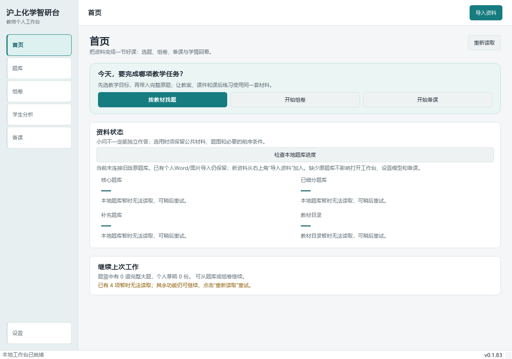
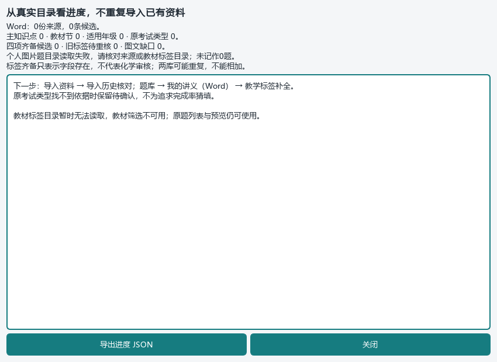

# 沪上化学智研台 · 上海高中化学教师工作台

**当前整合源码：0.1.83。Windows / PySide6 原生桌面优先。**

围绕教师的一次完整工作组织：资料导入 → 题目和教材标签 → 保留公共材料的选题 → 组卷或教案/PPT → 学生作答分析 → 针对性复练。已有功能继续使用，不另建一套网页项目。

> 本仓库是软件与已允许的简明知识索引，不包含教师电脑上的全部教材、公众号原图、Word题库、学生资料或模型密钥。0.1.83 是源码增量，不是已发布的新独立EXE。本轮没有新增导入真实题目，不能把历史本机统计当成当前机器题库。

[完整历史说明（截至0.1.82）](README-0.1.82-archive.md) · [更新记录](CHANGELOG.md) · [本轮整合与验收清单](docs/desktop-integration-20260914.md) · [教学设计与提示词研究](docs/research/2026-09-14-teaching-design.md)

## Windows 启动

在包含本文件的**仓库根目录**打开 PowerShell，首次准备 Python 3.12 环境：

```powershell
py -3.12 -m venv .venv
.\.venv\Scripts\python.exe -m pip install -r runtime\deeptutor_shchem\desktop_requirements.txt
```

随后双击根目录 **`启动源码桌面版.cmd`**，或运行：

```powershell
.\.venv\Scripts\python.exe runtime\deeptutor_shchem\desktop_teacher_workbench.pyw
```

使用 Git 的现有开发目录可先 `git fetch origin`，确认未提交改动已妥善保存，再切换 `integration/desktop-closure-20260914`。不要用强制重置覆盖本机工作。旧 `启动沪上化学智研台桌面版.vbs` 可能仍优先打开电脑上的旧打包EXE；它不是新源码入口。

首次下载源码、没有 `sh-chem-db` 时，也可打开桌面。工作台在 `%LOCALAPPDATA%\ShanghaiChem\DesktopWorkbench\library\sh-chem-db` 建立个人空目录。已有仓库旁的原题库优先沿用，不移动、不清空；已有个人Word/图片导入仍使用原个人状态目录。原库、教材目录不存在时，其筛选功能会明确提示缺少来源，不能凭空恢复教材或题目。

`SHCHEM_WORKSPACE_ROOT` 可显式指定包含 `integrations/deeptutor_shchem_v1` 的工作台目录；无效设置会提示更正，不静默切换另一份项目。

## 日常操作

| 入口 | 教师怎么用 | 输出与注意事项 |
| --- | --- | --- |
| 首页 | 按教材找题、开始组卷、开始备课；点击“检查本地题库进度” | 实时读取已保存目录，显示缺少哪些标签或图文条件；可导出JSON进度。 |
| 右上角“导入资料” | 选择Word、PDF或图片，预览后保存；从导入历史继续核对 | Word沿用原生正文、表格、公式及嵌入图链路；扫描件需要对应视觉能力。旧公式显示缺口仍需原Word核对。 |
| 题库 | 按教材、知识点与来源筛选；打开已导入Word或图片题逐题看原文、原图、答案和教学标签 | 适用年级、原试卷年级、考试类型与题型分别管理；AI建议并非教师确认。 |
| 组卷 | 加入完整大题或原生Word选题，保留公共材料；设置配分、预览学生版与教师版后导出 | 题目依赖前问时不能只摘一问；已有作答区域不重复增加横线。无真实来源时不编造题库命中。 |
| 备课 | 填课题、对象、课型、课时和目标；从原教案或题库带入资料，预览、修改教学结构后生成 | PPT与教案共用学习路径，区分学生页面和教师备注；知识说明、例题、独练、讲评和小结相互承接。 |
| 学生分析 | 使用匿名学生标识，录入材料与作答；教师记录评分和诊断，再按教材知识点推荐练习 | 保留真实题目身份和公共材料；复练结果未记录前不宣称学生已进步。 |
| 设置 | 配置模型地址、实际型号和个人密钥，按页面说明检验能力 | 文本联通不等于能读图；模型声明支持图片也不等于化学图和裁题质量已验收。 |

这些操作沿用0.1.82已有服务；本轮新增项见下一节。完整细节及旧版限制在历史说明中，不能把本轮启动验证当作所有教学环节已经终验。

## 0.1.83 新增

- 修复清洁源码目录因缺少私有原题库而无法启动的问题；新增明确的源码启动器。
- 首页改为教学任务优先的浅青色卡片，新增空库说明；更正“小问可以独立作答”的误导，明确公共材料、图形和前序条件。
- 新增本地题库进度：Word来源数/候选数、主知识点、教材节、适用年级、原考试类型、失效旧标签和材料缺口。图片题按主题和印刷题另计，**不把两库相加**。
- 新增课堂编排提示词合同 `classroom-closure-20260914-v1`，通过原有共享规则进入真实备课生成请求；不是只有一份未接线的提示词文档，也不是增加导出审批。
- 新增 Windows Actions 回归、五个原生页面的启动导航验证及真实空库截图。源码快照、JUnit和全部页面截图随Actions artifact保存；截图同步仅允许两张隔离空库图片和来源提交报告，不上传本机材料。

## 实际界面

以下图片由 Windows CI 中的**真实PySide6窗口**截取，不是概念设计图、网页替代界面或image-2.5生成图。空库警告如实保留；不能用这些图片证明用户的真实资料已导入。

### 任务首页



### 本地题库进度



[截图对应的操作系统、版本与源码提交](docs/qa/0.1.83-windows-smoke.json)。CI每次成功后同步截图；历史实际资料界面仍见历史README，不混称本轮新验证。

## 验证记录

代码提交 `5339138b75b04885edb2781aa8c67a27d39f48be` 已在 Windows Server 2025 / Python 3.12.10 上运行：**86 passed，0 failed，0 skipped**，五个原生页面均打开，未捕获异常0。涵盖首次启动、进度统计、提示词接线、原生UI及备课Provider等六个测试文件；这是定向回归，不是全仓库或真实课堂全量验收。

[对应Actions运行与完整artifact](https://github.com/2067169120-png/shanghai-chemistry-teaching-agent/actions/runs/34771885045)。后续截图元数据明确写出实际源码提交，不将仅更新文档的提交冒充新的课堂质量验证。本地无Qt环境的55项通过包含在Windows的86项中，不重复相加。

## 模型、资料和待完成项

DeepSeek当前官方文档已说明 `deepseek-flash` 支持图像输入；不能把整个厂商写成“不支持多模态”。请在设置中填写实际可用型号，并按相应接口与图片任务验证。见[DeepSeek图像理解官方文档](https://api-docs.deepseek.com/zh-cn/guides/vision/)。本轮执行环境的网络预检失败，**没有发送用户密钥，没有真实模型调用成功记录**。

仍须在用户Windows电脑完成真实资料批次验收：公众号与98份Word历史导入记录核对、逐题标签缺项补齐、裁片边界与答案核对、完整大题跨页面导出、真实模型读图与一课时教案/PPT联动。材料驱动的装置图/有机图自动生成、热点命题与长期复测闭环继续按整合清单推进，不能仅靠提示词宣称这些引擎已经完成。

请勿把密钥、原教材/教参、学生身份或个人进度报告直接提交Git。聊天中公开过的密钥应更换，再在本机设置页配置新值。
