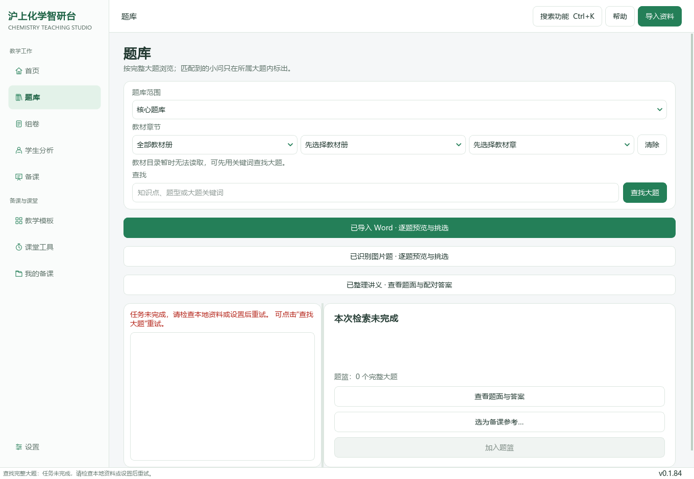
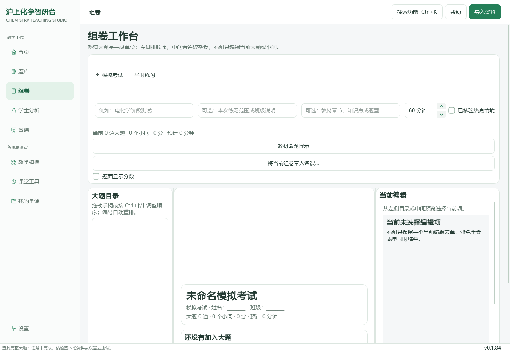

# 沪上化学智研台

### 从教学想法，到一节完整的化学课

**0.1.84 源码版 · Windows 原生 PySide6 · 上海高中化学教师工作台**

资料与题库、组卷、教案与PPT、课堂工具和学生分析，在同一个桌面中衔接。本版以任务式入口、清晰卡片和可继续编辑的工作流重整界面，新增教学模板、课堂工具和“我的备课”，不另起网页项目。


> 本文截图来自 Windows 上实际运行的 PySide6 窗口。题库使用隔离空目录；示范课题、学号和反馈是明确标注的合成演示，不含用户教材、题目或学生资料。它们展示界面与已执行的离线交互，不表示真实题库已导入或AI生成质量已验收。[截图来源与运行记录](docs/qa/0.1.84-studio-smoke.json)

[更新记录](CHANGELOG.md) · [功能对照与设计依据](docs/research/0.1.84-ui-benchmark.md) · [0.1.83旧说明](README-0.1.83-archive.md) · [0.1.82完整历史](README-0.1.82-archive.md)

## 使用指南目录

[启动与升级](#启动与升级) · [第一次完成备课](#第一次完成备课) · [首页](#01-首页) · [题库](#02-题库) · [组卷](#03-组卷) · [学生分析](#04-学生分析) · [备课](#05-备课) · [教学模板](#06-教学模板) · [课堂工具](#07-课堂工具) · [我的备课](#08-我的备课) · [导入与设置](#09-导入资料与模型设置) · [进度与帮助](#10-题库进度与快捷入口) · [常见问题](#常见问题) · [版本与验证](#版本与验证)

## 本版新增了什么

| 教师需要 | 0.1.84 的操作入口 | 是否需要AI |
| --- | --- | --- |
| 先说课题，不先找一堆表单 | 首页“今天准备讲什么” → 预览教学模板 → 带入备课 | 此步骤不需要 |
| 复用清楚的授课结构 | 6种教学模板，支持搜索、分类、收藏和完整预览 | 不需要 |
| 找回已保存工作 | 我的备课：统一搜索离线草稿与生成任务，查看或继续编辑 | 查看不需要；重新生成另行确认 |
| 安排独立练习时间 | 倒计时、暂停、继续、重置与大字投屏 | 不需要 |
| 课堂点名和讨论分组 | 不重复随机点名、均衡随机分组、复制结果 | 不需要 |
| 讲清动态平衡 | 可调参数的 A⇌B 原生交互模型、相对浓度与曲线 | 不需要；固定教学模型，不是AI任意生动画 |
| 把课堂反馈带回备课 | 手动录入出口检测 → 保存JSON或追加到原备课资料 | 此步骤不需要 |
| 快速找功能 | Ctrl+K搜索入口、F1应用内帮助 | 不需要 |

全局导航、按钮、表单、标签页、卡片与对话框使用统一的浅色绿色样式。原五个核心任务和 Ctrl+1～5 保持不变；新功能作为补充入口加入。

## 启动与升级

### 第一次使用源码版

准备 Windows 上的 Python 3.12。在包含本README的仓库根目录打开 PowerShell：

```powershell
py -3.12 -m venv .venv
.\.venv\Scripts\python.exe -m pip install -r runtime\deeptutor_shchem\desktop_requirements.txt
```

之后双击根目录 **`启动源码桌面版.cmd`**。也可以直接执行：

```powershell
.\.venv\Scripts\python.exe runtime\deeptutor_shchem\desktop_teacher_workbench.pyw
```

启动后查看右下角，应为 **v0.1.84**。首次安装依赖需要网络；模板、课堂工具和本地草稿等离线功能在安装完成后不依赖API。

### 已有项目升级

本版开发分支为 `feature/desktop-studio-0.1.84`，基于0.1.83整合分支。先保存或提交当前代码修改，再获取新分支；不要强制重置或覆盖本地工作。

```powershell
git fetch origin
git switch feature/desktop-studio-0.1.84
```

本版没有移动或重导题库。个人草稿、原有题篮、已导入Word及图片资料继续使用原个人数据目录。**旧VBS可能仍打开本机旧EXE；要运行新源码，请使用CMD入口。** 本次版本管理的是源码与验证记录，不是新免安装EXE发布。

### 资料保存在何处

| 内容 | 默认位置或处理方式 |
| --- | --- |
| 既有原题库 | 优先沿用工作区的 `sh-chem-db` |
| 新环境的空题库目录 | `%LOCALAPPDATA%\ShanghaiChem\DesktopWorkbench\library\sh-chem-db` |
| 个人设置、草稿及任务 | `%LOCALAPPDATA%\ShanghaiChem\DesktopWorkbench` 下原有目录 |
| 教学模板收藏 | 现有个人状态文件中的 `studio.favorites`；不改题目身份或题篮 |
| 课堂点名名单与分组 | 当前窗口内存中，不自动保存；关闭应用后清除 |
| 课堂反馈JSON、模型截图 | 点击另存时由教师选择保存路径 |

需要指定另一份工作区时，使用 `SHCHEM_WORKSPACE_ROOT` 指向包含 `integrations/deeptutor_shchem_v1` 的项目目录。无效目录会提示更正，不悄悄换成别处的资料。

## 第一次完成备课

**建议先走一次不调用AI的流程，再配置生成。**

在首页填“化学平衡”，选“概念新授课”，点击“开始备课”。预览结构后填写授课对象并应用。进入备课页，检查课题、课型、课时与目标，补入实际教材段落、完整例题或自己的教学材料，点击“保存草稿”。打开“我的备课”，找到刚保存的记录，再载入继续修改。

接着打开“课堂工具”：给一道独立练习设定倒计时，或在“动态平衡”中比较正逆速率。在“出口检测”填写教师手动统计的结果，点击“追加到备课资料”。原材料保留，反馈附在后面；保存后形成下一次备课的起点。

需要生成教案或PPT时，再到“设置”配置可用模型，在备课页选择输出种类，核对材料与发送范围后点击“生成备课候选”。模板应用、查看历史和带入反馈本身不发起模型请求。

## 01 首页


首页上方先处理“今天要讲什么”。输入课题，选择教学组织模板，再打开预览；不是输入一句话就直接收费生成。已有备课内容时，模板只补充结构和空缺目标，不覆盖原课题、原材料或图片。

“常用教学任务”直达找题、组卷和备课。“浏览教学模板”“打开课堂工具”“继续我的备课”分别进入三个新增页面。下方“资料状态”和“检查本地题库进度”读取真实本地来源；没有原题库时显示缺项，不制造演示数量。

## 02 题库



先选择已有资料范围，再按关键词、知识点或教材目录查找大题。选中结果后查看题面、答案与来源，确定用途后“加入题篮”或“选为备课参考”。

已导入内容分开进入 **“已导入 Word · 逐题预览与挑选”** 与 **“已识别图片题 · 逐题预览与挑选”**。Word保留原生正文、表格、可支持公式和嵌入图；图片题保留原页、裁片、共同材料与答案角色。具体标签和裁片修订仍使用原有逐题界面，本版没有重做来源身份或重新导入资料。

选用小问时必须保留它需要的共同材料、图表及前序条件。原试卷年级、适用年级、考试类型和作答形态分别看待；目录为空时先导入或连接本地资料，不从文件名猜出完整教材映射。

## 03 组卷



从题库选入完整主题，或使用原有Word和个人图片题入口加入题篮。在组卷页调整顺序、配分和显示设置，检查公共材料是否仍能支持全部小问，再生成学生版与教师版分页预览。

按现有界面核对实际页图后导出同一份预览对应的文件。学生版不应带入答案图；原题已有空格、表格或绘图区时，不另外画一套答题横线。题面分数开关与教师版评分内容分别保留。需要排版转换环境的导出仍沿用原要求；本版UI更新并未替换渲染引擎。

## 04 学生分析


使用学生代号组织材料，带入实际题目、学生作答与评分依据，再进行诊断与练习推荐。选题时仍引用可找到的题库身份和完整公共材料，避免给出脱离题干的小问。

“课堂工具”的出口检测是**教师对一次课堂任务的手动汇总**，不是本页的学生档案替代品，也不是学生端实时采集。需要长期追踪时，应在原学生流程记录日期、作答和复测结果；没有新复测就不把建议写成已经进步。

## 05 备课


备课页沿用原有六项常用输入：课题、授课对象、课型、课时、教学目标、资料与补充说明。输出可以选择PPT、教案或两者联合。模板填入的结构在精细设置中仍可编辑；教师的原结构保留在前面，新模板追加在后面。

材料可以来自已保存命题蓝图、Word与教材知识点、完整原教案或本课选题。含图材料保留原图与角色；只作为排版图片与交给AI读图是不同选择，应根据实际任务和模型能力设置。

**保存草稿**只在本机保存当前输入。**生成备课候选**才进入原有模型确认与生成流程。生成后可查看课件预览、检查课堂结构与笔记、修订教案和课件，并打开对应PPT、教案和学习单。候选内容仍需教师核对科学条件与实际课堂节奏。

## 06 教学模板


内置六种原创教学组织方式：概念新授、实验探究、专题复习、试卷讲评、情境与数据、单元整体备课。可按关键词或分类筛选；“收藏”保存在本机，“只看我的收藏”便于反复使用。

这些是**教学结构模板，不是声称已经下载的获奖PPT，也不是飞象老师的原模板复制品**。它们先帮助教师确定学习目标、任务顺序、反馈和用时，再把真实材料带入已有生成链。


预览中填写课题与对象，查看目标和教学推进，点击“应用到备课”。已有内容时保留教师填写的课题、对象、目标、材料和图片；空白备课才采用模板建议课型与时长。重复应用同一模板不会重复追加同一段结构。当前正在保存、导入或生成时，待其结束后再应用。

<details><summary>较窄窗口中的模板布局</summary>


</details>

## 07 课堂工具

### 倒计时


设置1～180分钟，点击开始、暂停或继续。重置采用当前设定时长。“投屏大字”打开全屏数字，按Esc返回。计时按实际经过时间计算，不依赖刷新次数；切换工作台页面不会暂停，关闭应用后不继续运行。

### 点名与分组


每行输入一个唯一学号或代号；也可以设定人数后点击“填入顺序学号”。随机点名在本轮中不会重复，全部抽完后明确提示“重开一轮”。修改名单会重置点名轮次并清空旧分组显示。

设定组数后生成均衡随机分组，各组人数最多差1。分组不会改变当前点名轮次，可点击复制带到自己的记录中。名单在当前会话内存中使用，不自动存入学生库或发给AI。

### 动态平衡


点击播放，观察A、B的相对浓度和最近过程曲线。可调整正、逆速率常数；拖动初始A浓度会重置过程。正逆速率与时间在图下实时显示，可暂停讨论，也可把当前模型面板保存为PNG。

这是封闭、一级可逆 **A⇌B** 的确定性教学示意，总相对浓度为100，参数和时间均为任意模型单位。它用于讨论“速率相等是否意味着浓度相等”，**不是实测数据、真实装置仿真或AI生成任意动画的能力**。截图保存的是当前静态状态，不会把动画自动嵌入PPT。

### 出口检测


填入本次检测问题或学习目标，记录达成、需要再讲、尚未完成的人数，并写具体错因或下一步安排。填写问题与至少一项人数后，可另存JSON，也可“追加到备课资料”。

追加后自动回到备课页，原材料不替换。点击保存草稿后，这份反馈才成为可找回的备课输入；此操作不调用AI、不改学生评分。这里没有联网投票或自动批阅功能。

## 08 我的备课


汇总已保存的离线备课草稿与生成任务，各来源最近最多50条。可按课题搜索，或筛选“离线草稿”“生成任务”。“刷新”重新读取当前本机记录，不自动重新生成。

选中离线草稿后会先进入原有预览，再确认载入；有未保存表单时保留原来的替换确认。生成任务打开已有状态与结果，不自动重试或产生API费用。这个页面是已有服务的统一入口，不再建第二份作品数据库。

## 09 导入资料与模型设置

### 导入资料


全局右上角打开“导入资料”。选择Word、PDF或图片，先预览再选择保存；已有批次从历史入口继续处理，不因升级重复导入。Word有可提取正文就沿用原生提取，扫描页和不完整图形需要相应识图能力与原页对照。

导入窗口中的指定98份解析版入口仍是原有本地资料工作流；本版本没有新增98份原件，也没有替教师完成本地知识蒸馏。题目标签补全、裁片修订与批次核对可继续在本地执行。

### 模型设置


填写服务地址、实际模型标识与个人密钥，按任务选择输入能力和预算，保存后测试连接。文本测试只说明相应文本请求可用，不能据此证明模型可以识别扫描页、结构式或装置图。

课堂工具、模板预览、收藏和本地草稿查看无需模型。生成、读图、AI分析等仍使用原有明确确认流程。本版没有调用用户API进行付费测试；截图里没有可用密钥。

## 10 题库进度与快捷入口

### 当前题库进度


首页点击“检查本地题库进度”，查看Word来源、候选数量及主知识点、教材节、适用年级、原考试类型的覆盖和缺项，同时列出需要重核的旧标签与材料缺口。个人图片题按主题和印刷题另计，不把两库简单相加。

“导出进度JSON”用于本地推进和交接。报告可能包含来源名称，分享前自行检查。字段齐备不代表化学答案或裁图已审核；读取失败也不会伪装成0题。

### 快捷入口


按 **Ctrl+K** 或点击顶部搜索按钮，输入“PPT”“分组”“讲评”“原题”等词，选择功能或模板后按Enter进入。这是功能搜索，不冒称全题库语义检索。

| 快捷键 | 功能 |
| --- | --- |
| Ctrl+1～5 | 首页、题库、组卷、学生分析、备课 |
| Ctrl+K | 搜索功能与教学模板 |
| F1 | 应用内使用帮助 |
| Esc | 关闭当前对话框或计时投屏 |


## 常见问题

**为什么升级后题库仍显示缺少资料？** 仓库不包含你的私有原题库。新环境会创建空目录，不会凭空下载教材或恢复本机另一处文件。检查工作区与导入历史；不要用历史README里的数量当作当前状态。

**模板是不是直接生成了一份PPT？** 不是。模板先填教学目标与组织建议，再由教师带入实际材料，在原备课页确认生成。它与已生成课件、教材知识索引是不同对象。

**为什么还显示旧版本？** 旧VBS可能打开现有旧EXE。确认切到0.1.84分支并使用源码CMD入口，查看窗口右下角版本。

**课堂工具会把名单发到外部吗？** 点名和分组不发送名单，且不自动持久化。教师点击“复制”会写入本机剪贴板；课堂反馈选择另存或追加是另一个明确操作。后续在备课中确认使用AI时，实际提交哪些材料仍由原生成流程说明。

**和飞象老师已经完全一样了吗？** 没有。本版借鉴任务入口、卡片选择与课堂交互的方向，完成原生桌面对应的可用增量；没有复制其商业内容，也没有新增任意AI交互动画生成、云端社区、跨设备作品同步或学生端实时数据库。

**知识蒸馏和本地题库有什么变化？** 本版不新增教材蒸馏、真实题目导入或批量标签；这些继续由本地工作推进。原知识索引与资料读取链保持，现有题库进度入口继续可用。

## 版本与验证

源码版本在 `integrations/deeptutor_shchem_v1/desktop_version.py` 中统一为0.1.84。分支从0.1.83的 `85f0ab05` 开始；保留原分支及PR，不自动合并main、不覆盖本地资料。

Windows CI运行原有定向回归与新增模板、收藏、草稿、课堂工具和反馈接线测试，并实际打开8个主页面、课堂子页及导入、设置、进度、模板预览、搜索和帮助对话框。测试结果以Actions的 `studio-qa/pytest.xml` 为准；截图元数据明确记录操作系统、Python/Qt版本、执行动作、来源提交及每张图片的SHA。

- [本版Actions工作流](.github/workflows/desktop-studio.yml)
- [实际截图与操作范围](docs/qa/0.1.84-studio-smoke.json)
- [发布与验收说明](docs/qa/0.1.84-studio.md)

截图与源码导航测试不能代替真实题库、实际AI返回、全部导出格式或课堂效果验收。本版没有生成新的免安装EXE，也未进行本机全量资料处理。

## 开发与后续整合

核心业务仍在 `integrations/deeptutor_shchem_v1`。新增 `desktop_studio.py` 保存可单测的模板与课堂算法，`desktop_workbench/studio_*`、`classroom_page.py`、`my_work_page.py` 负责原生界面。`StudioPreparationPage` 只扩展已有备课页，不替换原Provider、草稿格式或图片角色。

后续增加模板应保留当前材料与教师修改；新增课堂模型应明确科学假设并验证守恒；更改页面后同步真实截图和本指南。优先继续打通真实资料、可编辑教案/PPT和复练，而不是再加一层平行后台。
