# 沪上化学智研台

**0.1.85 源码版 · Windows / PySide6 原生桌面 · 上海高中化学教师工作台**

## 左侧按标签找题，右侧看题，选好后直接预览试卷

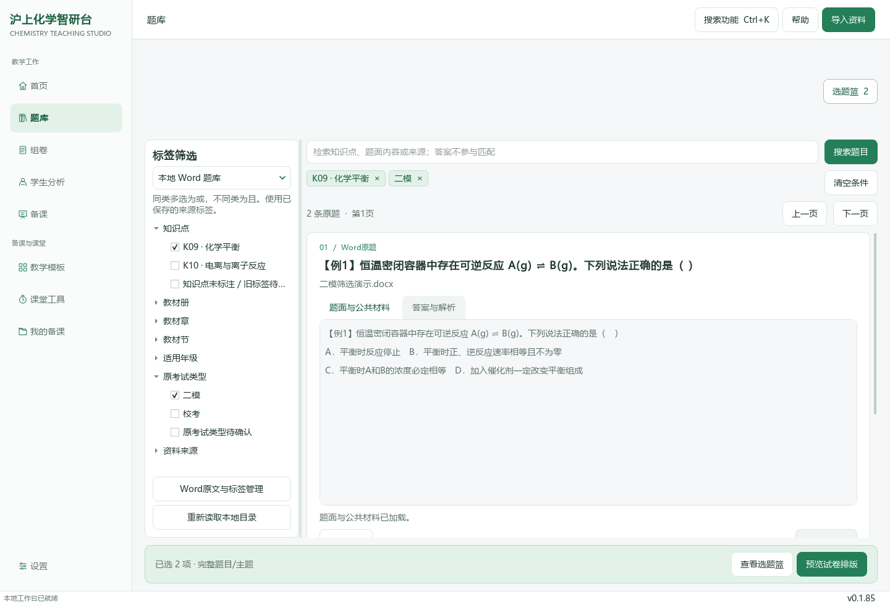

题库、选题篮、组卷、教案/PPT、课堂工具和学生分析使用同一个桌面。0.1.85集中改造选题体验，不另建网页，不创建第二份题篮，不移动或重导教师资料。

六张0.1.85截图来自Windows上实际运行的程序；合成Word样题经过真实导入、标签保存和Office分页。题目、目录和考试类型标签均为测试内容，不是用户原题或真实考试。未改版页面保留0.1.84截图作为操作说明。

[更新记录](CHANGELOG.md) · [本版测试与截图报告](docs/qa/0.1.85-selection.json) · [验证边界](docs/qa/0.1.85-selection.md) · [0.1.84完整历史指南](README-0.1.84-archive.md)

## 启动与升级

首次使用：安装Windows版Python 3.12，在仓库根目录打开PowerShell：

```powershell
py -3.12 -m venv .venv
.\.venv\Scripts\python.exe -m pip install -r runtime\deeptutor_shchem\desktop_requirements.txt
```

之后双击 **`启动源码桌面版.cmd`**，窗口右下角应显示 **v0.1.85**。也可运行：

```powershell
.\.venv\Scripts\python.exe runtime\deeptutor_shchem\desktop_teacher_workbench.pyw
```

已有开发目录先保存或提交未完成修改，再切换本版分支，不要强制重置：

```powershell
git fetch origin
git switch feature/question-explorer-0.1.85
```

本版是源码交付，**不是新的免安装EXE**。旧VBS启动器可能仍优先打开本机旧EXE；运行新版本请使用CMD入口。安装依赖需要网络，已安装后的本地筛选、题篮、模板、草稿和课堂工具不要求模型API。

### 资料位置

| 内容 | 位置或处理方式 |
| --- | --- |
| 既有原题库 | 优先沿用工作区的 `sh-chem-db` |
| 无原库时的个人空目录 | `%LOCALAPPDATA%\ShanghaiChem\DesktopWorkbench\library\sh-chem-db` |
| 个人设置、草稿、题篮及任务 | `%LOCALAPPDATA%\ShanghaiChem\DesktopWorkbench` 下既有状态目录 |
| 指定其他工作区 | `SHCHEM_WORKSPACE_ROOT` 指向包含 `integrations/deeptutor_shchem_v1` 的目录 |

仓库不包含教师的完整教材、Word题库、公众号原图或学生资料。没有原库也可打开应用，但不会凭空恢复题目。旧资料继续沿用；缺少来源时检查工作区与导入历史，不要重复导入来掩盖路径问题。

## 01 首页：从教学任务开始

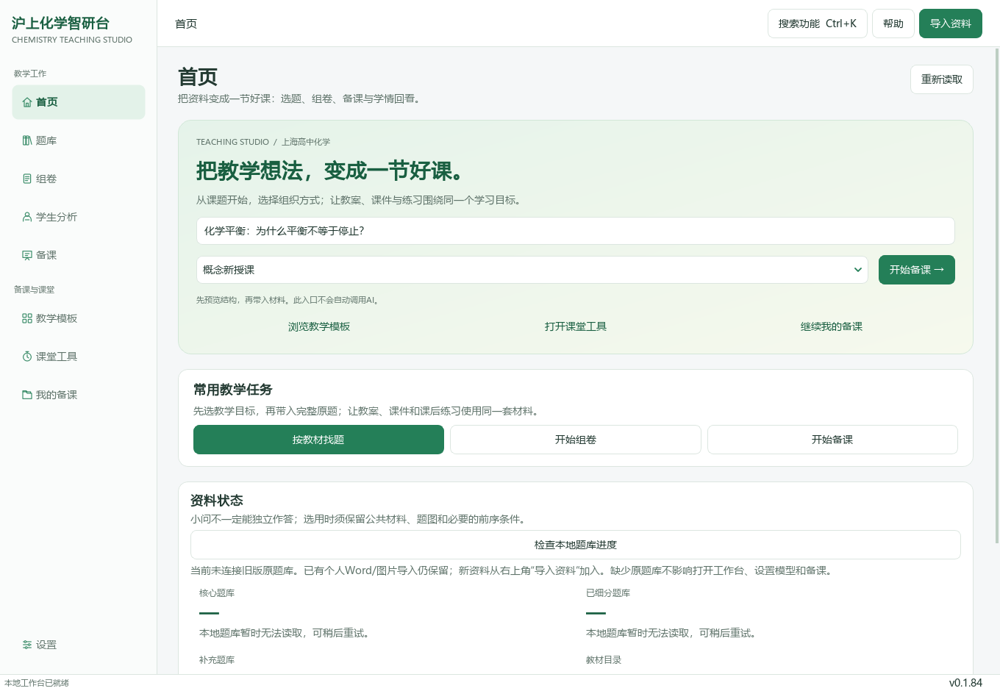

在“今天准备讲什么”填写课题，选择教学组织模板并预览，再带入备课。下方入口可直接找题、组卷、浏览模板、打开课堂工具或继续已有备课。模板应用只填写本地表单，不直接收费生成。

“资料状态”与“检查本地题库进度”读取当前本机目录；空库如实提示，不用历史统计或演示数量代替。

## 02 选题中心：标签菜单与题目列表


左侧先选择来源：核心原卷、细分原卷、公众号补充题、本地Word、个人图片题。再勾选**该来源实际支持**的知识点、教材册/章/节、适用年级、考试类型、年份、区域等标签。不同来源的标签覆盖不完全相同；没有出处的字段不猜填。

**同类多选取并集，不同类同时满足。** 例如知识点选择两个主题表示任一主题符合即可，再勾选“二模”则同时要求原考试类型匹配。顶部条件条可以逐项删除；“清空条件”只清筛选，不清题篮。

右侧是分页题目卡片。第一题自动展开，其余点击“展开题面与答案”即可在当前页面查看完整原文、公共材料和图片；题面与答案分标签页，图片支持放大。关键词检索题面、公共材料与来源，不把答案文字当作题面命中。


完整题面加载后点击“加入选题篮”；已经选过会显示“已在题篮”，避免重复加入。跨页、切换筛选与重新打开应用保留已选项目。搜索刷新也保留教材树展开路径和教师手动收起的标签组。

原卷标签括号中的数字是当前匹配的**作答单元数**，不是独立大题数。小问选入时保留所属主题和必要公共材料，不能因为命中一个标签就把题目拆到无法作答。Word或图片题的标签与范围仍可从左下角原文/裁片管理入口修订。

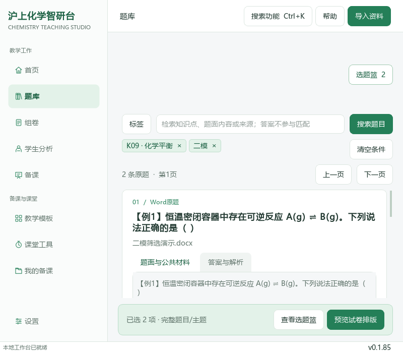

窄窗口把菜单折叠为“标签”按钮，点开仍可操作；没有匹配时可移除单个条件，不必重新导入资料。

## 03 选题篮、组卷与真实排版

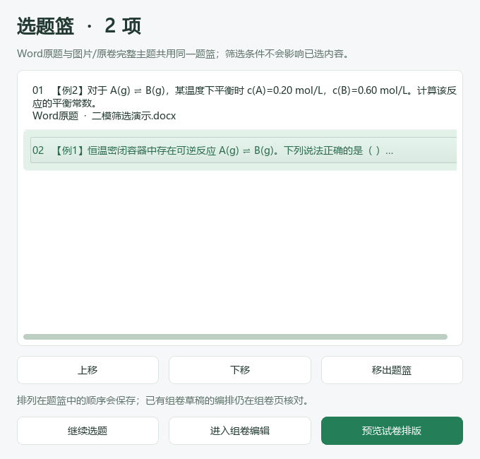

右上角和底部始终显示题篮入口及数量。打开可查看题目标题和来源，上移、下移、单项移除；移除只改变本次选择，不删除原题。一项可能是Word题，也可能是包含多个小问的完整主题，不把“项目数”冒充独立小问数。

**“预览试卷排版”使用当前题篮全部项目及当前顺序。** 已有标题和配分设置保留；此前在本卷排除但仍留在题篮内的项目会重新包含。需要继续修改旧组卷草稿时，点击“进入组卷编辑”，两种入口用途不同。

组卷页可调整标题、配分、额外作答区及学生版分数显示。原题已有空格、横线或表格时不重复增加一套；主题公共材料、原图和答案角色保留。

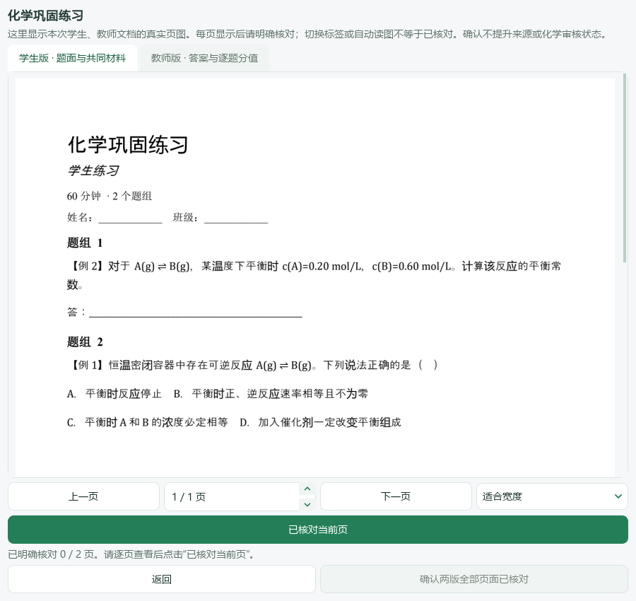

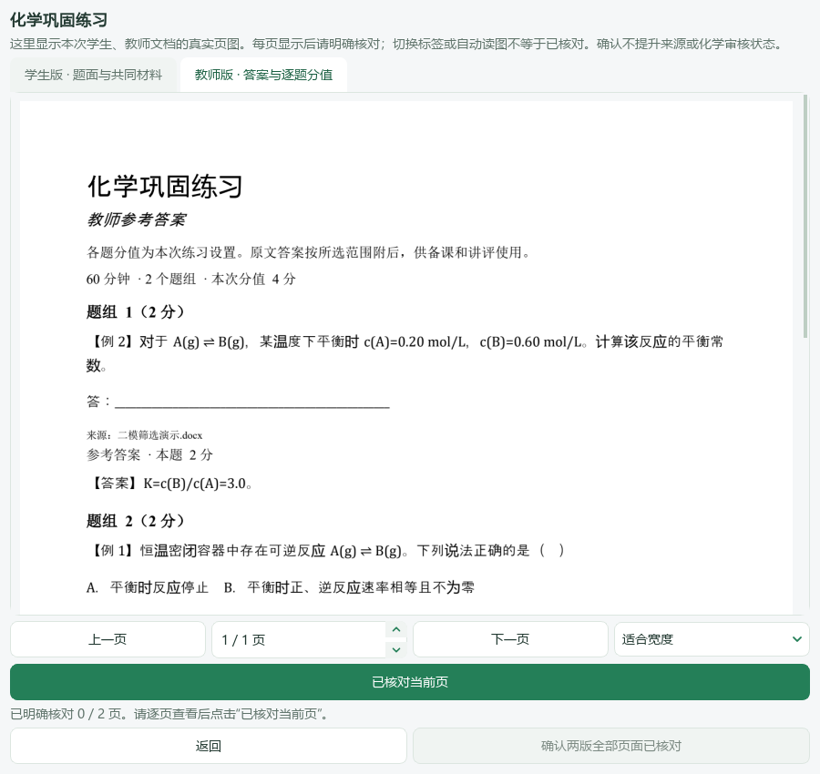

预览是本次DOCX转换成PDF后的真实页图，可切换学生/教师版、翻页与缩放，不是题目清单或示意纸张。按现有流程逐页核对后，导出复用本次冻结的DOCX/PDF，避免确认后再次排版产生差异。学生版不带教师答案图，教师版保留本次配分与来源说明。

### 排版环境

本机需要 **LibreOffice（优先）或Windows Microsoft Word** 完成DOCX→PDF转换，随桌面依赖安装的PDFium负责显示页图。不需要旧开发机的Codex私有工具路径。缺少转换工具会明确提示，保留题篮，不用假预览代替。不同Office与字体可能产生不同分页，最终以本次生成并核对的文件为准。

## 04 学生分析

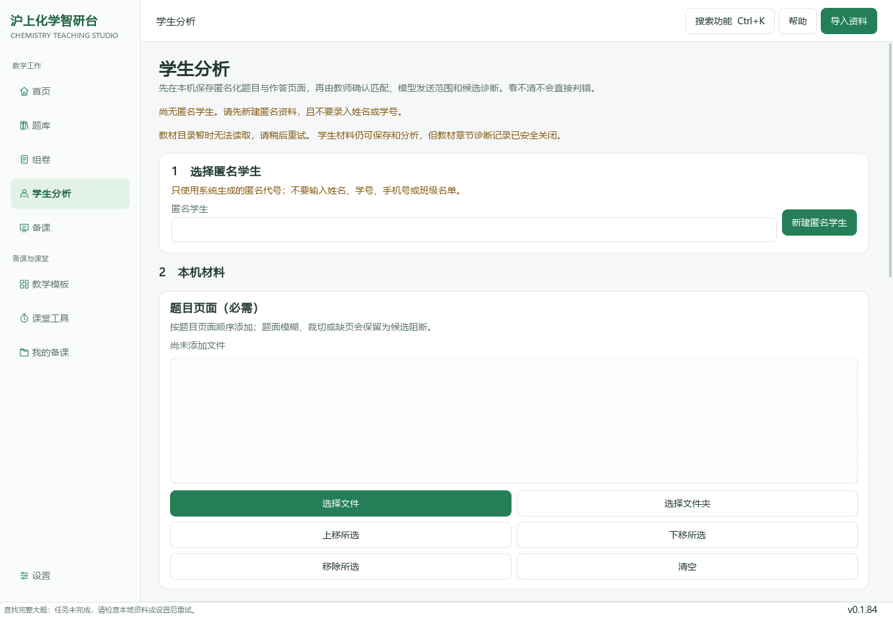

使用学生代号，提供真实题目、作答和评分依据，再进行诊断与练习推荐。推荐继续引用可核对题库身份和完整公共材料。记录日期与复测结果；尚无新作答时，不把建议写成“已经掌握”。

课堂工具中的出口检测是教师对一次任务的手动汇总，不替代学生档案，也不是学生端实时采集。

## 05 备课：教案与PPT

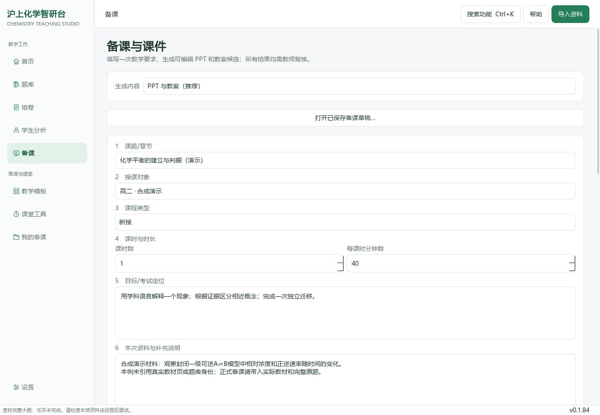

填写课题、授课对象、课型、课时、目标和资料。可从原教案、教材知识点、Word或本课选题带入完整内容；教学模板的组织建议仍可编辑。输出可选择PPT、教案或两者联合。

“保存草稿”只保存本机输入。“生成备课候选”才进入已有模型确认与生成流程。含图材料用于本地排版和交给AI读图是不同设置；根据实际任务确认发送范围。生成后检查知识解释、例题、独练、反馈与小结是否衔接，并核对科学条件和课堂时间。

首次体验可走离线流程：模板带入 → 补充材料 → 保存草稿 → 我的备课找回 → 课堂反馈追加 → 再次保存。需要生成时再配置模型，不把填好结构当作已经生成课件。

## 06 教学模板

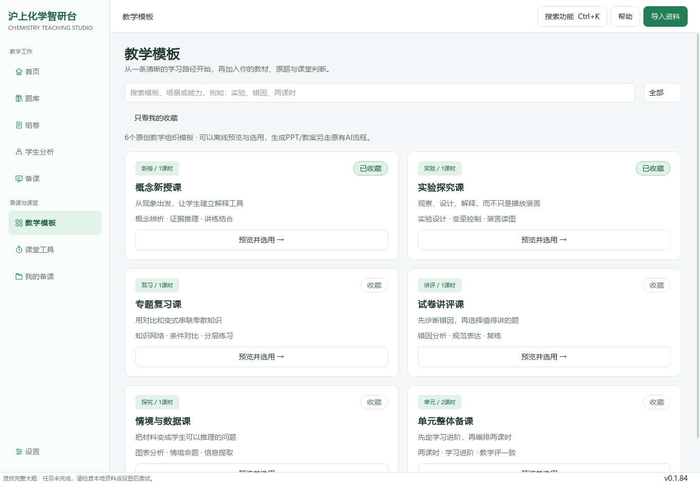

概念新授、实验探究、专题复习、试卷讲评、情境与数据、单元整体备课共六种原创结构。支持关键词搜索、分类、收藏和完整预览；不是获奖PPT下载，也不是商业平台模板复制。

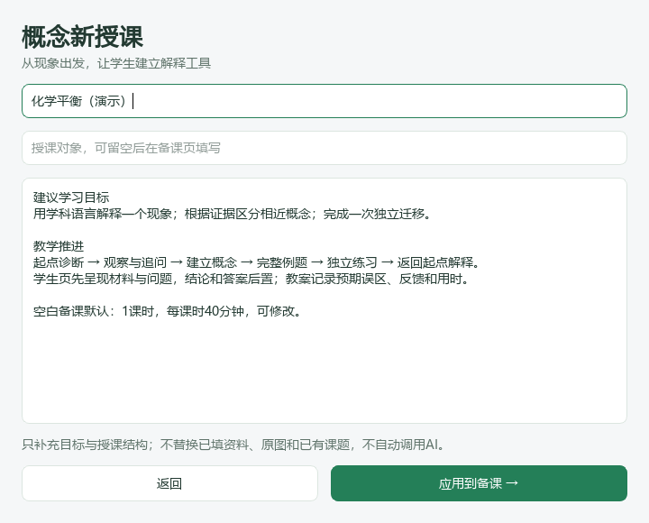

预览后应用到原备课表单。已有课题、对象、目标、材料和图片保留；空白表单才采用模板建议课型与时长。重复应用同一模板不会重复追加同一段结构。保存、导入或生成过程中，待当前操作结束后再应用。

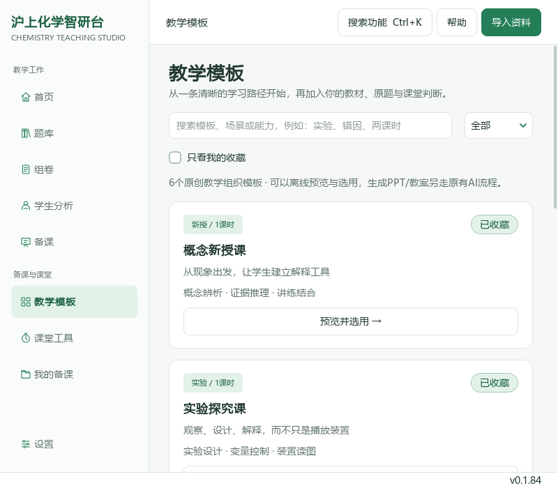

## 07 课堂工具

### 倒计时

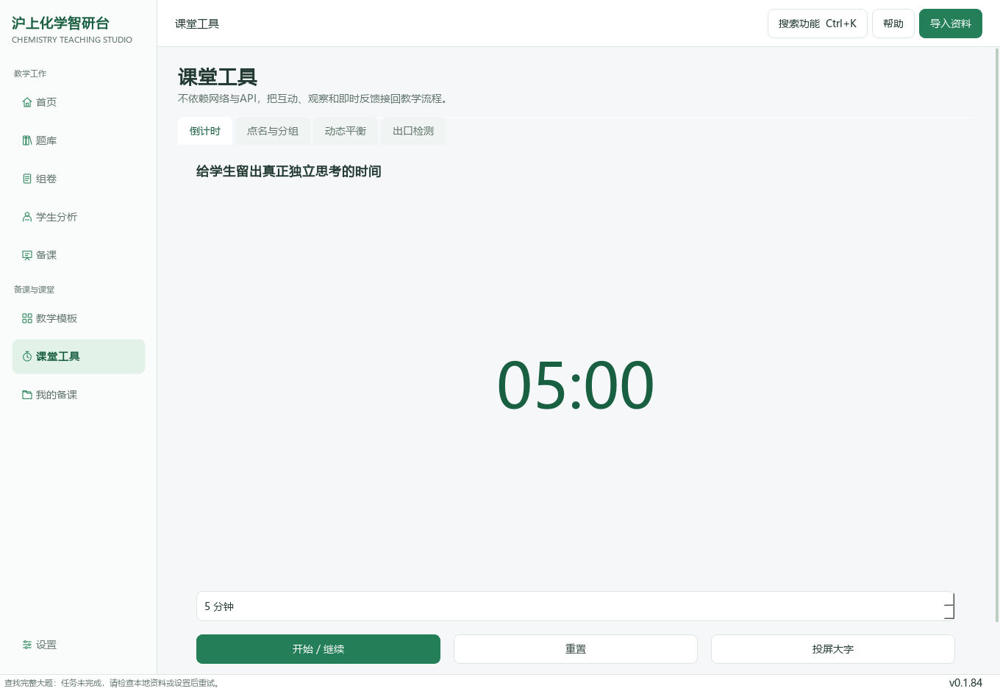

设置1～180分钟，开始、暂停或继续；重置采用当前设定时长。“投屏大字”打开全屏数字，Esc返回。计时按实际经过时间推进，切换工作台页面不暂停，关闭应用后不继续运行。

### 点名与分组

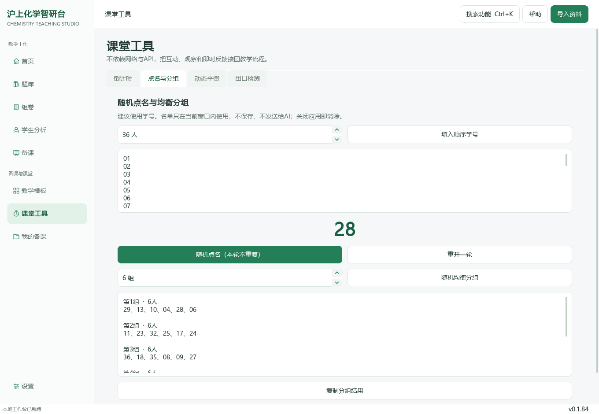

逐行输入唯一学号或代号，也可填入顺序学号。一轮内点名不重复，全部抽完后重开一轮；修改名单重置该轮并清空旧分组。设定组数后均衡随机分组，各组人数最多差1，结果可复制。

名单仅在当前会话内存中使用，不自动存入学生库或发送给AI。点击复制会写入本机剪贴板。

### 动态平衡

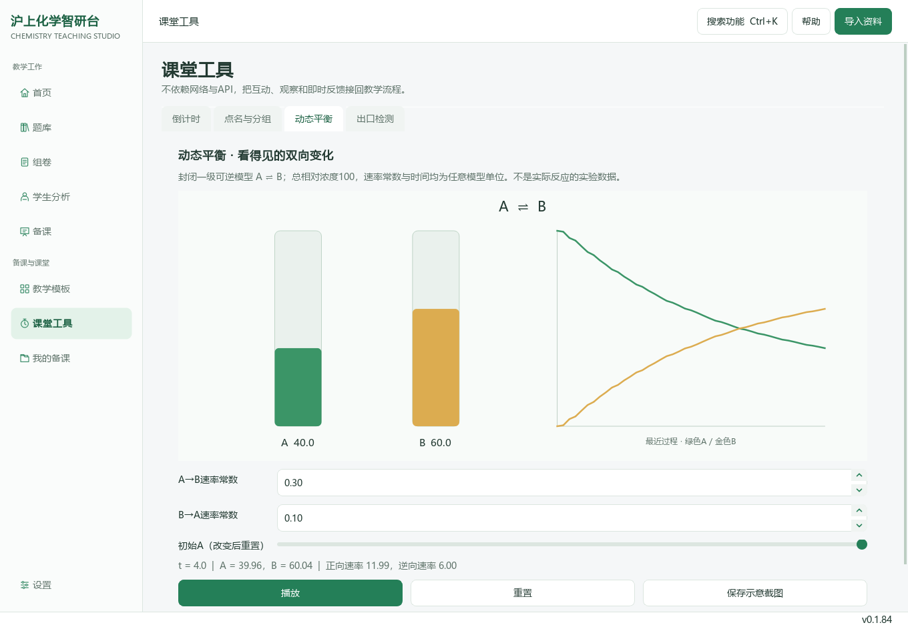

播放后观察相对浓度、最近过程曲线、正逆速率和时间；可修改速率常数，改变初始A浓度会重置过程。支持暂停和保存当前PNG。

这是封闭、一级可逆 **A⇌B** 的固定教学示意，总相对浓度100，参数与时间为模型单位。用于讨论速率相等与浓度是否相等，不是实测数据、任意装置仿真或AI任意动画生成；PNG保存静态状态，不自动把动画嵌入PPT。

### 出口检测

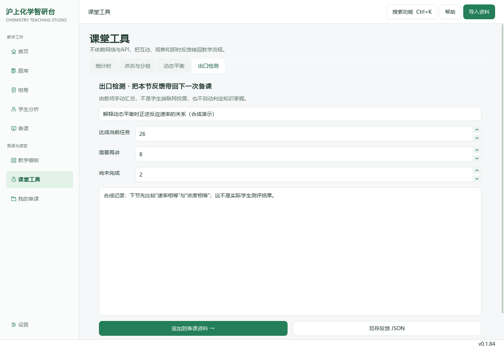

填写检测问题或目标，记录达成、需要再讲、尚未完成的人数和具体错因。填写问题与至少一项人数后，可另存JSON或“追加到备课资料”。追加保留原材料，保存草稿后才可找回；不调用AI、不改学生评分，也不提供联网投票。

## 08 我的备课

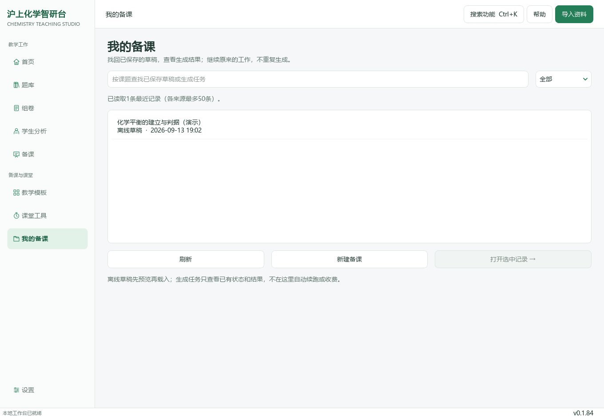

按课题查找已保存草稿和生成任务，各来源最近最多50条。离线草稿先预览再载入；有未保存修改时明确确认，不默认丢弃。失效的指定草稿不会改开另一份记录。生成任务查看已有状态和结果，不自动重试或收费；“返回备课继续编辑”仅导航，不新建或清空。

## 09 导入资料与模型设置


右上角“导入资料”选择Word、PDF或图片，预览后保存。已有批次从历史继续核对；Word优先原生提取正文、表格、支持的公式和嵌入图。扫描页、旧公式或不完整图片需要相应识图能力及原件核对。

题答范围不准确时，从Word原文管理修订；本版演示的一处答案串入下一节标题已通过该入口显式校准，不因此宣称通用自动分题已经完美。真实题库标签、裁图和知识蒸馏仍由本地资料工作继续推进。

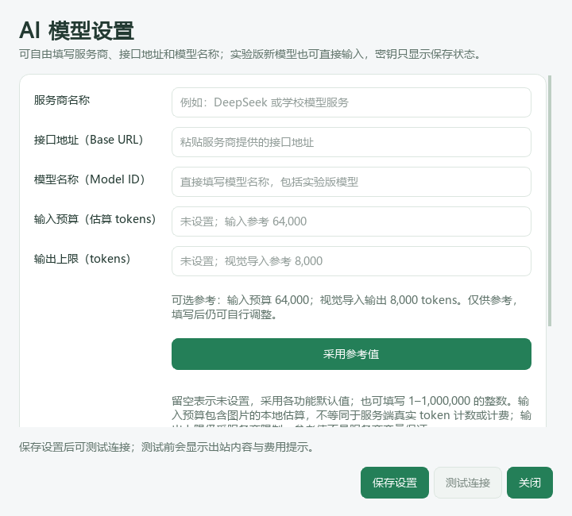

填写服务地址、实际模型标识、个人密钥和预算，保存后测试连接。文本联通不等于能看图，也不证明化学结构识读准确。筛选、题篮、模板、课堂工具和本地草稿不要求AI；生成、读图、分析仍走原有确认流程。不要把密钥提交Git。

## 10 进度、快捷入口与帮助

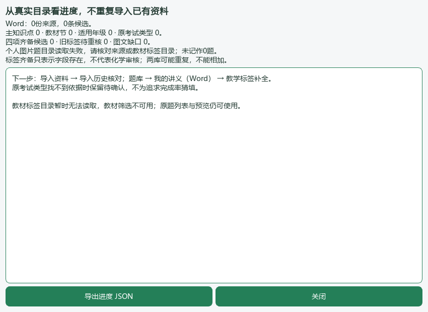

首页检查当前Word来源、候选数量、知识点/教材节/适用年级/原考试类型覆盖，查看旧标签重核和材料缺口。图片题按主题和印刷题另计，不能把两库简单相加。进度JSON可用于本地交接，包含来源名称，分享前检查；字段齐备不等于化学审核。

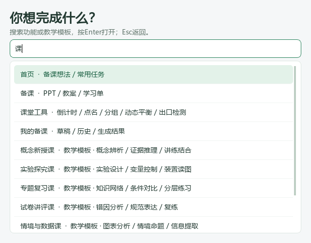

`Ctrl+K`搜索功能或模板，`Ctrl+1～5`切换原五个页面，`F1`打开帮助，`Esc`关闭当前对话框或投屏。快捷入口不是全题库语义搜索。

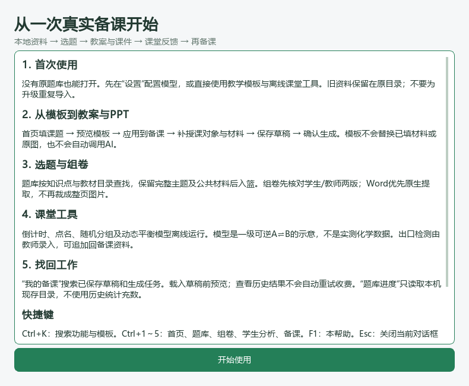

## 常见问题

**仍是旧版本？** 检查分支为 `feature/question-explorer-0.1.85`，使用源码CMD而非可能指向旧EXE的VBS。

**有资料却搜不到？** 先检查来源选择和筛选条件，再看当前工作区、导入历史及标签是否失效。不同来源的标签覆盖不同，缺失考试类型不能靠推测补齐。

**为什么预览需要Office？** 需要将真实DOCX转换为PDF来显示实际分页；没有转换工具时仍可选题和保留题篮，但不能用示意内容替代排版。

**已完全对齐商业平台了吗？** 没有。当前完成原生标签选题、题篮与真实分页等增量，没有复制商业题库，也没有新增云社区、跨设备同步或学生端实时投票。

## 版本与验证

当前版本统一为 **0.1.85**，分支基于0.1.84的 `dc63b4bb`。本次Windows代码回归 **245项通过，0失败、0错误、0跳过**；真实导入合成Word、保存标签、界面筛选、入篮和重排后，生成学生版与教师版PDF各1页，并记录6张本版窗口截图。41项本地测试是其中子集，不重复累加。

[机器报告](docs/qa/0.1.85-selection.json)记录实际受测源码、平台、截图SHA与测试数量；[验证说明](docs/qa/0.1.85-selection.md)说明范围修订和已知边界。最后的文档提交可能晚于代码验证，不冒充重新验收程序。未改版页面的0.1.84截图只作为操作参考。

本版没有新独立EXE、真实API调用、用户原题新增导入或知识蒸馏。定向回归与合成材料排版不替代全量真实题图、全部导出场景或课堂效果验收。保留原分支、历史README和更新记录，不自动合并main。

## 开发定位

`desktop_workbench/question_explorer_page.py`负责新选题页；`desktop_question_explorer.py`复用筛选服务，`DesktopStateStore`保存同一题篮，`MixedPaperService`负责组卷和冻结分页。现有备课、学生分析与教学工作室保留，不新增平行数据库。

[0.1.85 Windows工作流](.github/workflows/question-explorer.yml) · [0.1.84历史验证](docs/qa/0.1.84-studio.md) · [历版记录](CHANGELOG.md)
