# 沪上化学智研台

**0.1.89 · Windows x64 原生试用版 / 可运行源码版 · 上海高中化学教师工作台**

本版新增备课作品备份、校验与独立目录恢复，并可按原内容补回缺失备课图片。当前作品、归档和回收站分类随备份保留。保留原有选题组卷、教案/PPT、课堂工具、恢复副本和本机检查。

[下载本版 Release](https://github.com/2067169120-png/shanghai-chemistry-teaching-agent/releases/tag/v0.1.89) · [更新记录](CHANGELOG.md) · [59项任务进度](docs/roadmaps/audit-followup.md) · [源码验证](docs/qa/0.1.89-readiness.json) · [独立程序验证](docs/qa/0.1.89-package.json) · [0.1.88发行指南](README-0.1.88-archive.md)

## 启动：便携程序与源码二选一

### 教师试用便携程序

从本版Release下载 `ShanghaiChem-0.1.89-Windows-x64.zip`，**完整解压**，双击目录内的 **`沪上化学智研台.exe`**。不要在ZIP里直接启动，不要只复制EXE，不要删除旁边的`_internal`目录。窗口状态栏应显示 **v0.1.89 / 打包版**。不需另装Python；程序本身不包括Microsoft Office或LibreOffice。

程序未签名。请核对仓库发布来源和`SHA256SUMS.txt`，不要关闭Windows防护或跳过可疑文件警告。当前验证平台是Windows Server 2025 x64；尚未逐一验证全部Windows10/11配置、学校管控电脑或不同缩放。

### 开发者运行源码

源码版在含README的目录执行以下命令，随后双击 **`启动源码桌面版.cmd`**。状态栏应显示 **v0.1.89 / 源码版**。

```powershell
py -3.12 -m venv .venv
.\.venv\Scripts\python.exe -m pip install -r runtime\deeptutor_shchem\desktop_requirements.txt
```

已有Git目录先保存未提交修改，再执行 `git fetch origin` 和 `git switch feature/lesson-backup-0.1.89`。不强制重置；旧VBS仍可能启动本机旧EXE。源码版无法启动时可双击 **`检查运行环境.cmd`**。

### 资料和升级

个人设置、草稿、题篮及恢复副本继续放在 `%LOCALAPPDATA%\ShanghaiChem\DesktopWorkbench`，不随程序目录变更而搬迁。关闭旧版本后再运行新版本；替换程序目录不是删除个人资料。程序不含你的教材、题库、原图、学生作答或密钥。

源码旁的`sh-chem-db`仍按原规则使用；没有原库时建立个人空目录。**便携包不会自动复制另一源码目录旁的题库。** 原资料可继续使用原源码环境，或以`SHCHEM_WORKSPACE_ROOT`明确关联原工作区；不要把题库复制进`_internal`。恢复副本保留图片引用；本版可明确勾选备课图片和成品打包。原Word/公众号题库、学生档案和模型配置尚不在备份范围。

## 备份、恢复与补回原图

从 **我的备课 → 备份与恢复** 或 Ctrl+K 搜索“备份”进入。

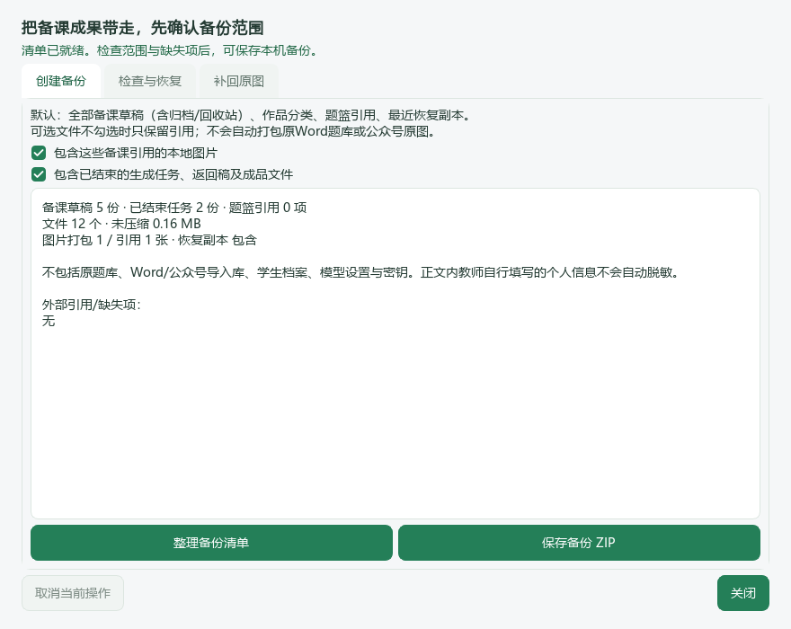

**创建备份：**默认包括全部有效备课草稿（含归档/回收站）、作品分类、题篮引用和最近编辑恢复副本。
按需勾选“包含本地图片”和“包含已结束的生成任务、返回稿及成品”，先整理清单，核对数量、文件大小与缺失项，再选择新文件名保存ZIP。草稿与题篮按整理清单时的快照保存；此后继续编辑，要重新整理清单才会包含新内容。图片与任务文件在写入时再次核对，变化会要求刷新，不覆盖旧备份。

题篮保存的是原题身份和材料摘要，**不是原题文件备份**。其他业务草稿、原Word/公众号导入库、学生档案、模型配置和密钥不包含。本版不是整个工作台的一键迁移。草稿/成品正文里教师自己录入的个人信息不会自动脱敏；ZIP未加密，请自行妥善保存。单文件上限128MB、每份备份上限2GB/2万个文件，备课图片沿用10MB单图限制。

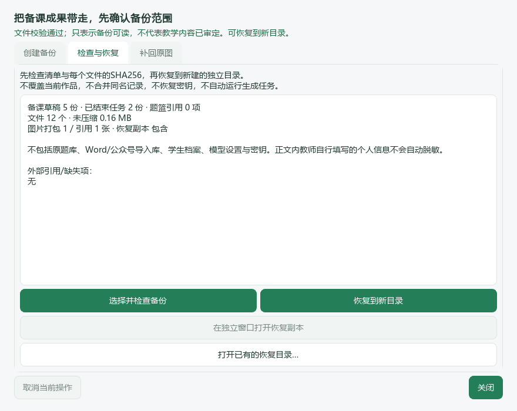

**检查与恢复：**选择ZIP，检查清单及每个文件哈希；确认后选择恢复位置，软件在其下创建新的“备课恢复-日期-编号”目录。不会覆盖当前作品，不与同名记录合并。校验失败不会接入损坏文件；未结束任务不打包、不恢复、不自动续跑。

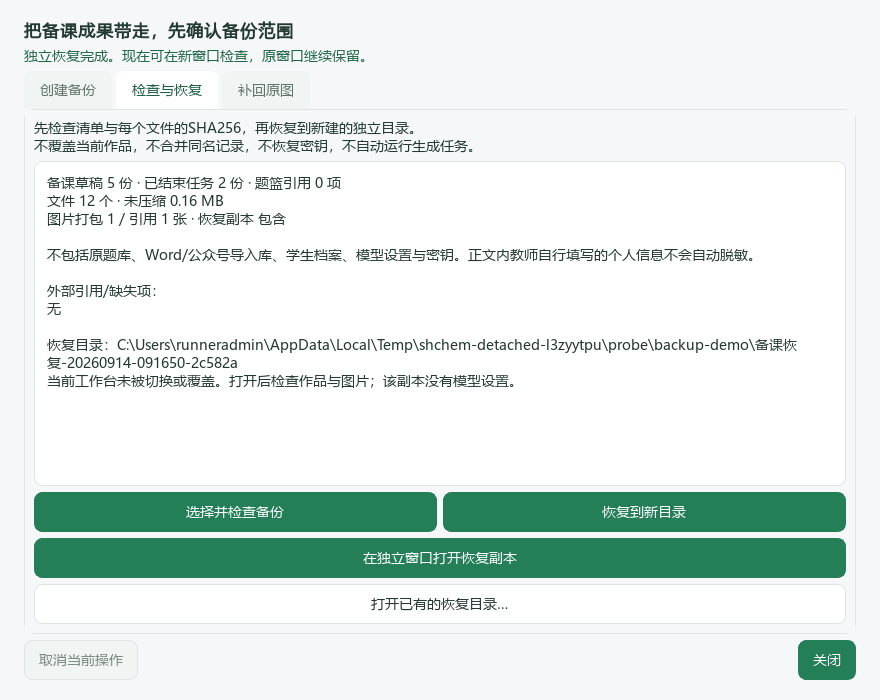

点击“在独立窗口打开恢复副本”，原窗口仍在，新窗口标题标明**独立恢复副本**。该窗口使用新目录保存后续编辑，没有原模型设置，也不会静默使用源码旁原题库。关闭后再次打开默认EXE仍回到默认个人资料。可在‘检查与恢复’中点击**‘打开已有的恢复目录…’**，选择先前创建的恢复目录再次打开，无须重复恢复。也可执行：

```powershell
& "C:\应用目录\沪上化学智研台.exe" --personal-state "D:\备份恢复位置\备课恢复-日期-编号"
```

源码方式是在原源码启动命令后加同样的`--personal-state`参数。该参数只接受工作台已经校验生成的恢复目录；不执行备份内的脚本。恢复副本里的新修改不会自动同步回原窗口，**不要把独立恢复误当作合并**。

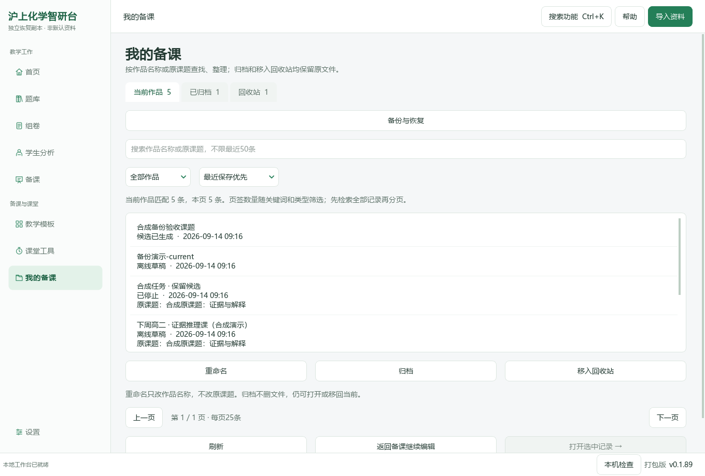

**补回原图：**在需要修复的那份工作台窗口打开“补回原图”标签，检查缺失备课图片，选中后提供原始PNG/JPEG/WebP。只有文件SHA256、尺寸和格式与旧引用一致才补回；仅同名或内容改过的图片不替换，草稿正文和题目身份不变。原Word和公众号题库的跨目录重新关联仍待后续版本。

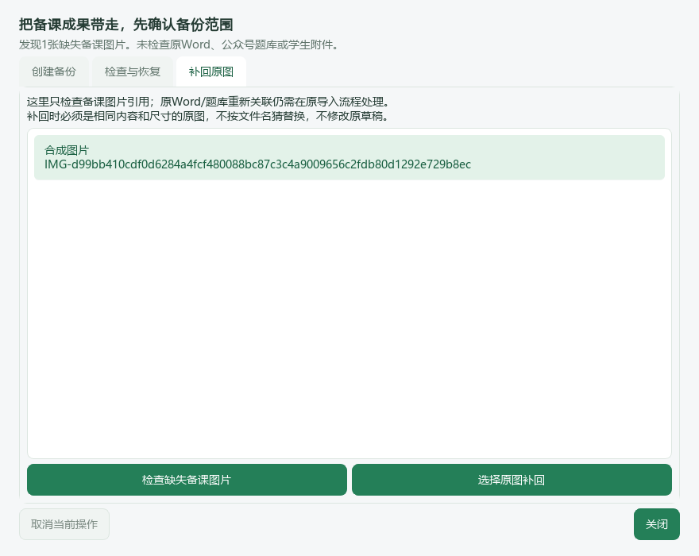

较小窗口也保留范围、清单和操作，备份读写在后台执行；点“取消当前操作”可停止尚未提交的操作。已完成写入则如实报告成功，不伪称已撤销。

## 本版设置与本机检查

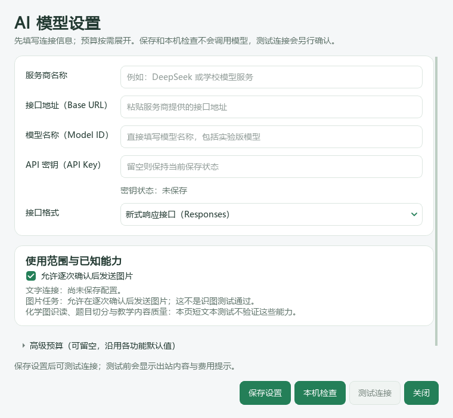

先填服务商、Base URL、实际模型名、密钥和接口格式。保存仅修改本机配置；点击“测试连接”才会确认并发送固定短文本。修改了配置但未重测时，旧成功结果不作为当前连接已验证的证明。

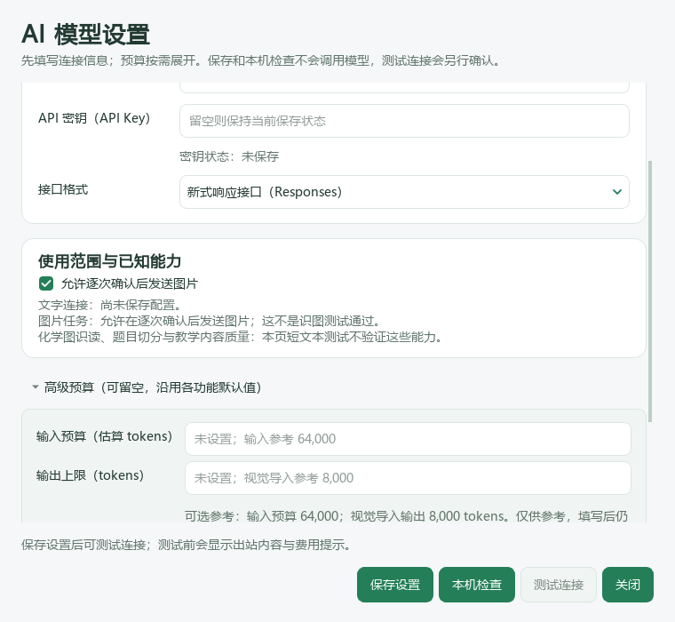

高级预算默认收起，已有值仍保留；输入/输出预算可留空或按需修改。错误输入会展开高级区以便纠正。预算不是厂商容量保证，图片的本地估算不是真实计费值。图片发送许可与模型看图能力是两回事，本轮没有发起真实多模态验证。

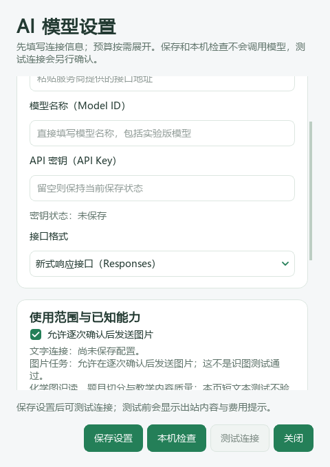

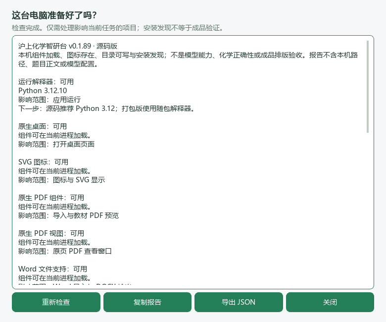

本机检查可从状态栏、设置和快捷搜索打开；结果分别说明版本身份、Qt/PDF/Word/PPT组件、图标资源、个人目录写入和Office安装发现。检测不读取密钥、不扫描题目正文、不发网络请求。可复制或保存JSON。**发现Office不等于转换成功，空题库也不等于应用无法运行。** 真正分页需本机LibreOffice或Windows Microsoft Word。

## 本版验证与交付

同一提交完成 **395项Windows定向测试，0失败、0错误、0跳过**。源码和同一发行EXE均执行备份清单→保存ZIP→校验→独立目录恢复→打开原成品→补回原图。原草稿、分类和恢复表单不被改写；恢复后的规范候选通过原生产渲染器再次导出。便携程序还以--personal-state实际打开并关闭恢复窗口。8页及既有5页PPTX/2页教案PDF回归保留。以上为隔离合成数据验证，不代表全题库备份或真实课堂验收。

本版未签名；测试使用隔离合成资料，没有真实模型调用、用户教材蒸馏或全题库恢复验收。

## 日常使用导航

[首页](#01-首页从教学任务开始) · [选题](#02-选题中心标签菜单与题目列表) · [题篮和组卷](#03-选题篮组卷与真实排版) · [学生分析](#04-学生分析) · [备课](#05-备课教案与ppt) · [教学模板](#06-教学模板) · [课堂工具](#07-课堂工具) · [我的备课](#08-我的备课名称归档与回收站)


## 01 首页：从教学任务开始

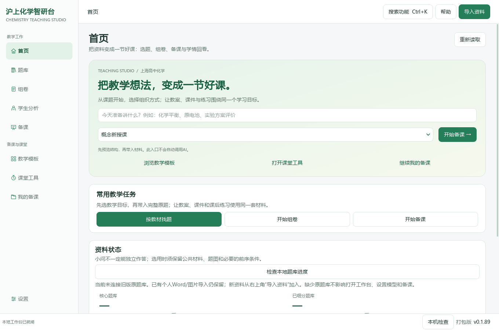

在“今天准备讲什么”填写课题，选择教学组织模板并预览，再带入备课。下方入口可直接找题、组卷、浏览模板、打开课堂工具或继续已有备课。模板应用只填写本地表单，不直接收费生成。

“资料状态”与“检查本地题库进度”读取当前本机目录；空库如实提示，不用历史统计或演示数量代替。

## 02 选题中心：标签菜单与题目列表


左侧先选择来源：核心原卷、细分原卷、公众号补充题、本地Word、个人图片题。再勾选**该来源实际支持**的知识点、教材册/章/节、适用年级、考试类型、年份、区域等标签。不同来源的标签覆盖不完全相同；没有出处的字段不猜填。

**同类多选取并集，不同类同时满足。** 例如知识点选择两个主题表示任一主题符合即可，再勾选“二模”则同时要求原考试类型匹配。顶部条件条可以逐项删除；“清空条件”只清筛选，不清题篮。

右侧是分页题目卡片。第一题自动展开，其余点击“展开题面与答案”即可在当前页面查看完整原文、公共材料和图片；题面与答案分标签页，图片支持放大。关键词检索题面、公共材料与来源，不把答案文字当作题面命中。


完整题面加载后点击“加入选题篮”；已经选过会显示“已在题篮”，避免重复加入。跨页、切换筛选与重新打开应用保留已选项目。搜索刷新也保留教材树展开路径和教师手动收起的标签组。

原卷标签括号中的数字是当前匹配的**作答单元数**，不是独立大题数。小问选入时保留所属主题和必要公共材料，不能因为命中一个标签就把题目拆到无法作答。Word或图片题的标签与范围仍可从左下角原文/裁片管理入口修订。


窄窗口把菜单折叠为“标签”按钮，点开仍可操作；没有匹配时可移除单个条件，不必重新导入资料。

## 03 选题篮、组卷与真实排版


右上角和底部始终显示题篮入口及数量。打开可查看题目标题和来源，上移、下移、单项移除；移除只改变本次选择，不删除原题。一项可能是Word题，也可能是包含多个小问的完整主题，不把“项目数”冒充独立小问数。

**“预览试卷排版”使用当前题篮全部项目及当前顺序。** 已有标题和配分设置保留；此前在本卷排除但仍留在题篮内的项目会重新包含。需要继续修改旧组卷草稿时，点击“进入组卷编辑”，两种入口用途不同。

组卷页可调整标题、配分、额外作答区及学生版分数显示。原题已有空格、横线或表格时不重复增加一套；主题公共材料、原图和答案角色保留。


预览是本次DOCX转换成PDF后的真实页图，可切换学生/教师版、翻页与缩放，不是题目清单或示意纸张。按现有流程逐页核对后，导出复用本次冻结的DOCX/PDF，避免确认后再次排版产生差异。学生版不带教师答案图，教师版保留本次配分与来源说明。

### 排版环境

本机需要 **LibreOffice（优先）或Windows Microsoft Word** 完成DOCX→PDF转换，随桌面依赖安装的PDFium负责显示页图。不需要旧开发机的Codex私有工具路径。缺少转换工具会明确提示，保留题篮，不用假预览代替。不同Office与字体可能产生不同分页，最终以本次生成并核对的文件为准。

## 04 学生分析

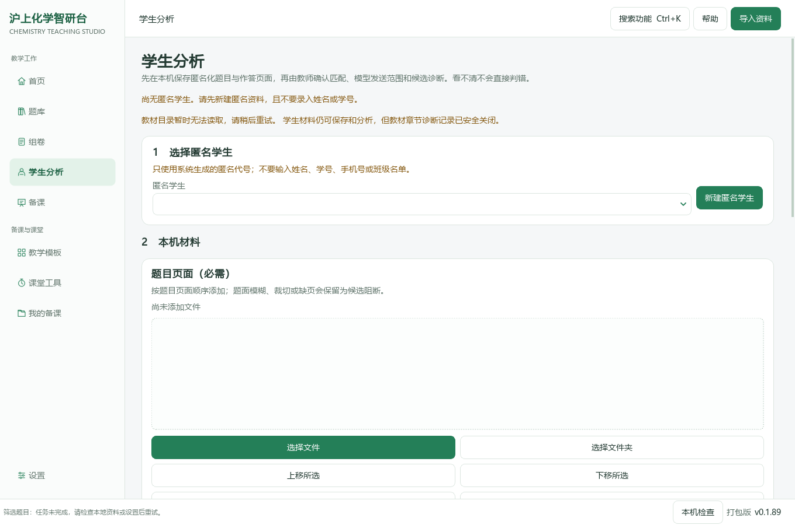

使用学生代号，提供真实题目、作答和评分依据，再进行诊断与练习推荐。推荐继续引用可核对题库身份和完整公共材料。记录日期与复测结果；尚无新作答时，不把建议写成“已经掌握”。

课堂工具中的出口检测是教师对一次任务的手动汇总，不替代学生档案，也不是学生端实时采集。

## 05 备课：教案与PPT

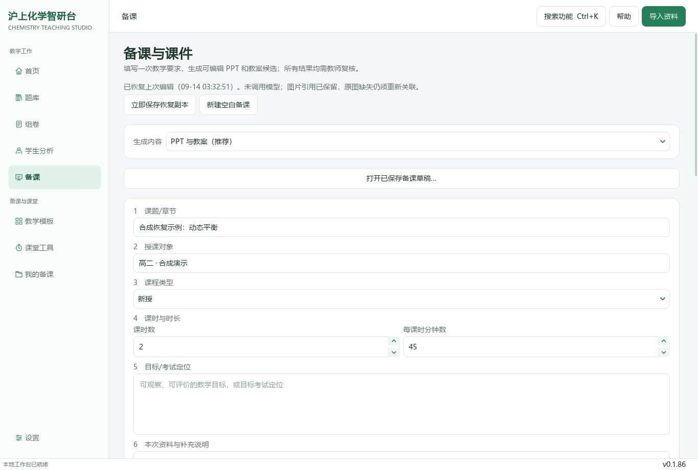

**自动恢复包括**课题、对象、课型、课时、目标、资料、输出类型、三项精细设置，以及教学图片的内容标识、来源、用途和本地/读图模式。未填完的文本也保存；恢复保留图片引用，但不会把已经删除的原图“变回来”。原图不可用时仍须重新关联或导入。

恢复副本和“保存草稿”不同：前者用于继续最后编辑，后者保存一个正式的本机版本，仍可在“我的备课”查找。开始另一节课可点“新建空白备课”；存在内容时会先确认，清空只影响当前表单和恢复副本，已保存草稿、题篮和图片文件不删除。

保存失败会提示磁盘/权限问题，退出时提供重试、取消退出或明确放弃最新修改。不可读或未来版本的恢复文件保留原件且暂停自动覆盖；先备份并检查个人目录中的该文件，仍可使用“保存草稿”另存当前工作。未结束的AI/导入任务不会因恢复表单而自动重新执行。异常退出只恢复最后一次成功写入的副本，约2秒内尚未落盘的编辑、断电或磁盘故障不作绝对无损承诺。


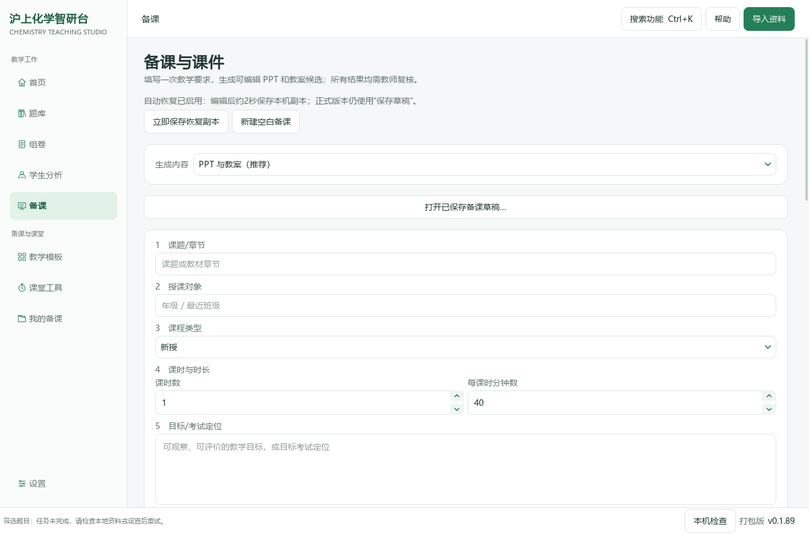

填写课题、授课对象、课型、课时、目标和资料。可从原教案、教材知识点、Word或本课选题带入完整内容；教学模板的组织建议仍可编辑。输出可选择PPT、教案或两者联合。

“保存草稿”只保存本机输入。“生成备课候选”才进入已有模型确认与生成流程。含图材料用于本地排版和交给AI读图是不同设置；根据实际任务确认发送范围。生成后检查知识解释、例题、独练、反馈与小结是否衔接，并核对科学条件和课堂时间。

首次体验可走离线流程：模板带入 → 补充材料 → 保存草稿 → 我的备课找回 → 课堂反馈追加 → 再次保存。需要生成时再配置模型，不把填好结构当作已经生成课件。

## 06 教学模板

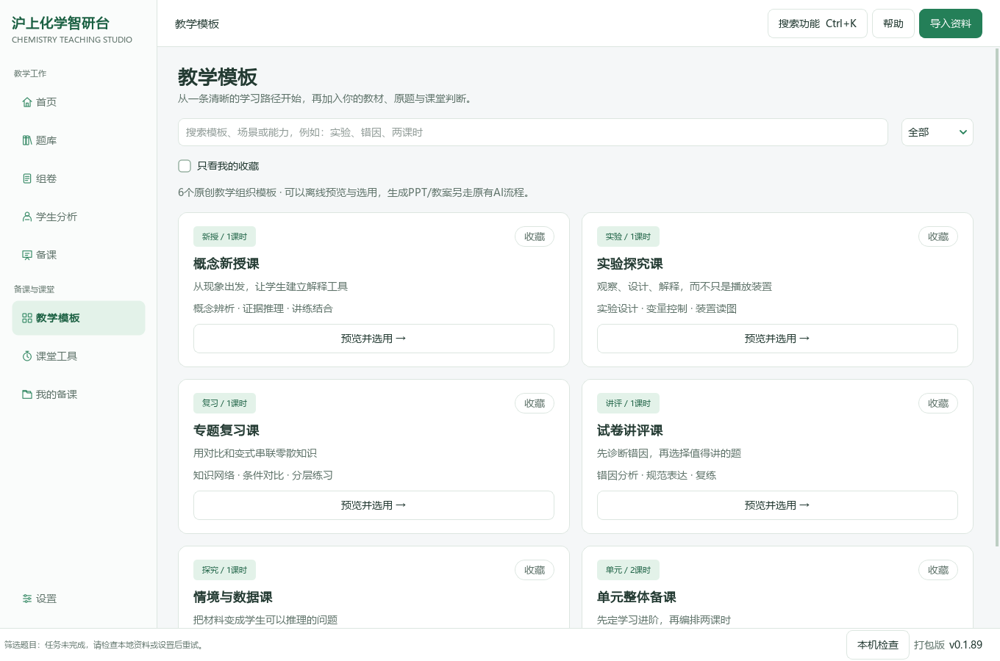

概念新授、实验探究、专题复习、试卷讲评、情境与数据、单元整体备课共六种原创结构。支持关键词搜索、分类、收藏和完整预览；不是获奖PPT下载，也不是商业平台模板复制。


预览后应用到原备课表单。已有课题、对象、目标、材料和图片保留；空白表单才采用模板建议课型与时长。重复应用同一模板不会重复追加同一段结构。保存、导入或生成过程中，待当前操作结束后再应用。


## 07 课堂工具

### 倒计时

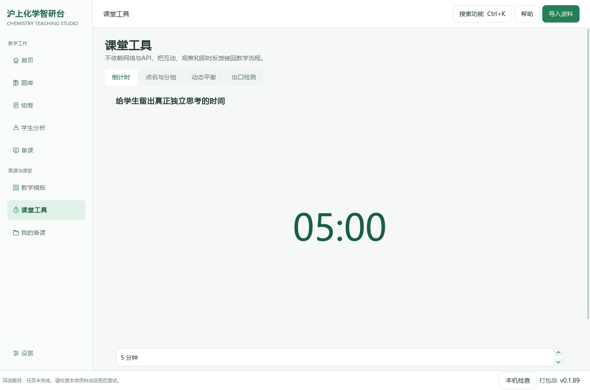

设置1～180分钟，开始、暂停或继续；重置采用当前设定时长。“投屏大字”打开全屏数字，Esc返回。计时按实际经过时间推进，切换工作台页面不暂停，关闭应用后不继续运行。

### 点名与分组


逐行输入唯一学号或代号，也可填入顺序学号。一轮内点名不重复，全部抽完后重开一轮；修改名单重置该轮并清空旧分组。设定组数后均衡随机分组，各组人数最多差1，结果可复制。

名单仅在当前会话内存中使用，不自动存入学生库或发送给AI。点击复制会写入本机剪贴板。

### 动态平衡


播放后观察相对浓度、最近过程曲线、正逆速率和时间；可修改速率常数，改变初始A浓度会重置过程。支持暂停和保存当前PNG。

这是封闭、一级可逆 **A⇌B** 的固定教学示意，总相对浓度100，参数与时间为模型单位。用于讨论速率相等与浓度是否相等，不是实测数据、任意装置仿真或AI任意动画生成；PNG保存静态状态，不自动把动画嵌入PPT。

### 出口检测


填写检测问题或目标，记录达成、需要再讲、尚未完成的人数和具体错因。填写问题与至少一项人数后，可另存JSON或“追加到备课资料”。追加保留原材料，保存草稿后才可找回；不调用AI、不改学生评分，也不提供联网投票。

## 08 我的备课：名称、归档与回收站

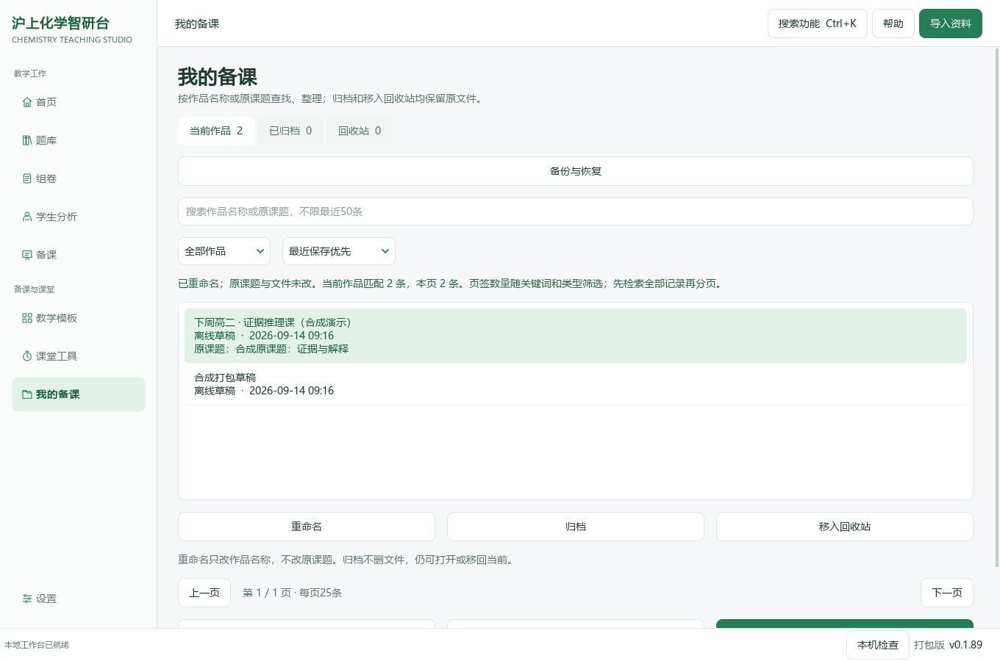

进入“我的备课”，选择“当前作品 / 已归档 / 回收站”。关键词同时匹配**作品名称或原课题**；类型、范围和关键词一起筛选，之后再排序和分页，每页25条，不限最近50份。页签数量随关键词和类型变化，不是磁盘全部文件数。默认按草稿保存时间或任务更新时间排序，重命名不伪造内容保存时间。

选中记录后点击“重命名”，输入1—160字的名称。名称仅用于整理与查找，**不修改草稿的课题、材料、图片、已经生成的文件名或内容**。新名称与原课题不同时，列表同时显示两者；打开后仍看到原教学内容。重名作品可共存，软件以类型和稳定ID区分，不按显示名称误选另一份。

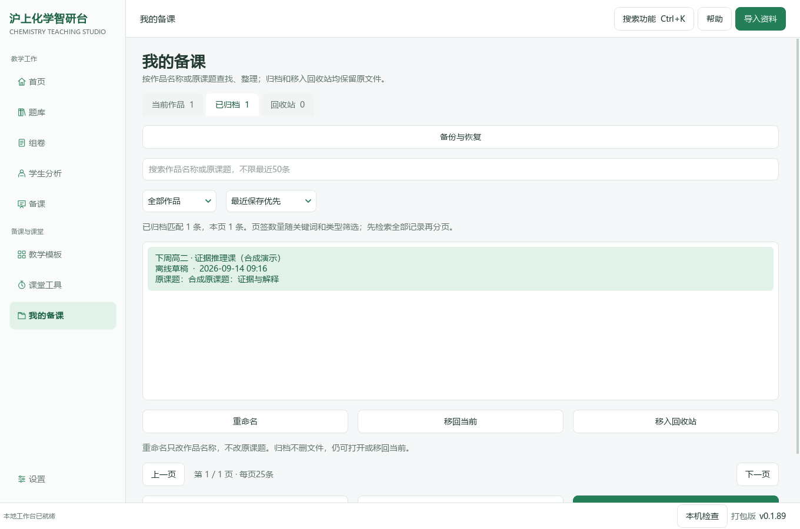

“归档”把当前作品移入已归档，可继续打开，或点击“移回当前”。备课页的草稿选择器默认仅列当前作品；归档草稿从“我的备课→已归档”打开。不会复制出另一份草稿。

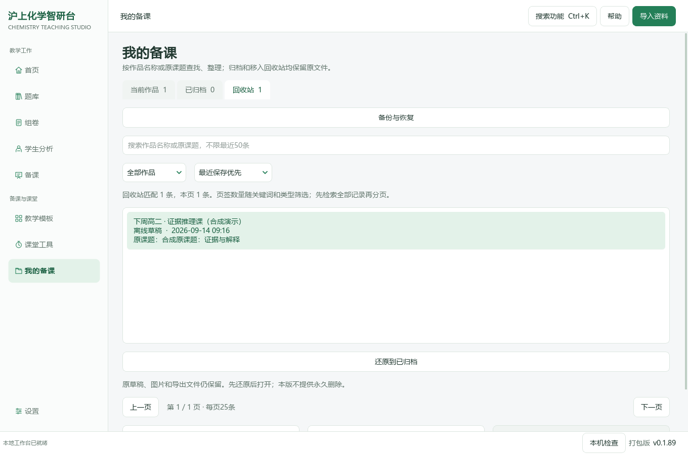

“移入回收站”先确认所选名称，再隐藏当前列表中的这条作品。原草稿、原图片和导出文件仍保留，不占用模型额度、不删除物理文件。回收站先还原再打开：原来归档的作品还原到已归档，原来当前的还原到当前。**本版不提供永久删除或清空回收站，也不会因此释放文件占用的磁盘空间。**

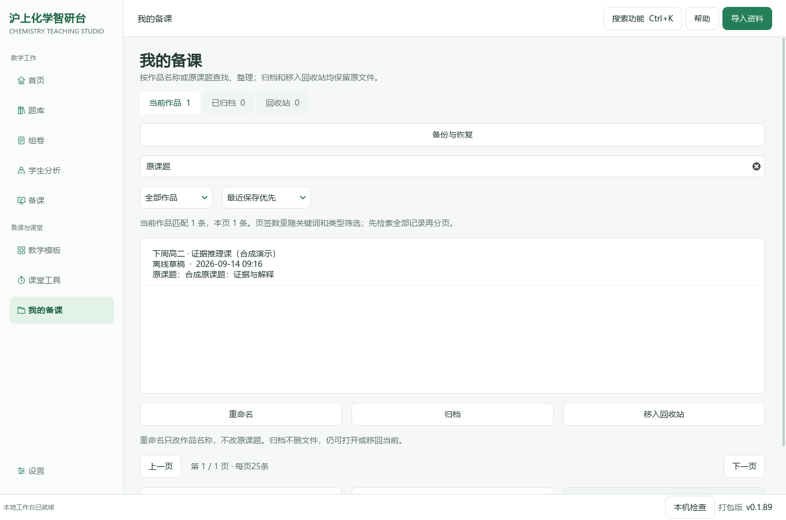

准备中、生成中或正在停止的任务暂不能整理，也不会被回收站隐藏。若其他入口重试了已整理的任务，新任务状态会重新出现在当前作品中。改变作品分类不会停止、恢复或重试模型调用。失败/已停止/完成的任务均可整理。

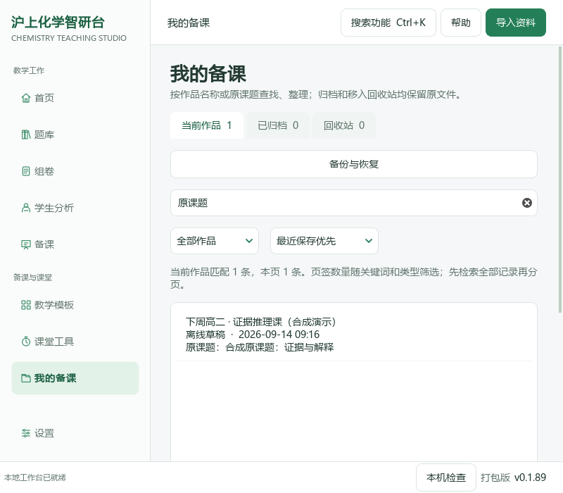

操作会复核选中记录及分类版本；若有其他写入改变了它，先提示刷新，不自动将操作应用到另一条记录。归档、重命名和回收站不清空当前未保存的备课表单或恢复副本；点击“返回备课继续编辑”回到原表单。

作品整理信息附加在既有个人状态文件中，不建立平行作品库。不需要数据迁移。旧版本不理解新增分类，降级打开时可能再次显示归档或回收站内容；它们原本就没有被物理删除。完整备份与资料重新关联属于后续A08，当前回收站不能代替备份。

## 09 导入资料与模型设置


导入仍走本机原生Word/PDF/图片流程；固定98份资料包入口仅适用于已有该资料包的机器。视觉识别另选模型并确认。设置的新界面与操作见本文‘本版设置与本机检查’。本次没有重导原资料。

## 10 进度、快捷入口与帮助


首页检查当前Word来源、候选数量、知识点/教材节/适用年级/原考试类型覆盖，查看旧标签重核和材料缺口。图片题按主题和印刷题另计，不能把两库简单相加。进度JSON可用于本地交接，包含来源名称，分享前检查；字段齐备不等于化学审核。


`Ctrl+K`搜索功能或模板，`Ctrl+1～5`切换原五个页面，`F1`打开帮助，`Esc`关闭当前对话框或投屏。快捷入口不是全题库语义搜索。


## 常见问题

**仍是旧版本？** 检查分支为 `feature/desktop-onboarding-0.1.87`，使用源码CMD而非可能指向旧EXE的VBS。

**有资料却搜不到？** 先检查来源选择和筛选条件，再看当前工作区、导入历史及标签是否失效。不同来源的标签覆盖不同，缺失考试类型不能靠推测补齐。

**为什么预览需要Office？** 需要将真实DOCX转换为PDF来显示实际分页；没有转换工具时仍可选题和保留题篮，但不能用示意内容替代排版。

**已完全对齐商业平台了吗？** 没有。当前完成原生标签选题、题篮与真实分页等增量，没有复制商业题库，也没有新增云社区、跨设备同步或学生端实时投票。

## 版本与验证

当前分支`feature/lesson-backup-0.1.89`，基于已发布v0.1.87的`3f28514a`，不移动旧标签，也不自动合并main。新增A07见[Issue #7](https://github.com/2067169120-png/shanghai-chemistry-teaching-agent/issues/7)。Release中`RELEASE-MANIFEST.json`区分受测/打包代码提交与后来只增加截图及验证报告的发行提交；`SHA256SUMS.txt`记录附件校验值。历史测试不重复相加。

## 开发定位

`desktop_workbench/question_explorer_page.py`负责新选题页；`desktop_question_explorer.py`复用筛选服务，`DesktopStateStore`保存同一题篮，`MixedPaperService`负责组卷和冻结分页。现有备课、学生分析与教学工作室保留，不新增平行数据库。

[0.1.85 Windows工作流](.github/workflows/question-explorer.yml) · [0.1.84历史验证](docs/qa/0.1.84-studio.md) · [历版记录](CHANGELOG.md)
