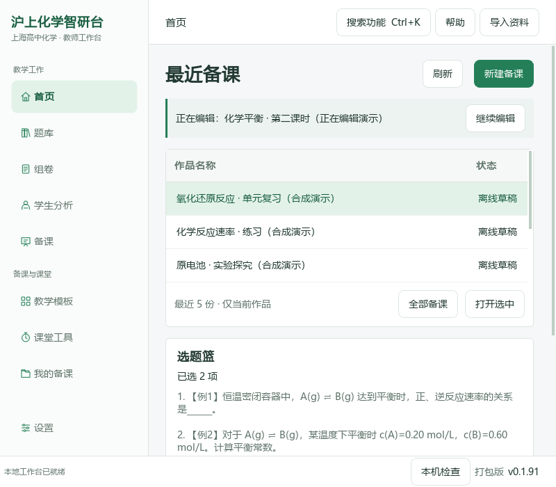
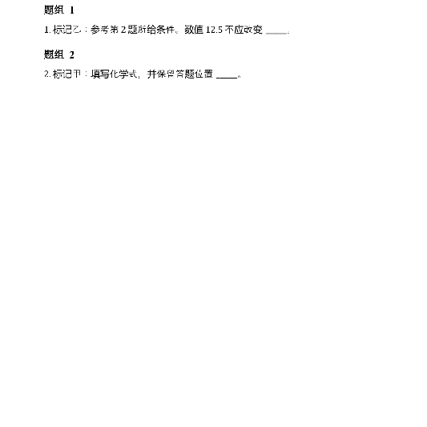
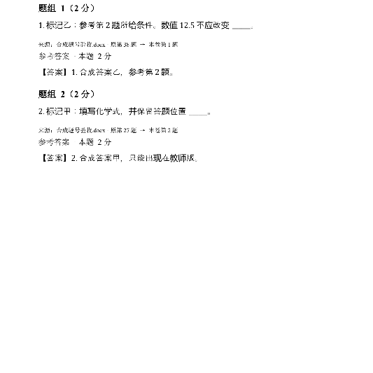
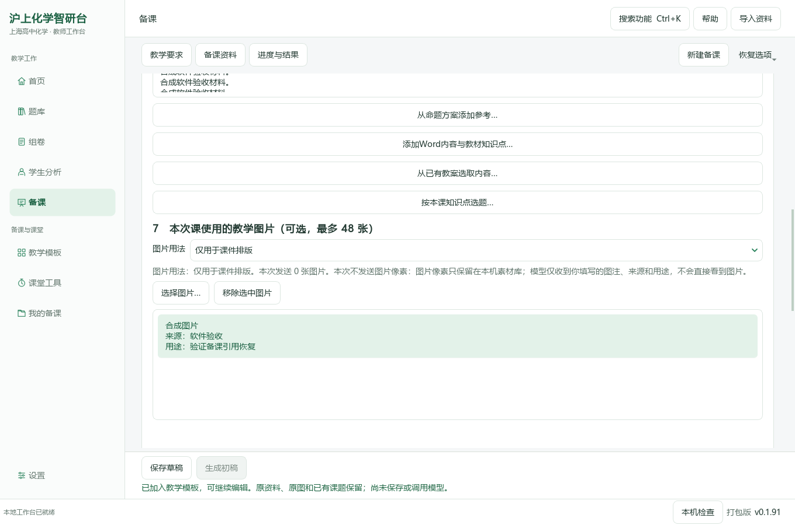
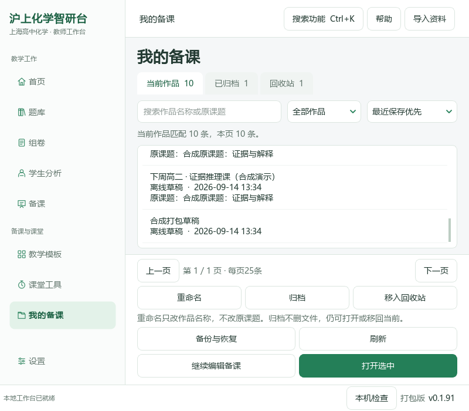
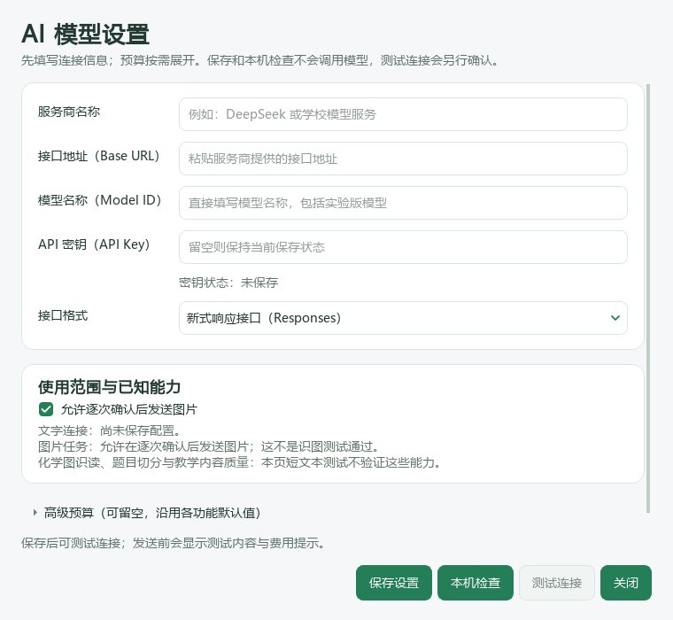
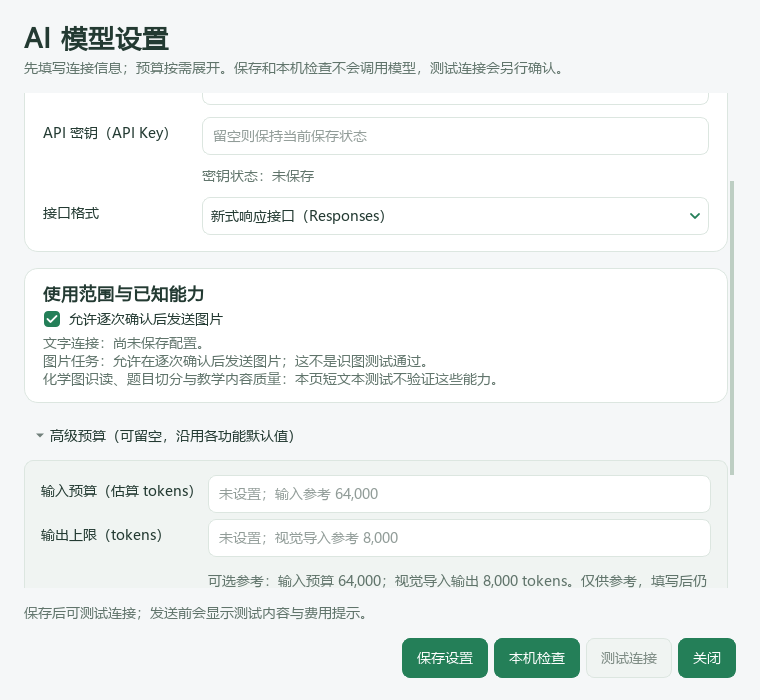
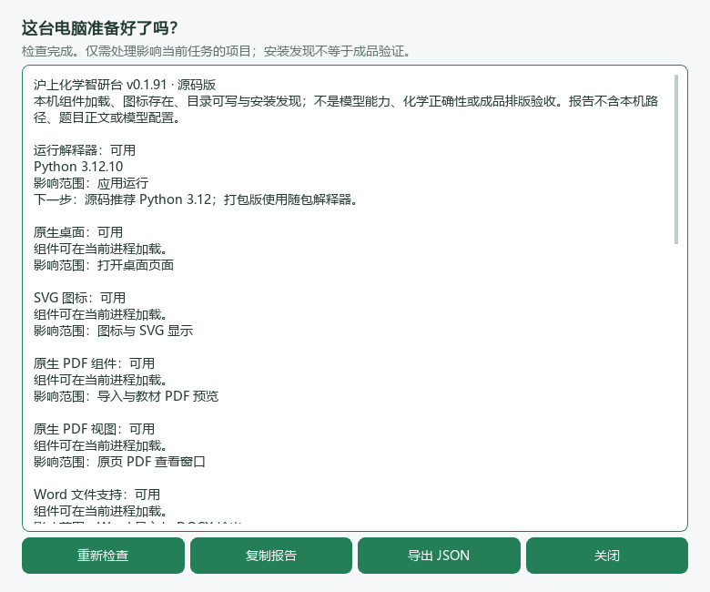
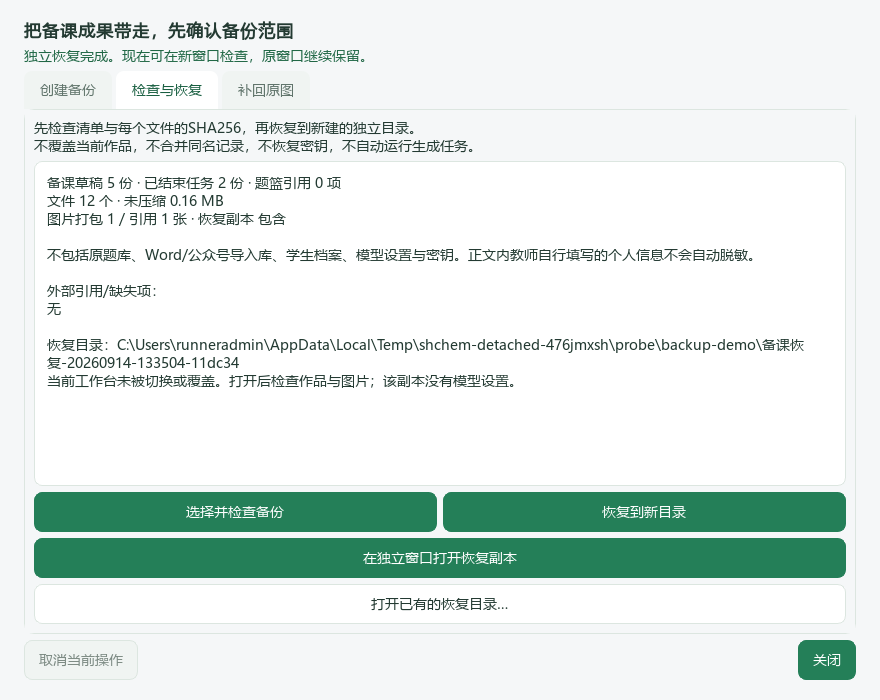

# 沪上化学智研台

**0.1.91 · Windows / PySide6 原生教师工作台 · 预发布试用版**

用于上海高中化学教师的本地选题、组卷、备课、教案/PPT和学生作答分析。本版修正新组试卷的文字题号与题答编号，统一常用中文操作文案，并固定备课页的保存、生成和结果入口。首页继续以最近备课和实际题篮为主。

[下载本版 Release](https://github.com/2067169120-png/shanghai-chemistry-teaching-agent/releases/tag/v0.1.91) · [逐页界面检查与后续改进](docs/ux/0.1.90-teacher-interface-review.md) · [更新记录](CHANGELOG.md) · [59项任务进度](docs/roadmaps/audit-followup.md) · [0.1.90历史指南](README-0.1.90-archive.md) · [本版题号与文案检查](docs/ux/0.1.91-numbering-and-copy.md)

> 原教材、题库、学生资料和模型密钥不随软件分发。新安装显示空题库是正常情况。备份目前覆盖明确选入的备课作品，不是整个题库的一键迁移。

## 安装与升级

### 教师：运行便携程序

从Release下载 `ShanghaiChem-0.1.91-Windows-x64.zip`，**完整解压**，双击目录内的 **`沪上化学智研台.exe`**。不要在ZIP里直接运行，不要单独复制EXE，也不要删除旁边的 `_internal`。不需要另装Python；窗口右下角应显示 **v0.1.91 / 打包版**。

关闭旧版后再启动新版。个人草稿、题篮、恢复副本及设置仍放在 `%LOCALAPPDATA%\ShanghaiChem\DesktopWorkbench`，不会因替换程序目录自动删除。便携程序不会自动复制另一源码目录旁的私有原题库；沿用原工作区时，可继续使用源码环境，或明确设置 `SHCHEM_WORKSPACE_ROOT` 指向该工作区，不把资料复制进 `_internal`。

程序未做数字签名。请核对本仓库Release和 `SHA256SUMS.txt`，不要关闭Windows防护。当前验证不覆盖每一台学校电脑、所有Windows 10/11配置和多显示器缩放。

### 开发者：运行源码

在包含README的仓库根目录执行：

```powershell
py -3.12 -m venv .venv
.\.venv\Scripts\python.exe -m pip install -r runtime\deeptutor_shchem\desktop_requirements.txt
```

然后双击 **`启动源码桌面版.cmd`**。已有Git目录先保存未提交修改，再执行 `git fetch origin` 和 `git switch feature/paper-numbering-0.1.91`，不强制重置。旧VBS可能仍启动旧EXE；源码版启动失败时可运行 **`检查运行环境.cmd`**。

### 哪些操作需要额外配置

浏览已有资料、整理草稿、教学模板、课堂工具和备份不要求模型在线。生成或模型诊断需要在设置中保存实际可用的模型配置，并按请求说明确认发送。**真实DOCX分页需要本机LibreOffice或Microsoft Word**；Office和字体文件不包含在程序包内。

## 日常操作导航

[首页](#home) · [选题](#library) · [组卷](#paper) · [学生分析](#student) · [备课](#preparation) · [教学模板](#templates) · [课堂工具](#classroom) · [我的备课](#mywork) · [导入与设置](#settings) · [备份与恢复](#backup) · [验证范围](#verification)

<a id="home"></a>
## 01 首页：最近备课与选题篮


首页显示最近5份**当前作品**，按现有保存/更新时间排序；不是最近打开时间。选中后点“打开选中”，或双击记录。归档与回收站继续在“全部备课”中查找，不混进当前列表。

上方“正在编辑”显示当前备课表单；点击“继续编辑”返回原表单，不清空、不调用模型。“新建备课”复用原有空白备课动作，有未保存内容时先确认，取消会保留编辑。教学模板仍从左侧独立入口使用，不重复放一个课题输入框。

右侧选题篮显示实际项目数量和前两项摘要。“查看 / 调整顺序”打开原题篮；“预览试卷排版”使用已有真实组卷链路；“继续选题”回题库。题篮的“项”可能是完整主题或Word题，不是统一的独立小问数。空题篮不提供空白假预览。



“题库与教材状态”默认收起，第一次展开才读取原库目录。最近作品或题篮读取失败会提示，不能把读取失败显示成0。资料缺项也可通过 `Ctrl+K` 搜索“题库进度”检查。

<a id="library"></a>
## 02 选题中心：左侧条件，右侧完整题目


左侧先选择来源，再勾选该来源实际支持的知识点、教材册/章/节、年级、考试类型、年份、区域等标签。同类多选满足任一项，不同类同时满足。条件条可单项取消；清空条件不清题篮。缺出处的字段不猜填，个人Word和原卷来源的标签覆盖可能不同。


第一条结果自动展开，其余点击展开后查看原文、公共材料和图片；题面与答案分开。完整题面加载后加入题篮，已选题显示“已在题篮”。翻页、换条件和重开应用不清空已选记录。

原卷匹配数可能是**作答单元数**，加入的却是所属完整主题；不能将一个依赖公共材料的小问拆到无法作答。Word原文范围、标签与图片裁片继续从原管理入口核对。本版没有重做来源选择器，也没有导入真实题库。

<a id="paper"></a>
## 03 组卷：题序、配分与真实分页


题篮可以上移、下移、移出；移出不删除原题。“预览试卷排版”按当前题篮全部项目和顺序重新包含题目；“进入组卷编辑”用于继续既有组卷草稿，两者范围不要混淆。


组卷可调整标题、配分、额外作答区及学生版分数显示。已有空格、横线、表格和绘图区不重复增加；保留主题公共材料、原图和答案角色。

**本卷题号：**新组试卷从1开始按当前题序连续编号。题组顺序和组内印刷小题编号分别处理，最小作答单元不另冒充一道题；本卷标题、题面标签与教师版按同一顺序输出。Word可编辑正文中的常见原题号（如`27.`、`27．`、`第27题`、`【例27】`、`【变式3-1】`）会在导出副本中替换，原题文件、公式、上下标、图片和来源身份不改。

同一Word来源里能够唯一对应的“第N题”文字引用会随选题顺序更新，参考答案的对应题号同步调整；教师版保留原号与新号对照。原有`（1）`等内部小问和实验步骤不全局替换。复杂手工题号、复合图形中的引用或选题范围有误时仍须对照原文检查，不靠难以判断的文本推测题目边界。

**图片题的剩余限制：**本卷编号已经写在题图上方，但扫描图像像素里印着的旧号及跨题引用**尚未自动擦除和改写**，会在预览与卷面中明确提示。图片内容保留原字节；本版没有通过涂白、AI补画或裁掉不明区域假装完全解决。带旧号的图片题在正式打印前仍需核对，不能说已实现全部扫描题无旧号输出。





预览可切换学生/教师版、翻页和缩放。逐页核对后导出复用该次文件，不用题目清单截图代替实际排版。缺Office时会提示，题篮保留；不同Office与字体可能改变分页，以本次实际文件为准。本版尚未把组卷页改成卷面居中的三栏工作区；题序改变后请重新生成预览，旧预览保留当时的顺序。

<a id="student"></a>
## 04 学生分析：以原作答和评分依据为准


使用学生代号，提供题目、作答、参考答案与评分依据后进行诊断和练习推荐。保留原题身份和公共材料，教师核对评分建议；没有复测作答时，不能把练习建议写成已经掌握。

本版修正部分按钮和分析提示措辞，但没有重构原作答/评分同屏界面，没有新增学生端采集。课堂工具里的随堂反馈是教师手动汇总，不替代学生档案。详细不足和三栏建议见逐页检查文档。

<a id="preparation"></a>
## 05 备课：保存资料，组织教案和课件



顶部“教学要求”“备课资料”“进度与结果”用于快速定位，不创建新表单、不重发模型请求。定位时保留资料框内的文字、选择范围和滚动位置。填写课题、对象、课型、课时、目标，加入实际原教案、题目和图片；“更多教学要求”用于补充实验安排、版式和作业要求。

底部始终保留**“保存草稿”**与**“生成初稿”**。保存草稿保留一个本机版本；生成的内容由“输出类型”决定，发送前仍须核对材料与模型。任务存在时，原来的停止、继续、修改与修复按钮也留在固定区域，继续使用同一任务状态，不复制第二套按钮。已有结果可定位查看；失败不代表自动重试，重试仍需明确确认。


“新建备课”放在顶部，有内容时仍须确认，取消不清空。恢复副本继续约每2秒自动保存；“恢复选项→立即更新自动恢复副本”是次要操作，不和正式保存并列争抢注意力。自动恢复保留不完整表单和图片引用，不是图片原件备份；写入或恢复异常继续明确提示。

生成的教案与课件共用学习目标、活动、评价和用时。**课件页图仍是共享布局预览，不是PowerPoint实际渲染PPTX的结果。** 本版只整理操作位置和导航，没有新增完整教学节点编辑器，也没有完成实际PPTX的Office视觉一致性验收。

<a id="templates"></a>
## 06 教学模板：先看结构，再带入备课


六种组织方式是概念新授、实验探究、专题复习、试卷讲评、情境与数据、单元整体。可搜索、分类、收藏和完整预览，确认后带入原备课表单。模板不是六种PPT皮肤，也不是自动取得教材全文。预览、收藏和应用本身不调用模型；取消预览不修改原资料。

<a id="classroom"></a>
## 07 课堂工具：离线使用，反馈再带回备课


倒计时支持开始、暂停、继续、重置和大字全屏；随机点名一轮不重复，可按指定组数均衡分组。动态平衡是固定一级可逆A⇌B示意，可调初值与正逆速率常数，不是任意AI动画或真实实验数据。

随堂反馈由教师填写任务完成情况、错因和下一步，可另存JSON或追加回备课材料，不自动修改学生成绩。投屏时留意实际展示内容；除已有计时全屏外，其他工具授课模式仍待改进。

<a id="mywork"></a>
## 08 我的备课：搜索、整理和继续编辑


按作品名称或原课题搜索，切换当前作品、已归档和回收站；先检索全部历史再分页，每页25条。类型与排序可组合，不退回最近50条限制。



结果列表独立滚动，分页、重命名、归档、回收站/还原、打开和备份固定在列表外。窄窗口动作按两列重排，不必再滚动整个页面寻找“打开”。

重命名只改显示名称，不改课题正文和已导出文件名。归档可打开或移回当前；回收站不物理删除文件，先还原再打开，回到移入前的范围。未结束任务不能整理，不会因归档自动取消/重试模型。回收站不是备份，也不释放磁盘空间。“继续编辑备课”只是导航，不清空未保存内容。

<a id="settings"></a>
## 09 导入、模型设置与本机检查


右上角导入支持原有Word/PDF/图片链路；文字型Word优先原生提取，扫描资料需要相应视觉能力。固定98份资料包入口仅适用于原资料机，不代表每位教师都拥有这些文件。导入完成后仍要核对题答关系、公式与公共材料；本版不重导资料。



先保存服务商、地址、实际模型名、密钥与接口格式，再点击测试并确认发送固定短文本。保存配置或打开页面不调用模型。改了配置但没有重新测试时，不把旧成功记录当成当前连接已验证。



高级预算默认收起，原值保留，错误输入会展开对应区域。“允许发送图片”与“已验证能看图”不是同一件事；短文本联通也不证明化学图识读或切题质量。



状态栏、设置及 `Ctrl+K` 均可进入本机检查，查看版本/运行模式、Qt/PDF/文档组件、资源、个人目录写入及Office安装发现。可复制或导出JSON，不读取密钥，不扫描题目正文，不发网络请求。发现Office安装不等于实际转换成功。

### 中文按钮与提示


“确定”“取消”等Qt标准按钮使用随程序已有的中文翻译资源。常用界面将“候选”按具体场景改为“初稿”“建议”或“待核对内容”；“解路”改为“解题思路”，“文字出站”明确为发送给模型，“冻结文档”说明为预览时核对的文件。**改文案不改变是否收费、发送范围、教师确认、数据身份或已有结果的可用状态。** 技术标识、版本号和接口地址不做伪中文翻译；不保证第三方系统对话框与每个后端动态错误都已逐条改写。

<a id="backup"></a>
## 10 备份与恢复：备课作品的独立副本


从“我的备课→备份与恢复”进入。默认包括有效备课草稿、当前/归档/回收站分类、题篮引用和编辑恢复副本；可明确勾选本地备课图片、已结束任务及返回稿/成品。先整理清单，核对数量、大小和缺失项，再用新文件名保存ZIP。

草稿与题篮是清单生成时的快照；之后又编辑时须重整清单。题篮引用不等于原题文件。原Word/公众号导入库、学生业务目录、非备课草稿、模型配置和密钥不包含。ZIP未加密，教师自行写入正文的个人信息不会自动脱敏。当前限制为单文件128MB，总计2GB/2万个文件，备课图片10MB。



选择ZIP检查清单和文件哈希，再恢复到软件目录以外的新建子目录，不覆盖或合并当前作品。打开后窗口标题标明“独立恢复副本”，后续编辑保存在新目录，不自动同步回默认窗口，也没有原模型设置，不续跑生成任务。关闭后，可点“打开已有的恢复目录…”重新进入，不必再次解压。

“补回原图”仅检查备课图片引用，必须选择相同内容哈希、尺寸和格式的原图，不按文件名猜替换。完整Word/公众号题库迁移和外部Word重新关联仍在A08待办中。

## 快捷键与常见问题

`Ctrl+1～5`：首页、题库、组卷、学生分析、备课。`Ctrl+K`：搜索功能或模板。`F1`：应用内帮助。`Esc`：关闭普通对话框或退出计时投屏；正在执行的文件操作先按界面提示取消。

找不到旧作品时检查当前/归档/回收站范围；没有选题结果时检查来源与导入历史，不把空原库理解成个人Word不存在。新旧版本混淆时查看状态栏版本和源码/打包标记，不使用旧VBS验证新源码。缺Office时保留作品并安装本机转换工具，不重新导入题库。

<a id="verification"></a>
## 本版改动与验证范围

同一提交完成 **923项Windows定向测试，0失败、0错误、0跳过**。源码和同一发行EXE验证真实Word导入后乱序选题、学生/教师两版新题号与答案对应、原文件不变、备课固定操作及中文标准按钮。独立EXE通过本机Office生成实际学生/教师PDF页图；原作品整理、备份恢复、8页导航和既有课件输出继续回归。图片像素内旧号没有自动改写；仅合成资料验收，无真实API请求、全库导入、多屏缩放或课堂效果验证。

实际测试与打包提交、随后只增加截图和报告的发行提交分别记录在 `RELEASE-MANIFEST.json`，不混称为同一次代码修改；版本标签建立后不移动。README新截图来自真实运行窗口；较早的合成题库/分页图片明确注明原版本。空库与合成记录都不是用户真实资料完成的证明。

[源码运行报告](docs/qa/0.1.91-readiness.json) · [独立程序报告](docs/qa/0.1.91-package.json) · [逐页检查、剩余不足与验收场景](docs/ux/0.1.90-teacher-interface-review.md)

本版实际修正组卷文字题号、常用界面文案和备课操作区。扫描图像内的旧号仍需后续处理；原Word/公众号全库迁移继续在A08中保持开放。源码与便携程序测试不替代真实资料、全部导出排版、课堂效果、多屏及Windows缩放验收；没有真实模型请求或全量教材蒸馏。
