# 沪上化学智研台

**0.1.93 · 上海高中化学教师工作台 · Windows / PySide6 原生试用版**

选题、组卷、备课和课后分析在本机完成。新版收口未发布的0.1.92中文显示修复，并加入扫描图片内题号的人工框选替换。0.1.92仍保留为历史候选，没有补造该版Release。

[本版下载](https://github.com/2067169120-png/shanghai-chemistry-teaching-agent/releases/tag/v0.1.93) · [更新记录](CHANGELOG.md) · [本版任务进度](docs/roadmaps/0.1.93.md) · [新功能与边界](docs/ux/0.1.93-scan-numbering.md) · [0.1.91完整旧指南](README-0.1.91-archive.md)

> 程序不附原教材、题库、学生档案和模型密钥。初装空题库是正常情况。当前备份涵盖明确选入的备课作品，尚不是完整题库的一键迁移。

## 安装与升级

教师从Release下载 `ShanghaiChem-0.1.93-Windows-x64.zip`，关闭旧程序，**完整解压**后双击 `沪上化学智研台.exe`。不要在压缩包内直接运行，不要只移动EXE或删除 `_internal`。无需另装Python；状态栏应显示 **v0.1.93／打包版**。程序未签名，请核对发布来源及SHA256，不关闭系统防护。

个人草稿、题篮和模型配置仍在 `%LOCALAPPDATA%\ShanghaiChem\DesktopWorkbench`。更新程序目录不会复制另一源码目录旁的题库，也不会迁移外部原图。实际DOCX转PDF分页需要本机LibreOffice或Microsoft Word，它们不随程序分发。字体采用本机字体，不附字体文件。

开发者在仓库根目录准备Python3.12环境，然后双击 `启动源码桌面版.cmd`：

```powershell
py -3.12 -m venv .venv
.\.venv\Scripts\python.exe -m pip install -r runtime\deeptutor_shchem\desktop_requirements.txt
```

Git分支为 `feature/scan-numbering-0.1.93`。先保存本机未提交修改再切换，不使用强制重置。旧VBS可能仍启动旧EXE；源码打不开时运行 `检查运行环境.cmd`。

## 本版：中文显示与图片题号

### 中文字体


使用本机真正可用的中文字体，并保留上标、下标和化学箭头的逐字符回退。正文11磅，侧栏等小字提高到9.5磅；部分专用控件仍有独立字号。重复初始化不再重复刷新全局样式。菜单、按钮、输入框和部分自绘内容沿用相同字体选择。

在状态栏点击“本机检查”，可查看实际字形来源、字号与中文/化学符号样例。`Microsoft YaHei UI`是微软雅黑的英文名称；看到英文名称不等于用了英文字体。本机检测只检查界面样例，不改扫描图或旧Word、PPT、PDF中的文字。

### 调整扫描图片中的旧题号

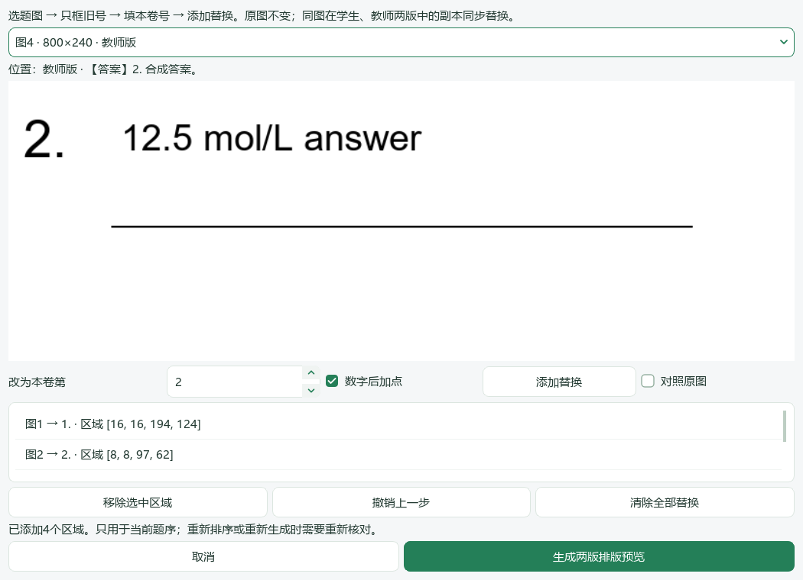

选题后进入混合组卷页，点击 **“调整图片题号后预览…”**。若原题库旧式组卷页没有这一入口，可从首页或题篮进入“预览试卷排版”打开当前题篮的混合组卷界面。先确定题序，再做以下操作：

1. 在下拉菜单选图，对照其所在学生版/教师版及前文位置。
2. 用鼠标**只框旧题号**，不框入题干、选项或公式；填入本卷新号，选择数字后是否加点，点击“添加替换”。
3. 勾选“对照原图”比较。改错可“撤销上一步”或移除指定区域；同一图可框多个不重叠区域。
4. 点击“生成两版排版预览”，检查实际PDF所有页面，再确认并导出。导出复用核对后的同一份DOCX/PDF，不在最后重新生成。

**这是手工确认号码和区域，不是自动OCR。** 字节相同的图在两版中共用同一修改；仅在教师版出现的答案图不会加入学生版。框外解码像素、图像尺寸、Word文字/公式和原题库文件不改。被替换区域为白底黑色数字，彩色背景不会自动修复。

支持静态PNG、JPEG、BMP。旋转标记、动态图片、矢量图等不强行替换。未框选的旧号和“见第N题”引用不会自动修改；可另框引用中的数字并取消句点。相同图内容若在两题应使用不同号码，当前不能逐处独立设置，请保留原图另行编辑。改变题序或重新生成必须重新核对；本轮框选不保存回原题库，不自动复用到下一张卷。

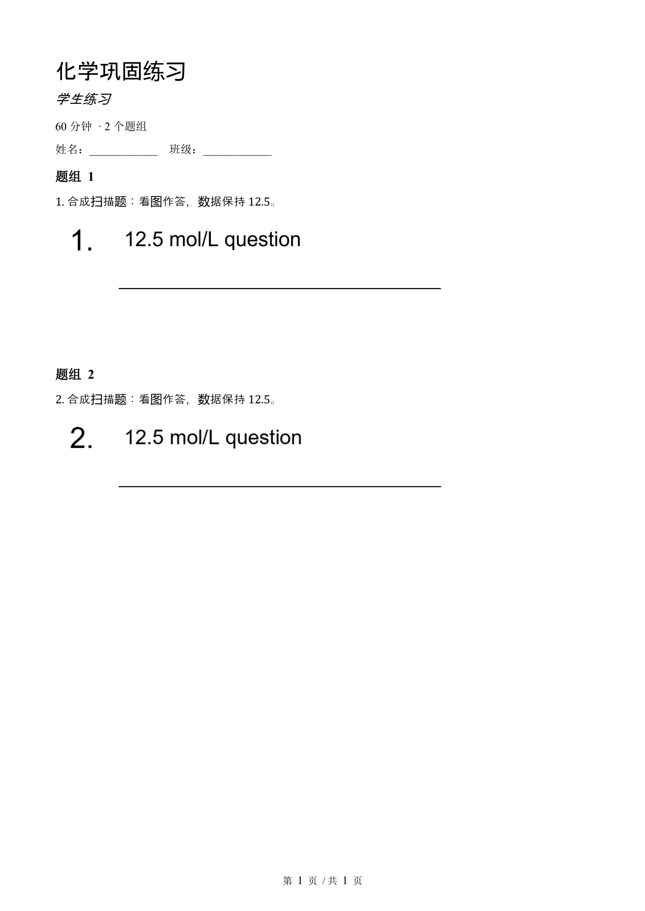

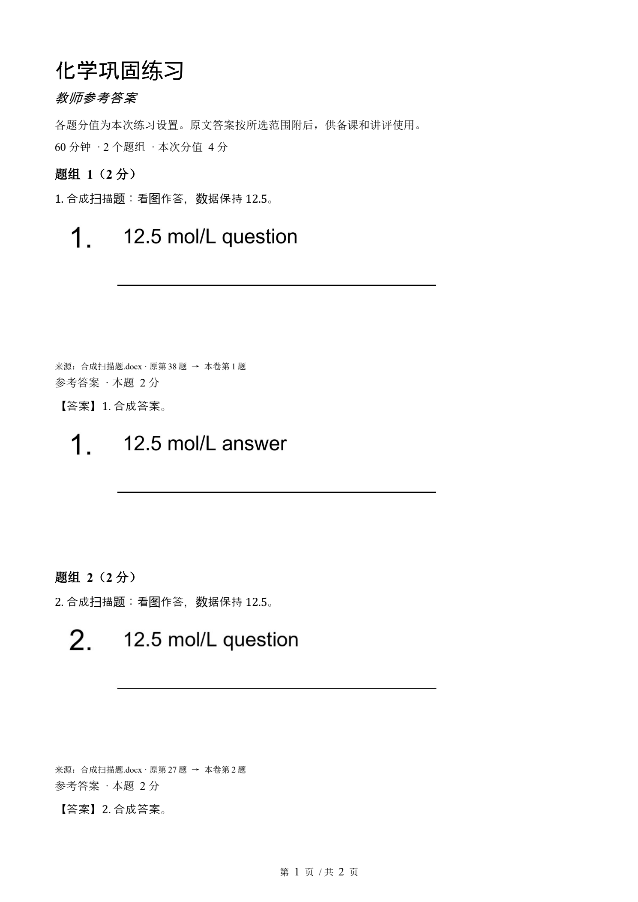

以上为两道合成题的实际整页输出，展示原38→新1、原27→新2的图片号码调整。不是用户真题，也不是教学质量样例。Word可编辑正文仍沿用0.1.91自动按题序编号。

## 01 首页：继续上次工作

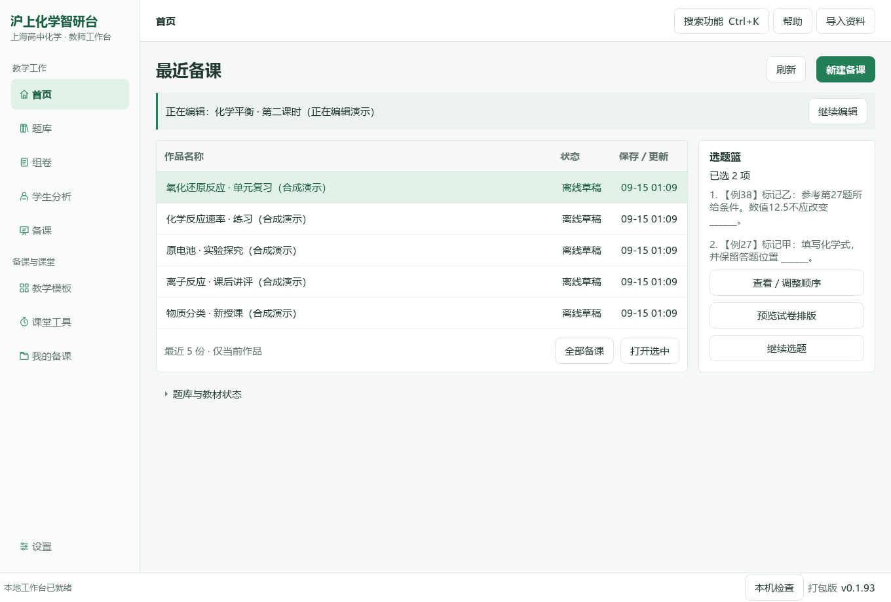

最近五份当前作品按保存或更新时间显示。选中打开，或点击“全部备课”查旧课题；归档和回收站不混入当前作品。上方“继续编辑”回到未完成表单，不调用模型。新建有未保存内容时沿用原确认。右侧是真实题篮，可排序、继续选题、进入卷面预览；下方资料状态按展开读取。

## 02 题库：左标签、右题目

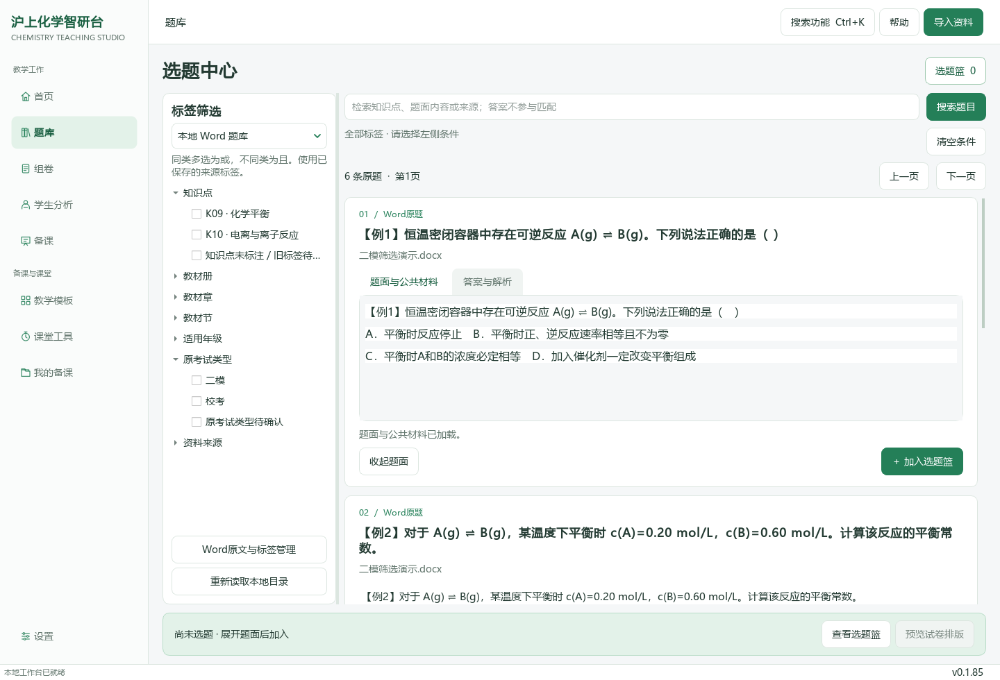

先选可用来源，再按教材、知识点及来源实际支持的年级/考试类型筛选。展开题卡核对题面、公共材料、图片与答案后加入题篮。小问依赖公共材料时保留完整主题，不把题篮项目数当作独立小问数。缺失标签不按难度或题号猜填。已有Word走原生提取，不重新截整页。

## 03 组卷：题序、配分与实际排版

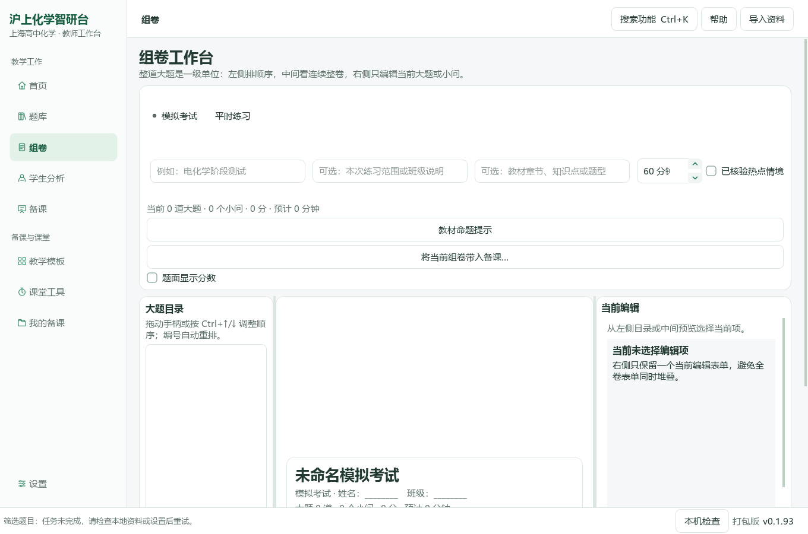

题篮可查看、上移、下移、移除；不删除原题。混合组卷可编排Word题、图片主题，保留必要共同材料。修改标题、用时与配分后预览学生版和教师版。已有答题区域不重复加线。文字题号按本卷顺序，图内号码使用本版入口处理。缺少Office时不能生成真实分页，但题篮仍保留。

## 04 学生分析

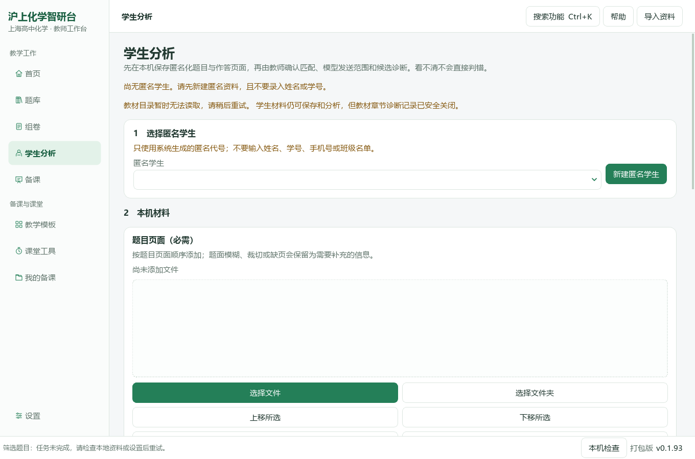

按原题与实际作答记录评分，教师复核分析建议。用已核对标签推荐真实题库练习，不编造题目命中或未发生的复测进步。当前仍是原有纵向布局，原作答/评分同屏和复练回写尚未在本版改造。

## 05 备课：资料、教学要求与结果

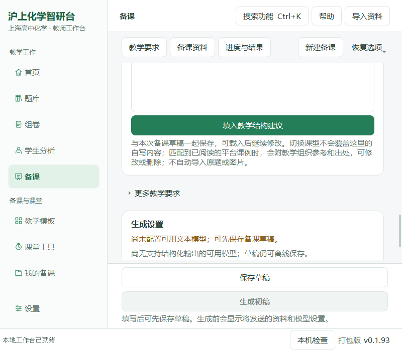

填写课题、对象、课型、课时、目标与实际资料。顶部定位“教学要求／备课资料／进度与结果”，底部保存和生成始终保留；自动恢复属于“恢复选项”，正式保存草稿另外保留版本。生成前核对发送范围和费用；本地保存、打开历史结果不会调用模型。没有相应模型能力时，不把文字连接测试当作看图通过。

教案和PPT沿用同一教学路径、原题身份与必要材料，结果可查看、修订和导出。快速PPT预览仍是共享布局绘制，**不是Office对实际PPTX的兼容性终验**。本版没有新增完整教学节点编辑器。

## 06 教学模板

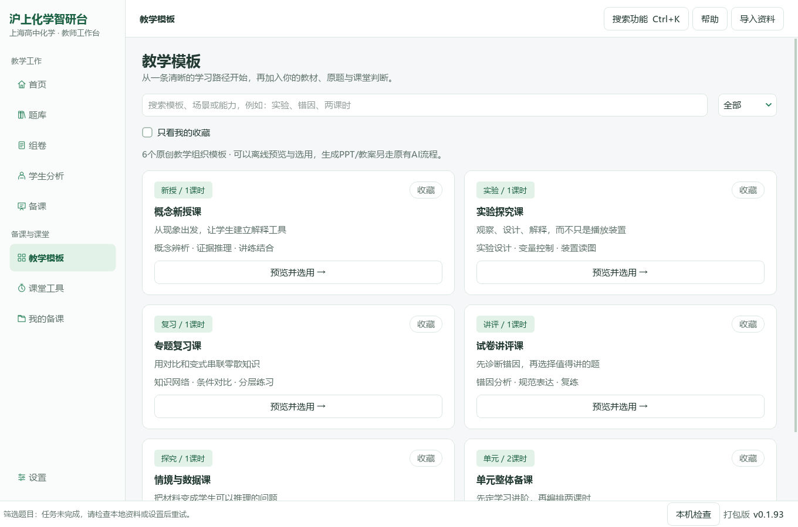

六种教学组织模板支持分类、搜索、收藏和完整预览，确认后带入原备课表单，不覆盖已有材料或原图。模板是教学结构，不是获奖课件原文件，也不等同于PPT皮肤。预览模板不调用模型。

## 07 课堂工具

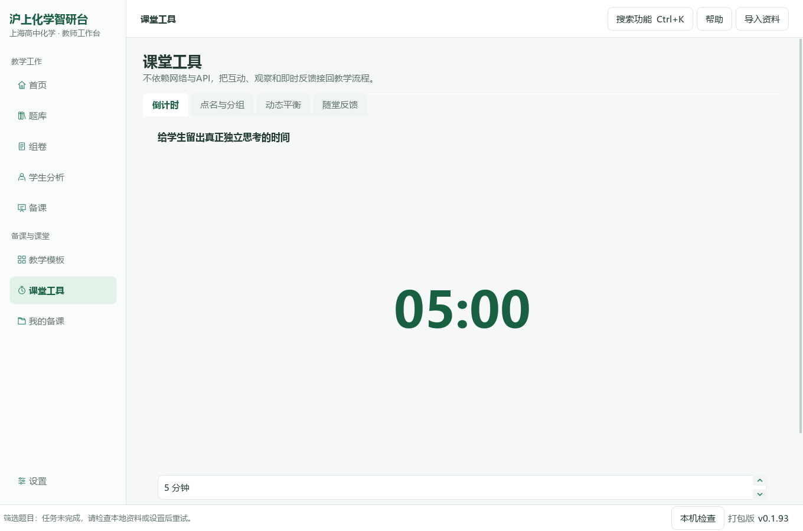

本地倒计时可暂停、继续与大字显示；点名一轮不重复，分组均衡。A⇌B是明确条件下的一级可逆反应演示，不是任意反应仿真。随堂反馈由教师录入，可追加回备课；没有学生端实时投票或云同步。

## 08 我的备课与备份

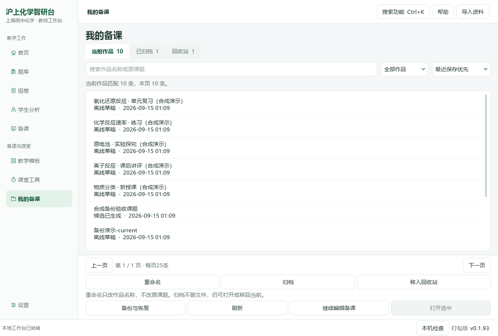

先搜索全部作品再分页。当前、已归档、回收站分开；重命名只改显示名称，归档不删文件，还原回原范围。运行中的生成任务不能被整理操作悄悄隐藏。

“备份与恢复”可保存备课草稿、分类、题篮引用和恢复副本，图片及已结束任务/成品按需勾选。先看清单再写新ZIP；恢复到新独立目录，不覆盖默认状态，也不自动续跑模型。关闭后可“打开已有的恢复目录…”。缺失备课原图按内容身份补回，不能拿同名不同图片替换。

**备份不包含原Word/公众号题库、学生业务目录或模型密钥。** 题篮引用不等于完整题目文件。ZIP未加密，教师写在正文的信息不会自动脱敏。

## 设置、导入和快捷入口

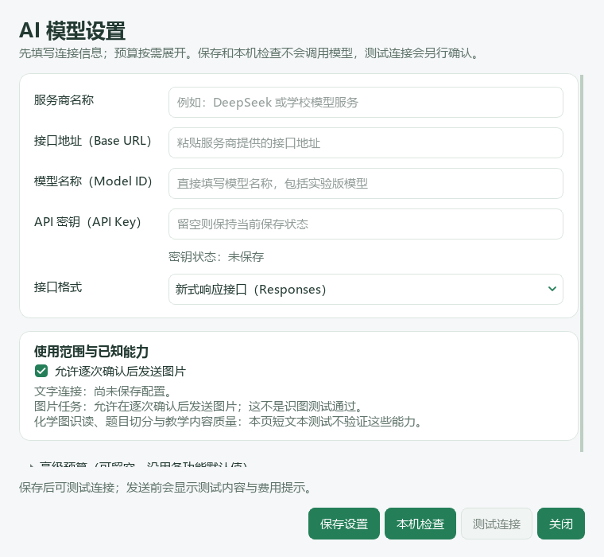

服务商、地址、实际模型名、密钥和接口格式填在基础区；高级预算可收起，已有值不丢失。保存仅修改本地配置，测试连接另行确认。缺少中文字符时先看“本机检查”的字形样例；不要仅因显示问题重新导入题库。

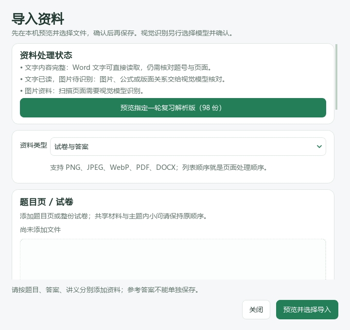

右上角导入Word、PDF或图片；已有98份资料包入口只适用于实际拥有该资料的机器，不是软件自带题库。`Ctrl+K`搜索功能，`F1`帮助，`Ctrl+1`至`Ctrl+5`切换原五个主页面。

## 验证与剩余范围

同一提交完成 **966项Windows定向测试，0失败、0错误、0跳过**。源码与同一发行EXE均走过合成扫描题导入、原生调整入口、撤销、实际两版PDF和导出，原文件不变。中文和化学符号缺字样例为0，Windows原生Qt后端1/1.25/1.5倍率检查通过；这是倍率模拟，不是实际系统缩放或多屏验收。既有八页、作品整理、备份/独立恢复、文字编号与合成PPTX/DOCX输出继续回归；没有调用真实模型。

[源码报告](docs/qa/0.1.93-readiness.json) · [独立EXE报告](docs/qa/0.1.93-package.json)。本版新截图由Windows实际程序生成；历史操作图明确标版本。测试均为隔离合成资料，未读取用户题库或调用真实模型。文件校验不是化学正确性验证。真实Windows系统缩放、多屏、学校设备及全库复杂版式另需实机验收。

原Word/公众号完整迁移仍在Issue #9；扫描号码的自动关联、跨卷持久标注和复杂版面仍在Issue #14后续范围。旧标签不移动，main与既有PR不自动合并。Release发行清单区分实际受测提交与随后补充图文证据的提交。
