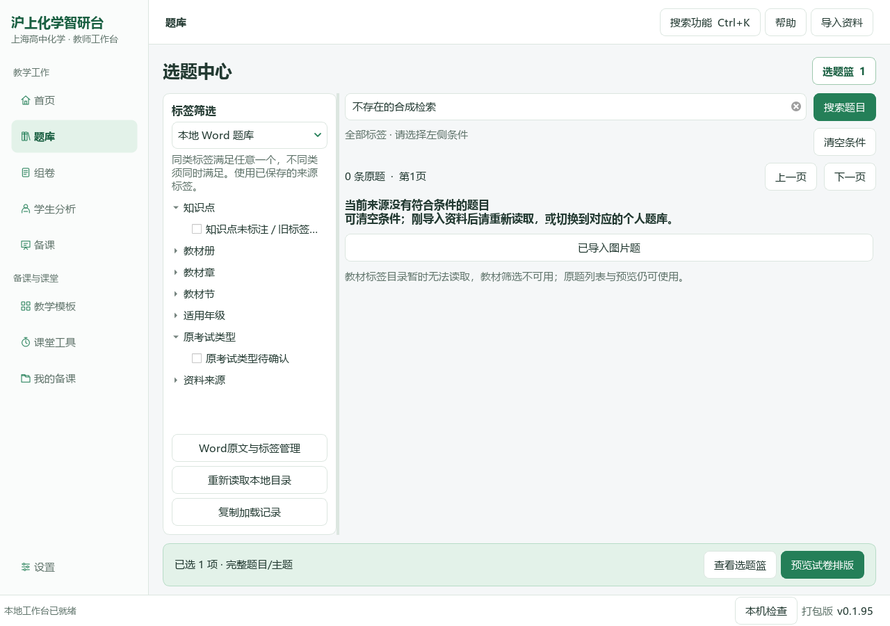
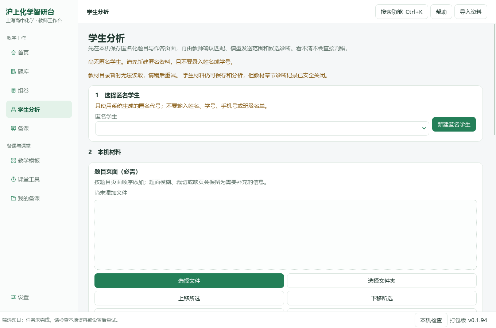

# 沪上化学智研台

**0.1.95 · 题目加载与导入衔接 · Windows / PySide6 原生试用版**

保留教师日常桌面、真实题库身份与成品输出。本版优先处理反复筛选/翻页和多图Word题加载，补齐选题来源记忆、通用导入入口与题号位置备份。本版没有加入Coze、Dify或其他服务端依赖。

[本版Release](https://github.com/2067169120-png/shanghai-chemistry-teaching-agent/releases/tag/v0.1.95) · [作者工作流与开源项目研究](docs/research/0.1.95-workflows-and-references.md) · [更新记录](CHANGELOG.md) · [验收范围](docs/ux/0.1.95-explorer-performance.md) · [0.1.94完整旧指南](README-0.1.94-archive.md)

## 安装和升级

教师下载`ShanghaiChem-0.1.95-Windows-x64.zip`，关闭旧版，完整解压后运行`沪上化学智研台.exe`。不要只移动EXE或删除`_internal`；不需要另装Python。状态栏应显示v0.1.95／打包版。程序未签名，请核对Release来源及SHA256，不关闭系统防护。

资料沿用当前Windows用户的`%LOCALAPPDATA%\ShanghaiChem\DesktopWorkbench`；换程序目录不会复制外部原题库。便携包不附教材、题库、模型密钥、学生资料、Office或字体文件。实际DOCX→PDF仍需本机LibreOffice或Microsoft Word。

开发源码用Python3.12，在仓库根目录执行：

```powershell
py -3.12 -m venv .venv
.\.venv\Scripts\python.exe -m pip install -r runtime\deeptutor_shchem\desktop_requirements.txt
```

再双击`启动源码桌面版.cmd`。Git分支`feature/explorer-performance-0.1.95`；先保存未提交修改，不强制重置。旧VBS可能仍启动旧EXE。

## 这次选题怎样更顺手


左侧来源会记住上次选择。未打开选题页时不主动读取个人题库；进入后建立本次目录索引，后续筛选/翻页复用。每个来源最多缓存4组查询匹配位置，避免无限累积。答案页按需打开；本题多幅Word图合并读取一次来源，仍核对修订、归属与原图字节。



原卷目录为空不等于个人Word或图片库为空。空结果页直接提供相应来源入口；切换只改变搜索范围，不搬动原题。导入对话框退出时清理目录索引，下次进入可看到保存的资料；标签管理后或外部文件变化请点“重新读取”。不静默把未知考试类型或年级补成确定标签。

“复制加载记录”位于左侧，复制最近一次目录、索引、筛选、卡片建立及Word图读取计时。不包含关键词、题干、文件路径或密钥。显示慢时先看是目录、图片还是界面阶段，不直接要求更换模型。

### 本版Windows合成性能记录

| 合成规模 | 原实现中位 | 新条件查询中位 | 索引建立（一次） |
| --- | ---: | ---: | ---: |
| 1000题 | 49.628 ms | 4.281 ms | 50.308 ms |
| 5000题 | 237.42 ms | 13.521 ms | 264.462 ms |
| 10000题 | 495.609 ms | 24.673 ms | 502.804 ms |

80题合成Word中的8幅图：原逐图读取中位366.947 ms，新合并读取42.66 ms；字节一致。

每项5次样本，结果/图字节一致。索引建立和查询分别统计；这些是检索适配器与来源读图计时，不是整屏绘制，也不是用户电脑上的速度保证。首次核对大量文件、旧公式转换、超大图片解码和原卷主题读取仍可能慢。完整样本见验证包`readiness-qa/explorer-performance.json`。

## 题号位置随备课备份保留

“我的备课→备份与恢复”现在同时包含已保存的原图身份、尺寸及题号区域，不含旧试卷的新号码，也不包含对应原题图。恢复到独立目录后，只有相同原图才能再次载入位置；备份并未变成完整题库迁移。无此字段的旧备份仍可恢复；含此扩展的新ZIP请用0.1.95或以后支持版本恢复。备份未加密，模型设置与密钥不打包。

## 日常页面指南

下列未改版页面沿用注明路径版本的历史实际截图；本轮新选题与导入截图在上方/下方单独展示，均使用隔离合成资料。

## 01 首页：继续上次工作


最近五份当前作品按保存或更新时间显示。选中打开，或点击“全部备课”查旧课题；归档和回收站不混入当前作品。上方“继续编辑”回到未完成表单，不调用模型。新建有未保存内容时沿用原确认。右侧是真实题篮，可排序、继续选题、进入卷面预览；下方资料状态按展开读取。

## 02 题库：左标签、右题目


先选可用来源，再按教材、知识点及来源实际支持的年级/考试类型筛选。展开题卡核对题面、公共材料、图片与答案后加入题篮。小问依赖公共材料时保留完整主题，不把题篮项目数当作独立小问数。缺失标签不按难度或题号猜填。已有Word走原生提取，不重新截整页。

## 03 组卷：题序、配分与实际排版


题篮可查看、上移、下移、移除；不删除原题。混合组卷可编排Word题、图片主题，保留必要共同材料。修改标题、用时与配分后预览学生版和教师版。已有答题区域不重复加线。文字题号按本卷顺序，图内号码使用本版入口处理。缺少Office时不能生成真实分页，但题篮仍保留。

## 04 学生分析



按原题与实际作答记录评分，教师复核分析建议。用已核对标签推荐真实题库练习，不编造题目命中或未发生的复测进步。当前仍是原有纵向布局，原作答/评分同屏和复练回写尚未在本版改造。

## 05 备课：资料、教学要求与结果


填写课题、对象、课型、课时、目标与实际资料。顶部定位“教学要求／备课资料／进度与结果”，底部保存和生成始终保留；自动恢复属于“恢复选项”，正式保存草稿另外保留版本。生成前核对发送范围和费用；本地保存、打开历史结果不会调用模型。没有相应模型能力时，不把文字连接测试当作看图通过。

教案和PPT沿用同一教学路径、原题身份与必要材料，结果可查看、修订和导出。快速PPT预览仍是共享布局绘制，**不是Office对实际PPTX的兼容性终验**。本版没有新增完整教学节点编辑器。

## 06 教学模板


六种教学组织模板支持分类、搜索、收藏和完整预览，确认后带入原备课表单，不覆盖已有材料或原图。模板是教学结构，不是获奖课件原文件，也不等同于PPT皮肤。预览模板不调用模型。

## 07 课堂工具


本地倒计时可暂停、继续与大字显示；点名一轮不重复，分组均衡。A⇌B是明确条件下的一级可逆反应演示，不是任意反应仿真。随堂反馈由教师录入，可追加回备课；没有学生端实时投票或云同步。

## 08 我的备课与备份


先搜索全部作品再分页。当前、已归档、回收站分开；重命名只改显示名称，归档不删文件，还原回原范围。运行中的生成任务不能被整理操作悄悄隐藏。

“备份与恢复”可保存备课草稿、分类、题篮引用和恢复副本，图片及已结束任务/成品按需勾选。本版同时包含已保存题号位置（不含原题图），旧ZIP仍可读取；先看清单再写新ZIP；恢复到新独立目录，不覆盖默认状态，也不自动续跑模型。关闭后可“打开已有的恢复目录…”。缺失备课原图按内容身份补回，不能拿同名不同图片替换。

**备份不包含原Word/公众号题库、学生业务目录或模型密钥。** 题篮引用不等于完整题目文件。ZIP未加密，教师写在正文的信息不会自动脱敏。

## 设置、导入和快捷入口


服务商、地址、实际模型名、密钥和接口格式填在基础区；高级预算可收起，已有值不丢失。保存仅修改本地配置，测试连接另行确认。缺少中文字符时先看“本机检查”的字形样例；不要仅因显示问题重新导入题库。


右上角导入Word、PDF或图片；已有98份资料包入口只适用于实际拥有该资料的机器，不是软件自带题库。`Ctrl+K`搜索功能，`F1`帮助，`Ctrl+1`至`Ctrl+5`切换原五个主页面。

## 验证与后续

同一提交完成 **1063项Windows定向测试，0失败、0错误、0跳过**。源码与同一发行EXE均实际导入16道合成Word题，首题8图一次来源读取，翻页复用索引，来源选择保留，导入后失效刷新，题号位置ZIP独立恢复；原文件与题篮不变。既有八页、中文/化学符号与Qt倍率、作品整理、备份恢复、编号及文档导出继续回归。这不是全量真实资料或所有Windows系统缩放验收，未调用真实模型。

[源码报告](docs/qa/0.1.95-readiness.json) · [同一EXE报告](docs/qa/0.1.95-package.json)。候选尚未通过时不要把本节占位当成已发布；Release只在同提交通过后创建。原0.1.94指南、失败记录和旧标签保持。

下一批转向作者案例中的班级作业流程：先做原作答与评分点同屏、逐题教师修正和批次汇总，再接真实题库复练。HTML语音课件不等于可编辑PPTX，完整教学节点编辑与Office兼容仍待完成。原Word/公众号全库迁移仍在Issue #9，复杂扫描图多实例/引用关联仍在Issue #14。本版没有进行知识蒸馏、真实用户题库重导或API请求。
