# 沪上化学智研台

**0.1.97 · 作业批次、逐人复核与输入暂存 · Windows / PySide6 源码候选（等待本版验收）**

面向上海高中化学教师的本地桌面工作台：把已有Word/PDF/图片资料整理为可选题目，在保留公共材料的前提下组卷，结合教材与教师材料生成备课初稿，并对照学生原作答记录教师评分。它不是只有聊天框的演示，也不是已经内置完整教材题库的在线网站。

本README是本版**完整功能与使用指南**，不是仅列新增内容。旧功能仍在下方逐页介绍；历史截图注明版本，新功能使用本版实际运行截图。模型生成的答案、课件和分析仍需教师核对。

[版本下载](https://github.com/2067169120-png/shanghai-chemistry-teaching-agent/releases/tag/v0.1.97) · [更新记录](CHANGELOG.md) · [59项改进任务](docs/roadmaps/audit-followup.md) · [本版实现与验收范围](docs/ux/0.1.97-work-batches.md) · [0.1.96完整历史指南](README-0.1.96-archive.md)

## 使用导航

[安装与资料](#install) ｜ [功能总览](#features) ｜ [日常流程](#flows) ｜ [首页](#home) ｜ [选题](#library) ｜ [组卷与题号](#paper)

[学生分析与作业批次](#student) ｜ [备课与PPT](#preparation) ｜ [教学模板](#templates) ｜ [课堂工具](#classroom) ｜ [我的备课与备份](#works)

[导入与教材标签](#import) ｜ [模型设置与中文显示](#settings) ｜ [常见问题](#faq) ｜ [验证、限制与开发入口](#verification)

<a id="install"></a>
## 1. 安装、升级与个人资料

### Windows教师试用

在本版Release下载 `ShanghaiChem-0.1.97-Windows-x64.zip`，先关闭旧版，**完整解压**后双击 `沪上化学智研台.exe`。无需另装Python；不要在压缩包里直接启动，不要只拷贝EXE，不要删除旁边的`_internal`。状态栏应显示 **v0.1.97／打包版**。

程序尚未数字签名，发布为预发布试用包。核对本仓库Release来源与`SHA256SUMS.txt`，不要关闭Windows防护。独立目录运行检查不代表全部学校受管电脑、所有Windows版本或多屏配置均已验证。

实际试卷分页预览需要本机 **LibreOffice 或 Microsoft Word**。程序不附带这些软件。缺少Office转换工具时，题库、题篮、草稿和已有评分不因此清空；PDF分页相关功能会提示缺项。

### 开发源码

使用Python3.12，在仓库根目录执行：

```powershell
py -3.12 -m venv .venv
.\.venv\Scripts\python.exe -m pip install -r runtime\deeptutor_shchem\desktop_requirements.txt
```

然后双击根目录的 **`启动源码桌面版.cmd`**。已有Git工作区先保存未提交修改，再 `git fetch origin`、`git switch feature/work-batches-0.1.97`，不做强制重置。旧VBS可能仍打开旧EXE；源码无法启动时运行 **`检查运行环境.cmd`**。

### 资料放在哪里

个人桌面状态默认在 `%LOCALAPPDATA%\ShanghaiChem\DesktopWorkbench`。程序目录与个人资料分开；换程序版本不会自动复制另一源码目录旁的私有题库。原工作区可按现有规则通过`SHCHEM_WORKSPACE_ROOT`关联，不把题库放进`_internal`。

本程序包**不包含原教材、用户题库、学生作答、API密钥、Office或字体文件**。初装空题库不是下载损坏。学生作答、批次和批改暂存沿用学生业务私有目录，与备课草稿区分；现有备课ZIP尚不包含学生业务。

<a id="features"></a>
## 2. 功能总览：能完成什么

| 工作区 | 教师可以做什么 | 输出或保存结果 | 是否需要模型 |
| --- | --- | --- | --- |
| 首页 | 回到最近作品、继续未完成备课、查看题篮 | 沿用既有作品与题篮 | 不需要 |
| 选题中心 | 按来源、教材章节、知识点等筛题，核对题面/答案后入篮 | 原题身份、题序和完整主题材料 | 查找已有题不需要 |
| 组卷 | 调整题序配分、连续题号、扫描图换号、查看两版真实分页 | 学生版/教师版DOCX与PDF | 组合已有题不需要；分页需Office |
| 学生分析 | 上传原页、匹配题答、获取分析建议、教师改判 | 原作答、模型建议、教师评分与诊断分别保留 | 新分析需适合任务的模型；查看/改分不需要 |
| 作业批次 | 把明确选定的已有作答组成批次，逐人复核、暂存未完成输入、记录情况 | 批次引用、暂存输入与教师状态 | 不自动调用模型 |
| 备课/PPT | 组织资料与教学目标、选择输出、核对/修订生成结果 | 教案、可编辑PPTX等当前任务声明的成品 | 生成/AI修订需模型；保存/查看不需要 |
| 教学模板 | 搜索、收藏、预览课型结构并带入备课 | 教学结构和教师材料 | 预览与选择不需要 |
| 课堂工具 | 计时、点名、分组、有限条件演示、录入随堂反馈 | 本地课堂活动与反馈 | 基础工具不需要 |
| 我的备课 | 搜索全历史、重命名、归档、回收、备份/独立恢复 | 作品整理状态与选入的备课文件 | 不需要 |
| 导入/设置 | 原生Word正文提取、图片识别流程、标签维护、模型连接和本机诊断 | 原资料关联、标签、配置 | 纯本地步骤不需要；识图另行确认 |

命题方案、热点材料、装置/结构图属于现有备课与命题参考入口所支持的范围，不冒称已完成独立的自动热点抓取平台、全套装置绘图CAD或有机结构校验引擎。后续目标与当前可用能力分开记录。

<a id="flows"></a>
## 3. 四条常用工作流程

**把已有试题变成一张卷：** 导入资料并核对题答范围 → 补标签 → 选题入篮 → 调整题序与配分 → 必要时修改扫描图题号 → 检查学生/教师两版真实PDF → 导出。

**备好一节课：** 从模板或现有课题开始 → 添加教材、Word内容、完整题目与教学目标 → 核对发送范围 → 生成初稿 → 检查教学顺序、解释、例题和作答活动 → 修订 → 导出教案/PPT并保存作品。

**复核一个学生：** 学生分析中打开作答 → 确认题目、学生作答与答案页的匹配 → 生成或读取已有分析 → 同屏查看原页与建议 → 教师记录评分及诊断 → 按已有标签寻找复练题。

**连续批改多人：** 学生分析 → 作业批次 → 新建批次并明确选择每名学生的一份已有作答 → 逐人/逐题核对 → 正式记录分数，未完成输入可暂存 → 标明待核对或缺页等情况 → 下次重新打开继续。此版不自动完成所有学生的模型分析，也不计算班级排名。

<a id="home"></a>
## 4. 首页：从已有工作继续

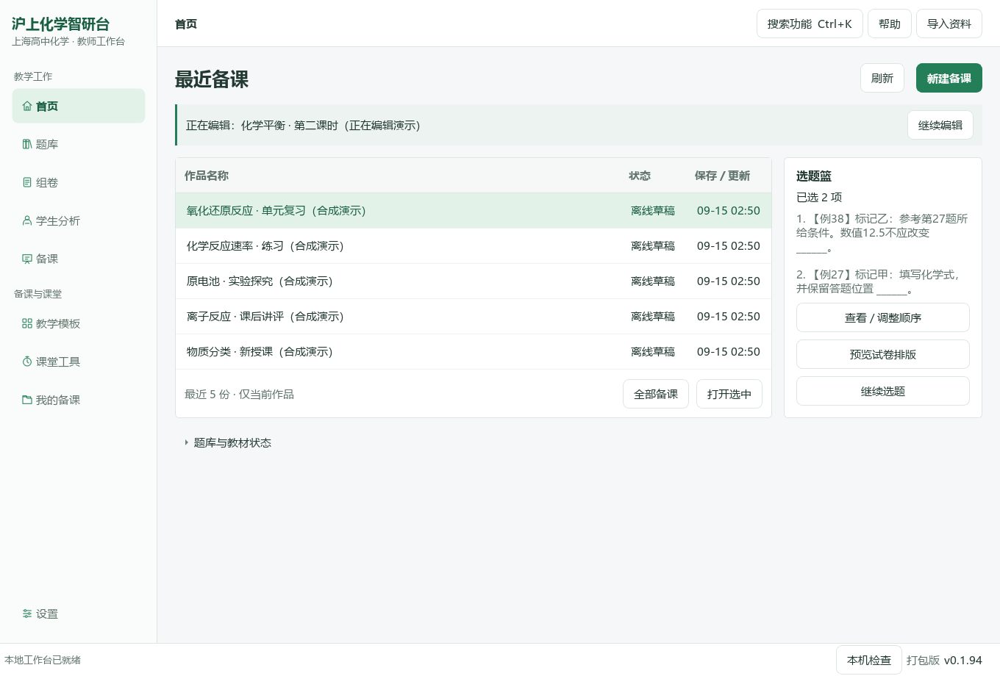

最近五份当前作品按保存或更新时间展示，选择后打开；更早作品在“全部备课”中搜索。归档、回收站不混在当前作品里，保存时间不冒充最近打开时间。

“继续编辑”回到原备课表单，不清空材料、不发起模型调用；“新建备课”有未保存内容时会确认。右侧使用真实题篮，查看、调序、继续选题及预览试卷共用同一批已选题。底部题库/教材状态按展开读取，不用宣传卡片占满日常工作区。

<a id="library"></a>
## 5. 选题中心：左侧标签，右侧原题

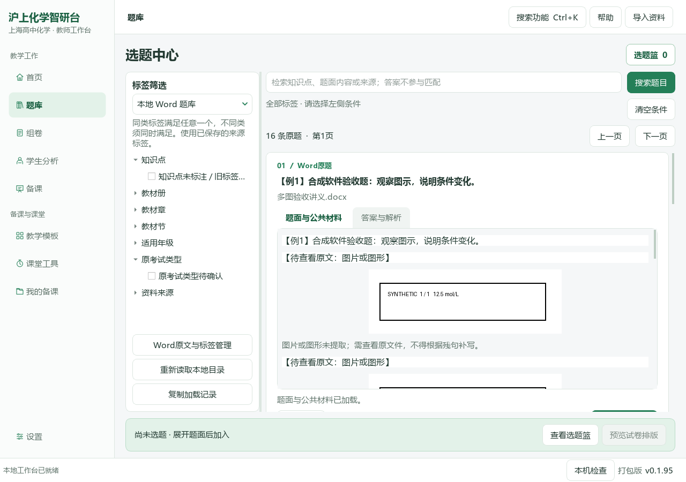

先在左侧选择实际拥有的资料来源，再使用来源支持的教材、章节、知识点、年级或考试类型筛选。**同类满足任一条件，不同类同时满足**；删除顶部标签可单独取消一个筛选。来源选择会记住，空结果可切换已导入Word或图片题，不把空原卷目录误当所有库都没有题。

右侧题卡可展开题面、公共材料与图片，并切换答案/解析。核对后加入题篮，已加入状态不会因翻页丢失。题篮中的一项可能是带多个小问的完整主题，不等于一条最小作答单元。依赖共同材料或前题条件的小问不作为缺条件孤题导出。

个人目录首次读取后建立可丢弃索引；同来源最多缓存四组匹配结果，后续筛选/翻页复用。Word同标签页多图合并读取，答案按需展开；不通过降低原图质量换速度。导入、标签管理和“重新读取”会更新快照；外部直接修改来源文件后需手动重新读取。

左侧“复制加载记录”只复制各阶段耗时和数量，不含关键词、题面、路径或密钥。首次大目录、旧公式转换、大图解码和外部磁盘仍可能慢，局部性能数字不是全库冷启动承诺。

<a id="paper"></a>
## 6. 题篮、组卷与连续题号

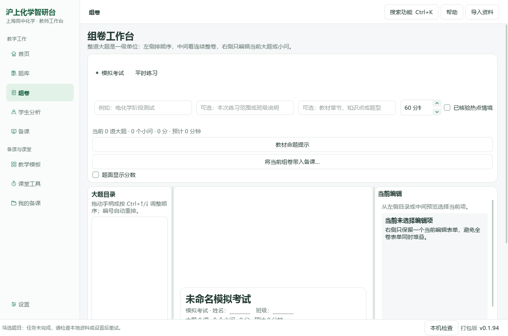

题篮可查看、上移、下移和移除，移除不删除原题。**“预览试卷排版”使用当前题篮；“进入组卷编辑”继续组卷草稿**，两者不要混为同一范围。混合组卷编排Word原题与图片主题，保留完整共同材料、已有公式和作答区域。

教师可调整卷名、用时、题序、配分与当前编辑页支持的作答设置。未知分值需要核对，不能作为确定的0分。原题已有横线、表格或绘图区时不重复添加。生成后切换学生版/教师版逐页检查，确认后导出本次核对的同一批文件；调整题序后重新生成预览。

### 文字题号与图片题号

可编辑文字题号按本卷顺序重新编号，对应答案同步；同来源且对应唯一的文字引用跟随更新。题内(1)(2)层级、选项、公式上下标及12.5等数值不做粗暴数字替换。教师来源说明保留原题号，便于回查。

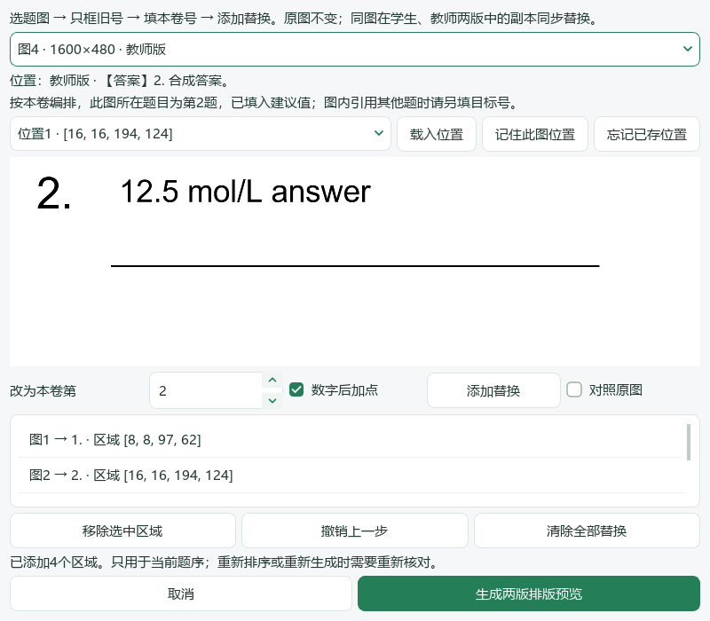

扫描图片内部的旧号在混合组卷 **“调整图片题号后预览…”** 中处理。选图，只框旧号，填写本卷号码并添加替换；可原图对照、撤销、移除或清除。修改写入学生/教师DOCX副本，再进入实际PDF转换，不只是窗口遮盖。原图不改写，框外像素保留。

“记住此图位置”只存原图身份、尺寸和坐标，不保存旧卷新号码；下次“载入位置”后核对当前号再应用。能唯一对应一条Word印刷题时提供本卷号码建议，共享材料或多义对应不猜。图内“见第N题”等引用须另核对目标。

当前限静态PNG/JPEG/BMP白底数字方式；彩底、旋转、同图不同实例需要不同编号和复杂跨页来源仍有待补齐。答案标题/短首段与首内容块关联分页，长答案不强制挤在一页。编号正确不代表所有复杂卷面已终验。

<a id="student"></a>
## 7. 学生分析、同屏批改与作业批次

### 上传、匹配和分析

学生以已有匿名代号管理。按当前界面选择原题、学生作答、参考答案页，先在本机准备并核对页码对应和满分，再确认需要发送的材料及模型。资料不足、匹配不明或模型不支持图片时，不应把文本联通当作识图通过。

已有分析可重新打开，不需要重新收费调用。原作答、模型建议和教师决定分别保存；“不能据此判错”的信息不是已确认的0分。真正模型识别准确率取决于所选模型、页面质量和人工核对，本版合成测试不构成准确率证据。

### 一份作答的同屏复核

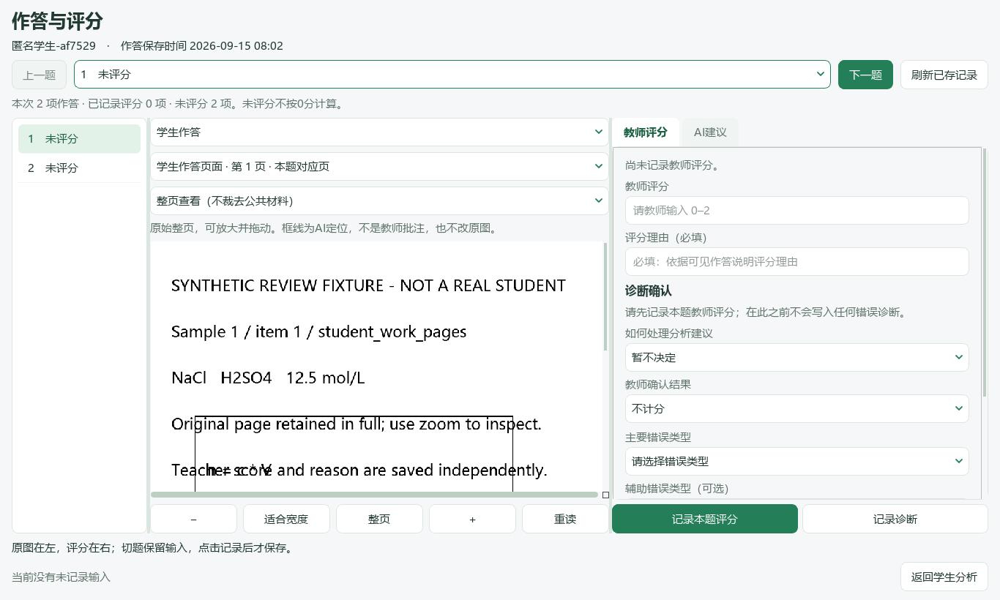

打开已有分析后，点击顶部 **“打开作答与评分（同屏批改）”**。左侧选题，中间切换学生作答、原题/公共材料和参考答案，右侧分为“教师评分”与“AI建议”。支持适合宽度、整页、缩放和拖动；AI证据框需对应实际页面，框线不修改原图。

新分数留空，明确填写分数和理由后点击“记录本题评分”。诊断单独记录，可采纳、修改、不采纳或暂不判断；修改分数后旧诊断需重核。目前修改的是题目总分与诊断，并非每一个AI评分点都已有独立改判编辑器。

单份旧窗口在当前窗口内保留切题输入；本版新增持久暂存的是下方**作业批次窗口**。两者界面明确区分，不把未记录的输入说成已保存评分。

### 新建批次并选择已有作答

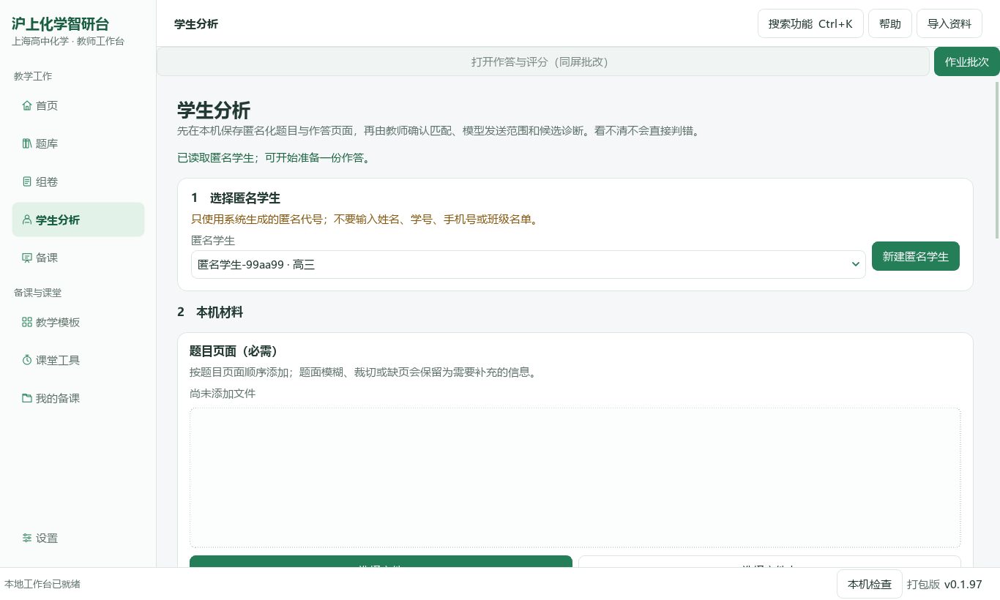

点击 **“作业批次→新建批次”**，填写作业名称，班级备注可不填。勾选实际属于同一作业的已有学生作答，每人只选一份；同一个学生有新旧版本时由教师明确选择，不根据文件名推断姓名、班级或试卷。

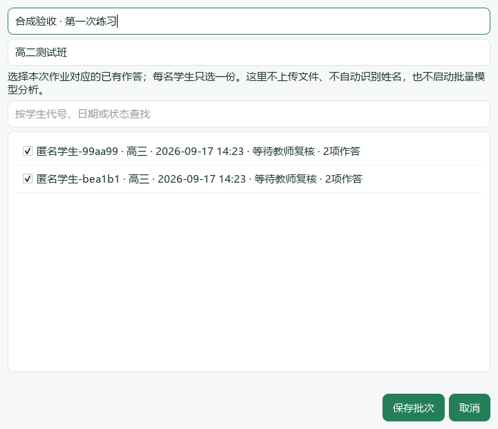

选择器读取全历史而非只截最近50份。搜索只隐藏不匹配项，不清空已勾选内容。保存后可通过“编辑批次”重命名或调整成员；改变成员不删除原作答、正式评分或暂存。批次是引用分组，不再复制整套学生库。

### 在同一窗口逐人复核

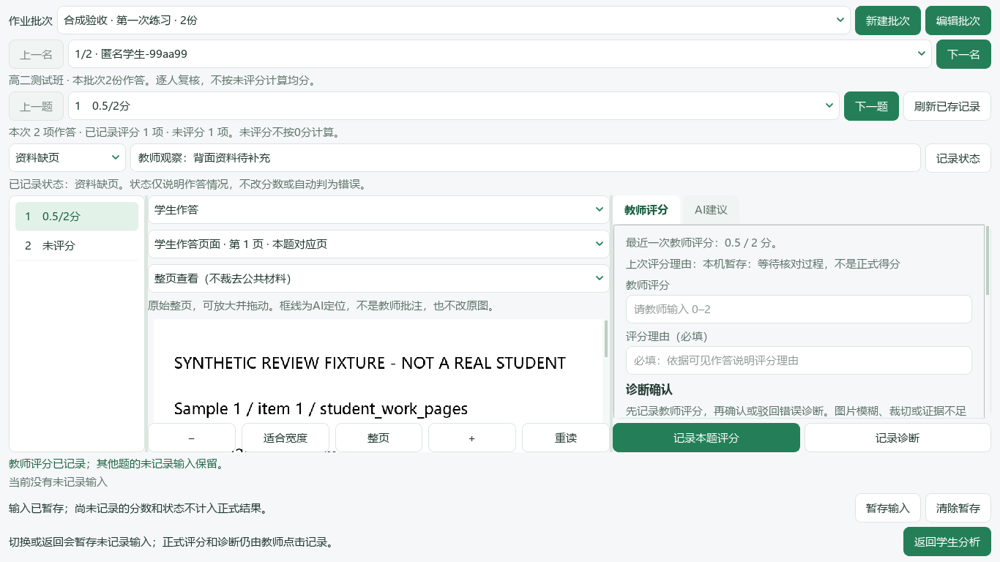

顶部选择批次与学生，或用“上一名／下一名”。一名学生内部仍用原来的上一题/下一题和原页阅读器。切换时先处理当前暂存，再读取新学生，加载失败不会沿用前一名的图。

某份作答没有已有分析时，会说明需回学生分析完成原流程；批次窗口不会自动发起模型请求。此版是**已有作答的批次复核**，不是批量上传、一键循环调用模型或班级自动打分平台。

### 暂存输入与正式评分分开

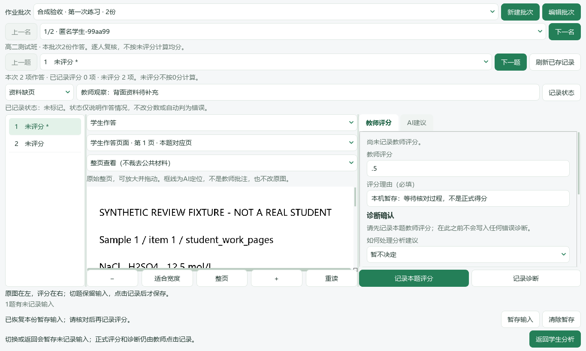

在批次窗口，切换学生或返回时会暂存尚未记录的分数、理由、诊断输入和作答情况输入，也可以主动点击 **“暂存输入”**。重新打开批次后可继续；暂存不改模型稿、不算正式得分、不更新错因统计。

点击“记录本题评分”才写入原评分服务；成功后清理该题已经记录的对应暂存字段，其他题未完成内容保留。“清除暂存”需要确认，只清未记录输入，原评分、诊断、原图和批次不删除。

暂存写入失败时留在当前学生，不悄悄切走。已有正式记录或原题对应发生变化时提示核对，原题变化的旧暂存不会直接套用。此版没有每键自动保存：**异常退出前未点暂存、未切换/返回的最新输入仍可能丢失**。学生目录仍未纳入备课备份ZIP。

### 记录未做、缺页等实际情况

可选择 **未标记、待核对、资料缺页、未作答、尚未学到、作答时间不足、图像难辨**，填写观察依据后点击“记录状态”。除了清回未标记，需写明依据；程序不会把空白自行判断为不会。

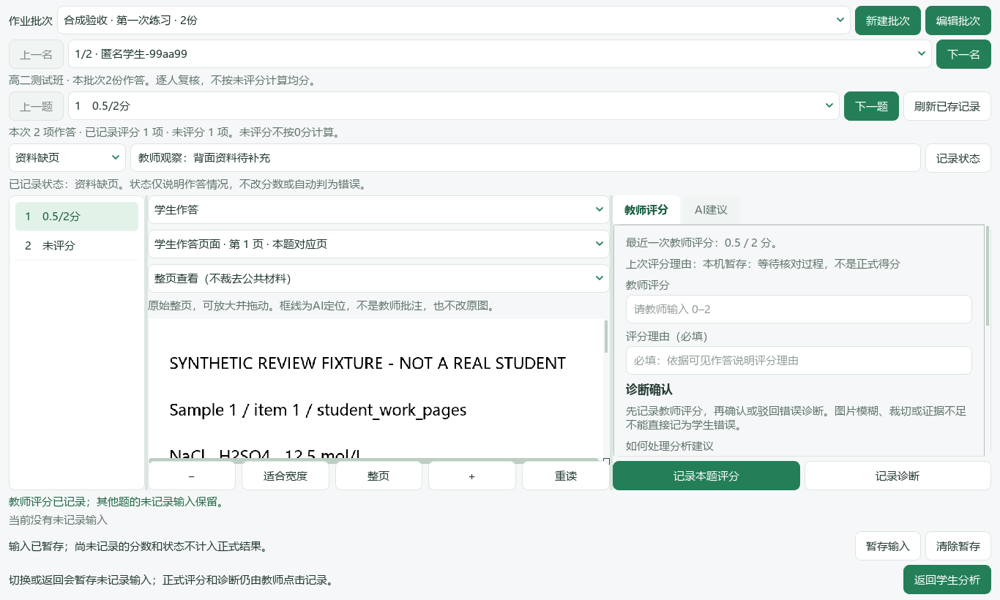

情况与评分是两个维度：标记资料缺页不自动改成0分，取消状态也不会删除正式分数。状态保留修改记录，尚未记录的选择只作为输入暂存。当前只展示批次成员和本份评分进度，**不按不同试卷或未批完分数计算班级均分、排名和能力雷达**。

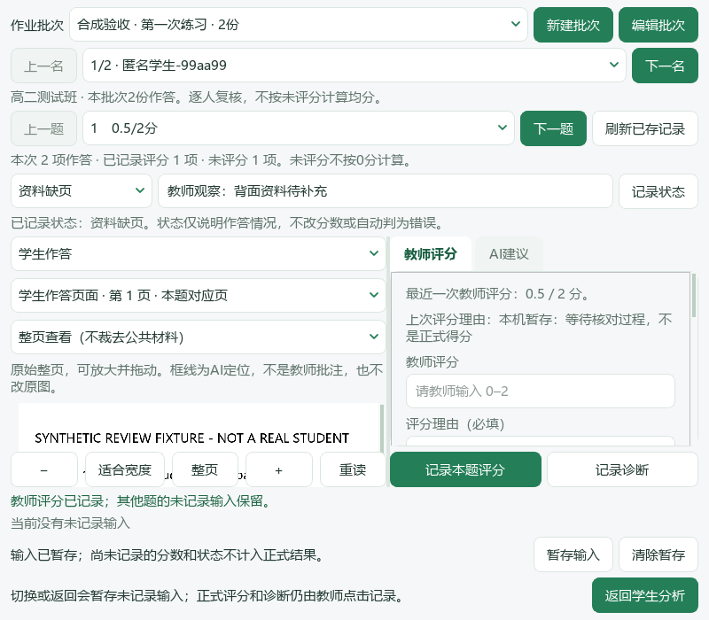

### 复练边界

原单份分析页保留按教师评分、诊断与教材范围寻找现有题库练习的入口，核对完整题面和公共材料后入篮。没有适合候选时不造题号。本版未完成班级批量推荐、复测任务与结果回写，未复测不显示“已提高”；也没有把勾叉批注直接画回学生原卷。

<a id="preparation"></a>
## 8. 备课、教案与PPT

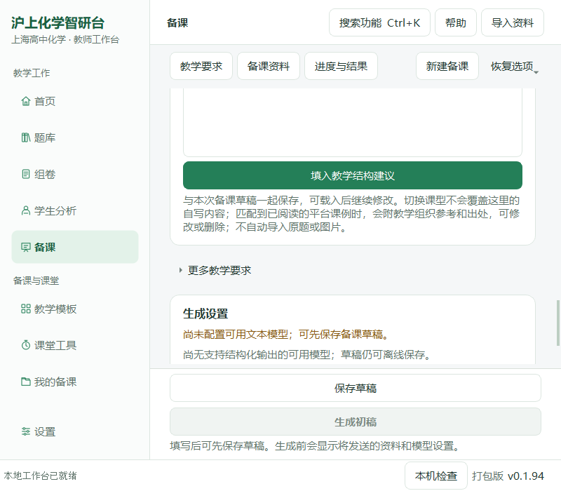

填写课题、授课对象、课型、课时、教学目标与实际材料，再选择当前任务支持的输出类型。顶部可定位教学要求、备课资料、进度与结果；底部保存/生成保持可达，不必滚到表单最末寻找按钮。

资料可从Word内容、教材知识点、完整题目、命题方案和已核对材料带入；追加参考不应覆盖原课题与已填目标。Word文字直接读取，图片保留原页或独立引用；是否让模型读图由配置、能力与发送确认决定。

生成前核对模型、资料、页数和预算。查看返回稿，核对目标、讲解、问题情境、学生任务、例题、独立练习、反馈与课堂收束是否合理，再修订导出。软件应组织一节课而非只是罗列题目，但生成质量仍需人工把关。

PPT输出使用可编辑PPTX；现有快速预览由共享布局绘制，**不是PowerPoint对实际PPTX的最终渲染核验**。字体替换、复杂化学图形与投影效果应打开最终文件核对。当前修订和序列操作沿用已有能力，完整目标—活动—评价三栏节点编辑及全部输出联动仍在路线图，不以固定导航冒称已完成。

备课恢复副本约每两秒检查编辑，正常关闭再保存最后修改；正式“保存草稿”用于保留版本。恢复副本不是原图备份，已被外部删除的图片不会因恢复表单自动找回。模型失败后已保存内容仍可查看，不应无解释地重复整次收费生成。

<a id="templates"></a>
## 9. 教学模板

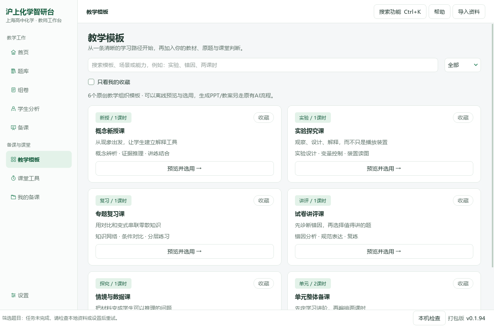

按现有课型分类、搜索和收藏模板，先查看完整教学结构，再确认带入备课表单。保留教师已有材料与图片，模板预览不调用模型。

模板用于教学组织，不是“换一套颜色”，也不是获奖课件原件。当前六类结构不等于六套经课堂验证的成品PPT；教师自建共享模板库和视觉主题/页面布局完全分离仍属后续。

<a id="classroom"></a>
## 10. 课堂工具

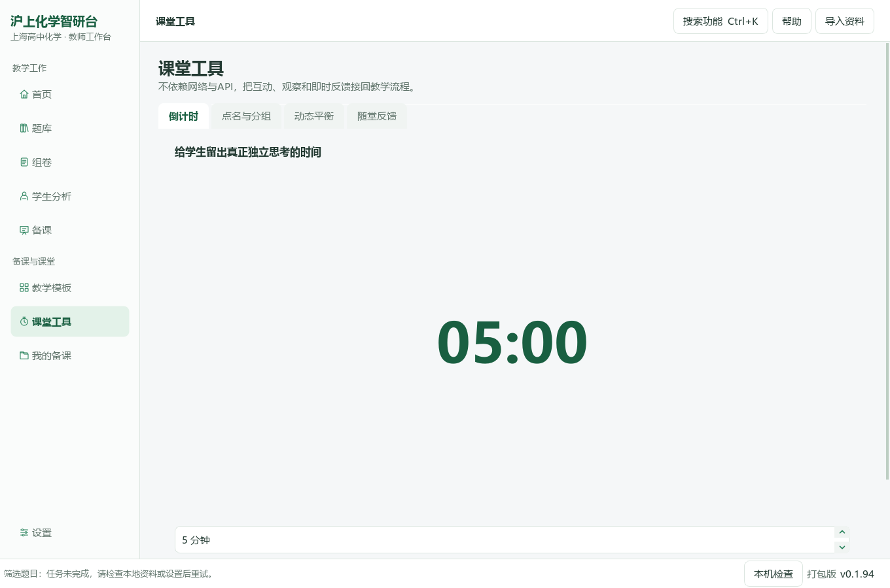

本地计时支持开始、暂停、继续和大字显示；点名一轮不重复，分组按当前列表均衡处理。演示工具的A⇌B采用明确条件下的一级可逆反应模型，不作为任意化学反应仿真。

随堂反馈由教师录入，可追加回备课，帮助下次调整解释与练习。目前没有学生端实时投票、云同步或全套实验装置模拟；使用课堂大字模式时仍需核对学生投影区不包含教师管理信息。

<a id="works"></a>
## 11. 我的备课、作品整理与备份

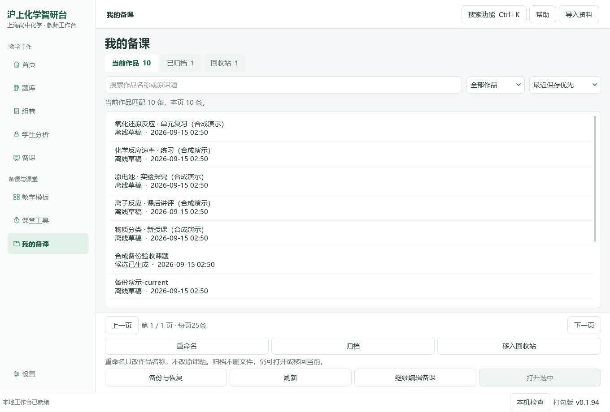

搜索全部有效历史，再筛选草稿/生成任务、排序和分页，较早作品不会因最近50条截断而失踪。当前作品、已归档和回收站分开；常用操作固定在列表之外，小窗口无需再滚整页找按钮。

重命名只改作品显示名称，不悄悄改课题正文或成品文件名。归档不删除文件，回收站还原到原范围；当前没有永久清空。运行中的任务不会被整理操作静默取消。回收站不释放磁盘，也不能替代备份。

“备份与恢复”先整理清单，再创建ZIP。默认包含有效备课草稿、分类、题篮引用、恢复副本和已存扫描号位置；备课图片及已结束任务/登记成品按需勾选。恢复到新独立目录，不覆盖当前工作；“打开已有的恢复目录…”用于后续继续。独立恢复不是双向同步。

缺失备课原图可按内容哈希、尺寸和格式补回，不拿同名不同图替换。题号位置随备份恢复，但不含对应原题图；新版可读旧ZIP，扩展字段需支持版本读取。**原Word/公众号完整题库、学生作答/批次/批改暂存和模型密钥仍不在备课ZIP内**。ZIP未加密，教师写入正文的信息不会自动脱敏。

<a id="import"></a>
## 12. 导入资料、教材映射与标签

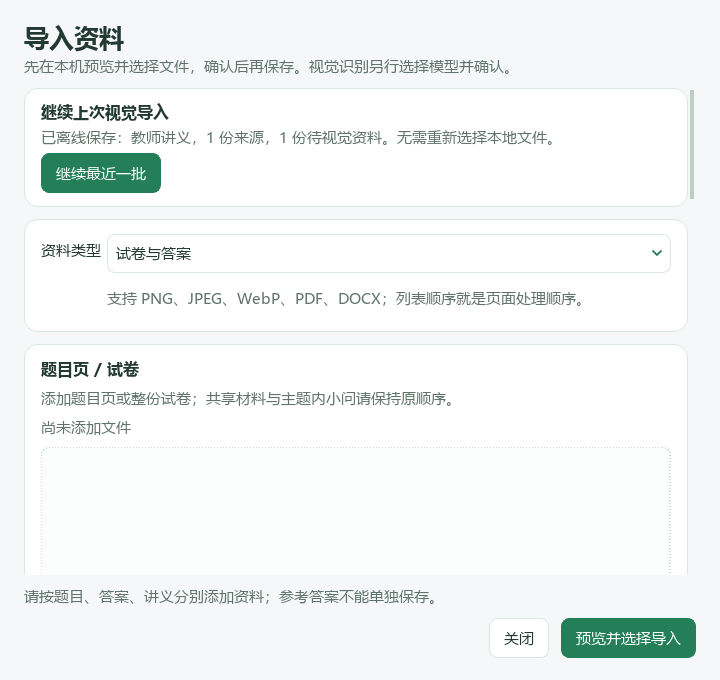

从右上角“导入资料”选择Word、PDF或图片，按试题、参考答案、教师讲义等用途放置文件。可预览并选择导入范围；保存过的批次即使后来取消窗口也可能已存在，退出后选题快照会失效刷新。

Word可读正文直接提取，保留公式及嵌入图，不把全部Word转为大截图。不能读取的旧公式对象或扫描页按原流程提示，可回原文件核对；视觉识别需合适模型与明确发送确认。自动切割不能免除题答分离、跨页公共材料、边缘裁切和已有答题区域的复核。

来源管理可按实际支持范围维护知识点、教材册/章/节、年级和考试类型。只保存有依据的标签，不按学校名、题号、难度印象或文件名猜填“官方”“一模”等字段。筛选与推荐是否命中取决于有效标签；已填字段数不等同于整库完成核验。

旧98份资料包入口仅供本机实际拥有该资料包的环境，普通文件无需使用它。软件没有附带这份资料包，也没有因更新自动完成用户本地公众号、Word或教材的重新导入与蒸馏。

<a id="settings"></a>
## 13. 模型设置、字体与本机检查


填写服务商、Base URL、实际模型名、API密钥与接口格式后保存。高级预算默认收起，已有参数仍保留，留空使用原默认策略；预算不是厂商容量或计费保证。

保存配置只改本机记录；测试连接会另行确认并发送固定短文本。修改配置后旧成功记录不代表新配置已验证。**允许发送图片、模型宣称支持图片、实际读图质量通过是三件不同的事**。文本API不可因能聊天而被当作已具备视觉解析、化学图识别或结构化输出能力。

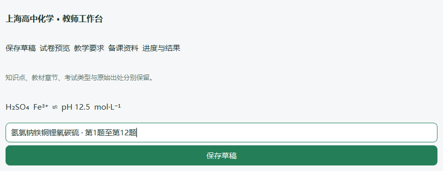

状态栏“本机检查”显示版本、源码/打包身份、组件、资源、目录可写性、Office安装发现和实际中文/化学符号字形。检查不读密钥、不扫描全题面、不自动请求模型。发现Office不等于真实转换已通过。

界面优先使用本机实际可用中文字体，正文11磅、部分辅助字9.5磅，并保留化学上下标和箭头的字符回退。`Microsoft YaHei UI`是微软雅黑的英文名称，不代表用英文字体画汉字。界面修复不修改原图片、Word、PPT或PDF字体。

<a id="faq"></a>
## 14. 常见问题与快捷入口

| 现象 | 处理方法 |
| --- | --- |
| 更新后还是旧版 | 确认运行新解压目录的EXE或源码启动脚本，查看状态栏版本，不沿用可能指向旧版的VBS |
| 明明导入过，选题却为空 | 切换到对应的本地Word/个人图片来源，清掉过窄标签并重新读取；查看导入实际保存结果 |
| 点击题目仍慢 | 用“复制加载记录”区分目录/索引、题图和卡片阶段；大文件首读与复杂公式仍有成本 |
| 新卷出现旧题号 | 可编辑文字重新生成预览；扫描图使用图内换号入口，图内引用另核对，旧成品不会自动改写 |
| 新批次里无法复核某生 | 批次只分组已有作答；该生尚未完成分析时需回学生分析完成原流程，不会自动调用模型 |
| 切换后分数栏恢复了但统计未变 | 恢复的是暂存输入，正式分数须点击“记录本题评分”；未评分不是0分 |
| 缺页状态和已记录分数同时存在 | 状态与评分独立，教师需核对是否修订分数；软件不会自动删分或判零 |
| 暂存失败无法切换 | 当前输入仍在，先检查本地可写性；记录冲突需重新读取后核对，不会写到其他学生 |
| 恢复备课后没有题库或学生作答 | 备课ZIP并非全工作台迁移，原题库与学生业务当前不包含 |
| PPT预览好看但Office打开不同 | 快速预览不是实际Office渲染；检查字体、换行、上下标与最终投影效果 |

`Ctrl+K`搜索功能，`F1`打开帮助，`Ctrl+1`至`Ctrl+5`切换原五个主页面。窗口常用操作使用完整中文用途，不需要输入后台ID。

<a id="verification"></a>
## 15. 本版验证、限制与版本管理

{{VERIFICATION_SUMMARY}}

[源码Windows报告](docs/qa/0.1.97-readiness.json) · [同一EXE报告](docs/qa/0.1.97-package.json) · [本批实现与尝试记录](docs/ux/0.1.97-work-batches.md)。每次测试独立计数，本地子集不叠加。新截图来自实际Qt窗口的隔离合成资料；Windows上的Qt offscreen自动化不等于所有系统缩放、多屏和学校机器终验。

本版没有真实学生、真实API调用或教材蒸馏。固定传输夹具只用于构造可复现样例，不能据此声称AI识别、化学答案或评分准确。未完成范围继续列入任务表：全量Word/公众号题库迁移；可靠班级均分与复测回写；逐评分点编辑；学生数据备份；完整教学节点工作区；实际PPTX兼容预览；复杂图号多实例与引用关联。

版本使用独立分支、PR、标签和Release附件。标签与程序不因后续文档修订而移动，旧README原字节归档；`RELEASE-MANIFEST.json`区分受测/打包提交与只增加说明截图的发行提交。没有自动合并main或覆盖历史PR。本README始终覆盖完整功能，新版日志另放CHANGELOG，不让教师必须翻十个历史版本才知道如何使用。

## 开发定位

原生界面在`integrations/deeptutor_shchem_v1/desktop_workbench/`；题目、组卷、备课与学生服务在同级模块。批次仅引用既有学生/作答身份；`desktop_work_batches.py`保存分组、状态与暂存，`work_batch_desk.py`嵌入既有复核器。运行与打包入口位于`runtime/deeptutor_shchem/`，定向测试在`staging/coordination/deeptutor_gateway/tests/`。

同类项目/作者公开工作流的取舍见[工作流与开源借鉴研究](docs/research/0.1.95-workflows-and-references.md)。本版不新增Coze/Dify服务器、不用Web替代原生桌面，不把作者收费插件当作本项目已实现能力。
