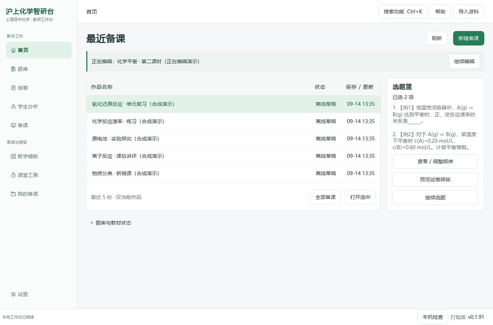
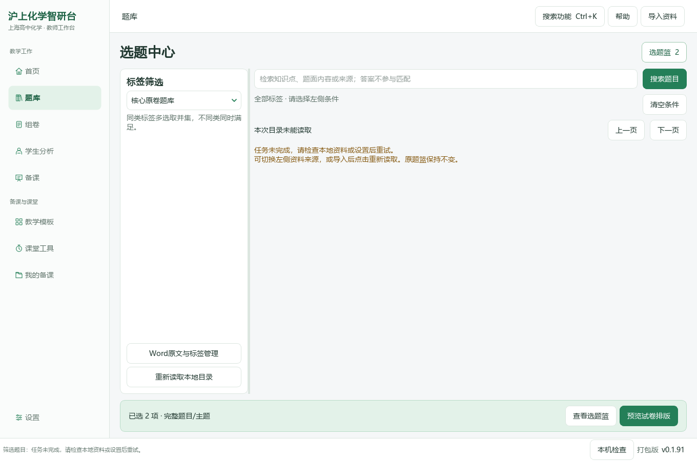
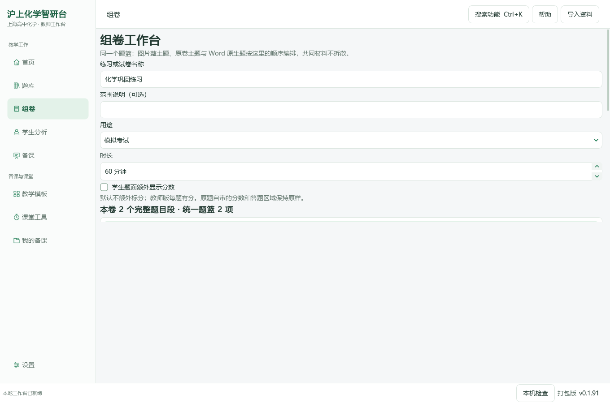
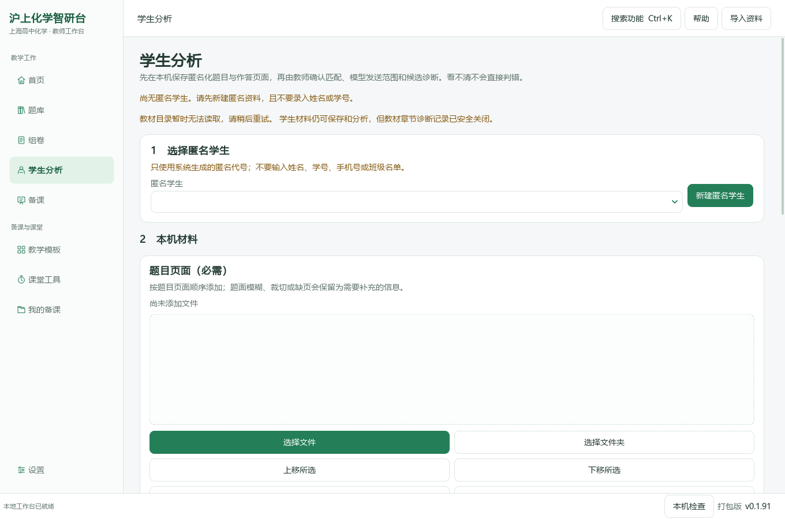
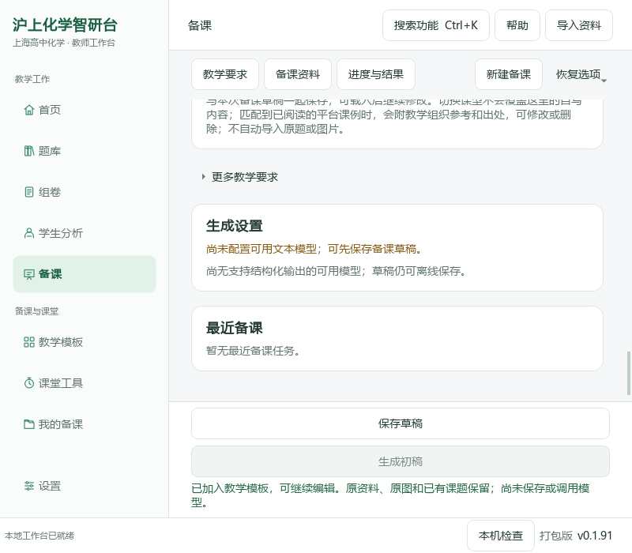
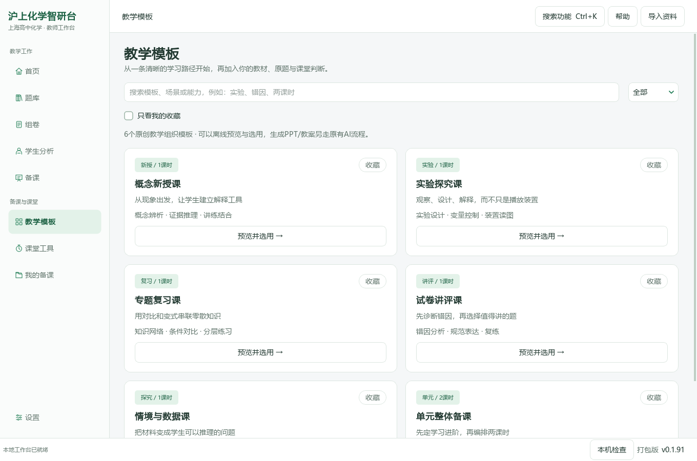
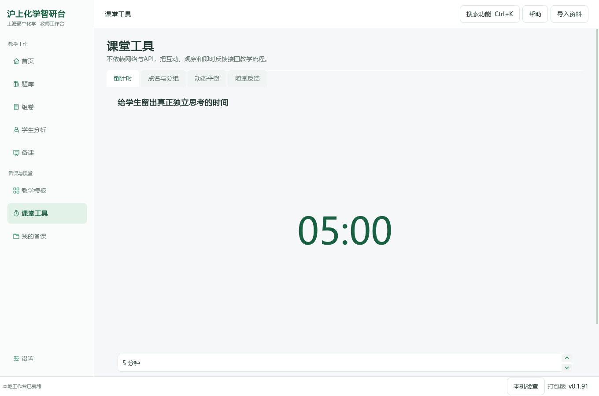
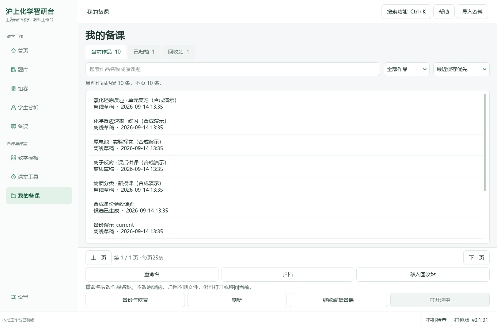

# 沪上化学智研台

**0.1.92 中文字体修复：源码候选，尚未发布 Windows 安装包**

当前已发布的试用版仍为0.1.91。本分支正在核对中文字体、实际字形、字号和Windows缩放。不能把英文拼写的字体名称当成英文字体：Windows基线中，汉字实际使用的是Microsoft YaHei UI（微软雅黑）。

[字体修复 PR #15](https://github.com/2067169120-png/shanghai-chemistry-teaching-agent/pull/15) · [已发布的0.1.91](https://github.com/2067169120-png/shanghai-chemistry-teaching-agent/releases/tag/v0.1.91) · [完整图文使用指南](README-0.1.91-archive.md) · [字体检查说明](docs/ux/0.1.92-chinese-typography.md)

## 当前改动与验证边界

分支中的第一批代码统一应用级中文字体选择，移除全局样式重复的字体列表，把正文统一到11磅，将侧栏、徽标等原11像素辅助文字提高到9.5磅；新增本机字体诊断，不改原Word、题图或生成成品。

Windows基线已采集。第一轮完整回归走到新增化学符号用例时失败，随后取消，未取得通过报告。补查发现新加载器漏掉旧版使用的本机符号字体；另有重复初始化样式造成大量既有窗口重绘的问题。本地修订已补上符号回退和幂等样式初始化，专项测试通过，但最终代码写入被平台拦截，**该本地修订尚未进入本分支**。

因此目前没有0.1.92版本标签、Release或新便携程序。后续必须将修订纳入版本后重新运行同一提交的Windows回归、实际字形和独立程序检查，才能发布。当前源码不作为已验收教师试用版。

## 使用已有版本

教师继续使用0.1.91 Release中的Windows x64便携包，完整解压后运行`沪上化学智研台.exe`；不单独移动EXE或删除`_internal`。不需要另装Python。新卷文字编号和既有备课功能继续使用0.1.91的已发布实现。

开发者运行源码时，在仓库根目录执行：

```powershell
py -3.12 -m venv .venv
.\.venv\Scripts\python.exe -m pip install -r runtime\deeptutor_shchem\desktop_requirements.txt
```

随后双击`启动源码桌面版.cmd`。本分支尚在验收，不建议用其替换已发布便携程序。

## 各界面操作参考

以下是0.1.91实际窗口的历史操作参考，**不是0.1.92字体验收截图**；更详细的选题、组卷、备课、导入、设置、备份步骤见完整图文指南。

### 首页：最近作品与题篮



### 选题：左侧条件与完整题目



### 组卷：题序、配分与排版



### 学生分析：原作答与评分



### 备课：资料与固定操作区



### 教学模板



### 课堂工具



### 我的备课



## 数据与剩余任务

个人原教材、题库、学生资料、模型密钥和字体文件不随软件分发。扫描题号像素替换仍在Issue #14，完整Word/公众号题库迁移仍在Issue #9；本轮没有自动导入资料、发起模型调用或完成这些任务。
