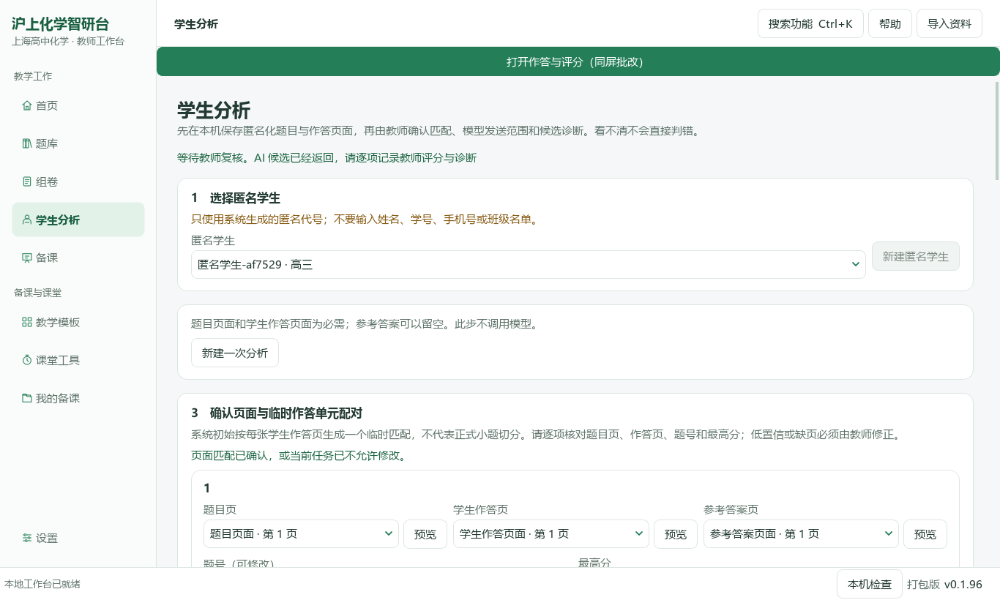
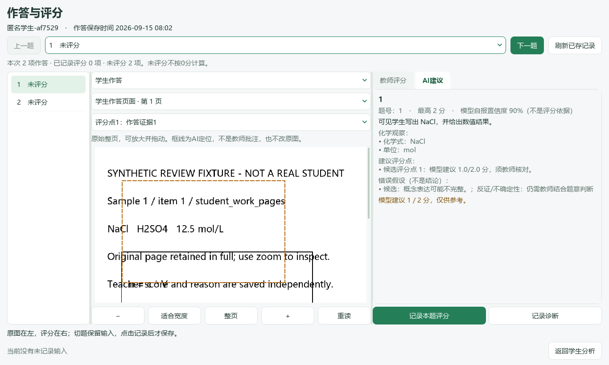
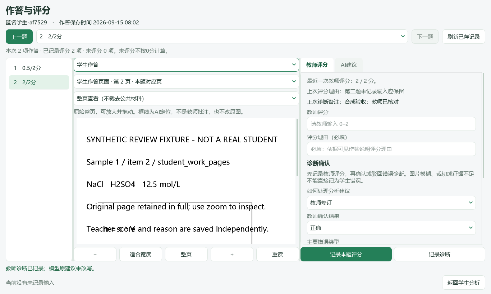
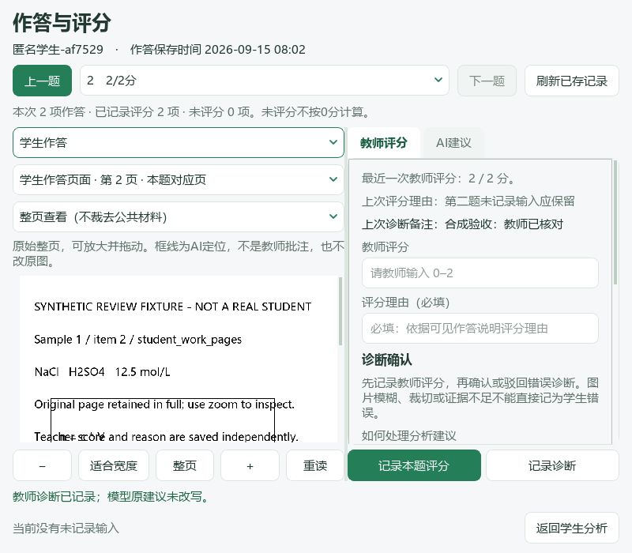

# 沪上化学智研台

**0.1.96 · 原作答与评分同屏 · Windows / PySide6 源码候选（等待本版验收）**

本版接续教师工作流改进，把同一份学生作答、原题与参考答案、AI评分建议和教师记录放进同一个原生工作区。选题加载、连续题号、图片换号、备课、恢复和作品整理继续保留；不引入第二个学生库或云平台。

[本版Release](https://github.com/2067169120-png/shanghai-chemistry-teaching-agent/releases/tag/v0.1.96) · [更新记录](CHANGELOG.md) · [本批范围](docs/ux/0.1.96-student-review.md) · [任务进度](docs/roadmaps/0.1.96.md) · [0.1.95历史指南](README-0.1.95-archive.md)

## 安装和升级

教师下载`ShanghaiChem-0.1.96-Windows-x64.zip`，关闭旧版，**完整解压**后运行`沪上化学智研台.exe`。不要只移动EXE或删除`_internal`，不需要另装Python。状态栏应显示v0.1.96／打包版。未签名试用包请核对本仓库来源与SHA256，不关闭系统防护。

个人数据仍在当前用户的`%LOCALAPPDATA%\ShanghaiChem\DesktopWorkbench`，程序不附学生作答、教材、题库、密钥、Office或字体文件。备课备份仍排除学生业务目录；本版没有增加学生记录跨电脑迁移。真实DOCX分页需要本机LibreOffice或Microsoft Word。

开发源码用Python3.12，在仓库根目录执行后，双击`启动源码桌面版.cmd`：

```powershell
py -3.12 -m venv .venv
.\.venv\Scripts\python.exe -m pip install -r runtime\deeptutor_shchem\desktop_requirements.txt
```

Git分支为`feature/student-review-desk-0.1.96`；先保存本机未提交代码，不强制重置。旧VBS可能仍打开旧EXE。

## 本版重点：边看原作答，边记录教师评分

### 从已有分析进入

在“学生分析”中选择学生，打开最近的一份作答，待已有分析建议读取后，点击顶部固定的 **“打开作答与评分（同屏批改）”**。已有结果的查看、教师评分和诊断记录都不需要重新调用模型。没有已有分析建议时，仍走原上传、匹配、分析流程；本版不是无模型的全自动批改器。



宽窗口左侧显示本次题目与复核进度，中间是原始整页，右侧为教师评分。小窗口隐藏左侧列表，顶部题目选择仍可用，原图与评分保持同屏。此窗口处理**一个学生的一份已有作答**；切换学生或其他作答仍返回原学生分析页，不把它称为完整班级批次系统。


### 原图、公共材料与证据

中间可以切换“学生作答／原题与公共材料／参考答案”，选择本次上传的对应页或其他同类页面。保留原始整页，默认按阅读区宽度显示，向下滚动可看完整材料；支持放大、缩小、“整页”切换及拖动。缺少对应页或读图失败会清空旧图并提示，不用上一题的图片代替。

评分点定位只画可关闭的框线，不改原图。位置来自AI返回稿，并且必须与本题已经匹配的页面身份一致；框线不代表教师已经确认识别正确。可回整页查看前后材料。切题后记住该题正在查看的材料种类和页码；本版不保存缩放倍率与拖动位置。



### 评分与诊断分别记录

右侧分为“教师评分”和“AI建议”。“AI建议”页内保留模型评分、评分点与作答证据。新评分栏留空，教师输入分数及理由后点击固定的 **“记录本题评分”**。不得分仍由教师明确填0；缺页、未核对或未评分不是0分。AI原建议和教师新评分分别保留，当前记录及上次理由可重新读取。

诊断在评分之后核对，教师选择采纳、修改、不采纳或暂不判断，并填写原有服务要求的错因与教材范围。新诊断不默认认定正确。修改评分后，旧诊断按原规则标为需重新确认，不能继续当作匹配当前分数的终判。



同窗口切换题目保留尚未记录的输入；保存第一题不会清空第二题尚未写完的理由。记录失败时保留输入，可刷新已存记录、核对后再提交；正在保存时不切换目标。返回前有未记录输入会提示，选择取消继续编辑，选择放弃只丢弃未记录输入，已保存决定不撤销。

**未记录输入仅在当前窗口保留，不是自动恢复副本。** 关闭、异常退出或明确放弃不能保证找回这些输入。当前统计只列本份作答的已评分／未评分数量，不计算虚构班级平均或能力排名。



## 日常页面指南

未改版页面下方继续使用已标注路径版本的历史实际截图；本版新同屏图使用隔离合成学生与作答，不代表真实教师资料已导入或真实AI批改质量通过。

## 01 首页：继续上次工作


最近五份当前作品按保存或更新时间显示。选中打开，或点击“全部备课”查旧课题；归档和回收站不混入当前作品。上方“继续编辑”回到未完成表单，不调用模型。新建有未保存内容时沿用原确认。右侧是真实题篮，可排序、继续选题、进入卷面预览；下方资料状态按展开读取。

## 02 题库：左标签、右题目


先选可用来源，再按教材、知识点及来源实际支持的年级/考试类型筛选。展开题卡核对题面、公共材料、图片与答案后加入题篮。小问依赖公共材料时保留完整主题，不把题篮项目数当作独立小问数。缺失标签不按难度或题号猜填。已有Word走原生提取，不重新截整页。

## 03 组卷：题序、配分与实际排版


题篮可查看、上移、下移、移除；不删除原题。混合组卷可编排Word题、图片主题，保留必要共同材料。修改标题、用时与配分后预览学生版和教师版。已有答题区域不重复加线。文字题号按本卷顺序，图内号码通过“调整图片题号后预览…”处理，已存区域可复用。缺少Office时不能生成真实分页，但题篮仍保留。

## 04 学生分析

上传与匹配继续保留原流程。已有分析读取后，顶部固定入口打开本版同屏工作区，详细操作见上文。当前评分、诊断、教材范围与题目身份仍由原服务保存；选题推荐不因新布局改变来源。完整班级批次汇总与复测回写仍待推进。

## 05 备课：资料、教学要求与结果


填写课题、对象、课型、课时、目标与实际资料。顶部定位“教学要求／备课资料／进度与结果”，底部保存和生成始终保留；自动恢复属于“恢复选项”，正式保存草稿另外保留版本。生成前核对发送范围和费用；本地保存、打开历史结果不会调用模型。没有相应模型能力时，不把文字连接测试当作看图通过。

教案和PPT沿用同一教学路径、原题身份与必要材料，结果可查看、修订和导出。快速PPT预览仍是共享布局绘制，**不是Office对实际PPTX的兼容性终验**。本版没有新增完整教学节点编辑器。

## 06 教学模板


六种教学组织模板支持分类、搜索、收藏和完整预览，确认后带入原备课表单，不覆盖已有材料或原图。模板是教学结构，不是获奖课件原文件，也不等同于PPT皮肤。预览模板不调用模型。

## 07 课堂工具


本地倒计时可暂停、继续与大字显示；点名一轮不重复，分组均衡。A⇌B是明确条件下的一级可逆反应演示，不是任意反应仿真。随堂反馈由教师录入，可追加回备课；没有学生端实时投票或云同步。

## 08 我的备课与备份


先搜索全部作品再分页。当前、已归档、回收站分开；重命名只改显示名称，归档不删文件，还原回原范围。运行中的生成任务不能被整理操作悄悄隐藏。

“备份与恢复”可保存备课草稿、分类、题篮引用和恢复副本，图片及已结束任务/成品按需勾选。本版同时包含已保存题号位置（不含原题图），旧ZIP仍可读取；先看清单再写新ZIP；恢复到新独立目录，不覆盖默认状态，也不自动续跑模型。关闭后可“打开已有的恢复目录…”。缺失备课原图按内容身份补回，不能拿同名不同图片替换。

**备份不包含原Word/公众号题库、学生业务目录或模型密钥。** 题篮引用不等于完整题目文件。ZIP未加密，教师写在正文的信息不会自动脱敏。

## 设置、导入和快捷入口


服务商、地址、实际模型名、密钥和接口格式填在基础区；高级预算可收起，已有值不丢失。保存仅修改本地配置，测试连接另行确认。缺少中文字符时先看“本机检查”的字形样例；不要仅因显示问题重新导入题库。


右上角导入Word、PDF或图片；已有98份资料包入口只适用于实际拥有该资料的机器，不是软件自带题库。`Ctrl+K`搜索功能，`F1`帮助，`Ctrl+1`至`Ctrl+5`切换原五个主页面。

## 验证与尚未完成

{{VERIFICATION_SUMMARY}}

[源码记录](docs/qa/0.1.96-readiness.json) · [同一EXE记录](docs/qa/0.1.96-package.json) · [尝试与实现范围](docs/ux/0.1.96-student-review.md)。没有真实学生资料或真实模型API请求；分析返回稿来自显式注入的本地固定传输夹具，不能当作AI识别准确率或教学有效性证据。

本版先落实Issue #19的单份作答复核入口。班级批次导航、缺页／未做等状态细分、可靠班级汇总、复测任务、复练结果回写以及学生资料备份仍待完成。完整教学节点编辑与实际PPTX兼容核验、原Word／公众号整库迁移#9、复杂扫描题多实例与引用#14也没有因本版发布而默认完成。

真实Windows系统缩放、多屏、学校管控设备和全量原题版式需实际试用；程序倍率与合成数据检查不等于这些场景验收。各版分支、PR、标签、附件与报告分开对应，旧标签不移动，main及历史PR不自动合并。
