# 沪上化学智研台

面向上海高中化学教师的 Windows 本地工作台，支持题库浏览、题篮组卷、教师版与学生版导出、教材与讲义关联、课堂课件编排及本地修订。

本仓库用于软件源代码、测试及用户授权的简明知识索引的版本管理。教材和教案原文件、公众号原图、试卷、学生资料、个人设置、模型密钥、构建包及过程截图保留在本机，不随代码上传。`knowledge/` 只保存改述的知识索引、来源摘要及覆盖说明，不提供整本教材或完整教案的公开复制。下方功能截图使用合成演示内容，不含用户资料或平台原图。

## 当前范围

- 原生桌面界面位于 `integrations/deeptutor_shchem_v1/desktop_workbench`，不依赖网页套壳运行。
- 题库读取保留原卷主题、小题与作答单元的对应关系，以及原图和来源绑定。
- 来源参考答案与 AI 补充解答分别存储、标注。补充答案不会改写原归档的“未附答案”状态，也不冒充官方评分标准。
- 组卷题面默认不添加分数，可通过“题面显示分数”选择开启；教师版评分答案始终保留每题及各小问分值。显示设置随草稿保存，修改后需要重新预览。
- 课堂备课支持两课时编排、知识页与例题页插入、教师提示及学习单。具体课堂效果仍需教师使用后反馈。

当前本机桌面包为 **0.1.62**。现成Word的原文、表格和图片是主内容，知识索引只辅助查找，不重写现成教案。该包修复特殊题目标记造成的漏切，并增加保存前的范围预览与具体确认；原教案通读、选段备课、本次练习推荐和课例建议继续保留。后续源码另修正两条Word引用链的旧图片提示，尚未重打包：导入只保存本地备课素材，后续是否发送像素由生成模式及发送预览决定。本轮没有真实模型调用，未复核独立EXE启动与关闭；源码测试、冻结包检查与课堂使用反馈分别记录。具体批次见[更新记录](CHANGELOG.md)，闭环进度见[教师工作台路线图](integrations/deeptutor_shchem_v1/TEACHER_WORKBENCH_ROADMAP.md)。

## 调整题目范围，先预览再保存（0.1.62）

入口：**题库 → 已导入Word · 逐题预览与挑选 → 调整本题范围**。填写题面、答案和共同材料的区块范围后，点击“查看本次范围预览”，分别阅读将要保存的完整文字。原图引用列出数量，并明确引导到逐题预览或原Word看图；范围文字页不冒充图形审看。

修改任何范围都会清除旧预览和勾选。仅对实际存在的三类歧义提供默认不选的具体确认：无答案标签、非标准题目标记、题面已含所引用材料。未确认的提醒仍保留；确认不能解除同段题答混合或把答案放进学生题面/共同材料。此确认只记录分界与材料位置，不代表化学或官方答案审核。界面采用原生纸面阅读样式，900/420像素合成预览已目视检查。

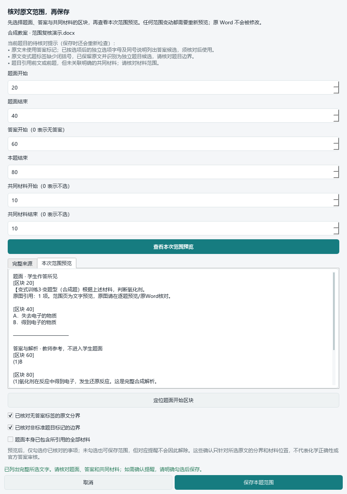

## 先通读原教案，再选段备课（0.1.61）

入口：**导入资料 → 已导入Word → 查看Word内容**，或在备课页点**查找已导入的原教案**。打开后默认进入“通读教案”，不再只显示首个区块：

1. 滚动阅读完整原文，使用全文查找、上一处／下一处及章节定位。阅读不受备课20,000字限制，也不自动勾选整份内容。
2. 点击某段下方的来源图片链接，原图在该段后展开；可放大核对。一次显示一张选中的图，其他图保留入口，不自动读取整份教案的数百张图片。EMF另标本地转换，WMF及无法显示的旧对象仍提示使用原Word。
3. 点击“选此段备课”，切到“选段与备课”；调整起止区块，点“预览将带入的内容”，核对文字和图片后再确认追加。仅查看、查找或返回全文不会修改既有选区、确认或发送内容。

0.1.61支持原表网格预览：打开一份已导入Word时，从该原件读取明确的行列、横向合并和纵向合并关系，并逐表核对文字与当前预览一致；不改98份缓存、原文、题目标记或备课选区。顶部可切换“网格预览／逐格原文”。超过6列、嵌套或合并关系不明确时保留逐格原文并提示核对原Word；不能读取网格时全文仍可使用。图片仍按明确的区块归属展示，不声称还原Word分页、表格单元格内图片位置或旧公式。原文HTML转义，由本地Qt文档绘制，不依赖浏览器引擎，不自动打开网络链接或本机资源。

原文较多的共性提醒在文末完整保留，可从顶部跳转查看；各段的缺口提示仍在对应段旁，不用大量重复提醒挤占全文开头。下图只含合成演示资料，不包含原教案或试卷图片。

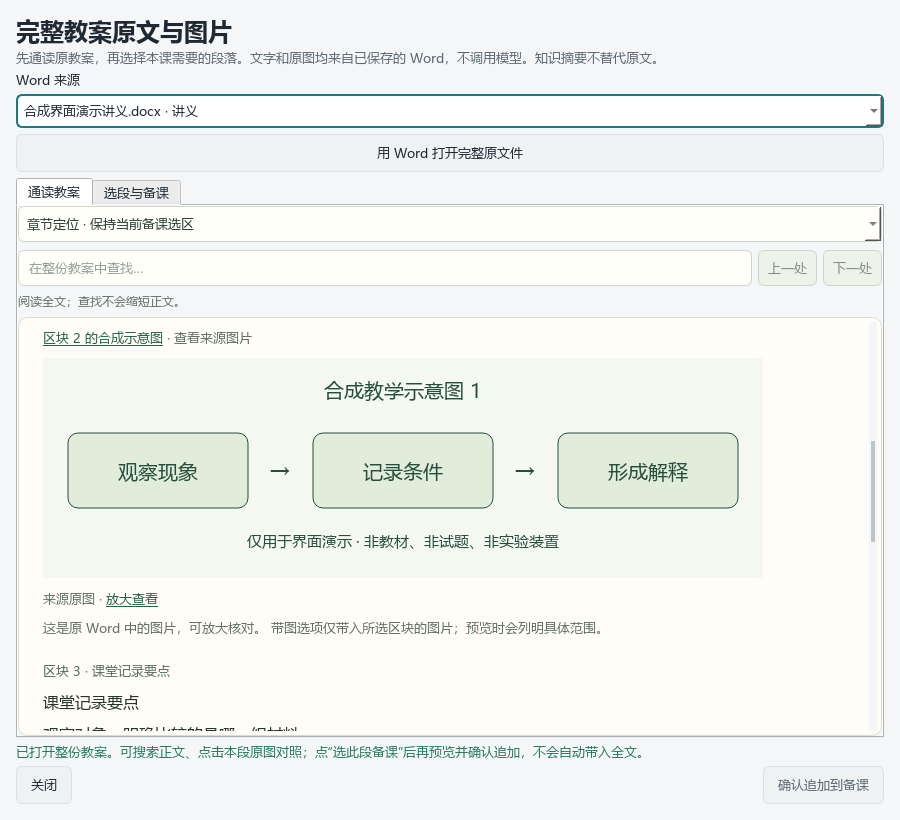

表格改动采用原生纸面阅读样式，下面只展示合成内容。真实来源核对另选第09讲：20张表的结构与缓存正文一致，选定合并长表在420/900像素下完成目视检查，源文件与缓存字节未变。这不是814张表逐一视觉验收。

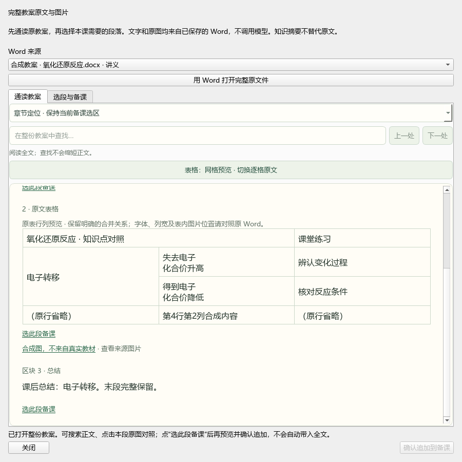

## 本次学情到完整练习（0.1.61）

在“学生分析”记录本次教师评分、诊断及对应教材章节后，点击“按本次学情推荐练习”。卡片显示章节依据、命中单元数、完整大题范围及共同材料数量；先查看完整题目与材料，图片读取成功后才能明确加入题篮，组卷页计数同步更新。

改分、改诊断、未提交编辑或切换学生/任务都会清除旧推荐；源码还会复核当前评分记录、题库及实际教材映射，拒绝过期推荐入篮。推荐按明确章节绑定匹配，不调用模型，不自动判定长期薄弱点或写入长期学情。当前可用章节映射来自主库和补充库；未映射的Word题与wave1不冒充已覆盖。

该增量的原文表格、推荐界面、原生集成、HTTP、投影与冻结检查器联合210项测试通过，含1个既有Qt警告。现已纳入0.1.61本机构建，包内源码一致性见下方构建记录，未将冻结检查器测试当成新EXE运行。以下合成截图使用真实原生StudentPage和内存样例：900像素显示预览前状态；另核对420像素完整预览后的解锁状态，没有真实学生读取或入篮写入。

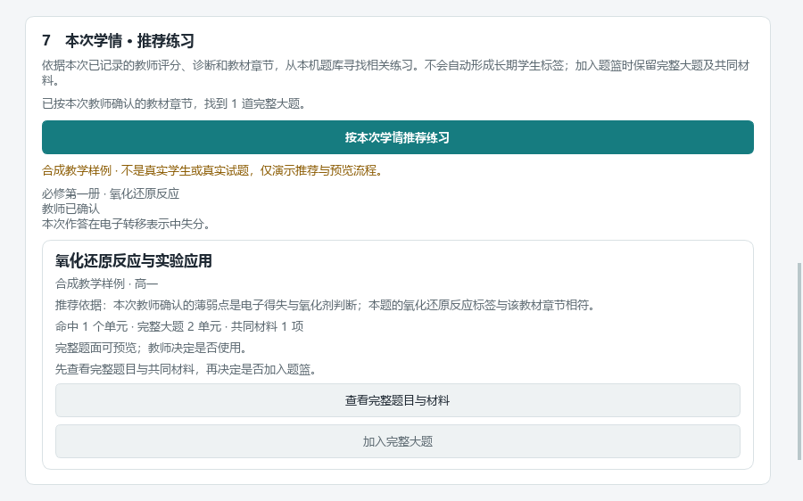

## ZnS主题裁图与答案（0.1.61）

入口：**题库 → 核心题库 → 搜索“ZnS” → 题面与公共材料／答案与分析**。接通复旦附中2026届高三四月阶段检测主题五：8道印刷题、9个既有作答单元，未新增或重复导入主库身份。现成Word教案继续直接读取完整原文、表格与图片，知识索引不替代原教案。

从绑定的原卷和非官方答案页划分22处显示窗（8题面、6共同材料、8答案），修复相邻题混入、Q42题干切顶、材料标题残缺；保留ZnS简介、制备流程、回收率曲线，以及完整晶胞序列、充电箭头和图例。13份来源、24张存档裁片、候选记录均不覆盖。题目年级、校考来源及知识点候选随现有身份展示；主辅未定和难度未知仍明确保留。

第41题保留一道印刷题和两个作答单元，非官方参考分值分别1分、2分，整组17分；完整推导图在教师版内容计划中只绑定计算单元一次，判断单元仍能预览同一答案原图。学生题面默认不额外标分，明确设置的零附加答题行沿用。单问导出的材料按其明确来源依赖缩小，不携带无关兄弟题答案。

该增量核对了原页与22处实际显示图，以及原生预览、题篮和学生/教师内容计划。ZnS读取26项、原生集成12项、福辛普利接线9项通过；旧公众号、主题目录及题图/答案边界回归29项通过（共76个不同用例，重复执行不累加），Ruff与差异格式检查通过。0.1.61本机包已包含该读取器，并核对冻结代码与当前源码一致；未生成这组新的DOCX/PDF、未核验Word分页，不将源码接通与打包写成课堂终验。

原生直接图文读取现为14个产品、262条投影，旧HTTP范围仍为10个产品、224条；主目录48个主题、470个规范作答单元及480个展示单元不变。原生题图覆盖与待归属应分别核算，不把二者合成一个未完成数。

## 福辛普利主题原图与答案（0.1.59）

入口：**题库 → 核心题库 → 搜索“福辛普利” → 题面与公共材料／答案与分析**。可以查看并放大每题的来源答案原图，加入完整主题，或选取带必要材料的小问后进入组卷预览。默认采用来源A，来源B只作差异对照；来源为非官方回忆及机构解析，不改称官方原卷或官方评分。

本批为已有9个作答单元接通10张题面、1张完整合成路线与9张答案图，共20处从绑定原页重新裁取的展示图。第7题跨页条件保留为两张连续题图；第5、7、9题的结构式或路线答案随教师版导出，其余答案图供逐题查看。学生版不含答案图，题面分数可选显示，教师稿保留本次练习分值，原有答题区域不额外重画。原件、旧裁图与归档哈希不覆盖。

所选来源的主题标题、题号及顺序只在完整、同源且身份匹配时补到桌面展示层，不修改中央原记录，也不从文件名猜测。第3题来源A为选择作答，来源B的不同作答形式保留在对照信息中；第6题原页未注明单多选规则，继续提示待核对。知识点候选可用于查找，主辅标签与难度未知仍保留。

该历史批次完成时，原生直接图文读取范围为13个产品、253条投影，旧HTTP范围仍为10个产品、224条；主目录48个主题、470个规范作答单元不因图文接入增加。该批次的原生题图覆盖统计为436项有图、34项未接图，另43项待归属属于另一统计口径；最新增量见上节。

本机实际生成学生版2页、教师版3页的DOCX/PDF，5对页面PNG逐一SHA一致；逐页视觉查看未见截字或跨题混图，74份来源文件前后不变。演示评分统一每题2分，仅验证可编辑评分链路，不是来源原分值。末页留白与答案区排版仍待优化，技术导出通过不代表全部化学内容或真实课堂已经验收。

## 在题库查看已接通的公众号题目（0.1.57继续完善）

进入“题库”，选择“核心题库”，搜索相关主题或知识点，再点击完整大题查看题面、公共材料与来源参考答案。本版接通松江2025二模“Fe(OH)₂的制备”9个印刷题/作答单元，以及上中东校2025年5月高二B卷主题四、五11个印刷题/作答单元，共3个主题、20个单元；这些是已有身份的图文接入，不是新造20条主库题目。

原答案仍标注“来源参考答案（非官方）”，已记录的内容争议保留。源记录未区分主辅时显示“知识点候选（主辅待核对）”，可以按这些知识点查找，但不会自动填成主知识点；难度与前题依赖未知时明确提示。整题的公共材料保留，不将孤立小问当成可独立作答的大题。

待归属作答单元改为结果栏的单独说明，不占用完整大题列表、总数或分页。原生Master目录仍有48个主题，另43个单元待补归属；43是该范围总数，不是每次关键词命中数，也不等于无题图数量。原资料未删除。下图使用合成资料演示界面，不包含原试卷图片：

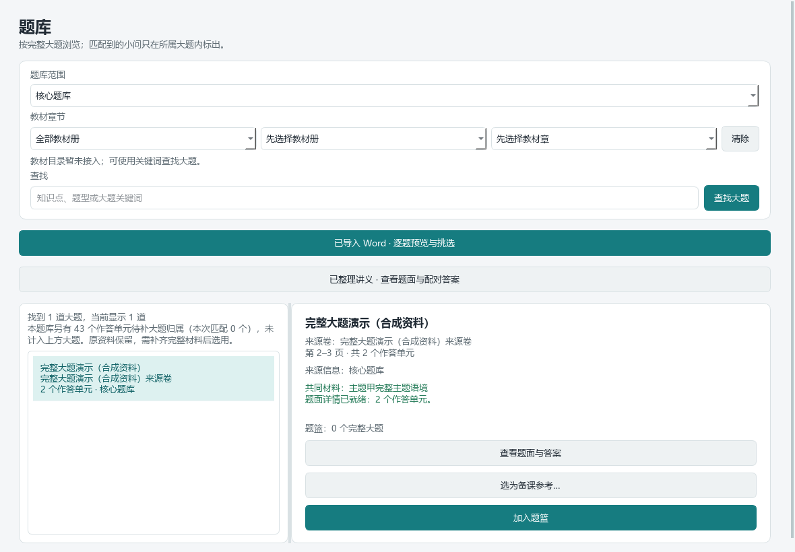

新候选包由桌面读取器显式启用，搜索、详情和组卷复用同一来源范围；旧HTTP接口的10产品/224条投影保持不变。原文件、题图和个人状态不随代码上传。

0.1.55源码已返工上述来源中5张题面图：松江主题二第8题及上中东校主题五《有机合成药物》第1—4题。修订从完整原页重新裁取，恢复切断的字形、去除下一题边缘，保留原有结构式和作答线；5张新图已逐张对照原页查看。原页、旧裁片和归档哈希不覆盖，展示图另有裁框、SHA及“裁图已修订”提示。修订改变后，旧题篮引用或已确认预览不能沿用，须刷新并重新确认。

0.1.56源码继续补齐松江主题二的两处共同材料：从已绑定原页保留完整文字条件和装置，不再只显示局部装置图；重复包含小题的两张全页图仍在归档中，但不再重复作为课堂共享材料展示。当前松江主题二展示3项共享材料，上中东校主题五展示1项完整合成路线。首次实际导出发现的松江第4题原卷页脚、第5题页眉横线已另行裁除，并经再次导出的实际页面核对。当前累计为7处题面修订加2处共同材料修订，共9处；其中5处是0.1.55保留项，本轮新增4处，不覆盖原图或重复计数。

这两个主题共14个作答单元的共同材料及前题依赖，已按完整源页记录为可追溯的候选判断；例如松江第7题须保留第6题给定操作，第9题承接第8题计算结果，选取时须同时保留第8题。上中东校主题四的6个单元仍保持依赖未知，不能据此宣称可单独选取。原档案、来源答案、人工审核和官方属性均不升级。

重新预览后，共同材料按明确关联的小题放到首次使用位置；旧记录没有成员关系时仍保留主题开头展示，不猜归属，非法或不匹配的绑定会拒绝。材料标签与图不再组成连续的共享表格；显示标题按源卷主题顺序去除重复编号，保留来源题号与教师评分对应，原来源绑定不改。0.1.56发现的答案结构图缺失已在0.1.57补齐两处；学生末页仅第5题、教师末页题答留白较多仍需优化，不是全库整改或最终课堂成品验收。

### 逐题查看答案原图与教师版结构图

在“题库 → 核心题库 → 上中东校对应完整大题 → 答案与分析”中，每题可点击 **“查看非官方答案原图”**，再点击图片放大；可随时收起。打开题面不会加载答案图。当前明确接通该来源主题四、五的11个作答单元，不代表全库答案图都已接通；来源答案与AI补充解答仍分开。

主题五第3题的反应方程式、第5题的完整合成路线属于不可由文字摘要替代的答案图，组卷后会嵌入教师版。其余9张供逐题核对，不重复贴入教师答案正文。原题已有的结构、答题线不重画；学生版不包含这些答案图，教师评分保留本次练习分值。必需图缺失、跨题或来源不匹配时，导出明确报错，不悄悄变成不完整的纯文字答案。更新前的相关题篮或确认预览需刷新后重新核对。

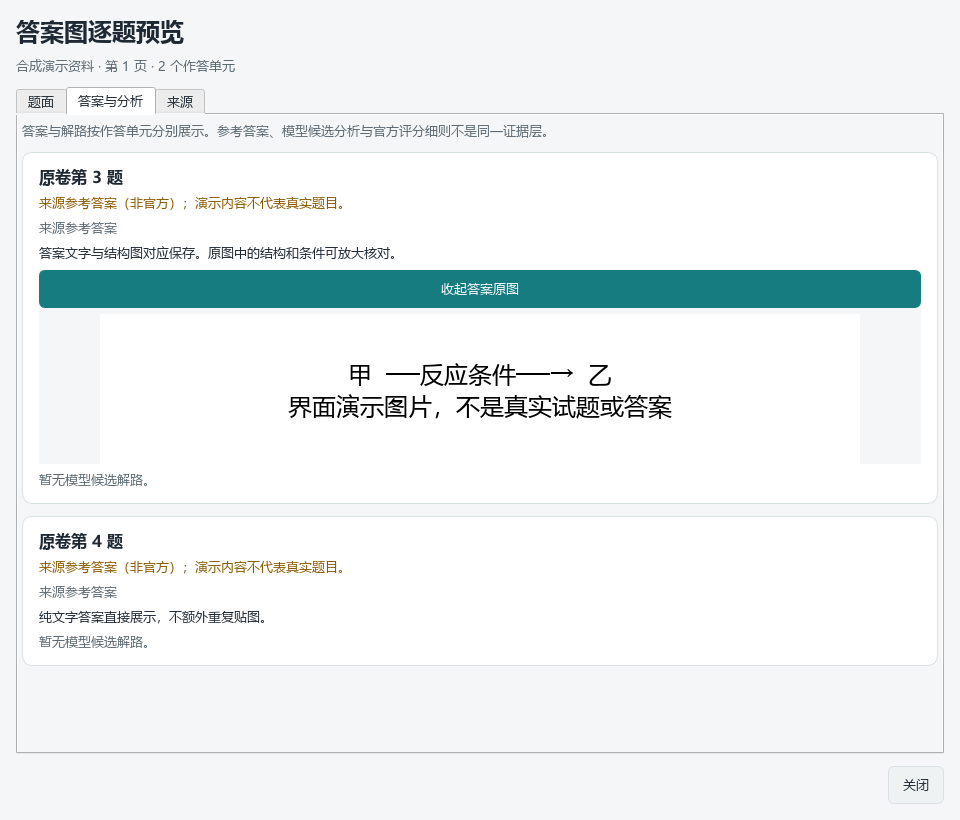

## 98份现成教案与讲练资料

本机已导入“上好课2026上海化学一轮复习讲练测”的 **98份解析版DOCX**，没有重复导入学生版。完整原文件逐份校验SHA-256，正文与图片按原位置关联；知识索引只是辅助检索，原教案、例题和答案始终保留。

2026年9月10日本机核对结果：44,987个原生正文区块、约290万字符、814个表格、20,041处正文图片引用（12,279种不同图片字节）。11,366处栅格图片引用通过解码核对，0处解码失败；另89处EMF引用对应71种原图（8种传统EMF、63种EMF+），均经最终本地渲染路径检查，保留原图并另生成PNG预览。8,586处WMF引用仍需用原Word查看：实测部分旧字体会缺字或错位，不能把非空图片当成可靠公式。图片引用包含反复出现的符号、公式及插图，不能当作独立题图数量；图片可显示也不表示每页化学内容已审校。

操作入口：**导入资料 → 已导入Word → 查看Word内容**。可选择来源、点击“查看整份教案”阅读全部原生正文，选择图片并放大，或点击“用Word打开完整原文件”查看原版排版及旧式公式。查看整份教案不受备课参考20,000字上限影响；追加备课时仍需选择合适范围，超限明确提醒，不暗中删节。新导入文件先逐份预览，再勾选整份来源确认导入；没有确认不会保存。

0.1.55只读核对确认98份归档原件现存、98份预览缓存均与当前提取版本和来源标识对应，没有重复导入；0.1.56继续以这98份完整Word为主来源。完整归档不等于所有对象已在软件中保真显示：旧式嵌入对象、特殊字体、部分正文容器及数学公式仍有局部提取提示，原件始终保留。WMF预览尚未开放，不支持的图片继续明确引导回原Word，不把丢字图当作已完成。

2026年9月10日本轮再次逐份重验：98/98原件SHA与98/98当前预览缓存校验通过，原件合计230,980,980字节，输入前后摘要未变。另对PKG-076《第09讲 化学反应与能量变化》重新原生提取，597正文区块（含20表）与缓存完整对象一致；107处PNG/JPEG引用可解码，191处WMF及205处旧对象占位仍保留缺口。没有重导入，没有把文件校验或可解码提升为全篇视觉识别完成。

2026年9月12日又确认98份归档DOCX与98份预览缓存现存，没有重复导入。PKG-076源件与归档字节相同，重新内存抽取的597区块、39,589字符与现存预览整个对象一致。该样本XML有317次图片出现，图片目录按区块及关系去重为298项，图文交接恢复317次位置，不把两种口径差值误判为丢图。WMF与205处旧对象占位等限制保留。0.1.59及此前默认窗口先定位首个区块；0.1.60已改为默认通读全文，但没有改动上述缓存、抽取版本或既有题目标签。软件结构化阅读不等同Word原版分页，原排版请用原文件入口。这次未启动真实EXE，不把实体文件和代码链验证写成全部界面交互验收。

同日对完整98份完成只读源件与缓存复核：98/98原始Word和归档SHA一致，98/98当前版本缓存可读取，原教案查找器实际列出98项，其中46项带知识导航，0条索引警告。合计44,987区块、2,900,181字符、814个表格、20,041图片引用；301个受检原件、缓存、批次载体及知识索引前后SHA不变，没有重新导入。代表教案PKG-076的597个区块完整读取、20张表均可投影，选定范围4张PNG按原字节提取并目视，其中3张是栏目标题图、1张是知识关系图，不算4道题或4张实验图。每份均含旧式WMF，合计8,586处，这部分仍需原Word查看。整份阅读与备课发送分开：前者不限制全文长度，后者目前最多12张不同图片、20,000字，超限不暗中删图删文。98份完整归档和正文可读不等于所有公式已在软件内保真呈现。

0.1.57另对一份教案中的5处对象引用、3个不同嵌入公式做只读研究：可从原生公式记录中保留字符、上下标及箭头条件关系，但这只是局部语义恢复验证，不是原图保真预览，也未接入产品。8,586处WMF引用的既有限制不变，没有重新执行全98份导入或虚增完成数。

2026年9月12日0.1.62重新核对98份来源与缓存后，逐题索引为 **3,573条**：恢复此前漏切的芬顿题，前题与新题的文字、原图、原答分别归位；另外3处无标签答案、缺括号标签及自含引用已按原文记录具体分界确认。全部定位到原答或解析段，不等于各小问已答全。重新从真实工作台读取后，3,570条可选/可导出；另3条仍因既有原解析问题或局部缺答保留源质量限制，与已修复的3处边界歧义不是同一组。

本机仅更新4条已有自动属性并新增1条，其他属性、教师修改、历史、原件和缓存保持不变。写前预演发现芬顿题被讲义章节误导为有机结构，核对题目与机理图后改为速率/机理主类、氧化还原辅类；电负性补原子结构与元素性质类，广义水解保留具体名称但不强挂盐类水解。这是特定来源的自动建议校正，不是通用标注算法已经完善。当前3,573条均有属性、0条过期绑定提醒；2,360条有主知识目录节点，1,213条目录归属仍待确认，755条有教材节候选；原考试类型839条有线索、2,734条待确认。教材节、考试与年级的未知不补猜，自动建议不作教师确认。

2026年9月10日的历史逐题快照为3,572条候选，其中25条按完整主题保留公共材料。原105条未定位答案项已逐条查明：101条为知识/方法编号误检，其余4条为范围或特殊答案标记问题；另恢复此前漏识别的真题。当时新旧key对比292条新增、106条移除、483条范围/状态变化，新增项均核对题干与原答衔接。3,572条均定位到原答或解析区块，其中1条无明确答案标记、连同其他边界问题共4条留待核对；当前增量以本节的新复核记录为准。这不表示每个小问都已答全。另对PKG-086原缺两问单列AI补充解答和非官方评分建议，未回写原答案。

同一历史批次更新了3,572条自动属性建议：2,358条有主知识点建议、1,214条待确认，755条有教材节候选；原考试类型838条有识别线索、2,734条待确认。适用年级与原题年级、资料包定位与原题出处分开；外省收录题不会因“上海专用”标题被改成上海原题。老师可以逐题修改标签并查看历史，自动结果不计作教师确认；保留的旧题目属性与修订历史不当作新增现行题目。

这些数目是本机数据快照，不是空仓库自带的题库，也不是全部题目已具备正式教学审核的声明。已发现的少量原解析问题单独记录并附AI修订建议，原文不覆盖；相关选题暂保留预览，不直接带入备课或导出。

## 可版本管理的知识索引

见[知识包说明](knowledge/README.md)：

- [教材知识索引](knowledge/textbook/knowledge.jsonl)：383条既有简明概念，覆盖五册、19章、60个编号节；本轮重整为可读索引，没有冒称重新逐页复核五册教材。
- [教案知识索引与覆盖表](knowledge/lectures/coverage.json)：46份复习讲义的262条知识、48条方法及56条易错/待核提醒，每项带原文件SHA和区块位置。另52份练习或检测文件的完整图文已在本机资料中，不另把它们伪装成46讲之外的新教案摘要。
- 索引都是辅助材料，不是教材原句、官方答案或教师确认；有图形条件的内容仍应查看完整原件。原教材/Word/PPT/图片不随这些JSONL上传。

## 智慧教育平台课件参照

截至2026年9月12日本轮，已从对应课程包进入实际课件：沪科技版高二《系统的内能》20页、《电离平衡常数》第一课时15页、第二课时12页，以及新增《核外电子排布的表示方法》29页，共3个知识点课程包、4份课件预览、76页逐页静态视觉阅读。配套6份附件20页正文文本阅读另计。原PPT/PPTX下载数仍为0，不把截图、在线演示或制作规范PDF算作下载的课程课件。

最新现场核查为2026年9月12日20:14：已进入[《核外电子排布的表示方法》课程包](https://basic.smartedu.cn/qualityCourse?courseId=18aa1947-8aac-2411-0633-726953abb358&classHourId=lesson_1)，核对29页课件预览，依次打开教学设计3页、学习任务单2页、课后练习4页；正文已加载，练习末页可见参考答案，不止核对入口名称。公开页面仍未见原PPT下载项；教学设计打开后核对250项当前已观察页面资源，也未见PPT/PPTX/ZIP线索。未下载这些资源，不判断登录后权限或全部文件。本次是附件加载和页数复核，没有重新逐页审查全部图形，新增原件下载0、不重复累加已读页数。

核外电子课例的29页静态课件和同包9页附件正文已分别计数。课件第24页提供必修一教材P129定位线索，第23、25、26页可供比较结构示意图与其他表示；教材原页尚未独立核对。动画、视频、附件图形和真实课堂效果未全部验收，公开预览不等于原PPT下载或再分发授权。

已有[来源与页码清单](knowledge/courseware/smartedu/first-batch-preview-catalog.json)及4份教学设计卡。新增[核外电子排布设计卡](knowledge/courseware/smartedu/electron-configuration-design-card.md)提炼同一对象的表示互译、独立练习与笔记比较表，并保留既有实验回扣、数据发现与对照论证参照。新增课题建议已纳入0.1.61本机包，教师可以修改或删除；只接入改述的设计建议，不自动导入平台题图，不把包内代码更新计作新增平台课件下载或阅读。

使用方法：在“备课”填写当前课题、课型及课时，点击 **“按当前课题与课型填入建议结构”**。课题明确包含“系统的内能／系统内能”“电离平衡”或新增的“核外电子排布／电子排布式／轨道表示式”等时，建议结构会附相应课例的教学组织、来源和适用限制；仅写“原子”或“电子”等宽泛词不会强加新课例。其余课题仍提供所选课型的一般建议。匹配只依据明确词面，不调用模型。教师可以直接删改；已有自写内容时，替换须另行确认且默认“不替换”，切换课题或课型不会自动覆盖文字。

下图为真实桌面中的可编辑建议文字，使用合成演示表单，不含原课件图片或原教案：

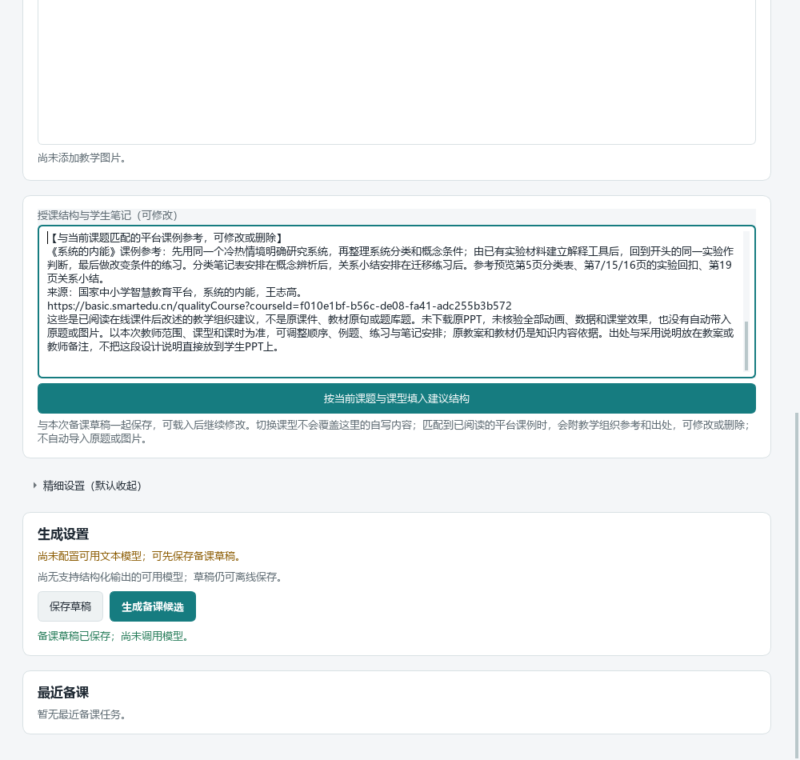

该文本通过现有 `advanced.template_and_delivery` 字段随草稿保存，并原样进入后续生成所用的教师简报；已用真实按钮、可编辑控件及隔离草稿存取核对这条链路，不是仅增加一份静态说明。平台课例只参考教学组织，98份原Word及本次教材仍是知识内容主来源；原题和图片不会自动带入。电离平衡课例明确排除原课件的不安全生活混配示例，若本课不讲平衡常数，应删除相应段落。未下载原PPT，未核验全部动画、数据与课堂效果，出处与采用说明应放在教案或教师备注，不直接堆到学生PPT。只提交改述设计摘要与来源信息，不上传平台页面图像。

## Word 逐题预览与选题

1. 打开“导入资料”，选择 DOCX 讲义并保存到本机。文字、表格、上下标和可解析公式优先读取原文；不需要为了预览纯文字题而调用模型。
2. 在导入窗口的“已导入 Word”处点击“逐题预览与挑选”。以后也可直接从“题库 → 已导入 Word · 逐题预览与挑选”重新打开。
3. 左侧按来源、知识点（含辅助知识点）、适用年级和原考试类型组合筛选，也可搜索题面、题号和章节。点选一题后，右侧“题面”显示原文与可支持的内嵌图片；“答案与解析”单独显示答案。可用“上一题／下一题”连续核对。已建立列表后，单题看原文/看图只重验所选来源；本机实测全98份列表约9.61秒，单题原文0.047秒、图片0.093秒，非所有电脑性能保证。
4. 勾选需要的题目，切换来源和搜索不会丢失勾选。选题会保存在本机，重新打开可继续使用。每题的“本次练习分值”可修改，默认2分，不代表原卷配分。
5. 识别范围不准时点击“调整本题范围”，查看整份原文区块并调整题面、答案、共同材料的起止位置。先点“查看本次范围预览”才能保存；改动后旧预览及确认清除。原图另在逐题预览或原Word核对，未勾选的歧义提醒保留。修改不覆盖原Word；旧选题预览失效后需重新确认。
6. 用于教案或PPT：默认同时带入原图，先点“预览选题”，核对文字、图片数量和缺口后点“确认带入备课”。成功后一起追加文字与图片，不清空已填课题、课时、要求和原有图片。PNG、JPEG、WebP 原图按内容去重，合并后最多12张；超过上限或含不支持的图时整批不追加，不截取前几张。需要纯文字参考时，主动取消“同时带入原图”并重新预览确认，缺图提醒会保留。
7. 用于纸面练习：输入练习名称，点“导出练习”，再打开学生版或教师版。支持的原生表格、上下标、OMML和内嵌图片随题保留；学生版不带答案、默认不额外增加分数或横线，需要分数时勾选“题面显示分数”；教师版每题始终显示所设分值。原题自带的分数和作答空间不涂改。

### 逐题浏览页面

下面是实际桌面窗口，内容为演示题，不是用户上传的教材或讲义。

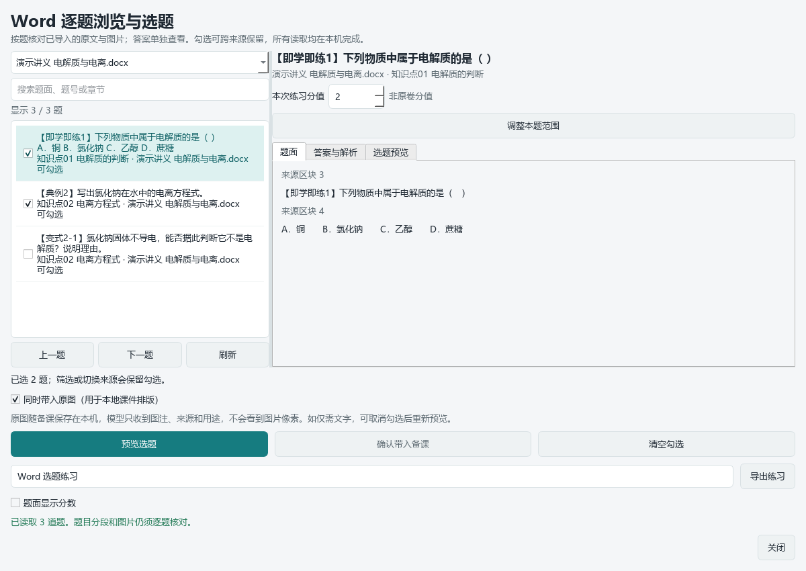

### 答案单独查看

题面与答案使用不同标签页，防止看题时提前出现答案。

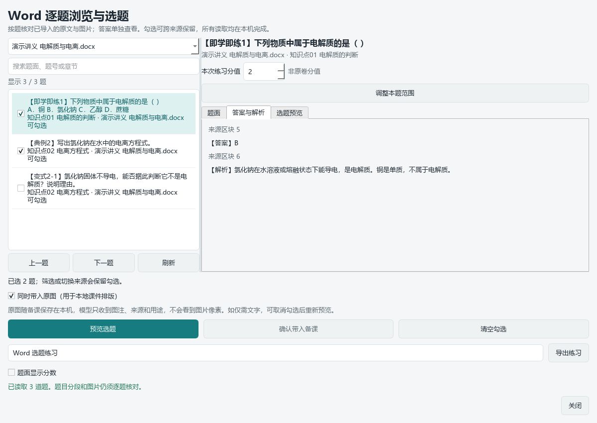

### 带图备课的实际含义

图片会保存在本机备课素材库，保存草稿后可继续使用。逐题选材按题号和原文区块列明图片属于题面、共同材料还是答案；整段原教案不自动猜每幅图的题答角色，保留区块用途并提醒避免提前展示解析。重复图片按内容去重存储，仍保留各处对应关系。实际生成后需查看页面，确认没有提前展示答案。

0.1.58新增“图片用法”，由教师明确选择：

- **仅用于课件排版**：发送备课文字、图注、来源和用途，不发送图片像素。旧草稿缺少图片模式时仍按此处理，图中尚未转写的条件需要教师补充。
- **同时交给 AI 读图**：除文字说明外，按所选顺序发送原图；包含图内全部可见内容及文件自带元数据，请勿选入未经授权的个人信息。软件不把整个资料库自动上传。零张图片时实际发送仍为零，不虚称模型已经看图。

生成前显示接收模型及地址、原图数量、图名和费用提示。模型未声明视觉能力，或未允许这类图片发送时，会提醒换配置或主动切换为仅排版，不静默退回文字。文本连接测试不验证视觉质量；模型目录或教师声明也不是图像识读正确性的保证。

历史任务继续或重试时，确认清单来自原任务冻结的图片与模型，不读取当前表单后来选择的图片；已有冻结候选只继续本地导出，不调用模型。草稿保留所选模式。原图缺失、SHA或尺寸变化、模型配置变化都不会静默忽略。字节只在调用内存中传递，任务与提示词不保存base64或本地路径。

本版用合成图片核对了 Responses 与 Chat Completions 的实际请求体，解码后的图片逐张保持原字节与顺序。最多12张、单张10MB的既有素材限制不变，多模态请求另有48MiB总大小上限；超限明确失败，不截断图片。视觉输出预算最多32000 token，具体服务商限制仍需核实。软件接通发送不等于真实模型已能正确识别所有有机结构、装置连接或教材原句；输出须按原图复核。

下图将真实图片控件与发送确认并排展示，内容为合成界面演示，不是原教案、平台课件或模型生成效果：

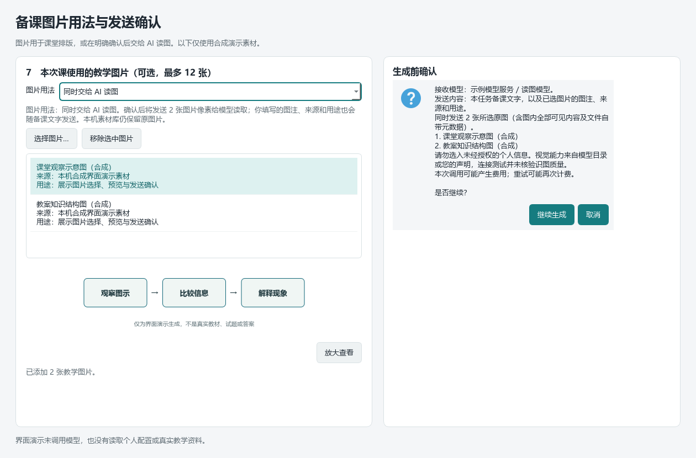

自动识别覆盖“即学即练、例、典例、同步练习、变式”等明确题号，以及有练习依据的数字题号；知识点编号不会直接当作题号。真实讲义仍需逐题核对，来源变化会取消旧勾选。题答挤在同一段、缺少必要公共材料或含暂不支持的对象时，软件会提醒修订，不能保证任意格式都能自动拆好。旧公式若保留的是原文件自带静态图，导出会明确提示其不再具有OLE编辑能力。

### 修改教学标签与保存前预览（0.1.52）

点“修改教学标签”选择主辅知识点、适用年级、教材节和原考试类型，填写备注，再点“预览变更”。只有确认保存才更新个人属性，取消不写入。原自动建议及历次教师修订保留；修改备注不会把未改的原题出处标成教师确认。重新分题后旧教师标签不自动套用到新范围，需要对照新范围再次确认，旧历史不删除。

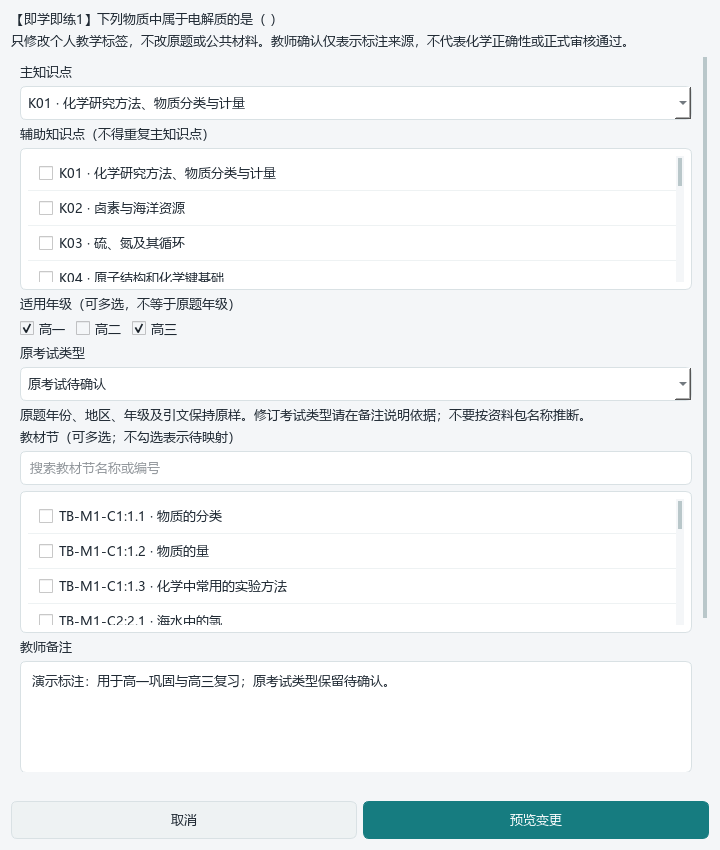

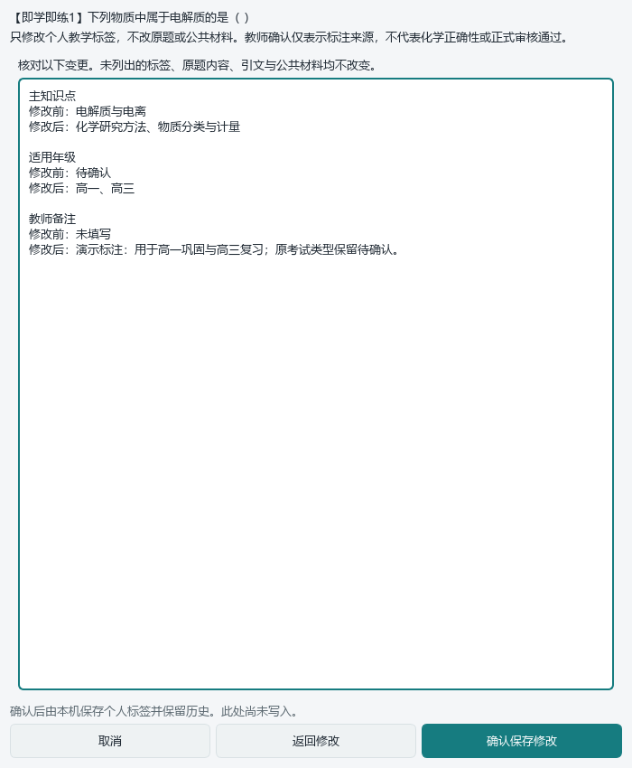

EMF转换只为本地图像显示，不是公式识别或化学审定。跨Python进程少量EMF+可能出现极少数字体边缘像素差异；原图SHA保持不变，派生预览保存实际SHA，旧参考因派生变化被拒绝时应刷新预览，不放宽来源检查。

### 在备课页直接找原教案与例题（0.1.53）

1. 填写课题，在备课页点“查找已导入的原教案”。按名称、知识线索、方法或易错点搜索；点击结果可查看索引和原文区块号，再打开完整原文与图片。46份知识索引只用于查找，不自动复制摘要到课件；无索引的原文件仍能打开。
2. 在原教案窗口选定本次要用的区块，默认“同时带入原图”。预览将带入的完整内容并确认后，文字、表格提取及支持的原图一起追加；原表单和已有图片保留。最多12张不同图片、20,000字，超出不截断；旧格式图或已知原文错误会具体列明。仅文字必须由教师明确选择，不悄悄降级。
3. 点“按本课知识点选题”，查看当前标签与课题的明确词面匹配建议，再决定是否应用筛选。原有年级、考试类型筛选和跨来源勾选仍保留；完整主题不拆小问，题面和答案分开预览，确认后追加本次备课。

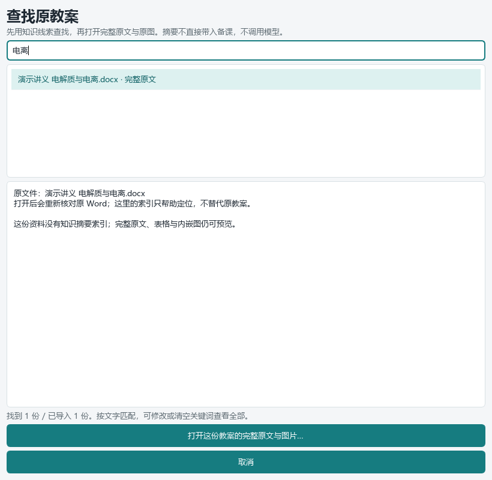

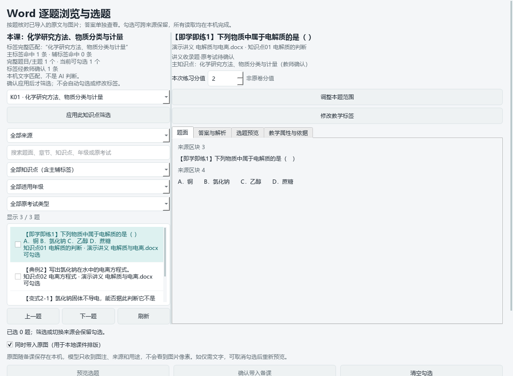

这是离线、可解释的选材导航，不是模型判断每道题适合本课，更不是自动入选。标签修改后重新计算建议，未标知识点的题不会被猜着推荐，仍可清空筛选查看。索引缺失不会使原教案消失；打开原文件、确认图文时仍核对实际字节和提取版本。图片附入本地排版不等于多模态识别已经完成。

## 其他页面的实际操作范围

| 教师任务 | 页面与操作 | 当前边界 |
| --- | --- | --- |
| 查找已有试题 | 题库中选择来源范围、教材章节和关键词，打开完整大题题面及答案 | 以本地已有题库为准，不宣称全库标签已齐全 |
| 按大题组卷 | 把题目加入题篮，在组卷中设定配分、作答区域和分数显示，预览后导出 | 保留主题及公共材料；Word逐题练习目前使用独立导出入口 |
| 使用已经整理的讲义 | 题库中进入“已整理讲义 · 查看题面与配对答案” | 与本次新导入Word入口分开，旧汇总条目不再假装具体选题加入题篮 |
| 编写教案与PPT | 备课中填写课题、授课对象、两课时安排和参考资料，生成后调整知识页、例题与教师提示 | 依赖老师配置的模型；课堂逻辑、教材原句和化学结论仍需核对 |
| 材料驱动命题 | 提供材料并生成、修改、审校命题蓝图 | 蓝图不等于已经生成完备试卷与装置图 |
| 配置AI | 设置中填写兼容接口与模型，测试能力后再使用 | 文本测试成功不等于能看图；不支持多模态时应按具体任务提醒 |
| 学生学习跟踪与推荐练习 | 原生学生页记录教师评分、诊断和章节，明确点击推荐，先看完整题目再加入题篮 | 已纳入0.1.61本机包；不自动写长期学情，跨作业趋势与复练反馈尚在开发 |

后续版本更新应同步维护这里的操作说明和相关页面截图。截图只能使用演示资料，不能出现真实学生信息、上传讲义、模型设置或密钥。

## 本地开发

使用 Windows 和 Python 3.12，建立独立环境后安装：

```powershell
python -m venv .venv-desktop
.\.venv-desktop\Scripts\python.exe -m pip install -r requirements-dev.txt
```

本软件当前读取已有的本地资料库。开发机需要在工作区配置 `sh-chem-db`，或通过 `SHCHEM_WORKSPACE_ROOT` 指向同时包含该目录和 `integrations/deeptutor_shchem_v1` 的本地工作区。空仓库克隆不包含教学资料，也不等于已经具备完整可运行题库。不要用虚构的题库或来源元数据填补缺失资料。

```powershell
.\.venv-desktop\Scripts\python.exe runtime/deeptutor_shchem/desktop_teacher_workbench.pyw
```

题库读取、正式生成等部分能力还依赖本机安装的项目控制器及其受控资料。需要外部模型的功能由用户在软件中单独配置；请勿将密钥写入代码或提交历史。

## 检查与构建

### 0.1.62 本机包

构建标识为`0.1.62-20260912-r1`，包目录及ZIP名为`desktop_package_0.1.62`。85个必需模块检查通过，84个产品模块的递归代码对象与源码一致，268个全新解压文件的大小与SHA一致。另执行冻结纯索引合成检查：特殊前缀分题、原图归属、三项窄范围确认及防答案泄漏；范围UI检查是静态代码与文案检查，不是新EXE真实交互。

ZIP为64,335,317字节，SHA-256为`4a99c1afb009dc3905aff6eb1b6a56151c7a9ed8eb3af20bbbdeb853bbea151e`；EXE SHA-256为`d6289658073d84af76bf271d7c6346d934040072c2ba574d1dd3c9b73725e069`。根启动器优先0.1.62，旧0.1.61及此前回退保留，未删除原资料、旧软件或过程证据。本机包不上传GitHub、不包含98份原教案；仍需要已有的本地资料库。

本轮未启动真实EXE、调用模型或制作新的Word分页成品；包内一致性、离屏控件检查、化学审校和课堂使用分别记录。

338个不同的相关用例分组通过：索引及来源范围服务96项、最终Word界面90项、导出与属性72项、局部写回28项、冻结检查器40项、启动入口与原生架构12项。早期分组及重复执行不累加；Ruff、差异检查和提交前文件类型/密钥位置扫描通过。这不是全仓库或真实课堂验收。

### 0.1.61 历史本机包

构建标识为`0.1.61-20260912-r1`，包目录及ZIP名为`desktop_package_0.1.61`。检查85个必需模块，其中84个产品模块的递归代码对象与当前源码一致，包含Word原表显示、StudentPage推荐链、ZnS读取器和v5核外电子排布课例规则。268个全新解压文件的大小与SHA逐一一致；检查还保留原生PDF依赖、禁用旧网页服务与外部ICU等边界。

构建入口、冻结检查器、原生界面架构及完整Word阅读器联合62项测试通过，无跳过；Ruff与差异检查通过。同步修订两处过时的静态合同：本地Qt富文本不是网页引擎，98份解析版走逐份预览、明确选择后提交的现有入口，不再要求旧196份直接批量导入。保留取消、输入变更与空选择不得提交，以及外链/文件资源不得自动打开的检查；这62项不是全仓库测试。

ZIP为64,327,365字节，SHA-256为`fc826a3cd87a17c612425a1975ac373d071a4d9a659ffcc9494fd76eb77854ab`；EXE SHA-256为`ac4d6340d152c1561959c90471d9a8ce2d6d714936f1e32573ce90c21dc1f99e`。根启动器优先选择0.1.61并保留0.1.60-r2等历史回退。构建脚本拒绝已有输出路径，使用新的构建标签及独立PyInstaller缓存，未删除旧软件、来源文件或过程资料。

包内静态检查与合成纯函数执行使用检查器环境，并非冻结程序实际运行。本轮没有启动EXE、测试真实桌面交互或调用模型；离屏原生控件截图也不替代这些验证。包只含程序，仍需本机已有资料库，不是附送98份教案的公共分发包；源码与合成截图可版本管理，包、原Word、题图及私人状态留本机。

### 0.1.60 历史核验

完整阅读、选段与备课联动共110项通过；原生文本、图文引用和冻结检查回归另92项通过。26项控件和29项集成已包含在110项内，重复执行不叠加，不宣称全仓库通过。

真实Qt离屏核对使用合成教案和只读PKG-076：597区块、39,589字符可读至末尾；明确选取的章节图片及白磷/能量曲线原图与来源字节、区块关系一致。最终三组14张界面截图覆盖900像素与420像素窗口、选段及末尾，水平滚动范围均为0；主代理复看关键图，子代理逐张查看。发现的中英文混排行宽取整边界已增加绘制余量，短文滚动条出现/消失亦有回归。原DOCX前后SHA不变；这不是98份教案逐页保真或化学审校完成，旧公式与表格原版布局限制仍在。

最终本机构建`0.1.60-20260912-r3`，试用包目录及ZIP名为`desktop_package_0.1.60-r2`：77个必需模块检查通过，76个产品模块的递归代码对象与源码一致，包含新增原教案阅读器及导入窗口；ZIP全新解压后的269个文件逐个大小与SHA一致。根启动器3项静态测试通过，优先使用该修订包并保留0.1.59等旧版回退。只核对构建和包内代码，没有启动独立EXE，不把离屏Qt观察写成真实EXE交互验收。

ZIP为64,250,693字节，SHA-256为`8ab197a3cc447c4b6d7b6390aaf3fa5a4ebc6ff06882cd538749ea38cba48959`；EXE SHA-256为`015e4061ff5aa4a7c43dddb69dbdc98f8888af812a416fad686a1a8edf86d393`。包及真实Word观察图只保留本机，公开界面截图采用合成资料。原Word、教材、试卷、平台课件与个人配置不上传；旧构建与失败QA保留，本轮未清理。

### 0.1.59 历史核验

本机构建`0.1.59-20260912-r2`：76个必需模块检查通过，75个产品模块的递归代码对象与源码一致；ZIP全新解压后的269个文件逐个大小与SHA一致。根启动器3项静态测试通过，优先使用0.1.59并保留0.1.58及旧版回退。未启动独立EXE或验证其真实界面交互，不借用前版启动计时。

裁图36项、读取器25项、福辛普利原生接线9项、所选来源标题/顺序11项专项通过；主题工作台、别名导出及冻结检查回归52项通过。各组分别核算，不叠加重复执行或内含子集，不声称全仓库测试通过。实际学生/教师导出的页面观察与化学审核边界见本页福辛普利章节。

ZIP为64,233,023字节，SHA-256为`549177d8f18d09841fa116cb630742e163a7a6aea3ed8b3eb0285cc803bdb724`；EXE SHA-256为`878df98dd4072af5ced458705a96ed4ce363114e7a27d004218139cc6341aec2`。包只留本机，不包含或上传原Word、教材、试卷、平台课件及个人配置；原资料与旧包未删除。

### 0.1.58 历史核验

备课、Word图文交接与页面回归共731项通过，保留3项警告；早期186项子集及修复后的重复执行不叠加。新模式、两种API字节绑定、无视觉声明拦截、取消、图片变化、草稿恢复、历史冻结范围及仅本地重试均有覆盖。模拟传输未连接真实模型；本轮没有新的完整教学课例或全部页面的课堂验收。

独立评审发现的费用提示遗漏、冷启动预检隐式恢复历史任务均已修复，后者有两项负测。四张真实Qt控件的合成状态图已实际查看：仅排版、发送两图、读图模式零图、历史本地继续；公开图不含原始教学资料。新增和修改的产品文件、专项测试与检查脚本完成定向Ruff和差异空白检查，不宣称全仓库检查通过。

本机构建`0.1.58-20260910-r1`已直接检查EXE归档：74个必需模块通过，其中73个产品模块的递归代码对象与当前源码相同；ZIP全新解压后269个文件逐个大小及SHA一致。检查器还用合成数据执行包内模式、权限、图片绑定、Manager转发与提示词函数；Provider主路由的静态检查不冒充真实网络调用。检查器自身24项测试与根启动器3项静态测试分开于前述731项记录。

ZIP为64,197,722字节，SHA-256为`3a682a8bd9923676e0753af0d5e286bda8b4b6a1e0b6c59ecb94a4f80946dd8d`；EXE SHA-256为`2740fd513837ad2a0a1ecc00f85171adc4330356dbe15fc6a836c207b4d18afe`。根入口优先0.1.58，保留0.1.57、0.1.56、0.1.54、0.1.53；本轮没有使用不可用的原生控制工具复核独立EXE启动与关闭，不沿用0.1.57启动计时作为本版证据。

### 0.1.57 历史核验

0.1.57的答案原图读取、教师专用路由与逐题懒加载已核对，真实Qt主视图及420像素窄窗使用合成资料检查；首次演示截图发现的中文缺字已修复，公开截图只使用修复后结果。本轮回归按范围分组记录，不把重复执行或内含子集相加，也不宣称全仓库测试通过：

| 核对范围 | 当前结果 |
| --- | --- |
| 答案导出、共享材料、渲染与评分回归 | 6个文件157项通过，含27项新增答案图专项；分页修复后27项复跑通过，不重复相加 |
| 答案来源、路由、过期绑定、逐题懒加载 | 19项通过；包含本地真实11题绑定，不是全库答案审校 |
| 上中东校原读取器回归 | 52项通过、0跳过 |
| 原生题库及备课图片回归 | 70项通过；7条既有Qt字体接口弃用警告 |
| 冻结包检查器 | 14项通过 |

157项首次组合测试证据保留在执行记录，其余本轮分组及27项复跑保留JUnit。新增改动作定向静态检查；旧模块已有问题不因此被称为全仓库Ruff通过。

本轮首次导出发现教师首页与正文分离及共同材料标题落单，已修订并再次生成。最终学生/教师DOCX/PDF共4文件，学生4页、教师5页；2张必需答案图仅进入教师版，9张既有修订展示图继续使用，旧展示图排除，74份绑定来源前后未改，模型调用0。9个不同页面已逐页实际查看，DOCX/PDF对应的9对页面PNG SHA一致；教师首页正常接正文、共同材料标题与图片同页，两张结构图完整。样本每题2分是本次练习设定，不冒充原卷分数或官方采分点。这不替代全库、化学答案或课堂效果验收。

前版0.1.56及更早的测试、下载观察和构建指标均保留在[更新记录](CHANGELOG.md)，不混入本版新增数量。来源字节一致不代表源裁片干净，也不替代化学答案、评分和课堂使用核对。

本机构建标识为`0.1.57-20260910-r1`：73个冻结模块检查通过，其中72个产品模块递归代码对象与当前源码一致；ZIP全新解压后的269个文件逐个核对大小与SHA。新解压包约6.19秒出现响应窗口、1.45秒正常关闭；根启动器另行验证实际运行0.1.57，约3.23秒启动、1.42秒正常关闭。两次均使用不同的隔离个人状态和最小系统PATH，退出码0、错误日志0，未调用真实模型。这是本机构建与启动核验，不是全部界面交互、干净新机或课堂质量验收，单次启动耗时不是性能保证。

本机ZIP为64,187,065字节，SHA-256为`53fe517965ba6b89c2fc949bf9a8cda03f0d39e915ee36316c4fe04f68635ccd`；EXE SHA-256为`8cab15f6acb2a102f4f269e55045141a17bd2e3139eece8c14a42add3cee9ec7`。构建包不进入Git；根启动器依次尝试0.1.57、0.1.56、0.1.54、0.1.53，旧版保留回退。

可独立运行的纯逻辑测试示例：

```powershell
.\.venv-desktop\Scripts\python.exe -m pytest staging/coordination/deeptutor_gateway/tests/test_supplemental_answers.py -q
```

真实题库集成测试需要本地资料，不能用纯逻辑测试通过来替代原图、化学答案或课堂使用核对。导出文档应查看实际分页，桌面包应另外检查启动和退出。

```powershell
powershell -ExecutionPolicy Bypass -File runtime/deeptutor_shchem/desktop_build.ps1 -Python .venv-desktop/Scripts/python.exe -BuildTag local-review
```

## 版本管理约定

在功能分支开发，检查通过后通过拉取请求合并。软件版本、更新说明、测试结果分开记录；保留来源原件，不批量改写或上传本地资料。

仓库未附开源许可证。第三方代码、教学资料与原始图片的授权不因该仓库存在而改变。
