# 沪上化学智研台

面向上海高中化学教师的 Windows 本地工作台，支持题库浏览、题篮组卷、教师版与学生版导出、教材与讲义关联、课堂课件编排及本地修订。

本仓库用于软件源代码、测试及用户授权的简明知识索引的版本管理。教材和教案原文件、公众号原图、试卷、学生资料、个人设置、模型密钥、构建包及过程截图保留在本机，不随代码上传。`knowledge/` 只保存改述的知识索引、来源摘要及覆盖说明，不提供整本教材或完整教案的公开复制。下方功能截图使用合成演示内容，不含用户资料或平台原图。

## 当前范围

- 原生桌面界面位于 `integrations/deeptutor_shchem_v1/desktop_workbench`，不依赖网页套壳运行。
- 题库读取保留原卷主题、小题与作答单元的对应关系，以及原图和来源绑定。
- 来源参考答案与 AI 补充解答分别存储、标注。补充答案不会改写原归档的“未附答案”状态，也不冒充官方评分标准。
- 组卷题面默认不添加分数，可通过“题面显示分数”选择开启；教师版评分答案始终保留每题及各小问分值。显示设置随草稿保存，修改后需要重新预览。
- 课堂备课支持两课时编排、知识页与例题页插入、教师提示及学习单。具体课堂效果仍需教师使用后反馈。

当前版本为 **0.1.78**：发送前直接查看实际图片；图片题可逐题核对、修改标签并叠加筛选。本机新视觉通道已完成首组9道题的识别、裁片修订及个人标签保存。原教案、明确关联的教材知识与题目标签共用备课参考；现成Word仍是主内容，不重写或重复导入98份资料。全库标记、全书与全专题深度蒸馏、图片题统一组卷和真实分页预览仍未全部完成。具体见[更新记录](CHANGELOG.md)及[教师工作台路线图](integrations/deeptutor_shchem_v1/TEACHER_WORKBENCH_ROADMAP.md)。

## 当前阶段：图片题逐题标签与首组真实入库（0.1.78）

**操作路径：资料库或导入资料 → 已识别图片题 · 逐题预览与挑选 → 编辑本题标签。** 当前题面、公共材料与答案图片能够读取后才能打开标签修改；先查看修改前后对照，再保存到个人库。支持主辅知识点、教材册/章/节、适用年级、原题年级、考试类型、年份、地区、学校、教学用途与备注。不同筛选组叠加，同组多选；年级、考试类型以中文显示。保存、取消、失败及刷新重试均保留窗口内尚未保存的其他选题。

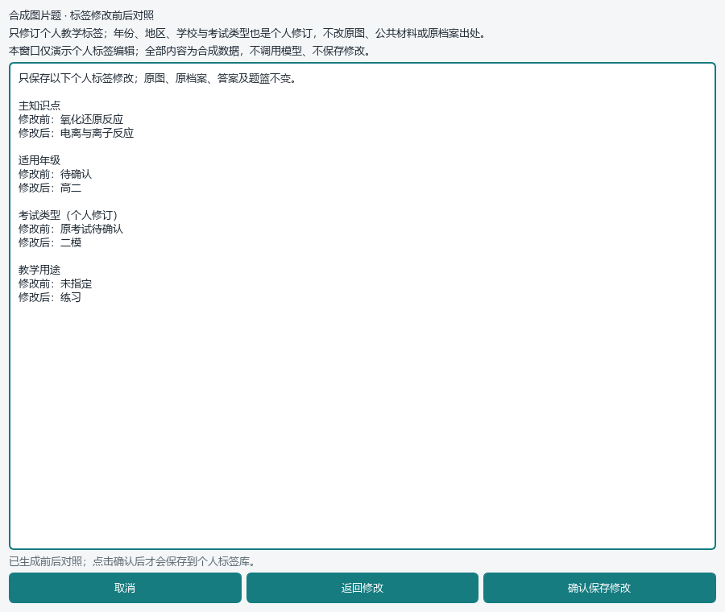

标签版本与题面识别版本分开，保存标签不会使当前选题失效；题面或来源后来变化时，旧标签留在历史中，不自动套到新题面。普通保存不等于教师确认，AI来源核对也不能冒充教师确认或覆盖老师已修订字段。只改个人标签，不修改原图、原答案、识别CAS或中央正式题库。

本机新视觉通道当前为 **1个完成批次、9道印刷小题、9个作答单元及9份来源参考答案**，来自松江2026“银镜反应”主题。实际新增2次原资料请求和1次小合成探测，均完成；没有自动重试。该主题此前失败请求及首次识别结果均保留。

- 对照完整原页逐张核对27张唯一题干、公共材料和答案裁片，修订35个证据范围，修复空白和串题裁片；纠正族号及溶度积指数识别，去除把已给反应误拆为作答单元的情况。
- 9题已保存主考点、对应教材节、高三与二模等个人标签；原卷显示“阶段模拟练习”，“二模”来自已归档公众号标签，学校没有依据仍未知。标签标记为AI来源核对，非教师审核。
- 9份来源答案保留逐题分值，合计20分；均为非官方参考资料，不称官方答案或评分细则。只选择第7题带入备课参考时，也保留完整主题9题、公共材料及27张图片，其中9张答案明确限定为教师参考；本次只验证本地预览，没有生成新课件或试卷。

本次未改变98份Word、3573道Word候选的标签或教材/教案蒸馏数量，也未完成其余公众号资料的裁剪导入。来源文件哈希、识别内容版本与个人选题在标签写入前后一致；27张裁片的模型视觉复核不能替代真人化学或教学验收。

12组相关联合回归209通过、1项仅面向另外分发包路径的启动器检查跳过；Ruff与差异检查通过。纯合成Qt标签界面已目视核对。新版独立包为`runtime/deeptutor_shchem/desktop_dist_0.1.78-visual-tags/沪上化学智研台/沪上化学智研台.exe`，6个改动模块的冻结代码与源码一致，EXE SHA-256：`01710f3b7ddf8de2858f0e8c3c06b9b6f2bd8a1645ec14fed9a42f35ac0c6abc`。尚未做真人原生EXE操作验收。

关闭旧窗口后，重新双击根目录“启动沪上化学智研台桌面版.vbs”，优先打开0.1.78；不用重复导入已有资料。旧版本、个人资料与过程文件本轮均保留。

## 前一阶段：发送确认统一看图（0.1.77）

**发送前必须看得到实际图片。** 题目导入和备课确认默认打开图片页；现在增加上一张、下一张、当前序号，支持缩略图双击放大。学生分析原先只有页数的确认窗口也已接入同一图库，分别显示题目、参考答案和匿名学生作答；两项隐私/费用确认保留，任一图片无法显示或发生变化均不允许确认发送。

学生图库使用同一次发送确认中的冻结页面、角色、顺序与哈希，不从之前的页面选择或文件名猜测。预览只读本机图片、不调用模型；确认时再次读取全部页面，原有任务修订、模型配置与出站校验继续生效。

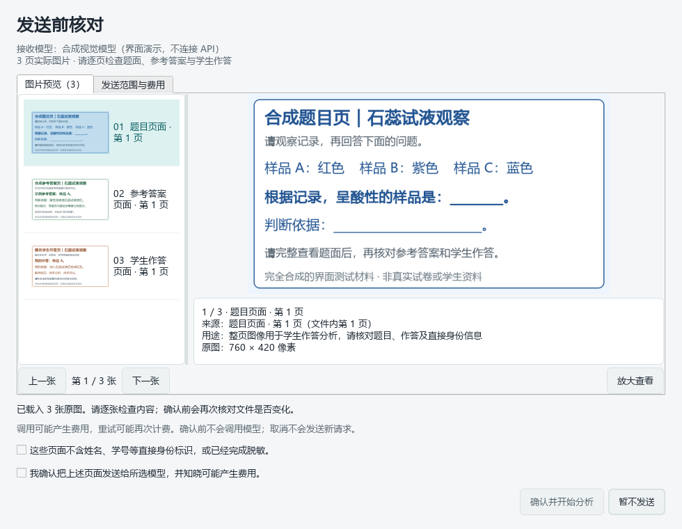

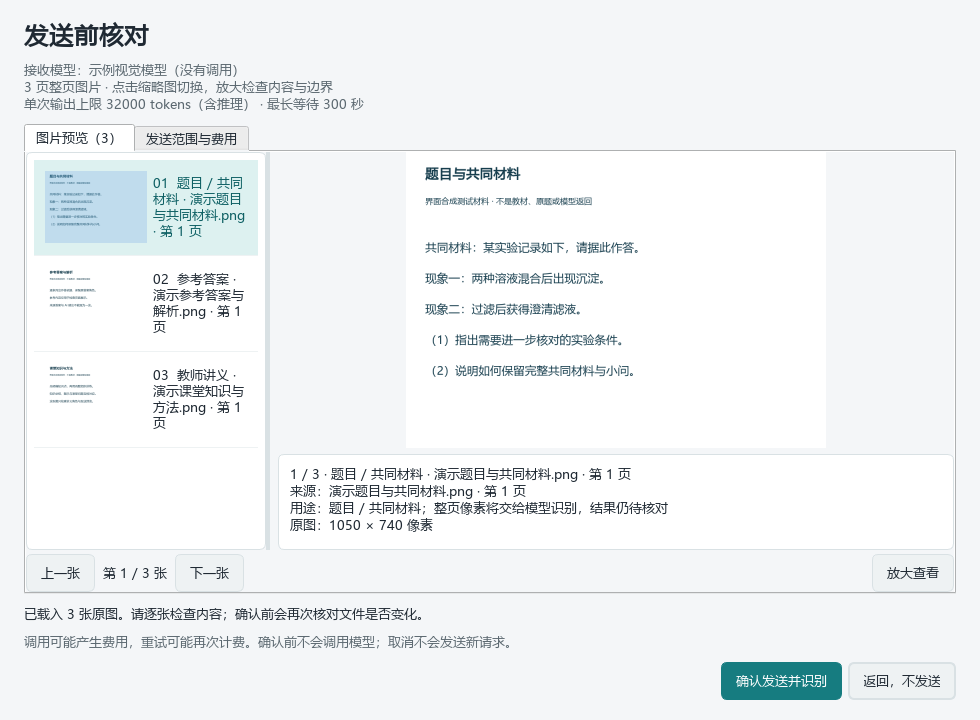

个人图片题的教材筛选修复为同一条“册→章→节”路径匹配：同组可多选、不同组叠加，不会拿第一册的册名和第二册的章节拼成命中。无明确教材依据的记录保留未标注，不猜测。

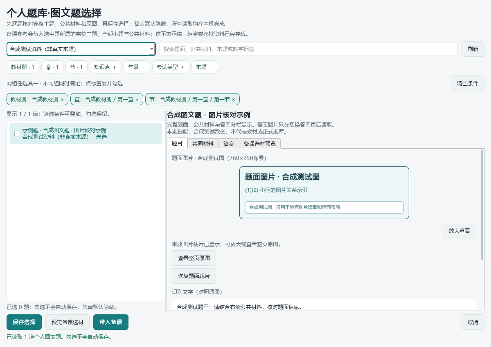

视觉导入诊断继续发现角色混入及独立图片页号错误；请求约束新增角色空数组和完整来源/角色/文件内页号/哈希组合，保留本地校验，不改写模型返回。0.1.76之后实际增加5次原资料请求及1次小合成探测，其中1次被额外QA观察器中断，观察器已修复；无自动重试。最新页面组合约束仅通过合成回归，尚未再次真实调用验证。**新增图片题仍为0，98份Word及3573道候选的标签、教材/教案蒸馏数量本阶段未变**；不能将界面、接口返回或打包通过称为题库质量完成。

相关联合回归347通过、1项未分发独立包检查跳过；有1项既有Qt字体弃用警告。合成Qt界面检查不代表真人EXE操作或教学验收。旧来源、个人状态和旧构建保留，不清理、不公开。

新版独立包：`runtime/deeptutor_shchem/desktop_dist_0.1.77-import-roles/沪上化学智研台/沪上化学智研台.exe`，9个改动模块的冻结代码与源码一致，EXE SHA-256：`4f4de475b3918380cd7e1aa6c1ff75cf72e3aca28f0fd2c8660dd6414c2e0b73`。关闭旧窗口，重新双击根目录的“启动沪上化学智研台桌面版.vbs”，优先打开0.1.77；已有资料不需要重新导入。

## 前一阶段：看清图片再发送，失败可恢复（0.1.76）

**操作路径：导入资料 → 第二步 → 预览发送页面，再识别。** 确认窗口默认展示第一张实际图片；左侧逐页切换题目、共同材料、答案及讲义，右侧查看并放大，不以文件名或图片数量代替内容。缺图、加载失败、像素或来源变化均阻止发送；公开调用入口也不能省略预览标识跳过核对。确认后复用相同冻结像素，返回不发送。

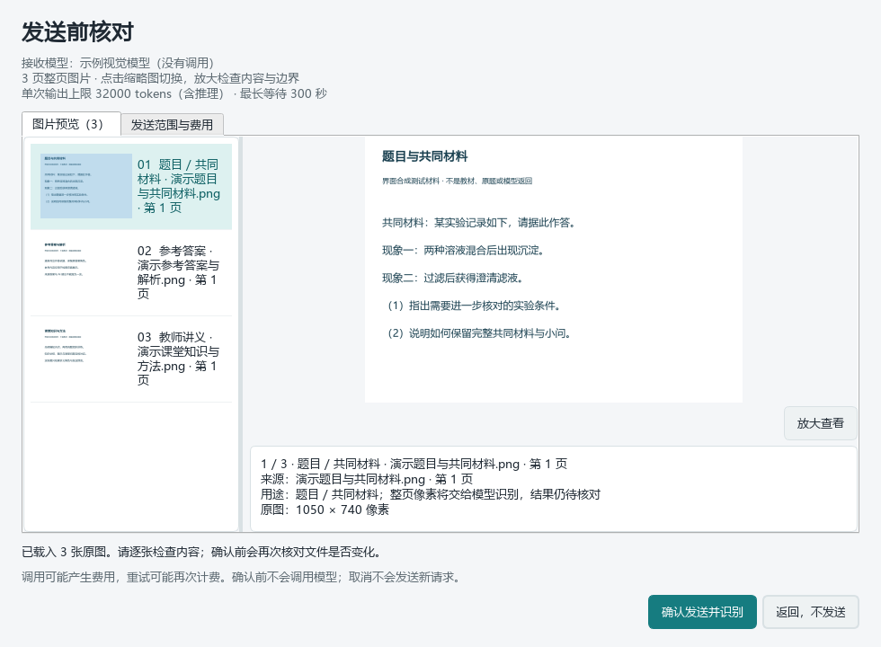

对已验证的官方 `api.deepseek.com` / Responses / `deepseek-v4-flash-vision-exp` 路由，等价展开局部schema引用和类型表达，保留全部必填字段、封闭对象、来源及本地验证；不降级为自由文本或补救残缺JSON。单次输出上限为32000 tokens（含推理）、最长等待300秒，直接显示在图片旁并绑定确认；其他路由保留8000/90。预算或处理规则变化必须重新预览。接口资料见[DeepSeek Responses API](https://api-docs.deepseek.com/api/create-response/)。

**操作路径：导入资料 → 继续最近一批 → 查看失败原因 → 核对设置 → 重新预览发送页面。** 恢复失败批次不再显示“保存完成”，而是保留原因与处理建议，并自动定位到第二步的模型选择处。重新打开不用再选择来源文件，不会自动重试或再次计费；重新发送仍须查看并确认实际图片。

错误提示只采用已知错误码对应的固定中文说明，不展示服务端任意正文、密钥或内部地址。区分请求被拒绝、凭据/权限、限流、超时及返回格式问题；“请求被拒绝”本身不能证明密钥错误或模型没有多模态能力。历史回执不能确认具体原因时保留通用提示，不猜测。

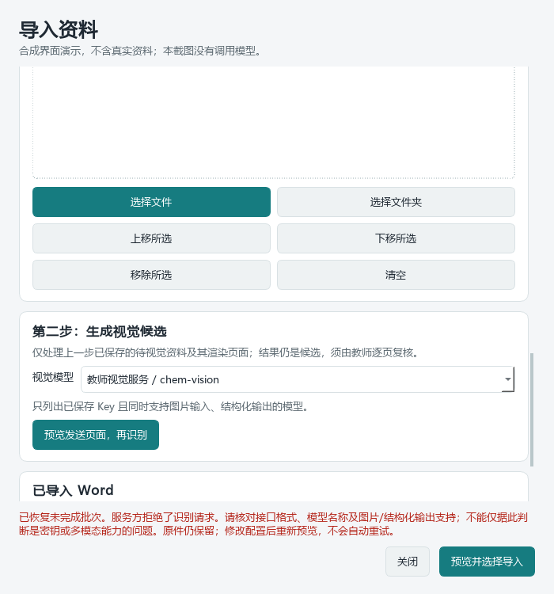

本次实际核对松江“银镜反应”完整主题：2页题面、1张完整答案裁片、9个印刷小题。3份输入的冻结字节与所看原图SHA一致。初次请求被拒绝；4次合成图差分探测确定等价schema兼容修复有效。首次修复后请求的8000输出额度全部用于推理；提高预算后，题面和答案两次请求均HTTP200、完整返回，但本地发现裁剪坐标越界，停止入库。合计4次真实资料请求、4次合成探测，每次修复后的尝试均明确发起，无自动重试；合成返回未进入题库。

**仍为0道新增图片题、0个完成视觉批次。** 未把保存原件或服务端完整返回算作识别、裁剪及标注完成。来源与失败回执留在本机；新版本明确显示页码/裁剪坐标校验失败，历史回执可从同来源清单只读恢复该原因。补充了归一化左上角坐标、换算公式和逐框自检提示，仍拒绝越界，不自动裁边或猜测单位；提示改进只做合成测试，尚未再次真实调用验证。答案来自非官方参考资料，不称官方答案。98份Word/3573道候选、已有标签和教材讲义知识索引本轮未变。

本版10组导入/发送预览/恢复/启动器相关回归 **169通过、1跳过**，Ruff通过。跳过项为源码仓库不分发的独立包检查；图片优先界面采用合成Qt离屏截图核对，不是人工操作EXE或真实题目质量验收。

最终桌面包位于 `runtime/deeptutor_shchem/desktop_dist_0.1.76-import-feedback-r2/沪上化学智研台/沪上化学智研台.exe`，7个改动模块的冻结代码与源码一致；SHA-256：`80fcd2a5738edaece2d5899652b83da0c5082af67e352f860588e09becad4ae4`。关闭旧窗口后从根目录启动器重新打开，优先使用此包；旧包和来源原件保留，未执行清理。构建检查不等于真人EXE操作验收。

## 前一阶段：题目导入发送前看得到图片（0.1.75）

**操作路径：导入资料 → 第二步 → 预览发送页面，再识别。** 原先只有文字的发送提示改为本地页面准备及逐页画廊；确认之前不调用模型。题目、共同材料、参考答案、讲义保留来源文件、页码与角色，默认直接显示第一张实际图片，可切换缩略图、放大查看，并核对接收模型与费用说明。

预览与发送绑定同一批次、模型配置版本及页面内容。确认前重新检查全部页面，实际识别复用已核对页面，不再重新渲染出一套可能变化的页面；缺图、内容变化、来源或配置变化时停止。点击“返回，不发送”不调用API，已保存的原始资料保留。该预览沿用视觉导入的500页/单页32MiB安全上限，冻结页面总量限制为512MiB，过大时提示分批；不套用备课的48图限制，也不静默漏掉后续页面。

以下为原生Qt控件的合成离屏检查图，不含真实题图，不是实际API调用或真人EXE操作验收。本次修复不改题库数据、标签或知识蒸馏数量。

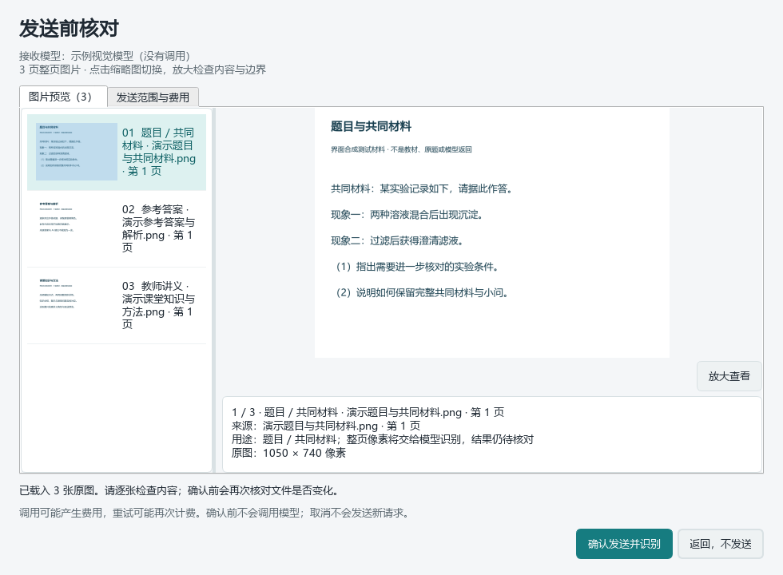

本轮导入服务、界面、备课核对及启动器回归 **124通过、1跳过**，保留1条既有Qt弃用警告；另有 **5项模拟传输整链路测试通过**，实际捕获请求的图片字节并与预览比较，验证PDF/Word不重复渲染、PNG不改写、来源及配置变化时零请求。`runtime/deeptutor_shchem/desktop_dist_0.1.75-egress/沪上化学智研台/沪上化学智研台.exe` 已构建，6个改动模块的冻结代码与源码一致；SHA-256：`082e3d0a5385adb81771a7d8aa31c08368bc0f97791522969d1025ca188fe1e9`。关闭旧窗口后，从根目录启动器重新打开即可优先运行新版。旧构建保留；本轮没有真人EXE操作或真实API识别验收。

## 前一阶段：图片题能逐题查看并带入备课（0.1.74）

**操作路径：资料库或导入资料 → 已识别图片题 · 逐题预览与挑选。** 导入第二步识别成功后的结果不再只有回执；重新打开软件仍可从个人导入记录中读取。浏览、筛选和带入备课均为本地操作，不会重复调用识别模型。

1. 左侧逐题选择，右侧先看实际题面图片，可放大、查看整页并恢复裁片。共同材料独立显示，答案默认隐藏，点击答案页才显示；切换题目不会沿用上一题的图片。
2. 顶部标签可勾选叠加：教材册、章、节、知识点、年级、考试类型、来源。已有明确标签用于筛选，缺项显示“待标注”；本版不把图片识别成功等同所有语义标签补齐，也不从讲义名猜测原考试类型。
3. 点击“保存选择”保存勾选；取消不会替老师保存，全部取消勾选后也可以明确保存清空。若题面或共同材料图片未能显示，本题不可新增选择。
4. 点击“预览备课选材”查看将带入的完整文字、图片数量和提醒，再点击“带入备课”。即使只选一个小问，也保留所在完整主题、共同材料和全部小题，避免失去解题条件。答案保留来源分值/评分点及待核对提示，不伪称官方答案。
5. 完整图文核对成功后才一起追加到备课页；旧资料和图片保留。备课中选择是否让AI读图，真正生成前继续使用0.1.73的逐张图片发送核对窗口。

以下为原生Qt控件的合成离屏验收图，不是用户题图、真实模型返回或人工EXE验收。页面采用图片优先的核对布局；[900×700共同材料页](docs/screenshots/personal-visual-materials.png)也能直接看到实际图片与底部操作。

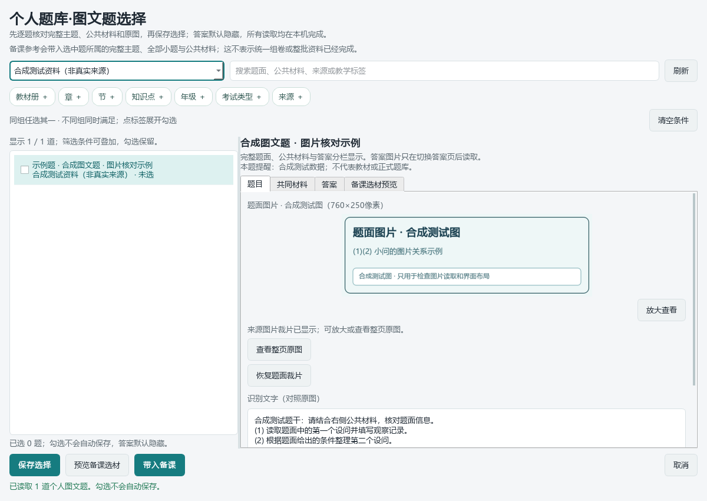

该入口直接读取已保存的来源绑定识别结果，不另造与原件脱节的题库副本，也不写中央正式题库。本次功能验证使用合成页面通过真实导入协调器和CandidateCAS构建题目，再检查图片裁片、选项图文、来源变化、重启选择和备课交接；未调用真实识别API，也未批量补导入公众号原图。图片题标签编辑/AI补标、裁剪返工编辑和与Word统一组卷继续推进，不能把本阶段称为整个工作台闭环已完成。

本机新图片识别通道目前有 **0个已完成批次、0道CAS题目**，因此在完成新的图片识别前，该入口会显示空列表；这是通道接通，不是历史题图迁移完成。既有公众号题仍从原资料库范围读取，98份Word的3573道候选保留原生Word通道，本版没有把它们重复发送做图片识别。

本轮桌面/预览/新功能回归 **122通过、1跳过**，导入核心与新服务组合回归 **68通过**（范围有重叠，不相加）。新目录 `runtime/deeptutor_shchem/desktop_dist_0.1.74-visual-questions/沪上化学智研台/沪上化学智研台.exe` 已构建，7个本次改动模块的冻结代码与源码逐一相同，SHA-256：`7648f3be15d967d957b152da0c16b11889f7a96b8479f98a5db35b5c36d99e73`。关闭旧窗口后，从根目录启动器重新打开；启动器优先新版，旧构建和缓存未删除或移动。这些检查不等于真人EXE操作或课堂验收。

## 上一阶段：讲义流程与图片发送前核验（0.1.73）

**仍未全部完成，以下数字是0.1.73阶段读回范围；0.1.74功能更新未改写这批题目与讲义数据，不等同教师审核或发布放行。**

| 当前范围 | 已有 | 仍待完成或限制 |
| --- | ---: | --- |
| 98份Word、3573道候选：主知识点 | 2751道 | 其余标签仍需继续核对；任一主知识点/教材映射缺项共1255道 |
| 同批题目：教材册/章/节映射 | 2567道 | 与主知识点缺项重叠，按题目去重统计 |
| 原考试类型线索 | 839道已知 | 2734道仍未知，不按讲义名或题目标题推断 |
| 46份复习讲义辅助整理 | 268条知识、93条方法、80条易错/待核提醒、18条讲练流程 | 9讲有流程、37讲尚缺；有流程不等于全文审校完成 |
| 五册教材 | 383条既有概念索引 | 本阶段数量不变；全书知识、例题和图表深度整理仍未完成 |

- 4道题经真实模型标注/复核后已保存到个人题库，仍标记为AI建议，未冒充教师审核。新增PKG-006《物质的分类 胶体》12条（3条知识、4条方法、3条易错/待核提醒、2条讲练流程），已计入上表累计值。
- PKG-012两课时完整参考在本地mock中为23,302字、28图，无截断或像素变化；未真实生成PPT。PKG-006精确流程联集为12,972字、5图，图片交接和容量校验通过；教材概念匹配为0，保留缺少教材关联等6条提示，不代表教学内容已全部审校。
- 生产发送前现在展示实际图片缩略图、大图和放大视图，只有1张图时也显示；图片读取失败或哈希变化即禁止发送。新任务和历史任务各使用自己的快照；单次最多48图、40,000字材料，并继续受单图10 MiB、24 MP、请求48 MiB及供应商尺寸限制。
- 公开合成验收截图为[发送前图片预览](docs/screenshots/preparation-egress-images.png)。发送确认相关39项测试通过；`0.1.73-lessons-r2`已构建，16个改动模块的冻结代码与当前源码一致。EXE SHA-256：`d0ae5a5b206d23b0a562ce11f365a37adf02237fd2589cb7f5fdf4f42190b806`。这些是合成UI和打包检查，不是人工原生EXE验收或课堂教学审核。
- 关闭当前工作台后，使用项目根目录的`启动沪上化学智研台桌面版.vbs`重新打开；启动器优先使用该新版，保留0.1.72及历史回退路径。备课选择“由AI读取图片内容”后，生成前可逐张查看原图；取消可返回修改材料。
- 题库个人属性未上传；公开同步仅包含代码、提炼知识摘要和合成图，不上传Word/PDF原图。个人题库标签、原件、模型响应和其他私有状态继续留在本机。

## 当前资料进度与标签调用修复（0.1.72）

**课本、教案深度蒸馏和全题库标记尚未完成。** 以下为本机实际读回的Word批次进度，不包含公众号题目的独立分母，也不等同教师审核。

| 当前范围 | 已有 | 仍待完成 |
| --- | ---: | --- |
| 98份Word、3573道候选：主知识点 | 2748道 | 825道缺项 |
| 同批题目：教材册/章/节映射 | 2563道 | 1010道缺项；两类重叠，去重1259道至少缺一项 |
| 原考试类型线索 | 839道 | 2734道缺依据，保留未知，不按讲义标题推断一模、二模或校考 |
| 46份复习讲义辅助整理 | 265条知识、89条方法、77条提醒、16条流程 | 8讲有流程、38讲尚缺；有流程不等于全文完成审校 |
| 五册教材 | 383条既有概念索引 | 23条编号节映射未知；全书知识、例题和图表深度整理未完成 |

- 本轮对照完整原题及实际附图后，保存8道题的标签建议：补6个主知识点、7个教材映射，纠正2个已有自动主考点。原考试信息、答案、教师字段和另外3565道记录未变；8道当前值及历史一致，数据库完整性检查通过。新结果仍标为自动建议。
- 实际9次调用：1次诊断确认原8192 token预算全部用于推理，输出未完成，未写入；调整预算后8次完整返回，经逐题核对后明确保存。首题完整返回需12,791个输出token。没有静默重试、截断JSON补救或关闭模型默认推理。
- 对已识别的DeepSeek官方v4端点，逐题标注预览现在明确显示32,000 token上限和300秒等待；自定义端点/其他模型保留原8,192/180设置。预算绑定预览，失败即停；诊断只记录限定的状态及用量，不记录服务端自由文本或推理正文。依据为[DeepSeek Responses API文档](https://api-docs.deepseek.com/api/create-response/)。
- 《不饱和烃》新增[16条来源绑定整理](knowledge/lectures/extensions-20260913-unsaturated.json)：3知识、7方法、4提醒、2个可调整的40分钟核心课时流程。实际阅读原教案1—595区块、25张不同原图/公式预览，对照上海选择性必修3印刷25—36页共12页教材。安排结构对照、命名、加成与逆推、装置评价、苯的性质、原例题和笔记表；原文和原图继续作为主要材料，不把摘要冒充课本原句。
- 16条新索引的来源SHA、区块版本及定位全部核对，其余45讲未变，重复合入为零新增。严格按课时流程完整选材后，两份参考分别带入6/1条讲义笔记和7/0条教材候选，但各15张图仍超过单次12图上限。另核对6组分阶段候选，各2—9张可读图，其中苯的反应部分还有1张旧公式阻断；不能称作两课时完整图文备课已交付。详见[本轮验证和待办](staging/coordination/deeptutor_gateway/native_desktop_0172_output_budget_and_unsaturated_20260913.md)。
- 标注/模型/界面相关120项回归、讲义与原文参考相关165项回归通过；启动器2项通过、1项因未分发独立启动器而跳过。已查看900px/420px合成离屏界面，不是用户原生EXE或真实课堂验收。

根启动入口优先读取 `runtime/deeptutor_shchem/desktop_dist_0.1.72-tags/沪上化学智研台/沪上化学智研台.exe`，SHA-256为 `1e15209a84546ea94a6e4c6709be915e9ef3fc387804a869bbb9723428fca38f`，包内9个相关模块已与当前源码代码对象逐一核对。旧构建和缓存保留，未删除、移动或替换。原Word/PDF、题图、模型响应、个人题库与检查截图只保留本机；公开版本包含代码、合成测试、改述索引与范围说明。

## 历史阶段：旧公式可读性修复（0.1.71）

**课本、教案深度蒸馏和全题库标记尚未完成。** 本轮先修复使部分图文题无法继续处理的旧公式读取问题，不以软件测试数量代替资料完成量。

- Word中的部分旧公式以WMF图片保存。现在先检查绘图记录、实际字体、字符集及字符是否存在，再用Windows GDI+生成来源绑定的PNG；不再走曾出现字体比例失真的经典绘图路径。未知控制、缺字体或缺字会明确保留提示，不静默换字体。原图不改写，也不将图片恢复称为可编辑公式转换。
- 实际重查此前阻断的14道题：11道的全部题面图片可读，51处图片引用中48处生成或读取成功；29处旧公式对应28张不同预览。主代理查看了全部29处旧公式，包括电荷、上下标、条件箭头及用量比。仍有3道旧对象未通过检查；这只是本批范围，不代表全库WMF或全题化学内容验收。
- 原Word逐题查看、完整教案阅读和选题带入备课共用该预览路径；合成测试验证来源SHA、图像SHA、备课交接及失败处理。255项相关回归通过，0.1.71已打包；未将打包成功称为真实课堂或EXE界面验收。
- 根启动入口优先读取最终构建 `runtime/deeptutor_shchem/desktop_dist_0.1.71-wmf-r2/沪上化学智研台/沪上化学智研台.exe`，SHA-256 为 `5d8c3807bec00420fd6c2b1e7dd1a112d64254ba002a5375ce59bb064cb9e556`。较早的同版本构建与构建缓存暂留，未执行清理或替换；最终包内4个相关模块已与源码代码对象核对。
- 另有2道题的原PNG透明背景需继续核对发送效果，暂未调用模型。余下9道已核对完整发送预览，但配置模型在第1道返回未完成输出，批次停止；实际1次调用、0道新增标记，其余8道未调用，没有自动重试。原件、3573道现有标签及个人状态保持不变。

0.1.71当时读回：**2742/3573道有主知识点，2556/3573道有教材映射，去重1267道至少缺一项**；2734道原考试类型缺依据，不能按教案标题猜测一模、二模或校考。46份讲义有262条知识、82条方法、73条提醒、14条讲练流程，7讲有流程、39讲尚缺；五册教材383条既有概念索引，该轮未新增蒸馏条目，全书知识、例题、图表深度整理仍待完成。最新进度以上方0.1.72为准。

本轮先解除旧公式读取障碍，后续继续处理剩余对象与透明图、未调用题目补标和教案深化。资料原件、真实题图、模型响应、个人题库与检查截图仍只保留本机；本次公开更新为代码、合成测试及范围说明，不清理来源资料或既有版本。

## 上一批资料进度：氧化还原讲练与图文题标签（2026年9月13日）

**尚未全部完成。** 本轮继续整理实际资料，软件保持0.1.70，未重复导入98份原Word或重新打包。

- 研读氧化还原反应原教案的440个原生文字/表格区块，查看11个Word原图片段，对照选择性必修1的4页教材，新增6条方法、3条提醒和2个40分钟讲练流程，已合入[讲义索引](knowledge/lectures/extensions-20260913-redox.json)。包括物质角色表、单双线桥对照、条件判断、配平、分段图题、独练和学生笔记，不只是知识点目录。
- 两课时核心材料实际选取47个区块、22段，带图参考12,891字、7张原图全部带入；原文、两个流程及2条既有教材候选均保留，没有截断或容量阻断。11条新增内容的来源/版本/区块与知识参考交接通过，90项相关回归通过。仍保留9条待核对提示，不将此称作最终PPT或课堂验收。
- 生成44道发送预览并检查可读状态；发送题目另逐题阅读完整题干与实际附图。实际21次分析（8次带图，其中1题只有装饰标记；13次文字），核对后保存19道，补11个主知识点、19个教材映射，并纠正1个已有主考点。1道读图依据不准确未采用，1道输出未完成，均未自动重试；文字批次失败后7道未调用，另14道原图或旧公式暂不可读、2道明示外省来源在发送前保留。原子光谱/电子云题的归章另对照了选择性必修2的9页教材。

| 氧化还原批次结束时的历史读回范围 | 已有 | 当时仍待完成 |
| --- | ---: | --- |
| 98份Word、3573道候选：主知识点 | 2742道 | 831道缺项 |
| 同批题目：教材册/章/节映射 | 2556道 | 1017道缺项；两类重叠，合计1267道至少缺一项 |
| 原考试类型线索 | 839道 | 2734道缺依据；本轮不重新判断原考试身份 |
| 46份复习讲义辅助整理 | 262条知识、82条方法、73条提醒、14条流程 | 7讲有流程、39讲尚缺；全讲深度审校仍未完成 |
| 五册教材 | 383条既有概念索引 | 23条编号节映射未知；全书知识、例题与图表深度整理未完成 |

19道保存值与修订历史一致，另外3554道记录、原考试信息、答案和教师字段保持原样；新标签仍为自动建议，不冒充教师确认。原Word/PDF、题图、个人库、实际模型响应和过程截图留在本机，公开版本只包含改述知识及进度说明。公众号资料进度与本批Word分开计算，本轮没有完成全库裁剪或清理过程目录。

## 上一批资料进度：物质的量与离子反应（2026年9月13日）

**仍未全部完成。** 本次是资料增量，软件保持0.1.70，不重新打包。98份原Word和3573道现行候选不重复导入；知识索引由工作台从本工作区读取，个人题目标记保存在本机。

- 继续研读“物质的量与气体摩尔体积”“离子反应和离子方程式”两份原教案，对照必修第一册11张教材原页，新增8条方法、4条易错提醒、4条可调整课时流程。每专题安排两个40分钟核心讲练课时，明确例题、独立练习、讲评及学生笔记表的用途。内容见[讲义扩展](knowledge/lectures/extensions-20260913-mole-ionic.json)。
- 新增[6条教材研读记录](knowledge/textbook/reading-notes-20260913.json)，保留表格、示意图和练习的原页定位；是简明改述，不替代教材原句、原图或完整例题，不重复计入383条既有概念。该单独文件是可读记录，软件参考目前采用已关联讲义条目与既有教材候选。
- 预览40道待标记原题，其中7道因既有标签需单独核对或明示外省来源而发送前暂缓。实际33次文字分析，逐题核对后保存29道，补21个主知识点和25个教材映射缺项；3道建议不够贴合题目、1道输出不完整，未采用且未自动重试。仍标为自动建议，不冒充教师确认。

| 上一批完成时的历史读回范围 | 已有 | 当时仍待完成 |
| --- | ---: | --- |
| 98份Word、3573道候选：主知识点 | 2731道 | 842道缺项 |
| 同批题目：教材册/章/节映射 | 2537道 | 1036道缺项；与上一行重叠，合计1286道至少缺一项 |
| 原考试类型线索 | 839道 | 2734道缺依据，保留未知；本轮不重新判定原考试身份 |
| 46份复习讲义辅助整理 | 262条知识、76条方法、70条提醒、12条课时流程 | 6讲有流程、40讲尚缺；有流程也不等于全文审校完成 |
| 五册教材 | 383条既有概念索引 | 23条编号节映射未知；全书知识、例题与图表深度整理未完成 |

29道保存结果与修订历史一致，其他3544道记录、已有非空标签、原考试信息、答案和教师字段保持原样。16条新讲义内容均通过来源SHA、提取版本与区块核对，能进入对应选段的知识参考；移除必要依据区块后对应条目不再带入。两讲参考分别含6/3条既有教材候选，未把页码关联称作已附教材原图。90项相关回归通过，重复合入为零新增；这不是全库化学正确性、完整图文交接、最终PPT或真实课堂验收。

原Word、教材PDF/原图、个人题库、模型响应与过程截图只留本机，公开版本只同步改述知识和进度说明。图片题及旧对象识读、剩余标签和讲义深化继续保留为待办；本轮未清理原资料或过程目录。

## 已有自动标签也能逐题核对（0.1.70）

在Word逐题页勾选题目 → **AI补全 / 核对已选题标签…** → 按需勾选“重新核对自动标签” → 预览原题与发送范围 → 确认调用 → 查看修改前后及原文依据 → 勾选需要的修改并确认保存。

- 默认仍只补缺失值；明确开启核对模式后，已有完整自动标签也可重新判断。模式绑定发送预览，改变模式会清除旧预览和发送同意；结果出来后关闭窗口再选择另一模式，未保存关闭会提示。
- 核对结果默认不勾选，保存前再次说明可能替换已有自动主考点或教材节。教师修改、教师确认及固定修订整题受保护；不改原题、答案、原考试类型或使用年级。
- 仍用完整题干、所有选项、公共材料及实际附图，不把当前自动标签或某个干扰选项当作分类依据。未知结果不清空已有标签；相同知识ID或相同教材节集合不产生仅换措辞的修订。
- 文字依据逐区块匹配，图像依据绑定实际发送像素；来源、题目范围、目录、模型配置及属性变化后不能沿用旧预览。采用使用事务和旧版本校验，保存历史；失败即停止，不自动重试。常见空响应、非JSON及未完成输出分别提示，不回显任意模型连接异常中的原始信息。

本轮核对5道已有偏题自动标签的原题，实际调用5次文字分析，4道建议经主代理逐题核对后保存，1道无可用输出、未重试。修正包括“碱金属递变→元素周期律”“铁的综合性质→金属性质”“Fe²⁺/Fe³⁺检验→重要金属化合物”；不是仅因某选项出现硫酸、氨气或氧化性而归章。共纠正1个已有主考点、3个已有教材映射，同时填补3个主考点、1个教材映射缺项，均发生在这4道题中，不重复计为新增题数。最新记录及历史已读回，另外3569题保持原样；采用后仍标记自动建议，不冒充教师审核。

| 0.1.70软件发布时的历史快照（后续资料增量见本页顶部） | 已有 | 未完成部分 |
| --- | ---: | --- |
| 98份Word、3573道候选题：主知识点 | 2710道 | 863道缺项 |
| 同批题目：教材册/章/节映射 | 2512道 | 1061道缺项；两类重叠，共1315道至少缺一项 |
| 原考试类型线索 | 839道 | 2734道依据不足，保留未知；本轮未重新核验出处 |
| 46份讲义 | 262条知识、68条方法、66条提醒、8条讲练流程 | 4份有流程、42份仍需深化；本轮未增加知识条目 |
| 五册教材 | 383条既有概念索引 | 23条编号节映射未知；全书知识、例题和图表的深度整理未完成 |

下面是离屏运行的原生控件与合成题面，不是真实用户材料、真实API返回截图或EXE启动验收。

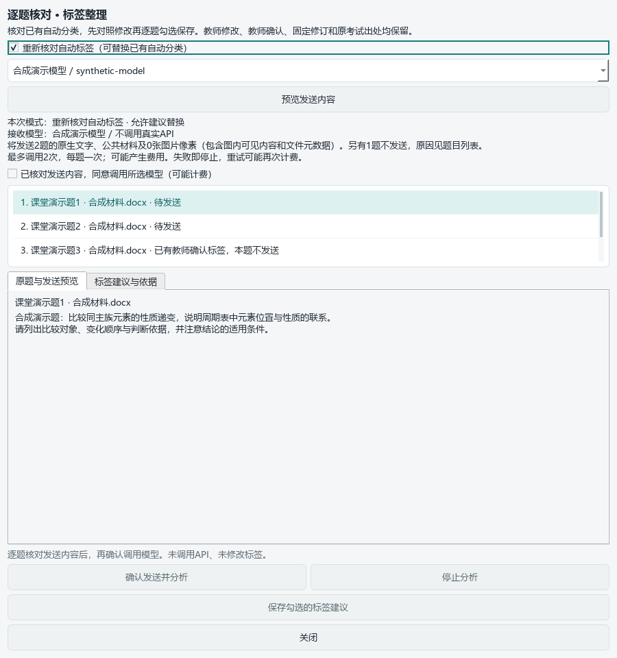

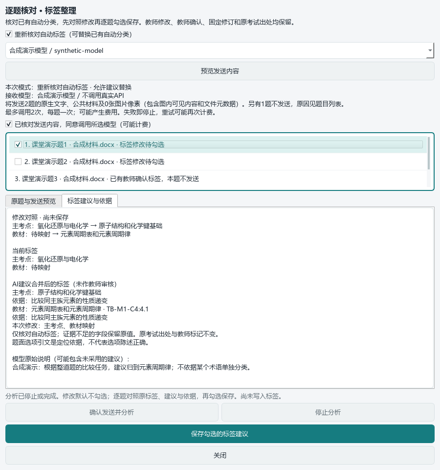

## 分别选择知识表和例题，再核对完整参考（0.1.69）

在完整Word的“选段与备课”中勾选“合并多个分散段落”，定位需要的知识、例题或解析后分别点“加入当前段”。清单显示范围与原文开头，可移除或清空；重复、重叠及相邻范围自动合并，按原文次序带入，最多32段。只浏览另一段不会改变已选清单，也不会把中间未选内容补进去。

点击“预览将带入的内容”后直接显示参考预览，再确认追加。修改清单、切源或改变带图/知识选项时旧预览失效；确认时复核原文件、提取版本及实际内容。原有单段方式仍保留。20,000字及图片容量限制不提高，不通过截断原文解决超限，完整题干、公共材料与对应答案仍须一并选入。

真实原教案检查中，钠第1课时选择39—92、216—220，铁第1课时选择45—82、322—332，明确仅文字参考分别为13,261和11,444字，均保留所选正文及讲练建议。铁的带图参考可读出7个不同原图资产（含符号和装饰，并非7幅装置图）；钠仍有区块59旧对象无独立预览，带图确认继续阻止，不隐藏缺口。

本轮补入“原子结构与核外电子排布”的2条方法、2个40分钟讲练流程，已对照10页教材及硫原子轨道表的5个原图片段。两课时精确多段参考均能包含原文、完整例题与讲练建议；新增内容只改述来源，不冒充教材原句。详见[本轮扩展](knowledge/lectures/extensions-20260913-atomic-flow.json)。

| 0.1.69阶段本机范围（历史快照） | 已有 | 未完成部分 |
| --- | ---: | --- |
| 98份Word、3573道候选题：主知识点 | 2707道 | 866道缺项 |
| 同批题目：教材册/章/节映射 | 2511道 | 1062道缺项；两类重叠，共1319道至少缺一项 |
| 原考试类型线索 | 839道 | 2734道缺来源依据，保留未知 |
| 46份讲义 | 262条知识、68条方法、66条提醒、8条讲练流程 | 4份有流程，另外42份还需深化；有简要索引不等于全文蒸馏 |
| 五册教材 | 383条既有概念索引 | 全书知识、例题、图表的深度整理未完成；本轮不增加概念数量 |

本轮16次真实文字请求中，13道核对后保存，新增12条主考点、8条教材映射；1道输出不可用、2道映射不够合适均未采用。另有5道已有标签偏题、4道明示外省来源，在发送前暂缓。本批12道未采用记录保持原样，已存结果及历史读回一致；不覆盖原考试事实、教师修订和已有非空字段。自动建议的覆盖率不代表正确率或教师审核。

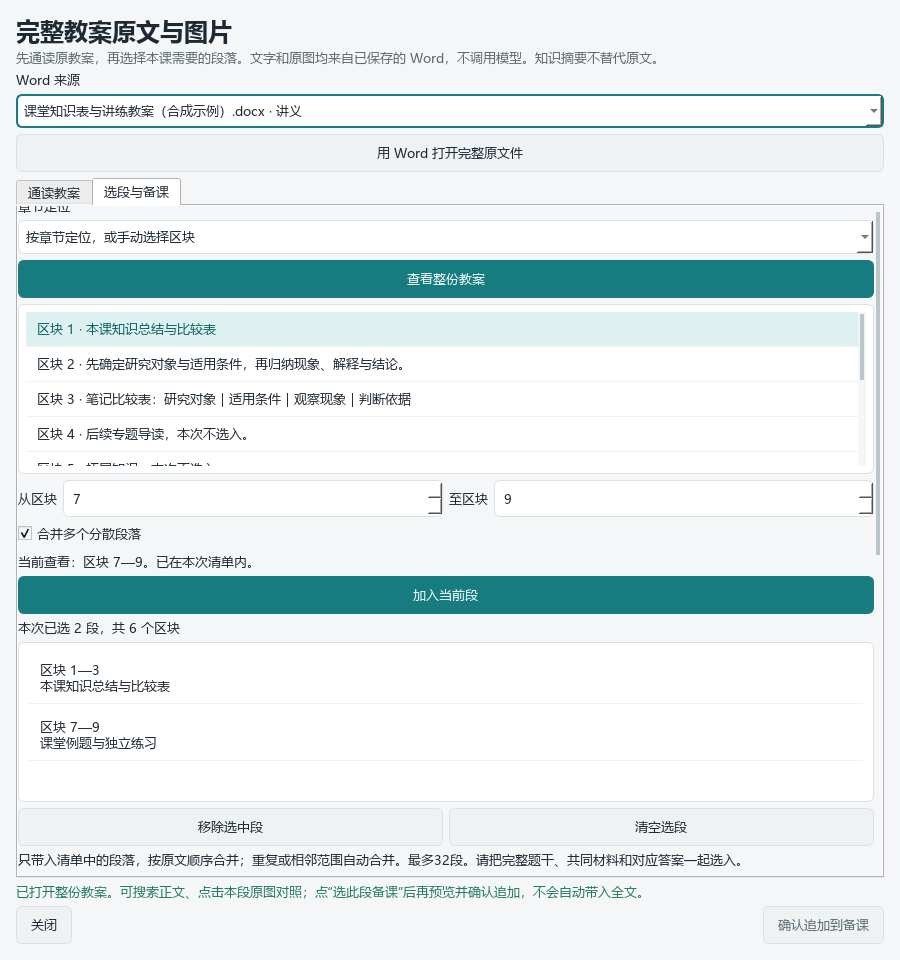

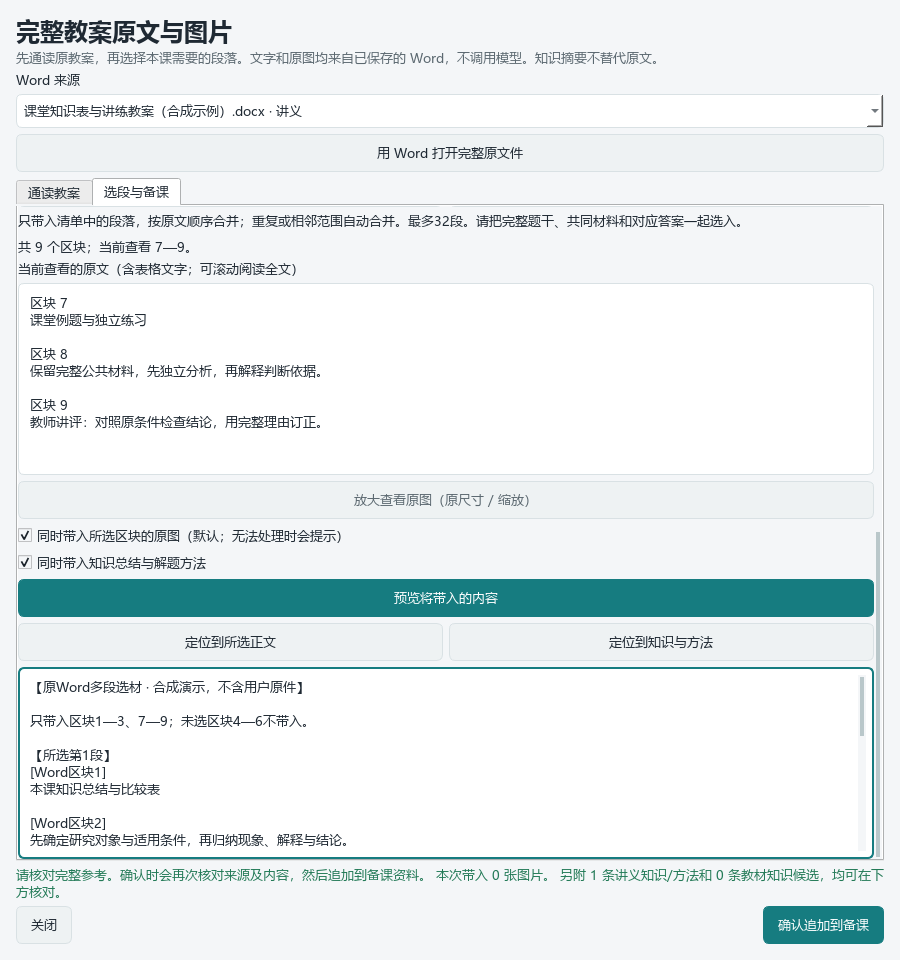

## 三专题讲练笔记与真实标签补缺（0.1.68）

2026年9月13日继续研读氯、钠、铁三份原Word的知识表格、例题及解析，对照19页教材图像和2幅Word原装置图，新增12条解题方法、6条易错提醒、6条可调整的40分钟课时建议。每个专题安排两个核心课时，包含主讲例题、独立练习、讲评及学生笔记表，不是只列知识标题。详见[扩展记录](knowledge/lectures/extensions-20260913.json)与[知识包说明](knowledge/README.md)。

- “查找已导入的原教案”现可检索和预览“讲练与笔记”。选段参考只附完整来源区块均在当前范围内的条目；不扩大选段、不额外选择题目或图片。
- 教材关联按具体内容拆分。例如仅选过氧化钠的定义辨析，不附碳酸盐对应页面；PDF文件页序与印刷页码分别显示。教材图须另外选择原页，关联页码不代表已经附图。
- 备课提示词升级为`20260913-lecture-practice-notes-v26`。建议课时服从教师本次输入，不覆盖授课范围和学生情况；例题、练习及学生可抄写的归纳表各有用途，流程建议不替代知识正文。
- 六个课时中，四个实际原Word连续选段的**明确仅文字**参考已核对通过，原文保留并带入相应讲练建议；钠、铁第1课时所需区块跨度超过当前20,000字上限，仍需分段处理，软件明确拒绝而未截尾。未据此宣称整讲图文或最终PPT已完成。

本轮通过现有API配置处理20道真实文字题，主代理逐题核对后保存17道，新增15条主知识点和13条教材映射；3道归属建议不准确或不够具体，未采用。保存后读回与历史一致，另外1332条原缺项记录、已有非空标签、原考试信息及其他个人状态未改；结果仍标为自动建议，不冒充教师确认。

| 0.1.68阶段本机范围（历史快照） | 已有 | 当时仍待完成 |
| --- | ---: | --- |
| 98份Word的3573道候选题：主知识点 | 2695道 | 878道缺项 |
| 同批候选题：教材册/章/节映射 | 2503道 | 1070道缺项；与上一行重叠，合计1332道至少缺一项 |
| 原考试类型线索 | 839道 | 2734道缺来源依据，保留未知 |
| 46份讲义的辅助整理 | 262条知识、66条方法、66条提醒、6条讲练建议 | 五个专题已有定向增补，不等于46讲逐段深度整理完成 |
| 五册教材既有索引 | 383条概念 | 本轮19页对照不等于五册逐页蒸馏完成 |

题库标签数量是覆盖率快照，不是全部正确性的验收。私人题库、原Word/PDF、教材页图和装置原图保留本机；公开版本只含改述索引、代码及合成界面示例。

## 原题看清楚，再用自己的API补标签（0.1.67）

在Word逐题页勾选题目 → **AI补全已选题标签…** → 选择模型并预览发送内容 → 确认发送 → 对照原标签、建议及依据 → 勾选保存。

- 每次1—100题，每题一次请求。预览不调用模型；未明确保存不写标签。显示接收模型、题数、图片数、费用提醒和不发送的原因。
- 题干、完整选项、公共材料及实际原图是输入，不发送答案。带图题须有多模态能力和图片发送权限；不可读图片不静默省略。原生表格按完整行列文字读取。
- 只补缺失主考点和教材映射，目录外ID、假引文或未发送图片的引用不采用。文字依据对应原区块，图像观察另标AI候选并绑定实际图片SHA；题面引文可能来自错误选项，不能当作知识结论。
- 结果页区分实际补全字段和模型原始说明；已有非空标签、教师修改、固定修订及原考试事实保留。源件、题目范围、目录或标签变动后需重新核对，保存采用事务并保留历史。
- 任一调用失败即停止，已完成候选仍可选择保存；不自动重试。未保存建议关闭前再次提示，重新分析可能再次计费。

0.1.67阶段通过现有模型配置实际发起11次请求，其中1次带真实题图；10道获得可采用结果并保存，1道返回不可用结果、保持原状。新增10条主考点和7条教材映射，均为自动建议、未作教师审核。保存后重读核对来源和历史，其余1349条原缺项记录及原考试信息未改。该阶段98份Word的3573道候选中，**2680道有主考点，2490道有教材映射；仍缺893/1083条，两类重叠**。最新数量见上方0.1.68；原考试类型839条有线索、2734条未知不变。

常规Word导入后的自动首轮标签仍是本地规则，API补缺须经上述入口确认，不等于所有上传资料已全自动处理。0.1.67阶段已有错误标签只能在“修改教学标签”另行核对；0.1.70增加上方明确选择的自动标签核对模式，默认补缺仍不覆盖已有值。当前目录对部分基础电解质主题仍不够细，不能为消除未知而强配进阶章节。

0.1.67阶段不新增教材/讲义知识量；当时为383条教材概念索引、46份讲义262条知识、54条方法及60条提醒。52份其他练习/测试资料保留完整原Word。后续专题增补见0.1.68，索引覆盖始终不代表完成课堂级蒸馏。

## 把原教案与对应知识方法一起带入备课（0.1.66）

1. 在“备课”点击“查找已导入的原教案”，打开对应的完整原文与图片；先通读，再切换“选段与备课”确定范围。
2. “同时带入知识总结与解题方法”默认勾选，可以取消。只附所选区块完整支持的讲义条目；原文、顺序和明确选择的原图保留，不扩大选段或添加未选题目。
3. 点击“预览将带入的内容”，可用“定位到所选正文”和“定位到知识与方法”对照。状态栏显示本次讲义条目和教材候选数量；确认前重新核对来源、索引、教材文件与选段，变化后必须重新预览。
4. 点击“确认追加到备课”，其他课题、目标与已有填写保留。随后生成仍使用软件中选定的模型及发送确认；本地整理不会调用API，勾选知识方法也不等于同意发送图片。

46份讲义索引现已绑定当前原生提取版本。没有索引、区块版本已变或选段未覆盖完整依据时，原教案仍可使用，但不会附上不对应的旧摘要。两个已深化专题的教材关联进一步绑定具体讲义区块；例如仅选微粒计数段，不自动附电子排布页。教材候选须同册、同来源SHA、全部页序都在明确范围内，并核对原PDF字节；这不是教材原句、原页图片或教师审核结论。

Word选题追加备课时同步携带当前主辅考点、教材映射、适用年级、原考试线索和各字段状态，以可读文字显示。原题及公共材料、答案不因标签而改变；标签修改会使旧参考需重新预览。提示词按“知识表达—主讲例题—独立练习—笔记归纳”组织采用关系，不把标签或AI改述替代题目，也不把使用年级猜成原题年级。

本机只读核对中，PKG-010所选段带入7条讲义参考和6条教材候选；PKG-056所选段带入2条讲义参考和4条教材候选，另3道原题保留当前标签。这是既有内容的交接，不是新增9条讲义知识或10条教材知识。原文、状态及缓存未写入，未调用真实模型。两段完整带图尚不全可用：前者超过既有20,000字参考容量，后者有5项图片问题；文字路径需明确选择仅文字，不能补猜图中条件或把这项检查称为图文全部可用。

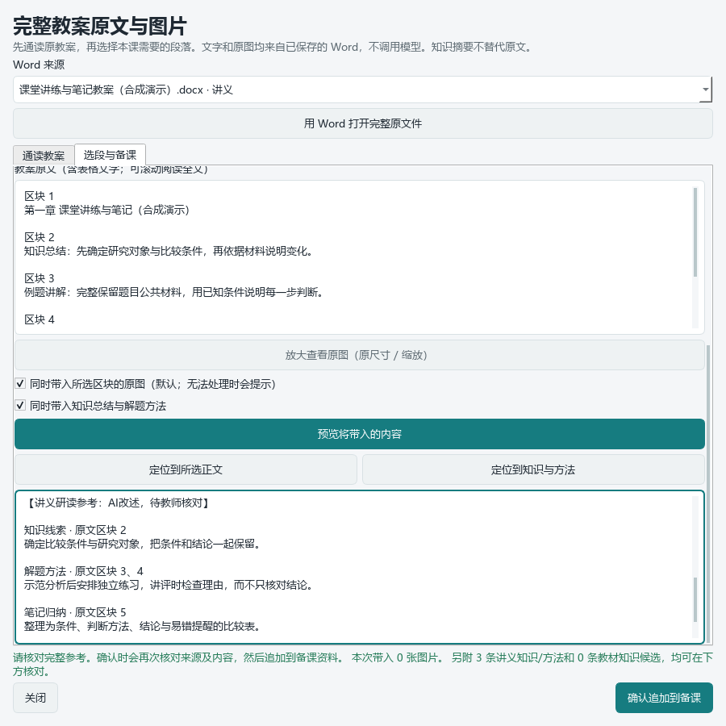

## 知识蒸馏与现有题目标签补全（0.1.65）

2026年9月12日本机实际写入后，98份解析版Word仍对应3,573条现行候选题，其中3,570条可选、3条已知来源问题继续保留限制。本次仅补缺失字段，共更新1,789道题；下表两类新增有重叠，不能相加作为新增题数。

| 属性 | 补全前已有 | 本次新增 | 写入后已有 | 仍待核对 |
| --- | ---: | ---: | ---: | ---: |
| 主知识点建议 | 2,360 | 310 | 2,670 | 903 |
| 教材册/章/节映射 | 755 | 1,728 | 2,483 | 1,090 |
| 原考试类型线索 | 839 | 0 | 839 | 2,734 |

标签来自题干、公共材料及明确来源证据，题目内容优先于讲义章节标题；仅在选项中出现的术语不能决定主考点，部分复合词也作了排除处理。这仍是**本地规则的自动建议，不是API语义识别或教师确认**。本批次不覆盖已有非空主考点/教材映射、教师修改和固定修订，不改原考试事实；适用年级只是授课使用定位，不能等同原题年级。

补缺工具见[complete_word_label_gaps.py](staging/coordination/deeptutor_gateway/scripts/complete_word_label_gaps.py)：默认只预演，显式写入需匹配已审看的方案SHA，并取得桌面独占锁；提交时重新核对来源、题目范围与目录，按事务保留属性历史。本次保存后重新读取结果与方案一致，再次补缺为零；其他个人状态及原Word、PDF、缓存未变。不自动在浏览题目时运行，也不将个人题库记录上传GitHub。

蒸馏本次聚焦“原子结构与核外电子排布”和“弱电解质的电离平衡”：对照两份原Word的知识、表格与例题，并实际查看对应教材9页，补入6条方法和4条易错提醒。新增内容包括表示方法互译表、电子排布纠错、弱酸比较条件表和带近似条件的电离计算步骤，便于继续组织讲解与学生笔记。46份讲义索引现为262条知识、54条方法、60条易错/待核提醒；[本次扩展记录](knowledge/lectures/extensions-20260912.json)保留来源SHA、原文区块及教材页码，原教案检索可显示关联线索。

教材383条既有概念索引数量未增加，本次9页阅读不代表五册逐页蒸馏完成。选修第二册关联PDF第16—20页/印刷第12—16页，选修第一册关联PDF第70—73页/印刷第64—67页；两种页码明确分开。原教材原图不上传，新增索引均为改述且仍未教师审核。剩余标签、旧图形的识读、其余教材与讲义深度整理继续列在路线图中，不把索引覆盖当作全部课程完成。

## 上传Word后整理标签，按教材章节选题（0.1.64）

入口：**导入资料 → 预览并确认保存 → 自动整理本批题目标签 → 逐题预览与挑选**。整理基于本地规则，不调用API；原文、表格、图片及原答案保留。若标签失败，原件仍已保存、可以查看；在“已导入Word”选择该批次后可点“补全／重试本批题目标签”。仅打开历史或浏览题目不会自动改标签。

筛选改为紧凑分组的可勾选标签，而不是竖排单选下拉框。教材册/章/节、主辅知识点、适用年级、原考试类型（一模/二模/校考等）均可多选：同组命中任一个，不同组同时满足；知识点可进一步要求同时包含所选标签。已选条件集中显示，可逐个取消或清空，保留已选题。按稳定目录ID及同一教材路径关联，不按讲义文件名或同名章节猜测；目录缺失、过期或未映射题仍可查找。

先看题再选择：导航只负责换题，主区域直接显示完整题干、公共材料、原图和选项，答案单独展开。确认当前题面可读后，在题面旁点“将这道题加入本次选择”；必需题图仍在读取或失败时不误报为可读，换题后晚到图片不能串入另一题。来源区块等工程信息不占据每段正文，窄窗默认收起候选标签，把空间留给题目。完整题目、范围修订和备课/统一题篮入口仍保留。

自动标签保持来源和当前切题范围绑定，重试幂等，教师修改及历史不覆盖。标签记录已保存不等于每个属性均已确定；没有来源依据的原考试类型、年份等保持未知。本轮仅用临时合成资料验证，不重新写入98份现有资料。对复杂分界与语义的API辅助，以及图片识别结果到统一可浏览个人题库，仍是下一阶段。

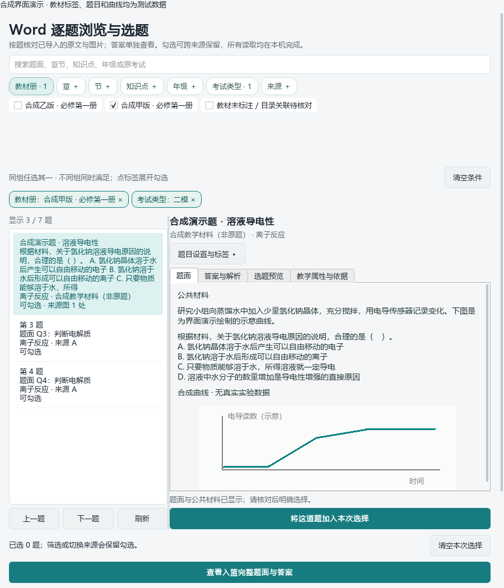

## Word与原卷题进入同一个题篮（0.1.63）

1. 在题库、导入资料或备课页打开“Word逐题预览与挑选”，勾选完整题目，查看本次学生版和教师版。原图全部可显示后，再明确点击加入统一题篮。勾选和原教案保留，真实软件不再并列显示绕过预览的独立Word导出入口。
2. 原卷大题同样先查看题面和公共材料。所需题图加载或解码失败时不能入篮；摘要不代替原题。来源答案缺失另行说明，不把题面可读当作答案已核定。
3. 在组卷页统一上移、下移、从本卷移除或恢复，调整本次分值。新增题目和切换混合来源时，按明确来源身份保留已有顺序与评分；无法绑定的旧记录要求重选，不按同名题猜来源。题篮满100项时明确报错，不自动删旧题。
4. 查看并确认本次两版图文，再导出学生练习和教师答案DOCX。改题、改分、换来源或图片变化会使旧确认失效；草稿恢复失败时保留原稿，不用默认设置覆盖。

Word导出保留支持的原生文字、表格、公式、图片和已有答题区，不额外补线；原卷主题保留共同材料和依赖顺序。学生新增分数默认关闭、可以选择显示，教师版逐题保留本次分值；开关不抹除原文件已有的印刷分数。混合预览中的表格为可读文本与原图，不冒充原Word分页还原。

混合来源本阶段输出两个DOCX，明确显示PDF尚未生成；原单一来源的既有四文件导出路径保留。未能显示的WMF、旧对象等仍阻止混合图文确认，不因文件存在就声称已验收。下面均为合成资料的原生界面，四张420/900像素截图已分别目视检查，不含原教案或试卷图片。

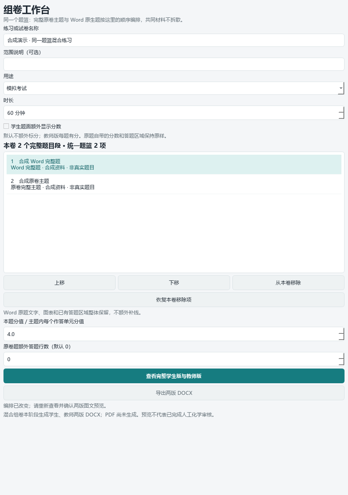

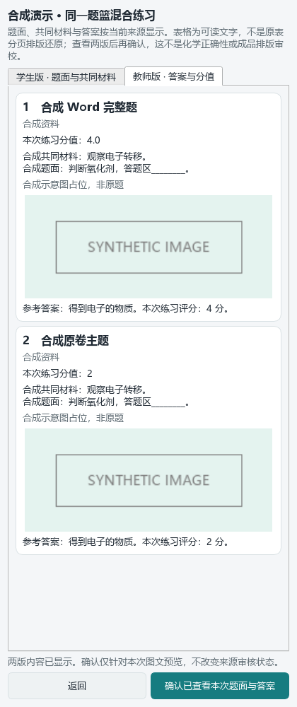

## 调整题目范围，先预览再保存（0.1.62）

入口：**题库 → 已导入Word · 逐题预览与挑选 → 调整本题范围**。填写题面、答案和共同材料的区块范围后，点击“查看本次范围预览”，分别阅读将要保存的完整文字。原图引用列出数量，并明确引导到逐题预览或原Word看图；范围文字页不冒充图形审看。

修改任何范围都会清除旧预览和勾选。仅对实际存在的三类歧义提供默认不选的具体确认：无答案标签、非标准题目标记、题面已含所引用材料。未确认的提醒仍保留；确认不能解除同段题答混合或把答案放进学生题面/共同材料。此确认只记录分界与材料位置，不代表化学或官方答案审核。界面采用原生纸面阅读样式，900/420像素合成预览已目视检查。


## 先通读原教案，再选段备课（0.1.61）

入口：**导入资料 → 已导入Word → 查看Word内容**，或在备课页点**查找已导入的原教案**。打开后默认进入“通读教案”，不再只显示首个区块：

1. 滚动阅读完整原文，使用全文查找、上一处／下一处及章节定位。阅读不受备课20,000字限制，也不自动勾选整份内容。
2. 点击某段下方的来源图片链接，原图在该段后展开；可放大核对。一次显示一张选中的图，其他图保留入口，不自动读取整份教案的数百张图片。EMF另标本地转换，WMF及无法显示的旧对象仍提示使用原Word。
3. 点击“选此段备课”，切到“选段与备课”；调整起止区块，点“预览将带入的内容”，核对文字和图片后再确认追加。仅查看、查找或返回全文不会修改既有选区、确认或发送内容。

0.1.61支持原表网格预览：打开一份已导入Word时，从该原件读取明确的行列、横向合并和纵向合并关系，并逐表核对文字与当前预览一致；不改98份缓存、原文、题目标记或备课选区。顶部可切换“网格预览／逐格原文”。超过6列、嵌套或合并关系不明确时保留逐格原文并提示核对原Word；不能读取网格时全文仍可使用。图片仍按明确的区块归属展示，不声称还原Word分页、表格单元格内图片位置或旧公式。原文HTML转义，由本地Qt文档绘制，不依赖浏览器引擎，不自动打开网络链接或本机资源。

原文较多的共性提醒在文末完整保留，可从顶部跳转查看；各段的缺口提示仍在对应段旁，不用大量重复提醒挤占全文开头。下图只含合成演示资料，不包含原教案或试卷图片。


表格改动采用原生纸面阅读样式，下面只展示合成内容。真实来源核对另选第09讲：20张表的结构与缓存正文一致，选定合并长表在420/900像素下完成目视检查，源文件与缓存字节未变。这不是814张表逐一视觉验收。


## 本次学情到完整练习（0.1.61）

在“学生分析”记录本次教师评分、诊断及对应教材章节后，点击“按本次学情推荐练习”。卡片显示章节依据、命中单元数、完整大题范围及共同材料数量；先查看完整题目与材料，图片读取成功后才能明确加入题篮，组卷页计数同步更新。

改分、改诊断、未提交编辑或切换学生/任务都会清除旧推荐；源码还会复核当前评分记录、题库及实际教材映射，拒绝过期推荐入篮。推荐按明确章节绑定匹配，不调用模型，不自动判定长期薄弱点或写入长期学情。当前可用章节映射来自主库和补充库；未映射的Word题与wave1不冒充已覆盖。

该增量的原文表格、推荐界面、原生集成、HTTP、投影与冻结检查器联合210项测试通过，含1个既有Qt警告。现已纳入0.1.61本机构建，包内源码一致性见下方构建记录，未将冻结检查器测试当成新EXE运行。以下合成截图使用真实原生StudentPage和内存样例：900像素显示预览前状态；另核对420像素完整预览后的解锁状态，没有真实学生读取或入篮写入。


## ZnS主题裁图与答案（0.1.61）

入口：**题库 → 核心题库 → 搜索“ZnS” → 题面与公共材料／答案与分析**。接通复旦附中2026届高三四月阶段检测主题五：8道印刷题、9个既有作答单元，未新增或重复导入主库身份。现成Word教案继续直接读取完整原文、表格与图片，知识索引不替代原教案。

从绑定的原卷和非官方答案页划分22处显示窗（8题面、6共同材料、8答案），修复相邻题混入、Q42题干切顶、材料标题残缺；保留ZnS简介、制备流程、回收率曲线，以及完整晶胞序列、充电箭头和图例。13份来源、24张存档裁片、候选记录均不覆盖。题目年级、校考来源及知识点候选随现有身份展示；主辅未定和难度未知仍明确保留。

第41题保留一道印刷题和两个作答单元，非官方参考分值分别1分、2分，整组17分；完整推导图在教师版内容计划中只绑定计算单元一次，判断单元仍能预览同一答案原图。学生题面默认不额外标分，明确设置的零附加答题行沿用。单问导出的材料按其明确来源依赖缩小，不携带无关兄弟题答案。

该增量核对了原页与22处实际显示图，以及原生预览、题篮和学生/教师内容计划。ZnS读取26项、原生集成12项、福辛普利接线9项通过；旧公众号、主题目录及题图/答案边界回归29项通过（共76个不同用例，重复执行不累加），Ruff与差异格式检查通过。0.1.61本机包已包含该读取器，并核对冻结代码与当前源码一致；未生成这组新的DOCX/PDF、未核验Word分页，不将源码接通与打包写成课堂终验。

原生直接图文读取现为14个产品、262条投影，旧HTTP范围仍为10个产品、224条；主目录48个主题、470个规范作答单元及480个展示单元不变。原生题图覆盖与待归属应分别核算，不把二者合成一个未完成数。

## 福辛普利主题原图与答案（0.1.59）

入口：**题库 → 核心题库 → 搜索“福辛普利” → 题面与公共材料／答案与分析**。可以查看并放大每题的来源答案原图，加入完整主题，或选取带必要材料的小问后进入组卷预览。默认采用来源A，来源B只作差异对照；来源为非官方回忆及机构解析，不改称官方原卷或官方评分。

本批为已有9个作答单元接通10张题面、1张完整合成路线与9张答案图，共20处从绑定原页重新裁取的展示图。第7题跨页条件保留为两张连续题图；第5、7、9题的结构式或路线答案随教师版导出，其余答案图供逐题查看。学生版不含答案图，题面分数可选显示，教师稿保留本次练习分值，原有答题区域不额外重画。原件、旧裁图与归档哈希不覆盖。

所选来源的主题标题、题号及顺序只在完整、同源且身份匹配时补到桌面展示层，不修改中央原记录，也不从文件名猜测。第3题来源A为选择作答，来源B的不同作答形式保留在对照信息中；第6题原页未注明单多选规则，继续提示待核对。知识点候选可用于查找，主辅标签与难度未知仍保留。

该历史批次完成时，原生直接图文读取范围为13个产品、253条投影，旧HTTP范围仍为10个产品、224条；主目录48个主题、470个规范作答单元不因图文接入增加。该批次的原生题图覆盖统计为436项有图、34项未接图，另43项待归属属于另一统计口径；最新增量见上节。

本机实际生成学生版2页、教师版3页的DOCX/PDF，5对页面PNG逐一SHA一致；逐页视觉查看未见截字或跨题混图，74份来源文件前后不变。演示评分统一每题2分，仅验证可编辑评分链路，不是来源原分值。末页留白与答案区排版仍待优化，技术导出通过不代表全部化学内容或真实课堂已经验收。

## 在题库查看已接通的公众号题目（0.1.57继续完善）

进入“题库”，选择“核心题库”，搜索相关主题或知识点，再点击完整大题查看题面、公共材料与来源参考答案。本版接通松江2025二模“Fe(OH)₂的制备”9个印刷题/作答单元，以及上中东校2025年5月高二B卷主题四、五11个印刷题/作答单元，共3个主题、20个单元；这些是已有身份的图文接入，不是新造20条主库题目。

原答案仍标注“来源参考答案（非官方）”，已记录的内容争议保留。源记录未区分主辅时显示“知识点候选（主辅待核对）”，可以按这些知识点查找，但不会自动填成主知识点；难度与前题依赖未知时明确提示。整题的公共材料保留，不将孤立小问当成可独立作答的大题。

待归属作答单元改为结果栏的单独说明，不占用完整大题列表、总数或分页。原生Master目录仍有48个主题，另43个单元待补归属；43是该范围总数，不是每次关键词命中数，也不等于无题图数量。原资料未删除。下图使用合成资料演示界面，不包含原试卷图片：


新候选包由桌面读取器显式启用，搜索、详情和组卷复用同一来源范围；旧HTTP接口的10产品/224条投影保持不变。原文件、题图和个人状态不随代码上传。

0.1.55源码已返工上述来源中5张题面图：松江主题二第8题及上中东校主题五《有机合成药物》第1—4题。修订从完整原页重新裁取，恢复切断的字形、去除下一题边缘，保留原有结构式和作答线；5张新图已逐张对照原页查看。原页、旧裁片和归档哈希不覆盖，展示图另有裁框、SHA及“裁图已修订”提示。修订改变后，旧题篮引用或已确认预览不能沿用，须刷新并重新确认。

0.1.56源码继续补齐松江主题二的两处共同材料：从已绑定原页保留完整文字条件和装置，不再只显示局部装置图；重复包含小题的两张全页图仍在归档中，但不再重复作为课堂共享材料展示。当前松江主题二展示3项共享材料，上中东校主题五展示1项完整合成路线。首次实际导出发现的松江第4题原卷页脚、第5题页眉横线已另行裁除，并经再次导出的实际页面核对。当前累计为7处题面修订加2处共同材料修订，共9处；其中5处是0.1.55保留项，本轮新增4处，不覆盖原图或重复计数。

这两个主题共14个作答单元的共同材料及前题依赖，已按完整源页记录为可追溯的候选判断；例如松江第7题须保留第6题给定操作，第9题承接第8题计算结果，选取时须同时保留第8题。上中东校主题四的6个单元仍保持依赖未知，不能据此宣称可单独选取。原档案、来源答案、人工审核和官方属性均不升级。

重新预览后，共同材料按明确关联的小题放到首次使用位置；旧记录没有成员关系时仍保留主题开头展示，不猜归属，非法或不匹配的绑定会拒绝。材料标签与图不再组成连续的共享表格；显示标题按源卷主题顺序去除重复编号，保留来源题号与教师评分对应，原来源绑定不改。0.1.56发现的答案结构图缺失已在0.1.57补齐两处；学生末页仅第5题、教师末页题答留白较多仍需优化，不是全库整改或最终课堂成品验收。

### 逐题查看答案原图与教师版结构图

在“题库 → 核心题库 → 上中东校对应完整大题 → 答案与分析”中，每题可点击 **“查看非官方答案原图”**，再点击图片放大；可随时收起。打开题面不会加载答案图。当前明确接通该来源主题四、五的11个作答单元，不代表全库答案图都已接通；来源答案与AI补充解答仍分开。

主题五第3题的反应方程式、第5题的完整合成路线属于不可由文字摘要替代的答案图，组卷后会嵌入教师版。其余9张供逐题核对，不重复贴入教师答案正文。原题已有的结构、答题线不重画；学生版不包含这些答案图，教师评分保留本次练习分值。必需图缺失、跨题或来源不匹配时，导出明确报错，不悄悄变成不完整的纯文字答案。更新前的相关题篮或确认预览需刷新后重新核对。


## 98份现成教案与讲练资料

本机已导入“上好课2026上海化学一轮复习讲练测”的 **98份解析版DOCX**，没有重复导入学生版。完整原文件逐份校验SHA-256，正文与图片按原位置关联；知识索引只是辅助检索，原教案、例题和答案始终保留。

2026年9月10日本机核对结果：44,987个原生正文区块、约290万字符、814个表格、20,041处正文图片引用（12,279种不同图片字节）。11,366处栅格图片引用通过解码核对，0处解码失败；另89处EMF引用对应71种原图（8种传统EMF、63种EMF+），均经最终本地渲染路径检查，保留原图并另生成PNG预览。8,586处WMF引用仍需用原Word查看：实测部分旧字体会缺字或错位，不能把非空图片当成可靠公式。图片引用包含反复出现的符号、公式及插图，不能当作独立题图数量；图片可显示也不表示每页化学内容已审校。

操作入口：**导入资料 → 已导入Word → 查看Word内容**。可选择来源、点击“查看整份教案”阅读全部原生正文，选择图片并放大，或点击“用Word打开完整原文件”查看原版排版及旧式公式。查看整份教案不受备课参考20,000字上限影响；追加备课时仍需选择合适范围，超限明确提醒，不暗中删节。新导入文件先逐份预览，再勾选整份来源确认导入；没有确认不会保存。

0.1.55只读核对确认98份归档原件现存、98份预览缓存均与当前提取版本和来源标识对应，没有重复导入；0.1.56继续以这98份完整Word为主来源。完整归档不等于所有对象已在软件中保真显示：旧式嵌入对象、特殊字体、部分正文容器及数学公式仍有局部提取提示，原件始终保留。WMF预览尚未开放，不支持的图片继续明确引导回原Word，不把丢字图当作已完成。

2026年9月10日本轮再次逐份重验：98/98原件SHA与98/98当前预览缓存校验通过，原件合计230,980,980字节，输入前后摘要未变。另对PKG-076《第09讲 化学反应与能量变化》重新原生提取，597正文区块（含20表）与缓存完整对象一致；107处PNG/JPEG引用可解码，191处WMF及205处旧对象占位仍保留缺口。没有重导入，没有把文件校验或可解码提升为全篇视觉识别完成。

2026年9月12日又确认98份归档DOCX与98份预览缓存现存，没有重复导入。PKG-076源件与归档字节相同，重新内存抽取的597区块、39,589字符与现存预览整个对象一致。该样本XML有317次图片出现，图片目录按区块及关系去重为298项，图文交接恢复317次位置，不把两种口径差值误判为丢图。WMF与205处旧对象占位等限制保留。0.1.59及此前默认窗口先定位首个区块；0.1.60已改为默认通读全文，但没有改动上述缓存、抽取版本或既有题目标签。软件结构化阅读不等同Word原版分页，原排版请用原文件入口。这次未启动真实EXE，不把实体文件和代码链验证写成全部界面交互验收。

同日对完整98份完成只读源件与缓存复核：98/98原始Word和归档SHA一致，98/98当前版本缓存可读取，原教案查找器实际列出98项，其中46项带知识导航，0条索引警告。合计44,987区块、2,900,181字符、814个表格、20,041图片引用；301个受检原件、缓存、批次载体及知识索引前后SHA不变，没有重新导入。代表教案PKG-076的597个区块完整读取、20张表均可投影，选定范围4张PNG按原字节提取并目视，其中3张是栏目标题图、1张是知识关系图，不算4道题或4张实验图。每份均含旧式WMF，合计8,586处，这部分仍需原Word查看。整份阅读与备课发送分开：前者不限制全文长度，后者目前最多12张不同图片、20,000字，超限不暗中删图删文。98份完整归档和正文可读不等于所有公式已在软件内保真呈现。

0.1.57另对一份教案中的5处对象引用、3个不同嵌入公式做只读研究：可从原生公式记录中保留字符、上下标及箭头条件关系，但这只是局部语义恢复验证，不是原图保真预览，也未接入产品。8,586处WMF引用的既有限制不变，没有重新执行全98份导入或虚增完成数。

2026年9月12日0.1.62重新核对98份来源与缓存后，逐题索引为 **3,573条**：恢复此前漏切的芬顿题，前题与新题的文字、原图、原答分别归位；另外3处无标签答案、缺括号标签及自含引用已按原文记录具体分界确认。全部定位到原答或解析段，不等于各小问已答全。重新从真实工作台读取后，3,570条可选/可导出；另3条仍因既有原解析问题或局部缺答保留源质量限制，与已修复的3处边界歧义不是同一组。

本机仅更新4条已有自动属性并新增1条，其他属性、教师修改、历史、原件和缓存保持不变。写前预演发现芬顿题被讲义章节误导为有机结构，核对题目与机理图后改为速率/机理主类、氧化还原辅类；电负性补原子结构与元素性质类，广义水解保留具体名称但不强挂盐类水解。这是特定来源的自动建议校正，不是通用标注算法已经完善。当前3,573条均有属性、0条过期绑定提醒；2,360条有主知识目录节点，1,213条目录归属仍待确认，755条有教材节候选；原考试类型839条有线索、2,734条待确认。教材节、考试与年级的未知不补猜，自动建议不作教师确认。

2026年9月10日的历史逐题快照为3,572条候选，其中25条按完整主题保留公共材料。原105条未定位答案项已逐条查明：101条为知识/方法编号误检，其余4条为范围或特殊答案标记问题；另恢复此前漏识别的真题。当时新旧key对比292条新增、106条移除、483条范围/状态变化，新增项均核对题干与原答衔接。3,572条均定位到原答或解析区块，其中1条无明确答案标记、连同其他边界问题共4条留待核对；当前增量以本节的新复核记录为准。这不表示每个小问都已答全。另对PKG-086原缺两问单列AI补充解答和非官方评分建议，未回写原答案。

同一历史批次更新了3,572条自动属性建议：2,358条有主知识点建议、1,214条待确认，755条有教材节候选；原考试类型838条有识别线索、2,734条待确认。适用年级与原题年级、资料包定位与原题出处分开；外省收录题不会因“上海专用”标题被改成上海原题。老师可以逐题修改标签并查看历史，自动结果不计作教师确认；保留的旧题目属性与修订历史不当作新增现行题目。

这些数目是本机数据快照，不是空仓库自带的题库，也不是全部题目已具备正式教学审核的声明。已发现的少量原解析问题单独记录并附AI修订建议，原文不覆盖；相关选题暂保留预览，不直接带入备课或导出。

## 可版本管理的知识索引

见[知识包说明](knowledge/README.md)：

- [教材知识索引](knowledge/textbook/knowledge.jsonl)：383条既有简明概念，覆盖五册、19章、60个编号节；本轮重整为可读索引，没有冒称重新逐页复核五册教材。
- [教案知识索引与覆盖表](knowledge/lectures/coverage.json)：46份复习讲义的262条知识、76条方法、70条易错/待核提醒和12条讲练流程，每项带原文件SHA和区块位置。6讲有流程、40讲仍需补充；另52份练习或检测文件的完整图文已在本机资料中，不另把它们伪装成新教案摘要。
- [教材研读记录](knowledge/textbook/reading-notes-20260913.json)：物质的量、离子反应对应11页的6条课堂组织参考，记录表格、图示、例题位置及笔记列项；不是新增6个概念或教材原页自动附入。
- 索引都是辅助材料，不是教材原句、官方答案或教师确认；有图形条件的内容仍应查看完整原件。原教材/Word/PPT/图片不随这些JSONL上传。

## 智慧教育平台课件参照

截至2026年9月12日本轮，已从对应课程包进入实际课件：沪科技版高二《系统的内能》20页、《电离平衡常数》第一课时15页、第二课时12页，以及新增《核外电子排布的表示方法》29页，共3个知识点课程包、4份课件预览、76页逐页静态视觉阅读。配套6份附件20页正文文本阅读另计。原PPT/PPTX下载数仍为0，不把截图、在线演示或制作规范PDF算作下载的课程课件。

最新现场核查为2026年9月12日20:14：已进入[《核外电子排布的表示方法》课程包](https://basic.smartedu.cn/qualityCourse?courseId=18aa1947-8aac-2411-0633-726953abb358&classHourId=lesson_1)，核对29页课件预览，依次打开教学设计3页、学习任务单2页、课后练习4页；正文已加载，练习末页可见参考答案，不止核对入口名称。公开页面仍未见原PPT下载项；教学设计打开后核对250项当前已观察页面资源，也未见PPT/PPTX/ZIP线索。未下载这些资源，不判断登录后权限或全部文件。本次是附件加载和页数复核，没有重新逐页审查全部图形，新增原件下载0、不重复累加已读页数。

核外电子课例的29页静态课件和同包9页附件正文已分别计数。课件第24页提供必修一教材P129定位线索，第23、25、26页可供比较结构示意图与其他表示；教材原页尚未独立核对。动画、视频、附件图形和真实课堂效果未全部验收，公开预览不等于原PPT下载或再分发授权。

已有[来源与页码清单](knowledge/courseware/smartedu/first-batch-preview-catalog.json)及4份教学设计卡。新增[核外电子排布设计卡](knowledge/courseware/smartedu/electron-configuration-design-card.md)提炼同一对象的表示互译、独立练习与笔记比较表，并保留既有实验回扣、数据发现与对照论证参照。新增课题建议已纳入0.1.61本机包，教师可以修改或删除；只接入改述的设计建议，不自动导入平台题图，不把包内代码更新计作新增平台课件下载或阅读。

使用方法：在“备课”填写当前课题、课型及课时，点击 **“按当前课题与课型填入建议结构”**。课题明确包含“系统的内能／系统内能”“电离平衡”或新增的“核外电子排布／电子排布式／轨道表示式”等时，建议结构会附相应课例的教学组织、来源和适用限制；仅写“原子”或“电子”等宽泛词不会强加新课例。其余课题仍提供所选课型的一般建议。匹配只依据明确词面，不调用模型。教师可以直接删改；已有自写内容时，替换须另行确认且默认“不替换”，切换课题或课型不会自动覆盖文字。

下图为真实桌面中的可编辑建议文字，使用合成演示表单，不含原课件图片或原教案：


该文本通过现有 `advanced.template_and_delivery` 字段随草稿保存，并原样进入后续生成所用的教师简报；已用真实按钮、可编辑控件及隔离草稿存取核对这条链路，不是仅增加一份静态说明。平台课例只参考教学组织，98份原Word及本次教材仍是知识内容主来源；原题和图片不会自动带入。电离平衡课例明确排除原课件的不安全生活混配示例，若本课不讲平衡常数，应删除相应段落。未下载原PPT，未核验全部动画、数据与课堂效果，出处与采用说明应放在教案或教师备注，不直接堆到学生PPT。只提交改述设计摘要与来源信息，不上传平台页面图像。

## Word 逐题预览与选题

1. 打开“导入资料”，选择 DOCX 讲义并保存到本机。文字、表格、上下标和可解析公式优先读取原文；不需要为了预览纯文字题而调用模型。
2. 在导入窗口的“已导入 Word”处点击“逐题预览与挑选”。以后也可直接从“题库 → 已导入 Word · 逐题预览与挑选”重新打开。
3. 左侧按来源、知识点（含辅助知识点）、适用年级和原考试类型组合筛选，也可搜索题面、题号和章节。点选一题后，右侧“题面”显示原文与可支持的内嵌图片；“答案与解析”单独显示答案。可用“上一题／下一题”连续核对。已建立列表后，单题看原文/看图只重验所选来源；本机实测全98份列表约9.61秒，单题原文0.047秒、图片0.093秒，非所有电脑性能保证。
4. 勾选需要的题目，切换来源和搜索不会丢失勾选。选题会保存在本机，重新打开可继续使用。每题的“本次练习分值”可修改，默认2分，不代表原卷配分。
5. 识别范围不准时点击“调整本题范围”，查看整份原文区块并调整题面、答案、共同材料的起止位置。先点“查看本次范围预览”才能保存；改动后旧预览及确认清除。原图另在逐题预览或原Word核对，未勾选的歧义提醒保留。修改不覆盖原Word；旧选题预览失效后需重新确认。
6. 用于教案或PPT：默认同时带入原图，先点“预览选题”，核对文字、图片数量和缺口后点“确认带入备课”。成功后一起追加文字与图片，不清空已填课题、课时、要求和原有图片。PNG、JPEG、WebP 原图按内容去重，合并后最多12张；超过上限或含不支持的图时整批不追加，不截取前几张。需要纯文字参考时，主动取消“同时带入原图”并重新预览确认，缺图提醒会保留。
7. 用于纸面练习：输入练习名称，点“导出练习”，再打开学生版或教师版。支持的原生表格、上下标、OMML和内嵌图片随题保留；学生版不带答案、默认不额外增加分数或横线，需要分数时勾选“题面显示分数”；教师版每题始终显示所设分值。原题自带的分数和作答空间不涂改。

### 逐题浏览页面

下面是实际桌面窗口，内容为演示题，不是用户上传的教材或讲义。


### 答案单独查看

题面与答案使用不同标签页，防止看题时提前出现答案。


### 带图备课的实际含义

图片会保存在本机备课素材库，保存草稿后可继续使用。逐题选材按题号和原文区块列明图片属于题面、共同材料还是答案；整段原教案不自动猜每幅图的题答角色，保留区块用途并提醒避免提前展示解析。重复图片按内容去重存储，仍保留各处对应关系。实际生成后需查看页面，确认没有提前展示答案。

0.1.58新增“图片用法”，由教师明确选择：

- **仅用于课件排版**：发送备课文字、图注、来源和用途，不发送图片像素。旧草稿缺少图片模式时仍按此处理，图中尚未转写的条件需要教师补充。
- **同时交给 AI 读图**：除文字说明外，按所选顺序发送原图；包含图内全部可见内容及文件自带元数据，请勿选入未经授权的个人信息。软件不把整个资料库自动上传。零张图片时实际发送仍为零，不虚称模型已经看图。

生成前显示接收模型及地址、原图数量、图名和费用提示。模型未声明视觉能力，或未允许这类图片发送时，会提醒换配置或主动切换为仅排版，不静默退回文字。文本连接测试不验证视觉质量；模型目录或教师声明也不是图像识读正确性的保证。

历史任务继续或重试时，确认清单来自原任务冻结的图片与模型，不读取当前表单后来选择的图片；已有冻结候选只继续本地导出，不调用模型。草稿保留所选模式。原图缺失、SHA或尺寸变化、模型配置变化都不会静默忽略。字节只在调用内存中传递，任务与提示词不保存base64或本地路径。

本版用合成图片核对了 Responses 与 Chat Completions 的实际请求体，解码后的图片逐张保持原字节与顺序。最多12张、单张10MB的既有素材限制不变，多模态请求另有48MiB总大小上限；超限明确失败，不截断图片。视觉输出预算最多32000 token，具体服务商限制仍需核实。软件接通发送不等于真实模型已能正确识别所有有机结构、装置连接或教材原句；输出须按原图复核。

下图将真实图片控件与发送确认并排展示，内容为合成界面演示，不是原教案、平台课件或模型生成效果：


自动识别覆盖“即学即练、例、典例、同步练习、变式”等明确题号，以及有练习依据的数字题号；知识点编号不会直接当作题号。真实讲义仍需逐题核对，来源变化会取消旧勾选。题答挤在同一段、缺少必要公共材料或含暂不支持的对象时，软件会提醒修订，不能保证任意格式都能自动拆好。旧公式若保留的是原文件自带静态图，导出会明确提示其不再具有OLE编辑能力。

### 修改教学标签与保存前预览（0.1.52）

点“修改教学标签”选择主辅知识点、适用年级、教材节和原考试类型，填写备注，再点“预览变更”。只有确认保存才更新个人属性，取消不写入。原自动建议及历次教师修订保留；修改备注不会把未改的原题出处标成教师确认。重新分题后旧教师标签不自动套用到新范围，需要对照新范围再次确认，旧历史不删除。


EMF转换只为本地图像显示，不是公式识别或化学审定。跨Python进程少量EMF+可能出现极少数字体边缘像素差异；原图SHA保持不变，派生预览保存实际SHA，旧参考因派生变化被拒绝时应刷新预览，不放宽来源检查。

### 在备课页直接找原教案与例题（0.1.53）

1. 填写课题，在备课页点“查找已导入的原教案”。按名称、知识线索、方法或易错点搜索；点击结果可查看索引和原文区块号，再打开完整原文与图片。46份知识索引只用于查找，不自动复制摘要到课件；无索引的原文件仍能打开。
2. 在原教案窗口选定本次要用的区块，默认“同时带入原图”。预览将带入的完整内容并确认后，文字、表格提取及支持的原图一起追加；原表单和已有图片保留。最多12张不同图片、20,000字，超出不截断；旧格式图或已知原文错误会具体列明。仅文字必须由教师明确选择，不悄悄降级。
3. 点“按本课知识点选题”，查看当前标签与课题的明确词面匹配建议，再决定是否应用筛选。原有年级、考试类型筛选和跨来源勾选仍保留；完整主题不拆小问，题面和答案分开预览，确认后追加本次备课。


这是离线、可解释的选材导航，不是模型判断每道题适合本课，更不是自动入选。标签修改后重新计算建议，未标知识点的题不会被猜着推荐，仍可清空筛选查看。索引缺失不会使原教案消失；打开原文件、确认图文时仍核对实际字节和提取版本。图片附入本地排版不等于多模态识别已经完成。

## 其他页面的实际操作范围

| 教师任务 | 页面与操作 | 当前边界 |
| --- | --- | --- |
| 查找已有试题 | 题库中选择来源范围、教材章节和关键词，打开完整大题题面及答案 | 以本地已有题库为准，不宣称全库标签已齐全 |
| 按大题组卷 | 把题目加入题篮，在组卷中设定配分、作答区域和分数显示，预览后导出 | 保留主题及公共材料；Word逐题练习目前使用独立导出入口 |
| 使用已经整理的讲义 | 题库中进入“已整理讲义 · 查看题面与配对答案” | 与本次新导入Word入口分开，旧汇总条目不再假装具体选题加入题篮 |
| 编写教案与PPT | 备课中填写课题、授课对象、两课时安排和参考资料，生成后调整知识页、例题与教师提示 | 依赖老师配置的模型；课堂逻辑、教材原句和化学结论仍需核对 |
| 材料驱动命题 | 提供材料并生成、修改、审校命题蓝图 | 蓝图不等于已经生成完备试卷与装置图 |
| 配置AI | 设置中填写兼容接口与模型，测试能力后再使用 | 文本测试成功不等于能看图；不支持多模态时应按具体任务提醒 |
| 学生学习跟踪与推荐练习 | 原生学生页记录教师评分、诊断和章节，明确点击推荐，先看完整题目再加入题篮 | 已纳入0.1.61本机包；不自动写长期学情，跨作业趋势与复练反馈尚在开发 |

后续版本更新应同步维护这里的操作说明和相关页面截图。截图只能使用演示资料，不能出现真实学生信息、上传讲义、模型设置或密钥。

## 本地开发

使用 Windows 和 Python 3.12，建立独立环境后安装：

```powershell
python -m venv .venv-desktop
.\.venv-desktop\Scripts\python.exe -m pip install -r requirements-dev.txt
```

本软件当前读取已有的本地资料库。开发机需要在工作区配置 `sh-chem-db`，或通过 `SHCHEM_WORKSPACE_ROOT` 指向同时包含该目录和 `integrations/deeptutor_shchem_v1` 的本地工作区。空仓库克隆不包含教学资料，也不等于已经具备完整可运行题库。不要用虚构的题库或来源元数据填补缺失资料。

```powershell
.\.venv-desktop\Scripts\python.exe runtime/deeptutor_shchem/desktop_teacher_workbench.pyw
```

题库读取、正式生成等部分能力还依赖本机安装的项目控制器及其受控资料。需要外部模型的功能由用户在软件中单独配置；请勿将密钥写入代码或提交历史。

## 检查与构建

### 0.1.70 本机包

构建标识`0.1.70-20260913-r1`，包目录及ZIP名`desktop_package_0.1.70`。94个必需模块核对通过，93个产品模块递归代码对象与源码一致，269个全新解压文件大小与SHA逐个一致。根启动器优先0.1.70，保留0.1.69等旧版回退；未启动真实EXE。首次包检查因检查器仍使用旧按钮文案而停止，修正检查器预期后完成核对，未更改或重建软件二进制。

- ZIP：64,494,141 bytes；SHA-256 `04a54a79c8c107e5b40597d515ef9075e806283ac74c6ff0915d0c0570633082`
- EXE SHA-256：`bbcafda9745fce313b6fac07862a7a62b036642577a0f6b2448eea7d50391ca3`
- 核对模式900px/420px原生离屏控件已检查四张合成截图。真实题库5次请求、4条采用的执行与包检查分开；包检查本身不调用API，也不读教师密钥或原题。
- 最终联合回归255项通过，0失败/0跳过；15条既有`QFontDatabase`弃用警告。新增核对模式、既有补缺、属性保存、逐题界面、源码包检查与启动器合同一并覆盖，Ruff及新文件格式检查通过。这不等于全软件所有功能或实机验收完成。

### 0.1.69 本机包

构建标识`0.1.69-20260913-r1`，包目录及ZIP名`desktop_package_0.1.69`。94个必需模块核对通过，93个产品模块递归代码对象与源码一致，269个全新解压文件大小与SHA逐个一致。根启动器优先0.1.69，保留0.1.68等旧版回退；未启动真实EXE。

ZIP为64,489,992字节，SHA-256为`27408dd33167de44d3c679f9d4851278b756ada89da5b5624006f93d25c63751`；EXE SHA-256为`be2f7481d9a0f9aeb76232bfebd6630077f64fac4fc071894503e851ad96ce84`。包、私人题库、真实原图和过程证据保留本机。

最终7文件229项回归通过，无失败或跳过；两份新增测试覆盖27项多段服务/界面合同，已包含于229项，不重复相加。900/420px合成源码界面已目视核对，400px真实可见页布局检查通过。Ruff、Git空白检查及四条新增讲义记录的来源校验通过，重复合入为零新增。真实Word交接、16次真实API请求和13道保存读回另计；未将代码/包检查等同独立EXE交互、化学正确率或课堂验收。

### 0.1.68 本机包

构建标识`0.1.68-20260913-r1`，包目录及ZIP名`desktop_package_0.1.68`。92个必需模块核对通过，91个产品模块递归代码对象与源码一致，269个全新解压文件大小与SHA逐个一致。根启动器优先0.1.68，保留0.1.67-r2及较早回退；未启动真实EXE。

ZIP为64,481,844字节，SHA-256为`671674ad5da43c79d312223bfe2011592ca004cc80b37c14447a039d2c58bedd`；EXE SHA-256为`903fee4b76822ca21f7bfa43c30a05e89090ae7afd80ea11548e671e59abcbad`。本机包、私人题库、原资料和过程证据不上传。

最终6文件核心回归163项、另2文件包检查/启动器合同44项通过，无失败、错误或跳过；早期重复子集不累加。变动Python与相关测试Ruff及Git空白检查通过。修复了提示语隐式拼接警告，并更新过期的提示词版本变异测试；检查器会拒绝旧v23/v25提示词。不把这些自动检查等同独立桌面交互、题目化学正确率或课堂质量验收。

实际资料核对另计：46份索引的源件、区块及提取版本通过，三份增补再次合入为零新增，其他43讲原记录不变；六段仅文字交接中的四段成功与两段容量限制如上说明。20次真实标签请求、17道实际保存和3道未采用记录均已单独读回，本轮新增标签与历史一致，不覆盖其他缺项记录或原考试事实。

### 0.1.67 本机包

最终构建标识`0.1.67-20260913-r2`，包目录及ZIP名`desktop_package_0.1.67-r2`。92个必需模块核对通过，91个产品模块递归代码对象与源码一致，269个全新解压文件大小与SHA逐个一致。根启动器优先r2，较早包保留；冻结检查没有启动真实EXE或调用真实模型。

ZIP为64,482,115字节，SHA-256为`e77cba945bcda67b819a1a82e54e739e885e675cfb99a8d15632ceb517064270`；EXE SHA-256为`eced3f9aa813c703a2deb0f9d7565e99efa1203692ac5402abac7f27490f5496`。包、真实题面/图片、私人属性记录和本地过程证据不上传。

最终15文件针对性回归351项通过，无失败、错误或跳过；27条既有字体接口弃用警告另计，早期重叠子集不累加。覆盖API预览/确认、原文/图片绑定、只补缺项、事务历史、过期数据拒绝、停止与未保存提示、组合筛选、选题入口及冻结/启动器静态合同。900/420像素源码窗口已目视核对，修复预览名称字段、图片类型字段、缩窗正文重建和图片零高度问题；不把源码窗口测试当作独立EXE或课堂验收。

真实模型验证与冻结检查分开：前者通过现有配置调用11次，10道结果实际保存、1道不可用保持原状；后者不借用密钥或调用API。保存后按98份来源重新读取3573道题，原题范围版本不变、历史及当前值匹配，本轮只更新10道个人题目的缺项。不代表已完成全库标记、化学审校或教材/教案深度蒸馏。

### 0.1.66 本机包

构建标识为`0.1.66-20260912-r1`，包目录及ZIP名为`desktop_package_0.1.66`。90个必需模块检查通过，89个产品模块递归代码对象与源码一致，269个全新解压文件逐个大小与SHA一致。根启动器优先0.1.66，0.1.65及更早回退保留；本轮没有启动真实EXE或调用真实模型。

ZIP为64,448,721字节，SHA-256为`85afb691054007052768554d8a7a7a9fa709886c4a6a611e7d019fb15cb05a9f`；EXE SHA-256为`51dd79c8f8f97d6a794b19a9a96532be4a8f7fd8afaf18a04abcb47632f557be`。原资料、个人状态、过程证据及本机包不上传，旧包与过程材料未删除。

冻结后的12文件针对性回归305项通过，无失败、错误或跳过；构建后启动器静态合同另3项通过，早期重叠子集不累加。覆盖完整原文/原图保留、选段与提炼依据、教材页范围、标签版本、确认前重验、开关与定位交互及备课提示词。900/420像素的源码窗口合成截图已目视核对；这不是独立EXE交互、真实模型生成或课堂验收。

两份真实原Word及三道现有原题的只读交接证明：本次所选原文、对应讲义提炼/教材候选和当前题目标签确实进入备课提示词，原件、缓存及个人状态不变。真实带图路径仍有容量和旧公式图片问题，具体见本页开头；没有用文字交接通过来代替完整图文验证，也没有新增全书/全讲知识蒸馏数量。

### 0.1.65 本机包

构建标识为`0.1.65-20260912-r1`，包目录及ZIP名为`desktop_package_0.1.65`。89个必需模块检查通过，88个产品模块递归代码对象与源码一致，269个全新解压文件逐个大小与SHA一致。根启动器优先0.1.65，0.1.64及更早回退保留；未启动真实EXE或调用真实模型，不沿用旧版本的启动结果。

ZIP为64,442,702字节，SHA-256为`01bbf51cbe7ed082a8ebc4d255d42f1aa44219c69f61fd96d8773c9b1ad19b49`；EXE SHA-256为`6f693767bbff9249eb33ddfc563cc58c13b01007492f5d44e041ac670367141a`。包、个人题库、原资料和过程证据均留本机，本轮未删除旧材料。

最终10文件针对性回归185项通过，无失败、错误或跳过，用时14.56秒，覆盖题干/标题/选项优先级、缺失属性合并、来源绑定、事务与历史、教案检索和冻结检查器。首轮过期的题篮窗口测试替身已补齐信号后重跑，失败结果未当作通过；早期子集不累加。构建后的启动器静态合同另有3项通过，不是实际EXE启动或课堂验收。两份源教材已查看9页、46份讲义来源SHA和区块引用重新校验，这些检查不代表全库化学审校或全书蒸馏完成。

### 0.1.64 本机包

构建标识为`0.1.64-20260912-r3`，包目录及ZIP名为`desktop_package_0.1.64`，包含最终的多标签勾选与看题优先界面。89个必需模块检查通过，88个产品模块的递归代码对象与当前源码一致，269个全新解压文件的大小与SHA一致。根启动器优先0.1.64并保留0.1.63及更早回退；未启动真实EXE、读取个人API或重新导入98份原Word。

ZIP为64,437,568字节，SHA-256为`f5d13a90a9e143be5e7591aa26a821707b77cc41010c5baa3c2c07440fc99af1`；EXE SHA-256为`8e751716788a9f23385aaf9d070494abbe4cfab5ce2eae9b23a0d00c5f9d095a`。包与原资料仅留本机，上方多选界面图为合成内容，旧构建及过程材料未删除。

最终冻结界面的10文件回归232项通过，22条警告，无失败、错误或跳过，用时22.03秒。覆盖组合条件与教材路径、先读题再选择、公共材料/图片可读性与换题隔离、自动标签、导入流程、混合题篮、冻结检查器及启动器静态合同。420/900像素的合成界面均已目视核对。新增筛选模块/控件与新测试通过完整Ruff，其余改动产品文件通过I/F/E9范围检查。早期508项联合结果与本次有重叠，不累加；这些检查不代替独立EXE、真实试卷分页或课堂验收。

### 0.1.63 本机包

构建标识为`0.1.63-20260912-r2`，包目录及ZIP名为`desktop_package_0.1.63`。87个必需模块检查通过，86个产品模块的递归代码对象与源码一致，269个全新解压文件的大小与SHA一致。根启动器优先0.1.63，0.1.62及此前回退保留；未启动真实EXE、读取个人API或重新导入98份原Word。

ZIP为64,400,994字节，SHA-256为`53e3d903d70d51c802addd8a4b01ad54f379713412ee38a8996c0d8d57fa43cd`；EXE SHA-256为`2ea7578605c951f82593d587fc2b430004095d5bbc4a32eb641c145c19374f3f`。包和来源材料只留本机，公开的两张界面图均为合成内容。

最终针对性回归分别为：Word/混合原生导出48项、混合界面25项、旧编排及题篮入口74项、服务/Facade/原子设置/学生练习81项、冻结检查器40项、构建完成后的启动器静态合同3项通过。这些组存在重叠，不相加为全仓库测试数。原生混合端到端用例实际构建学生/教师DOCX并核对原图、答案隔离、分值、来源变化拒绝及源件不变；未执行新混合成品的PDF渲染或全部页视觉验收。受检新增导出/服务代码通过完整Ruff；UI另做I/F/E9范围检查，尚不声明所有改动的全部风格规则通过。

### 0.1.62 本机包

构建标识为`0.1.62-20260912-r1`，包目录及ZIP名为`desktop_package_0.1.62`。85个必需模块检查通过，84个产品模块的递归代码对象与源码一致，268个全新解压文件的大小与SHA一致。另执行冻结纯索引合成检查：特殊前缀分题、原图归属、三项窄范围确认及防答案泄漏；范围UI检查是静态代码与文案检查，不是新EXE真实交互。

ZIP为64,335,317字节，SHA-256为`4a99c1afb009dc3905aff6eb1b6a56151c7a9ed8eb3af20bbbdeb853bbea151e`；EXE SHA-256为`d6289658073d84af76bf271d7c6346d934040072c2ba574d1dd3c9b73725e069`。根启动器优先0.1.62，旧0.1.61及此前回退保留，未删除原资料、旧软件或过程证据。本机包不上传GitHub、不包含98份原教案；仍需要已有的本地资料库。

本轮未启动真实EXE、调用模型或制作新的Word分页成品；包内一致性、离屏控件检查、化学审校和课堂使用分别记录。

338个不同的相关用例分组通过：索引及来源范围服务96项、最终Word界面90项、导出与属性72项、局部写回28项、冻结检查器40项、启动入口与原生架构12项。早期分组及重复执行不累加；Ruff、差异检查和提交前文件类型/密钥位置扫描通过。这不是全仓库或真实课堂验收。

### 0.1.61 历史本机包

构建标识为`0.1.61-20260912-r1`，包目录及ZIP名为`desktop_package_0.1.61`。检查85个必需模块，其中84个产品模块的递归代码对象与当前源码一致，包含Word原表显示、StudentPage推荐链、ZnS读取器和v5核外电子排布课例规则。268个全新解压文件的大小与SHA逐一一致；检查还保留原生PDF依赖、禁用旧网页服务与外部ICU等边界。

构建入口、冻结检查器、原生界面架构及完整Word阅读器联合62项测试通过，无跳过；Ruff与差异检查通过。同步修订两处过时的静态合同：本地Qt富文本不是网页引擎，98份解析版走逐份预览、明确选择后提交的现有入口，不再要求旧196份直接批量导入。保留取消、输入变更与空选择不得提交，以及外链/文件资源不得自动打开的检查；这62项不是全仓库测试。

ZIP为64,327,365字节，SHA-256为`fc826a3cd87a17c612425a1975ac373d071a4d9a659ffcc9494fd76eb77854ab`；EXE SHA-256为`ac4d6340d152c1561959c90471d9a8ce2d6d714936f1e32573ce90c21dc1f99e`。根启动器优先选择0.1.61并保留0.1.60-r2等历史回退。构建脚本拒绝已有输出路径，使用新的构建标签及独立PyInstaller缓存，未删除旧软件、来源文件或过程资料。

包内静态检查与合成纯函数执行使用检查器环境，并非冻结程序实际运行。本轮没有启动EXE、测试真实桌面交互或调用模型；离屏原生控件截图也不替代这些验证。包只含程序，仍需本机已有资料库，不是附送98份教案的公共分发包；源码与合成截图可版本管理，包、原Word、题图及私人状态留本机。

### 0.1.60 历史核验

完整阅读、选段与备课联动共110项通过；原生文本、图文引用和冻结检查回归另92项通过。26项控件和29项集成已包含在110项内，重复执行不叠加，不宣称全仓库通过。

真实Qt离屏核对使用合成教案和只读PKG-076：597区块、39,589字符可读至末尾；明确选取的章节图片及白磷/能量曲线原图与来源字节、区块关系一致。最终三组14张界面截图覆盖900像素与420像素窗口、选段及末尾，水平滚动范围均为0；主代理复看关键图，子代理逐张查看。发现的中英文混排行宽取整边界已增加绘制余量，短文滚动条出现/消失亦有回归。原DOCX前后SHA不变；这不是98份教案逐页保真或化学审校完成，旧公式与表格原版布局限制仍在。

最终本机构建`0.1.60-20260912-r3`，试用包目录及ZIP名为`desktop_package_0.1.60-r2`：77个必需模块检查通过，76个产品模块的递归代码对象与源码一致，包含新增原教案阅读器及导入窗口；ZIP全新解压后的269个文件逐个大小与SHA一致。根启动器3项静态测试通过，优先使用该修订包并保留0.1.59等旧版回退。只核对构建和包内代码，没有启动独立EXE，不把离屏Qt观察写成真实EXE交互验收。

ZIP为64,250,693字节，SHA-256为`8ab197a3cc447c4b6d7b6390aaf3fa5a4ebc6ff06882cd538749ea38cba48959`；EXE SHA-256为`015e4061ff5aa4a7c43dddb69dbdc98f8888af812a416fad686a1a8edf86d393`。包及真实Word观察图只保留本机，公开界面截图采用合成资料。原Word、教材、试卷、平台课件与个人配置不上传；旧构建与失败QA保留，本轮未清理。

### 0.1.59 历史核验

本机构建`0.1.59-20260912-r2`：76个必需模块检查通过，75个产品模块的递归代码对象与源码一致；ZIP全新解压后的269个文件逐个大小与SHA一致。根启动器3项静态测试通过，优先使用0.1.59并保留0.1.58及旧版回退。未启动独立EXE或验证其真实界面交互，不借用前版启动计时。

裁图36项、读取器25项、福辛普利原生接线9项、所选来源标题/顺序11项专项通过；主题工作台、别名导出及冻结检查回归52项通过。各组分别核算，不叠加重复执行或内含子集，不声称全仓库测试通过。实际学生/教师导出的页面观察与化学审核边界见本页福辛普利章节。

ZIP为64,233,023字节，SHA-256为`549177d8f18d09841fa116cb630742e163a7a6aea3ed8b3eb0285cc803bdb724`；EXE SHA-256为`878df98dd4072af5ced458705a96ed4ce363114e7a27d004218139cc6341aec2`。包只留本机，不包含或上传原Word、教材、试卷、平台课件及个人配置；原资料与旧包未删除。

### 0.1.58 历史核验

备课、Word图文交接与页面回归共731项通过，保留3项警告；早期186项子集及修复后的重复执行不叠加。新模式、两种API字节绑定、无视觉声明拦截、取消、图片变化、草稿恢复、历史冻结范围及仅本地重试均有覆盖。模拟传输未连接真实模型；本轮没有新的完整教学课例或全部页面的课堂验收。

独立评审发现的费用提示遗漏、冷启动预检隐式恢复历史任务均已修复，后者有两项负测。四张真实Qt控件的合成状态图已实际查看：仅排版、发送两图、读图模式零图、历史本地继续；公开图不含原始教学资料。新增和修改的产品文件、专项测试与检查脚本完成定向Ruff和差异空白检查，不宣称全仓库检查通过。

本机构建`0.1.58-20260910-r1`已直接检查EXE归档：74个必需模块通过，其中73个产品模块的递归代码对象与当前源码相同；ZIP全新解压后269个文件逐个大小及SHA一致。检查器还用合成数据执行包内模式、权限、图片绑定、Manager转发与提示词函数；Provider主路由的静态检查不冒充真实网络调用。检查器自身24项测试与根启动器3项静态测试分开于前述731项记录。

ZIP为64,197,722字节，SHA-256为`3a682a8bd9923676e0753af0d5e286bda8b4b6a1e0b6c59ecb94a4f80946dd8d`；EXE SHA-256为`2740fd513837ad2a0a1ecc00f85171adc4330356dbe15fc6a836c207b4d18afe`。根入口优先0.1.58，保留0.1.57、0.1.56、0.1.54、0.1.53；本轮没有使用不可用的原生控制工具复核独立EXE启动与关闭，不沿用0.1.57启动计时作为本版证据。

### 0.1.57 历史核验

0.1.57的答案原图读取、教师专用路由与逐题懒加载已核对，真实Qt主视图及420像素窄窗使用合成资料检查；首次演示截图发现的中文缺字已修复，公开截图只使用修复后结果。本轮回归按范围分组记录，不把重复执行或内含子集相加，也不宣称全仓库测试通过：

| 核对范围 | 当前结果 |
| --- | --- |
| 答案导出、共享材料、渲染与评分回归 | 6个文件157项通过，含27项新增答案图专项；分页修复后27项复跑通过，不重复相加 |
| 答案来源、路由、过期绑定、逐题懒加载 | 19项通过；包含本地真实11题绑定，不是全库答案审校 |
| 上中东校原读取器回归 | 52项通过、0跳过 |
| 原生题库及备课图片回归 | 70项通过；7条既有Qt字体接口弃用警告 |
| 冻结包检查器 | 14项通过 |

157项首次组合测试证据保留在执行记录，其余本轮分组及27项复跑保留JUnit。新增改动作定向静态检查；旧模块已有问题不因此被称为全仓库Ruff通过。

本轮首次导出发现教师首页与正文分离及共同材料标题落单，已修订并再次生成。最终学生/教师DOCX/PDF共4文件，学生4页、教师5页；2张必需答案图仅进入教师版，9张既有修订展示图继续使用，旧展示图排除，74份绑定来源前后未改，模型调用0。9个不同页面已逐页实际查看，DOCX/PDF对应的9对页面PNG SHA一致；教师首页正常接正文、共同材料标题与图片同页，两张结构图完整。样本每题2分是本次练习设定，不冒充原卷分数或官方采分点。这不替代全库、化学答案或课堂效果验收。

前版0.1.56及更早的测试、下载观察和构建指标均保留在[更新记录](CHANGELOG.md)，不混入本版新增数量。来源字节一致不代表源裁片干净，也不替代化学答案、评分和课堂使用核对。

本机构建标识为`0.1.57-20260910-r1`：73个冻结模块检查通过，其中72个产品模块递归代码对象与当前源码一致；ZIP全新解压后的269个文件逐个核对大小与SHA。新解压包约6.19秒出现响应窗口、1.45秒正常关闭；根启动器另行验证实际运行0.1.57，约3.23秒启动、1.42秒正常关闭。两次均使用不同的隔离个人状态和最小系统PATH，退出码0、错误日志0，未调用真实模型。这是本机构建与启动核验，不是全部界面交互、干净新机或课堂质量验收，单次启动耗时不是性能保证。

本机ZIP为64,187,065字节，SHA-256为`53fe517965ba6b89c2fc949bf9a8cda03f0d39e915ee36316c4fe04f68635ccd`；EXE SHA-256为`8cab15f6acb2a102f4f269e55045141a17bd2e3139eece8c14a42add3cee9ec7`。构建包不进入Git；根启动器依次尝试0.1.57、0.1.56、0.1.54、0.1.53，旧版保留回退。

可独立运行的纯逻辑测试示例：

```powershell
.\.venv-desktop\Scripts\python.exe -m pytest staging/coordination/deeptutor_gateway/tests/test_supplemental_answers.py -q
```

真实题库集成测试需要本地资料，不能用纯逻辑测试通过来替代原图、化学答案或课堂使用核对。导出文档应查看实际分页，桌面包应另外检查启动和退出。

```powershell
powershell -ExecutionPolicy Bypass -File runtime/deeptutor_shchem/desktop_build.ps1 -Python .venv-desktop/Scripts/python.exe -BuildTag local-review
```

## 版本管理约定

在功能分支开发，检查通过后通过拉取请求合并。软件版本、更新说明、测试结果分开记录；保留来源原件，不批量改写或上传本地资料。

仓库未附开源许可证。第三方代码、教学资料与原始图片的授权不因该仓库存在而改变。
