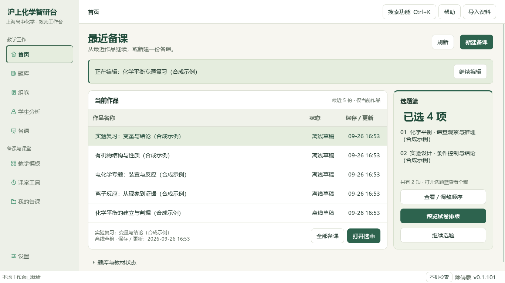
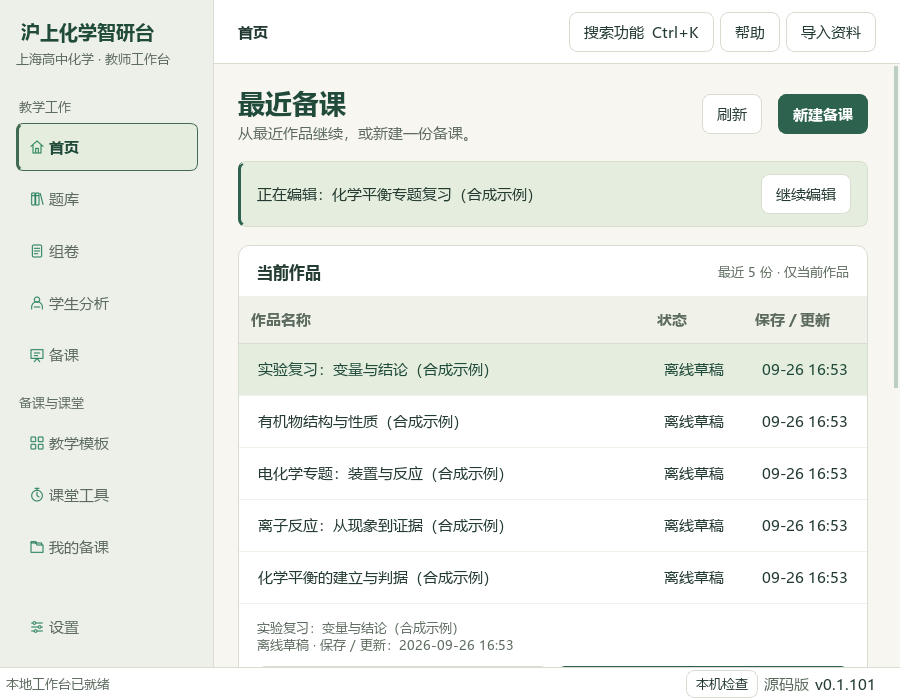

# 原生首页层次与窄窗口验收

本次延续原 PySide6 教师工作台，统一暖白、墨绿、细线边界和焦点状态，保留已验证中文字体及所有原路由。最近作品与真实选题篮仍是首页主体；新增明确读取/失败/空态、完整选中作品信息及 Enter 打开。当前编辑条、作品动作和诊断动作按可用宽度纵排，窄窗隐藏日期列时仍能在选中详情查看日期；五份最近作品在宽窗完整呈现。

## 实际图像

以下为本机原生 Qt 对合成临时资料运行的截图，不是设计稿、真实学生资料或新发行 EXE。没有调用模型。源码仍标注 v0.1.101，不将本次未发包的改动冒充已发布新版本。

## 验证范围

- 最终对比度修正后：首页13项行为/布局测试与中文字体14项，共27 passed。
- 之前相关旧studio/teacher_desk/字体/360窄窗集合33 passed；与前述集合重叠，不相加。一项真实目录扫描相关测试未纳入本机本轮，原目录读取在此私有大库环境超过20秒；本轮不声称完成全库扫描性能验收。新增测试保留合成目录的惰性展开验证。
- 最终9张图覆盖1366×768、900×700、420×700、360×560，以及窄窗选题篮/诊断操作区和空态。中文与化学样本缺字数0；采用 Microsoft YaHei UI，正常次要文字在所用浅色背景的对比度4.69—5.20。
- 主代理已目视宽、窄与360诊断图，核对中文可读、宽屏五行完整、窄屏动作可通过纵向滚动到达。未作全部学校显示器、多屏、真实模型或新EXE验收。

重现命令：`python runtime/deeptutor_shchem/home_dashboard_qa.py --output <new-screenshot-directory>`。使用临时合成个人状态，目录展开以合成返回专门核对布局；不是正式题库读取证明。新主分支 CI 执行首页、续导、安全测试并保留原生截图 artifact。
