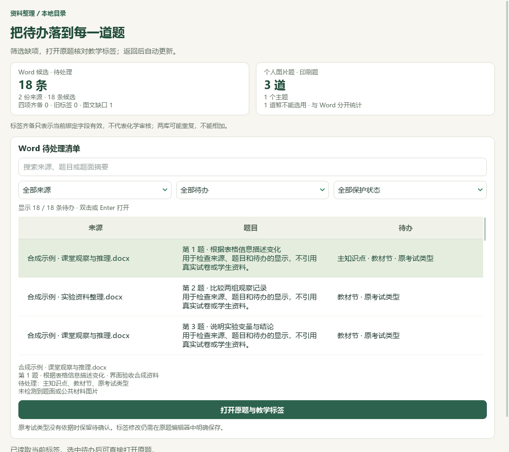
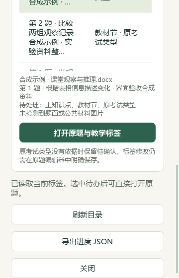

# 待整理清单、离线补标与氮专题验收

日期：2026-09-26。基于已合并 PR #35 的 `c0705ff`，继续维护源码；没有生成新 EXE，v0.1.101 仍是旧发行包。公开内容仅含代码、合成样例、改述知识索引和汇总；完整原题、私有候选、个人数据库、原图与备份留在本机。

## 教师界面

入口：**首页 → 题库与教材状态 → 检查本地题库进度**，或 Ctrl+K 搜索“题库进度”。Word 待办可按来源、缺失字段、教师保护状态及文字筛选，打开指定原题，在既有教学标签编辑器预览并明确保存。关闭原题后重新读取，保持筛选与同题；已解决行消失时选择附近位置。

统计复用现有有效标签投影，校验来源 SHA、题目版本、属性状态及教材目录。主知识点与辅助标签分开，教师确认或固定字段不能被自动补空覆盖。读取失败显示暂不可读，不计为零；停止或失败后的旧导出明确标作“上次快照”。报告包含本机来源名称和题面摘要，界面有提示。

以下为原生 Qt 合成资料截图。1080×960、420×700、360×560 均检查了控件可达及横向溢出；窄窗口使用纵向滚动。它们不是私有全库、真实学生或全系统缩放验收。

视觉题库保持独立统计，本轮未接通其完整修复链。该 UI 的四类待办包含原考试信息；下表仅统计主知识点与教材映射缺口，两者不能混称为同一队列。

## 本机题库增量

本轮检索文章 0、新增试卷 0、重复导入 0。读取已有 98 份解析版资料，当前题目仍为 3573 条，其中 3570 条可选；111 个历史属性键不计为新题。未根据文件名补造原考试信息。

22 道文字题形成 14 道补标候选，经另一模型代理交叉复核后采用；另 8 道涉及题答边界、解析或术语疑点、主考点未定及明确外省来源，保留待核。撤回一处不准确的教材节建议；已有非空标签不在本次自动纠偏范围。

| 本机指标 | 补标前 | 回读后 |
| --- | ---: | ---: |
| 有主知识点建议 | 2751 | 2760 |
| 有教材映射建议 | 2567 | 2578 |
| 缺主知识点 | 822 | 813 |
| 缺教材映射 | 1006 | 995 |
| 至少缺上述一项，去重 | 1255 | 1242 |
| 原考试类型未知 | 2734 | 2734 |

实际只改 14 道题，补 9 个主知识点与 11 个教材映射；其中一道仍缺教材映射，所以待核减少 13 道。其余 3670 条属性记录（含历史键）、9126 条旧历史完全不变，只增加 14 条版本历史。209 个核验输入中只有目标属性数据库改变；原文件、范围及其他受核验状态未变。新队列分为 408 文字、781 需图、50 范围/材料、3 教师保护。刷新旧版本绑定后再次 preview 为 0 变化，数据库未再写入。

这些是自动建议的覆盖数，不是正确率或教师审核数。原题答案的若干条件遗漏、术语和文字错误另存本机待办；未认证原解析。

## 离线候选工具

`runtime/deeptutor_shchem/apply_offline_word_labels.py` 默认 preview；apply 需要准确的计划 SHA 和工作台独占锁。候选绑定当前来源、题目范围、目录及旧属性，证据只能来自完整题面与公共材料；答案和题后材料不能作为分类引文。只补空主知识点/教材映射，使用旧版本比较及整批事务，回读逐条校验，不调用 Provider。

报告路径在创建文件前排除个人状态和资料保留路径。故障回执区分未尝试、提交未知和已提交，保留计划摘要；提交后回读、报告写入/刷新/关闭失败时提示先查标签与历史，不能自动重试。候选、SQLite 备份和全部私有回执位于本机 `outputs/offline-label-review-20260926/`；本次新队列位于 `outputs/local-import-continuation-20260926/run-4/`。

## 氮专题

对照必修一 3.2 节 PDF89—95／印刷84—90七张原页及七幅 Word 关键图，新增 6 条教材研读记录、13 条教学参考（2知识、5方法、4提醒、2个40分钟流程）。原图错误、氨水表述与含四氯化碳的旧装置方案保留限制，不照搬为课堂结论。

13 条已合入代码树和本机派生索引；真实参考服务返回16条，其中13条为本次新增，并关联7条既有教材概念。逐条移除必要证据的13次验证都排除相应内容，来源版本不符返回0条，重复合入新增0。完整 Word、PDF及图片哈希未变，catalog 只追加一条非官方派生记录，109→110条。

46讲合计270知识、102方法、87提醒、22流程；11讲已有流程、35讲仍缺。教材383概念总数不变。全部保持 `human_reviewed=false`，不是整本教材或全讲义审校。

## 验证范围

原生UI、候选事务、教师保护、只读队列及相关回归使用合成数据；真实批次另做数据库备份、逐字段/历史比对及来源哈希核验。最终首页、UI、补标、保护及队列联合集合257项通过；讲义扩展与参考定向集合100项通过；文档集合14项通过。独立审查修复了CLI伪锁及提交后错误状态两个问题。集合有交叠，不将测试次数相加；远端结果见本 PR。

真实资料新增枚举暴露了“扩展可保存、运行时却拒收”的校验缺口。本轮修正氮专题枚举，并在扩展保存前补齐运行时索引合同校验；不放宽读取要求。首次全目录读取曾出现较慢样本，后续两次约14—15秒，未复现死锁，不宣称已完成全库性能优化。

其余题库补标、35讲流程、教师化学审核、新发行包和跨业务完整闭环继续推进。
