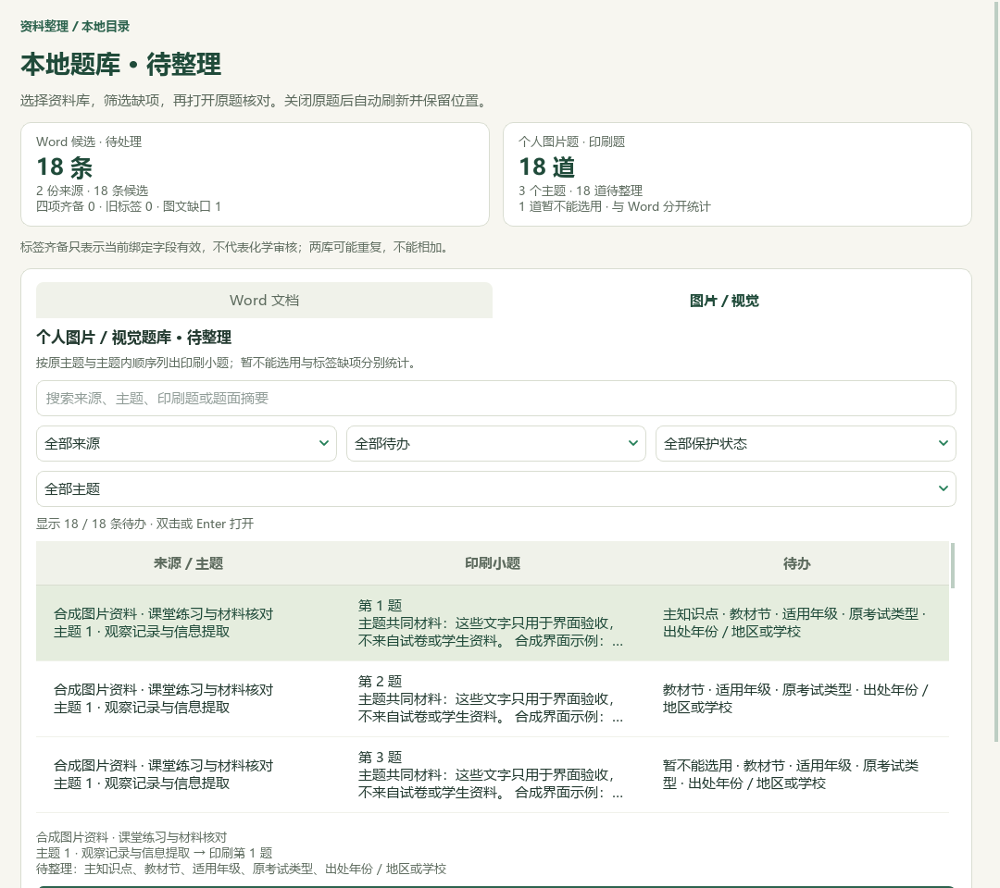
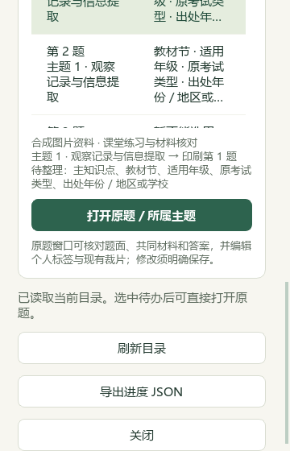

# 图片题待整理、题答边界与浓度专题

日期：2026-09-26。基线为 PR #36 合并后的 main `311008f`。本轮更新维护源码和本机派生资料，未生成新 EXE；v0.1.101 发行包仍保持原版本。

## 教师操作

首页 → 题库与教材状态 → 检查本地题库进度，可在 Word 与图片题之间切换。两库分别保留来源、待办、保护状态和搜索条件；图片题增加真实主题筛选，按候选来源中明确记录的主题及主题内顺序显示印刷小题。缺失顺序继续待核，不由题号或文件名补造。

图片待办可直接打开所选原题与所属主题，沿用既有题面、共同材料、答案、教学标签和个人裁片编辑器。关闭后重新读取，保留筛选与原题位置；该待办消失时转到邻近行。目标已移除或版本变化时提示刷新，不自动选中别题。教师标签、来源版本、裁片回执、取消和关闭后的回调均保留检查。

统计只计当前绑定且可被目录验证的标签；主知识点、辅助知识、教材映射和原考试信息分别处理。读取失败不当零，部分批次不可读时明确说明数量不完整。Word 与视觉题可能重复，数量不能相加。以下是原生 Qt 合成数据截图，不含本机原题或学生资料。

另通过正式服务读取本机目录：Word为3579候选、98来源，6条旧标签确实进入重核待办；视觉为41道印刷小题、5个主题、5个导入批次，未出现不可读批次，仍有1条图文材料待核。正常CAS读取锁照常取得及释放，原件、候选正文、属性数据库、状态和缓存哈希不变。该读取不代替私有资料上的编辑或化学审核。

## 题答边界

某些编号填空题的空格位于名词前，例如“属于……氧化物”，旧规则没有将其识别为题目，导致整道题混入前题解析。本轮要求“编号题干内部空格＋紧邻明确答案标签”才补识别；解析标题、隔着图片或空白的答案、知识标题不作依据。既有整主题和嵌套编号保护继续适用。

98份本机解析版比较：3573→3579条来源内候选，恢复6条索引记录，另6条前题收窄答案范围；3567条内容和版本完全一致。它们包含重复收录，不能称为6道去重新题。受影响旧属性保留在数据库和历史中，以“重核旧标签”显示；不自动迁移到新范围。题目版本按实际范围与内容变化，未让全库标签因规则更新失效。

公众号出处查询词为“2025 上海 化学 等级考 钨 锗”，搜索入口被浏览器站点安全策略拦截；取得文章链接0、阅读全文0、采集试卷0、重复导入0。缺少对应原卷页面、权威原始出处及评分资料，讲义卷名与年份仍只是待核线索。本地修复依据原讲义区块，不认证题目官方身份。

## 本机补标与研读

第二批逐题读取24道文字题，采用14道，仅补13个空主知识点和14个空教材映射。其余10道含明示外省来源、缺单位、解析争议或主标签待定，保留待审。所用引文来自题干和共同材料；答案只用于检查边界与解析风险，不作为分类证据。

数据库事务及回读通过；其他3670条属性、9140条旧历史保持一致，只增加14条版本历史。209个输入核验中仅属性数据库改变；教师字段、原出处及原件保持。按新属性版本再次预览为0项变化。全部仍为自动建议，不认证原解析或教师审核。

修复边界并补标后的当前有效主知识点为2768、教材映射为2588。新增13/14个标签的同时，范围变化使5个旧主知识点、4个旧教材映射暂不计为当前有效，故不能直接将补标数加到旧覆盖数上；旧值和历史未删除。

重新生成的主知识点／教材映射待核队列为1238项：394项纯文字、785项需图片、56项范围或材料不完整、3项教师保护。此队列只针对两个字段，与首页同时检查年级、考试来源及材料的2968项待办口径不同。3579条当前题中，3567条属性绑定仍有效、6条没有旧属性、6条旧属性版本待重核；111条剩余旧键不计为当前题。生成队列只读取209个输入，未调用模型或写标签。

物质的量浓度专题增加13条教学参考（2知识、5方法、4提醒、2个40分钟流程）及6条教材研读记录。教材核对1.3节PDF27—38与目录，聚焦关联PDF34—37／印刷29—32；查看11幅Word图片，其中9幅可读，两幅小公式仍不清楚。区分取样量和浓度、溶液与水的体积、稀释守恒、定量转移与定容，并保留原讲义数值矛盾、仰视错误、热转移条件缺失等提醒。

本机同步与真实备课参考读取已完成：13条新增均能回引，13项逐条缺块检查均排除依赖条目，来源版本改变后引用归零，重复预览新增为0。只改变浓度专题，其余45讲一致；46讲共272知识、107方法、91提醒、24流程，12讲已有流程、34讲仍缺。383个既有教材概念未增加，catalog只追加一条派生材料记录（110→111），原件和个人状态哈希保持一致。全部仍为模型研读候选，human_reviewed=false。

## 验证与范围

宽1080、420、360像素合成窗口检查了横向溢出和动作可达，另覆盖655行筛选及返回、真实标签编辑器保存/取消/失败、重复身份和版本过期。来源读取、题目化学、人工作答评分、跨业务迁移及新发行包仍是不同的验收范围。

18文件联合回归464项通过，涵盖首页、两库待整理、视觉源服务、Word边界及属性、离线事务、讲义扩展与实际参考合同；文档14项通过。测试中修正了两处过期测试设定，并将视觉服务依赖的本机原型合成fixture整理为公开独立测试辅助，28项视觉服务回归可直接运行。此前缺少fixture的收集失败不记为通过；最终联合运行已包含该组。独立模型审查未发现明确新回归，模型审查不冒充真人验收。

公开仓库仅保存代码、合成验收资料、简明改述索引和本汇总。完整原题、候选正文、个人数据库、原图及备份留在本机。完整题库整理与剩余教材深度研读尚未完成。
