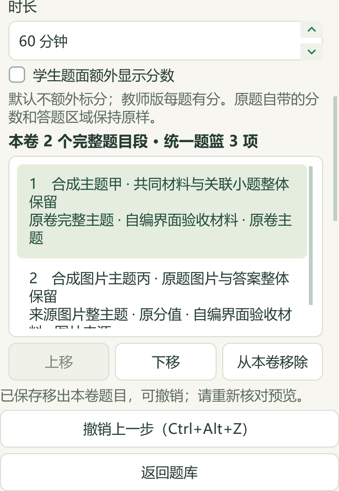

# 当前卷草稿撤销与反应方向研读

日期：2026-09-27。基于PR #49合入main的`9c0504a`。本次更新维护源码和本机候选资料，v0.1.101 EXE未重建。公开内容为代码、合成界面、简明改述索引和汇总记录；原件、题答全文、教材原页与个人数据库留在本机。

## 当前卷编辑、撤销与恢复

组卷工作台支持本次打开期间最近30次成功编辑的撤销，覆盖移除、调序、恢复移除项、配分、支持的答题行数及卷面设置。按钮与Ctrl+Alt+Z恢复前一步和选中项；输入框的Ctrl+Z保留。返回题库再进入时，同一工作台会话且来源、草稿未变化可继续使用历史；关闭后历史清除，已保存草稿保留。

每份草稿独立保存修订号和内容摘要，写入在现有协作锁内比较当前版本与题篮身份。其他草稿、设置或预览记录保存不使本卷历史失效；本卷或题篮变化、读取失败、无法确认的保存均使旧历史失效，不自动重试。草稿版本进入预览与确认记录，保存预览、分页、读页及确认的最终检查与记录保存共用状态事务；导出沿用原服务的来源复核。撤销回到相同内容也不会复用旧确认。

旧稿版本或来源身份不兼容时，页面提供“保留旧稿并重新开始”。教师确认后重新读取正式来源投影，与确认前提案一致且草稿、题篮版本仍匹配时，才在同一事务中保留旧记录并写入默认新稿；取消、并发变化和保存不确定均不重复执行。不可读取的状态文件不会被自动修复。每次撤销不重新读取全部原文件，原件核对仍由来源读取与预览、导出流程承担。

小窗口将长内容放在滚动区，保存状态、撤销与返回题库固定在下方。长题目标题和来源换行，配分标签使用全宽行。跨窗口撤销历史、独立于全局题篮的当前卷、完整细目表仍待推进，D05保持部分完成。

本轮覆盖当前混合组卷工作台，旧的仅原卷编辑器未加入撤销。保留的旧稿是本机状态记录，暂未提供专门的归档浏览或恢复界面。

实际Qt 2×合成截图共10张，覆盖360×520、420×520和900×650；主代理实际查看8张，公开3张。全部10张通过状态完整、撤销与返回可见及滚动操作可达检查。首轮截图容器背景不适合展示，最终使用带应用背景的窗口重新拍摄，未修改图片像素；截图不代表真实题图或EXE验收。

可对照[配分与答题行数设置](screenshots/2026-09-27-draft-undo/score-layout-bottom-420x520.png)及[旧稿保留后重新开始的入口](screenshots/2026-09-27-draft-undo/source-restart-bottom-360x520.png)。

## 本地题库补标

完整核读24题的92个题面块和48个答案块，共140块，含5×5、3×4两张原生表格。20题补9个主知识点、18题教材映射，新增21处章节链接；其中3题另行纠正旧自动主标签。4题因化学前提或参考答案存在疑点继续待核，未改写原题和答案；其他保留的命名、方程式或重复解析问题随证据记录。

20个不同属性记录发生预期变化。补缺和显式重核共新增23条历史，原9402条逐条保留，现9425条；各阶段回读符合预览，重复预览均0变更。765项保护路径中仅标签数据库发生本阶段计划内变化，教师字段、题答和难度字段保持。标签仍为AI候选，模型复核不等于教师审核。

只读刷新98份来源、3579题（3576题可选）：主知识点2919题、教材映射2794题，仍缺660、785。去重待办990题＝纯文字146＋图像785＋范围/材料56＋受保护3；来源SHA和当前题目key重复均0，不代表已经完成语义去重。资料不按地域排除。

下一批从146条纯文字待办中排除122条，选取24题、4份来源；7题此前仅排队未读，17题此前未排队。历史身份账分开保留已读310个（已采用277、暂缓33）与仅排队11个，已读及暂缓身份均不重新选入。本次只准备元数据，没有阅读新题正文、生成标签或应用。

## 焓变、熵变与反应方向

PKG-082新增11条教学参考：3知识、4方法、2提醒、2个40分钟流程；另有5条教材研读。主代理完整读245个原生文字区块，实际查看选必一PDF33—37页（印刷27—31）及PDF121页（印刷115），查看30/88个缓存图引用，含17个WMF确定性渲染引用。58个缓存引用、41个OLE二进制及1个额外原生媒体对未读；两处单位分隔字形依赖原生题干核对，不声称全Word视觉审核。

新增内容区分反应方向、平衡和快慢，使用焓熵联合判断、单位换算、给定温区与近似边界；不把持续加热、放热多少或动力学能垒直接当作自发性判据。教材水分解熵变与附录数据冲突、丁烷燃烧式不配平等疑点保留，对应数值未采用。原解析锡转化的单位换算和数值问题另行复算，催化路径按各自前驱态计算能垒；来源错误不静默修成“原答案”。流程尚未经过课堂试教。

实际备课入口回读旧7条与新增11条，关联3条既有教材概念；11项逐条删除必要依据区块的检查均排除对应新参考，来源版本失配时参考与概念归零。CODE与DATA重复合入均0新增，其他45讲及383条概念保持。46讲累计300知识、171方法、127提醒、52流程；24讲已有流程、22讲待补。

知识同步阶段812项保护输入保持，包括196份原Word及副本、488份个人状态文件；资料目录仅追加1条派生候选，122→123。全部新增知识与标签仍为`candidate_only=true`、`human_reviewed=false`。

下一章“晶体与金属晶体”仅完成来源、缓存和目录页准备，现有5知识、1方法、2提醒、0流程未改变。410个区块和179个缓存媒体引用尚未开始正文阅读；选必二PDF75—83页是后续主阅读计划，不是本轮已读页。

## 验证与后续

UI、状态、混合组卷等14个测试文件共377项通过；知识、消费者与标签相关6个文件324项通过；文档与发行边界34项通过，文档规则检查通过。三组共735个不同用例，Qt 2×专项30项为重叠验证。详细范围见[机器可读记录](2026-09-27-draft-direction.json)。新增CI覆盖草稿撤销、恢复冲突与Qt 2×合成窗口。

本轮公众号检索0、新收集试卷0、真实模型供应商调用0；GitHub版本操作有网络请求。私有回执位于本机`outputs/offline-label-review-20260927-batch13/`、`outputs/local-import-continuation-20260927-run12/`、`outputs/reaction-direction-distillation-20260927/`及`outputs/draft-undo-direction-live-20260927/`。剩余990题待办、22讲流程、复杂对象和图像题仍须继续处理。
