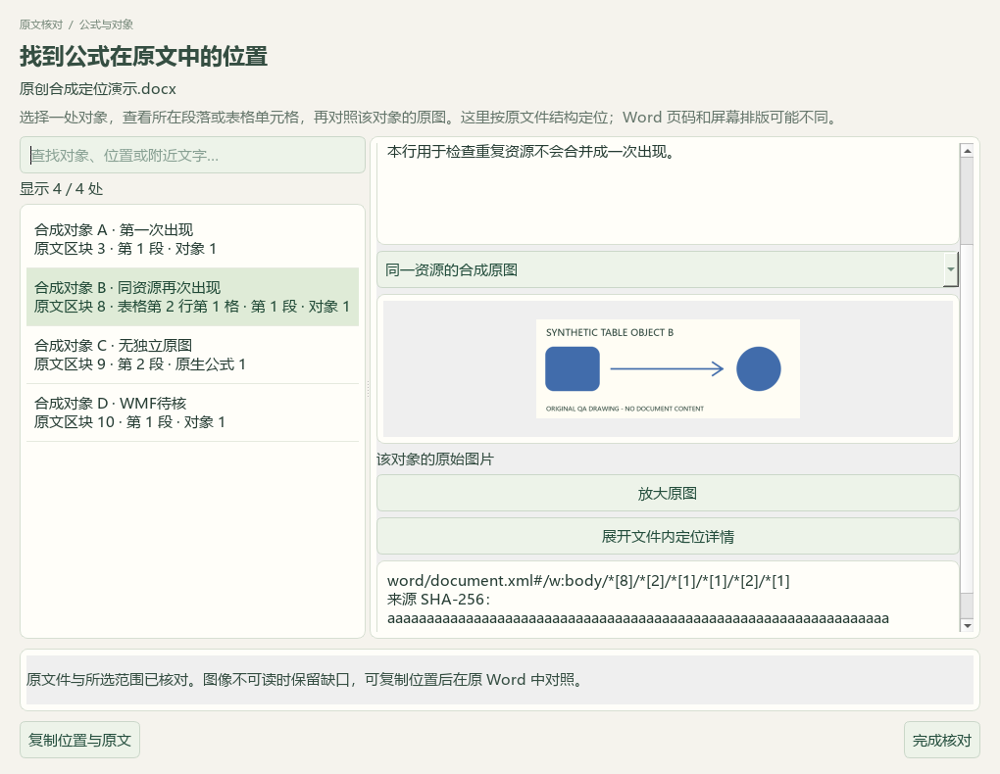
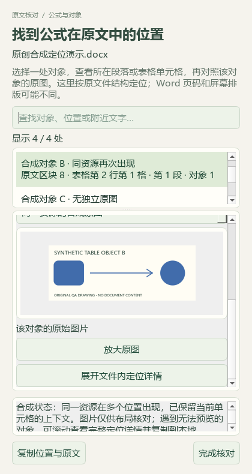

# 公式对象定位、题库补标与盐类水解研读

本轮基于 PR #41 合入 main 的 `1e9c051`，属于维护源码。公开内容为代码、合成截图、改述索引和验收摘要；原教材、原题、个人数据库、备份及逐题证据留在本机。v0.1.101 EXE 未重新打包。

## 原文位置与核对窗口

完整教案阅读器和选段区、Word题面/答案页新增公式与对象定位入口。每一次出现均由来源指纹和XML路径绑定，列表显示具体正文段落、表格行列、合并单元格或嵌套表位置。右侧保留相应原文、可读取的本对象图片及隐藏、修订、兼容显示分支提醒。搜索、原图放大、位置复制和窄窗口上下布局已接入，展开技术详情才显示文件内路径和指纹。

图片绑定检查明确的图片关系类型、内部包资源及哈希。旧OLE替代图必须匹配唯一ShapeID、最近对象/图形宿主和兼容分支；无法证明归属就保留缺口。复杂域仅定位其指令或边界节点，不声称完整起止范围已验证。多个位置使用同一资源时仍分别列出。过大的定位结果要求缩小区块，后续读取图片也限定在相应区块。

每次定位和读图重新核对来源、预览版本与范围。题面入口保留共同材料，答案入口只读答案；同段题答的文字切分不能证明对象归属时，明确要求回完整教案核对。缓存缺失或损坏仅在内存重读，不修补缓存。迟到回调、切换对象、来源失败和关闭窗口会清除旧图或失效请求，查看对象不会修改备课选段。

实际本地讲义的9个选定区块返回14处对象（13个图像节点、1个OLE节点），全部XML路径可解析且出现标识不重复。11个图片资源共12处出现逐次读取并核对字节哈希；原件、catalog及488个个人状态文件均未变化。这是来源结构和读图链验证，不是完整Word页面或全部OLE内容的视觉核验。C04继续为部分接通，Microsoft Word中自动选中对象仍待实现。

## 本地题库增量

本轮检索文章0篇、新采集试卷0套，没有新增原题归档。主代理阅读24题完整题干、选项、相关表格和来源答案，按题面证据填18个主知识点、20处教材映射；6个旧主知识点和4个旧教材映射保留。事务提交及回读通过，重复预览0变更，其他3660条属性和9224条旧历史保持，新增24条历史。271个既有保护路径中仅指定属性数据库变化，3个原先不存在的状态文件仍不存在。

来源中的自发反应焓符号推断、不同计量关系的溶度积比较、滴定读数条件等疑点另存，不改写原答案或视为通过化学审核。地方和全国资料继续使用同一核对流程，不猜测原考试身份，不增加教师确认或难度标定。

98来源仍有3579道当前Word题，主知识点2839、教材映射2673。至少缺一项标签的待办1145：纯文字301、需图像785、范围/材料56、受保护3。原考试类型已知837、未知2742；111条旧属性记录不计新题。新队列生成时209个输入哈希保持不变。本轮没有向中央正式题库新增条目。

私有证据位于 `outputs/offline-label-review-20260927-batch6/`，续处理清单位于 `outputs/local-import-continuation-20260927/run-4/`。

## 盐类水解教材研读

主代理逐页查看选必一3.3节PDF74—80（印刷68—74）7张原页，读取208个关联Word区块并查看11个媒体引用（9份不同字节内容）。讲义共558个原生区块；本轮没有阅读全文或完成整份Word渲染。143个WMF引用及171个OLE对象的视觉内容未核验，未查看的207个媒体引用继续保留缺口。第474块的小图仅支持加热符号，不能据此宣称整条反应箭头已核对。

新增13条教学参考：3条知识、5条方法、3条易错/待核提醒、2个40分钟流程；另有7条教材研读记录。覆盖盐电离与水解、计量点/终点/中性区分、分步水解、常数和守恒、稀释程度/浓度/物质的量区分及实验应用。主代理复算浓度近似下KhKa₂＝Kw、乙酸钠十倍稀释模型、教材高温Kw和半滴滴定模型；计算与题给数据分别标明。

第436块原图的浓度比可化为1/Ka₂，来源解析却称同温加碱后减小，该矛盾未采纳为知识结论；两处0.1 mol/L碳酸氢钠的不同pH分别保留。Fe³⁺颜色、草酸氢盐酸性、pH阈值和蒸干/灼烧条件均保留限定，未据答案填补未读公式。

实际备课入口可读取本讲21条参考，其中13条新增，并关联4条既有教材概念。替换来源预览版本时排除引用，逐条移除必要依据时相应新参考排除；重复合入0新增，其他45讲保持。同步时767个保护文件不变，包括196份原Word、488个个人状态文件；catalog由114至115行，仅新增声明范围的派生候选包。

46讲合计281条知识、129条方法、106条提醒、32条流程建议；16讲有课时流程、30讲仍缺，教材概念仍383条。所有新增内容保持 `candidate_only=true`、`human_reviewed=false`。没有全局技能安装、自动路由、真实供应商调用或课堂效果验证。私有页图、复算和备份位于 `outputs/salt-hydrolysis-distillation-20260927/`。

## 验证与待办

回归覆盖XML对象归属、复杂表格、原生文字、题答边界、版本变化、缓存只读、异步失效、窄窗/最小尺寸、原文选择、来源读取、标签事务、教材索引和引用排除。同步更新一项旧材料长度测试：在现行40000字上限内完整保留内容，超限明确拒绝，不再使用旧固定样本作为超限判断。运行数量和文档检查见[结构化回执](2026-09-27-formula-location.json)。

11张合成截图包括加载、成功、重复图引用、无对象、来源失败、WMF不可读、无独立图、无搜索结果、420像素窄窗及420×580最小窗口。模型检查不等于人工化学验收。后续仍需处理1145项标签待办、复杂材料与图像质量，补齐30讲流程，并推进其他尚未接通的业务和新版EXE验收。
