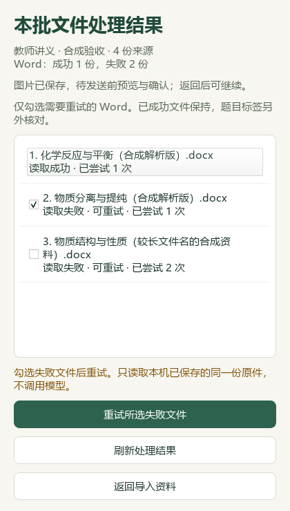

# 导入批次恢复与弱电解质章节候选

本轮基于 PR #38 合入后的 main 开发，不改变已发布 v0.1.101 EXE。测试使用临时合成资料；本机教材候选同步另有私有备份和哈希回执。公开仓库仅保存应用代码、合成截图、改述索引及下述结果摘要。

## 导入与界面

- 导入窗口保留历史批次选择，能查看每份 Word 的结果，并勾选失败文件重试。重启后读取实际批次结果，修复“Word部分失败却显示整批完成”的问题。
- 重试核对同一份原件、所选失败身份及当前结果版本；已成功缓存不重新解析，未选择的失败项不变。同名文件的内部身份保持稳定。
- Word与图片结果分别保存。Word重试不改像素、视觉候选及版本；图片已完成时，即使 Word失败或桌面摘要尚未刷新，也不能重复发送。
- 本机重试有进程锁，批次回执的比较与替换有独立短时锁。原生结果先写成功而外层回执中断时，可通过刷新重试复用缓存。旧批次会先保存来源绑定的失败清单，历史尝试次数缺失时显示“未记录”。
- 360、420与900像素宽度截图核对了文件名、状态、选择框和操作按钮；修复复选框挤占宽度后状态行被截断。历史入口另以540像素窗口核对。截图全部为合成数据。

视觉任务目前仍是整批续做，尚未持久化成功分片以便只重做失败分片。批次回执损坏、原件变化或成功缓存无法核验时仍需先处理相应问题。文件读取不等于题答完整、化学正确或教师核验完成。

## 本机教材和题库

本轮不新增外部采集：检索文章0篇、新试卷0套、无重复试卷归档。弱电解质候选只使用本机既有教材与PKG-056讲义；归档目录为`sh-chem-db/05_命题热点素材/教材研读候选/`，catalog从112行增至113行。原出处、年份和发布日期缺失仍标待核验。

选必一3.2节PDF70—73（印刷64—67）形成13条新教学参考与7条研读记录，包含两个40分钟流程。候选绑定讲义SHA、区块提取版本和教材页码；关键讲义图实际查看3/134幅，不能称全讲图像已审完。教材表和公式中的碳酸Ka₂末位不同、讲义温度通则与近似条件等继续保留限制。

实际备课读取包含新增13条，目标讲义共26条参考并关联4条既有教材概念。更改来源版本后旧引用归零；逐条删除一个必要区块，13条对应参考均被排除；重复扩展预览0新增。其余45讲及383条教材概念不变。全部仍为`human_reviewed=false`。

当前46讲合计276条知识、118条方法、99条提醒、28条讲练建议，14讲有流程、32讲尚缺。753个受保护文件哈希保持，包括196份原Word和个人状态；本轮未改个人题库标签，3579条Word候选及1217条待办沿用前轮。另准备24题的来源证据，尚未生成或采用新标签。

## book2skills试点

按最匹配名称评估 [simbajigege/book2skills](https://github.com/simbajigege/book2skills/tree/e5ba66cac91c857dce254dc6b6195d52201068d8)，复用其“明确适用范围、证据、判断过程与评价标准”的组织方式。创建[弱电解质章节试样](../../knowledge/skills/weak-electrolyte-equilibrium-chapter/SKILL.md)与来源映射、判断路线和5个合成评测用例。格式检查通过；数学数值检查与独立模型行为评测分别记录，后者尚未执行。

当前没有发现可直接对任意教材自动完成化学蒸馏的专用入口。本试样自行编写，未安装全局技能、未改应用模型路由，未运行上游Claude优化/评测脚本，也未上传本机教材。它不表示读完或蒸馏完整教材。

## 验证

最终回归数量和数值检查见[结构化记录](2026-09-27-import-retry.json)。本机验收报告保留在私有outputs中，CI再次以当前PR提交执行合成回归与截图。README完整性和文档策略均须通过后提交。Qt截图与模拟模型接口不代替真实供应商或新EXE验收。
