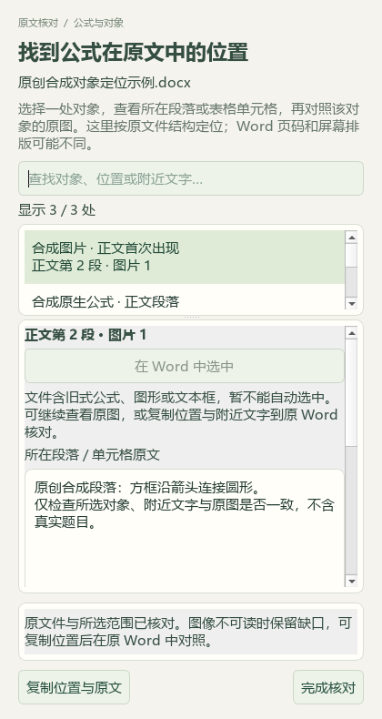

# Word兼容预检、24题补标与原电池研读

本轮以 PR #43 合入 main 的 `b3e165b` 为基线，属于维护源码。公开内容仅含代码、合成界面、改述候选知识与汇总；原件、题答、XML、个人数据库和备份保存在本机。v0.1.101 EXE 未重建。

## 自动定位前先说明支持情况

位置窗口按当前文件哈希、来源版本及对象位置检查兼容性，支持时才启用“在 Word 中选中”。缺失、旧版、字段不完整、类型不符或重复对象的预检结果均降为不可自动选中，不影响原图、上下文和复制。预检每次打开位置窗口执行一次；读图不重复运行。实际选择仍独立核对原件、Word内容及选区，预检通过不等于选区已经通过。

默认页面使用受控中文原因，原 XML 路径及包内位置放在折叠详情，复制仍保留完整定位证据。后续 Word 回读的文档变化、对象类型、出现位置或选区不符等错误，也按原因显示中文，不直接回显内部诊断。420像素窄窗与420×580最小窗口保留滚动详情和底部操作。

## 当前讲义的真实兼容限制

98份讲义原先都在 `xml_non_element_node` 首拒。逐文件检查确认它们各有一个位于正文外的文档根层注释。现仅允许这种惰性位置，不删除或重编号节点；正文内注释、其他非元素节点及未知结构仍拒绝。Word Flat OPC 只允许观察到的精确单一前导 `mso-application` 指令，源包及其他位置不放行。

修复后再跑当前生产预检，98份仍全部被后续门槛拒绝：复杂对象/兼容结构50，域或其他活动/修订结构47，旧式图形1。这是首个拒绝原因分布，同一文件还可能含其他限制；不能相加诊断对象总量，也不能称这98份已支持自动选中。196源文件/归档副本与8项元数据输入哈希不变。C04仍部分完成。

本机 Word 16.0.20326 对带根层注释的自造DOCX完成6个实际隐藏窗口选区回归：2个同段重复图片、1个正文OMML、2个表格图片、1个嵌套表图片。选区10–11、19–20、35–44、58–59、67–68、76–77全部回读通过，源哈希保持，每轮自有实例退出，最终Word进程数0。另回放16组既有合成快照与内存注释变体，22个既有捕获文件哈希不变。没有打开真实教学原件；可见窗口交接未在此次真实Word实测，仍以既有控制流测试覆盖。

## 本地题库补缺

逐题读取24题完整题面、选项与答案后，新增15个主知识点、19题教材映射，共24章节链接。保留原有9个主知识点、5题非空映射；其他3660条属性、9272条旧历史不变，新增24条历史。270项保护输入仅授权的属性数据库变化，3个原先不存在的路径仍不存在；回读通过、重复预览0变更。

识别到4处已有自动标签疑点，另建待复核清单；本轮只补缺失字段。原解析的方程式系数、下标、反应方向或答案说明矛盾单独保留，不以补标签背书源答案。

只读队列为98来源/3579题，主知识点2873、教材映射2708；1097待办＝文字253＋图像785＋范围/材料56＋受保护3。原考试类型已知837、未知2742，111条旧键不计当前新题。不按地域排除，未向中央正式题库新增原题。私有证据为 `outputs/offline-label-review-20260927-batch8/`，队列为 `outputs/local-import-continuation-20260927/run-6/`。

## 原电池与化学电源

新增2知识、5方法、4提醒及两节各40分钟流程，共13条教学参考，另有7条教材研读。主代理逐页查看选必一4.2 PDF95—105（印刷89—99），读取165个关联原生区块并查看14个图像引用。委派阅读覆盖403个原生文字区块；这不等于完整Word视觉核验。60个其他栅格图引用、41个WMF、51个OLE、2个未渲染OMML及一个未访问外链继续留作缺口；透明图仅采用可辨标签。

独立核算酸碱介质下甲醇反应、带电碳燃料电子数、铁离子浓度与两极计量、嵌锂质量及铜电极增重。原讲义熔融碳酸盐氢气式多写水、含锑固体式少氯离子系数、O₂与NO₃⁻电子数比较颠倒，均保留源文并在派生提醒中区分独立推导。没有用电流归零单独证明平衡，也没有从未知隔膜图猜其选择性。

实际备课入口回读本讲21条参考，其中新增13条，关联4个既有教材概念。版本失配时引用归零；逐条移除所需区块，相应13条新增参考均排除；重复合入0新增。其他45讲、788个保护文件（含196原件/副本与个人状态）不变。catalog116→117，只增加派生候选记录。

46讲合计285知识、139方法、114提醒、36流程，18讲有流程、28讲待补；383教材概念保持。全部新增内容为 `candidate_only=true`、`human_reviewed=false`。没有真实供应商调用、课堂效果验证或全书完成声明。私有原页、复算、保护快照与同步回执在 `outputs/galvanic-cell-distillation-20260927/`。

联合回归638项通过，文档与策略结果见[结构化回执](2026-09-27-native-word-compatibility.json)。10张公开截图均为合成材料与假回调，已由主代理查看，不是实际Office或私有题库截图。复杂原件定位、1097项标签待办、28讲流程及其余业务继续推进。
