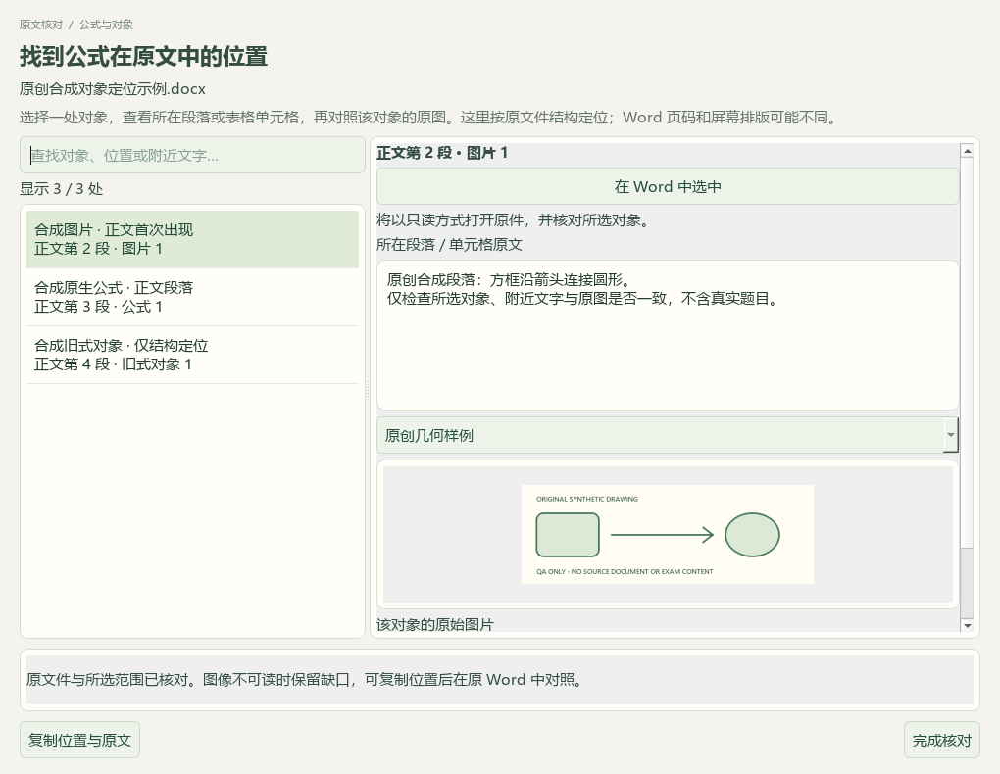
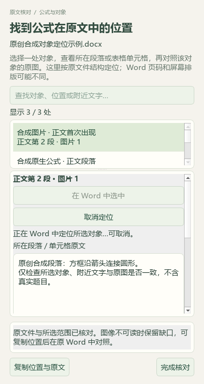
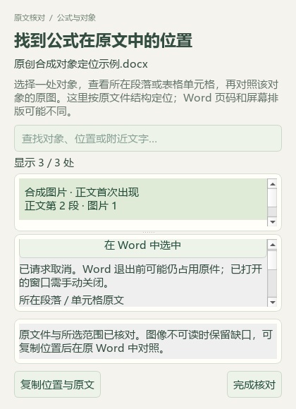

# Word原件选区、24题补标与沉淀平衡研读

本轮以 PR #42 合入 main 的 `99a84c8` 为基线，属于维护源码。公开仓库只保存代码、合成截图、改述知识与验收摘要；原件、逐题证据、完整XML、个人数据库及备份留在本机。v0.1.101 EXE 未重建。

## 只读原件中的实际选区

完整教案与Word题面/答案中的对象窗口增加“在 Word 中选中”、取消和处理状态。后台核对具体对象、来源版本和题目范围；成功后才显示只读原件。选择图片、搜索、关闭或取消会使旧回调失效。420像素窄窗和420×580最小窗口保留可滚动的状态/取消入口及固定底部动作。

映射使用原DOCX、Word完整Flat OPC、原生InlineShape/OMath范围及其前后前缀，不以纯文字长度推算位置。图片资源字节、顺序、容器和独立出现身份共同核对；同图重复出现不会只按图片哈希选第一个。Word在表格中的前缀可能扩张到整张外层表，只有严格匹配此结构并且完整文档内的docPr身份唯一时允许定位。

本机 Word 16.0.20326 对一个自造DOCX的6个对象完成真实服务回归：同段重复图片2个、正文OMML1个、表格图片2个、嵌套表图片1个。选区分别为10–11、19–20、35–44、58–59、67–68、76–77，均为主文档范围。选中后再次核对完整内容、实际选区XML及前缀，原文件SHA保持一致；每次请求关闭自有隐藏实例，最终Word进程数为0。此次真实回归使用隐藏窗口，窗口可见交接与取消等控制流另由假Word对象测试，未声称完成真人Word窗口验收。

实测发现Word会自动改变rsid、显示设置及部分编辑元数据；早期原始XML字符串比较因此误报变化，失败记录保留。最终通过受限的语义核对再次验证选区，不笼统删除所有ID；docPr及图片字节仍参与身份核对。Word退出存在延迟，未退出前再次点击会给出等待提示。

打开前检查整个包，外部关系、宏、活动嵌入、字段、修订、隐藏内容、兼容分支、浮动图和未知结构均拒绝。表格OMML也因不能证明唯一选区而拒绝；合并单元格只有合成XML覆盖，本轮未作真实Word实测。C04仍部分完成，现有旧式讲义不能据上述合成结果认定全部可自动选中。

新建实例启用宏禁用和禁止自动更新链接；已有Word进程时不打开另一个文档。退出前重新核对实例仍隐藏、未被接管且只含本次只读文档。超时不会杀掉仍在COM中的helper，也不会强制结束Word；取消标记和会话占用保留至helper退出。宿主先退出时，helper在释放句柄后清理其独占临时目录。被用户接管或无法确认的实例保留，等待本机处理。相关属性行为依据微软的 [UserControl说明](https://learn.microsoft.com/en-us/office/vba/api/word.application.usercontrol)、[只读打开接口](https://learn.microsoft.com/en-us/office/vba/api/word.documents.opennorepairdialog) 和 [AutomationSecurity说明](https://learn.microsoft.com/en-us/office/vba/api/word.application.automationsecurity)。

## 本地题库

本批逐题读取24份题面、选项及答案后，只补缺失字段：新增19个主知识点、16题教材映射，共18处章节链接；保留已有5个主知识点、8题教材映射。其他3660条属性与9248条旧历史不变，新增24条历史，重复预览为0变更。原解析中答案与解释不一致、己二腈下标缺失及条件不足等问题另记，未改原题或背书源答案。

最新只读队列统计98来源、3579道当前Word候选，主知识点2858、教材映射2689。1121项标签待办分为纯文字277、需图785、范围/材料56、受保护3；原考试类型已知837、未知2742，111条旧键不计新题。不按地域排除，本轮未向中央正式题库新增条目。私有证据在 `outputs/offline-label-review-20260927-batch7/`；最新队列在 `outputs/local-import-continuation-20260927/run-5/`。

## 沉淀溶解平衡

新增2条知识、5条方法、4条易错提醒与2节各40分钟流程，共13条教学参考；另有7条教材研读记录。主代理逐页查看选必一3.4 PDF81—86（印刷75—80），读取123个关联Word原生区块及8个不同媒体引用。委派阅读另外覆盖全部295个原生区块和45个PNG/JPEG引用，但不等于主代理阅读整份Word或完成全部图形核验；128个WMF引用、131个OLE对象仍未解读。

独立复算Mg(OH)₂的4s³与25℃pH、洗涤损失比约953、铁/铜选择性沉淀边界、BaSO₄/BaCO₃转化K＝0.04及过量银离子干扰。来源中“平衡只受温度”“曲线上方总为过饱和”等概括与不守恒反应式保留为待核提醒；不同来源常数分别记录。所有近似、温度和原创反例均明确标注，未从答案补出缺失公式。

实际备课入口读取本讲21条参考，其中新增13条，关联3条既有教材概念。来源版本失配时排除引用，逐条移除必要区块时相应新增参考排除，重复合入0新增；其他45讲保持。同步时770个保护文件不变，含196份原Word与个人状态；catalog仅新增一条派生候选记录，115→116行。

46讲合计283条知识、134条方法、110条提醒、34条流程；17讲有流程、29讲待补，383条教材概念不变。全部新增知识和标签均为 `candidate_only=true`、`human_reviewed=false`。没有真实模型供应商调用、新EXE、全书完成或课堂效果验证。私有页图、复算与备份在 `outputs/precipitation-equilibrium-distillation-20260927/`。

## 验证边界

联合回归与文档检查数量见[结构化回执](2026-09-27-native-word.json)。7张公开截图仅含合成题目与假回调，不冒充真实Word窗口或私有题库截图。仍需继续复杂旧式对象定位、图文缺口、1121项标签待办、29讲流程及其他未完成业务。
