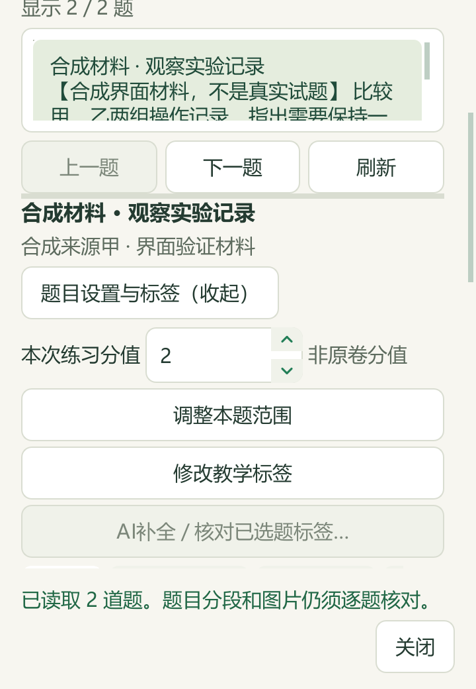

# 小窗口逐题阅读与工业反应研读

日期：2026-09-27。基于PR #47合入main的`59f20dc`。本次交付维护源码及本机候选资料；v0.1.101 EXE未重建。公开文件只含代码、合成界面、简明改述索引和汇总计数，原Word、教材原页、题答全文及个人状态留在本机。

## 逐题阅读窗口

逐题阅读器在实际360×520和420×520窗口下保留同一状态提示与关闭按钮，正文可滚动；长题面和答案继续分别滚动。阅读区随可用高度调整，空态收起多余空间，已有全库选题预览保持正常阅读高度。“题目设置与标签”“用所选题备课”显示中文展开/收起并同步可访问名称，展开后滚至对应区域。

来源限定、完整题面与答案预览、明确确认入篮、备课确认前重读、先保存再关闭、写入时拒绝关闭及迟到回调保护均保留。原来源无题时明确显示空态，其他来源的已有选择仍可预览。

可对照[长题顶部](screenshots/2026-09-27-reader/reader-ready-360x520-reading-top.png)、[长题末尾和合成图](screenshots/2026-09-27-reader/reader-ready-360x520-reading-bottom.png)、[备课确认](screenshots/2026-09-27-reader/reader-preparation-360x520-bottom.png)、[原来源空态](screenshots/2026-09-27-reader/reader-source_empty-900x760-whole.png)及[完整错误提示](screenshots/2026-09-27-reader/reader-error-360x520-bottom.png)。这些截图均使用合成内容，不代表真实题图质量验收。

112项不同UI契约通过，其中32项新增阅读器检查；新增32项在Qt 2×下复验通过，不重复计数。最终捕获26张图，主代理实际查看并公开6张；26张文件哈希、逻辑尺寸、像素尺寸、状态/关闭完整性和横向溢出均核对。覆盖360×520、420×520、900×760、1200×820，另有759/760布局断点测试。最小尺寸设置为320×440，但未将该尺寸列为视觉验收通过。全局密度、系统缩放和多显示器仍需继续验证，G02保持部分完成。

## 题库补缺和旧自动标签重核

完整核读24道纯文字题的100题面块、52答案块，其中含3个原生表格；这些题没有绑定公共材料范围。21题补9个主知识点、15题教材映射，共18个章节链接；另对其中4题进行显式自动重核，纠正3个主标签、1题教材映射。新主标签与已有辅助标签重合时，按既有规则移除1个重复辅助标签，原证据保留于历史。

3题因选项唯一性、固相反应条件或无水产物条件不足继续待核。原答案不改，教师字段和其他3663条属性保持。两阶段共新增25条历史，原9346条逐条保留，现9371条。应用前有独立SQLite备份与来源/属性版本预览，应用后回读符合计划，两阶段重复预览均0变更。每阶段786项保护输入仅个人标签数据库发生预期变化。

只读刷新98份来源、3579道候选题（3576道可选），主知识点2905题、教材映射2754题，分别仍缺674、825。去重待办1033题：纯文字189、图像785、范围/材料56、受保护3；来源SHA及当前题目key重复均0。资料不按地域排除，覆盖数量不等于化学正确率。

## 硫酸工业与合成氨

PKG-092新增13条教学参考：3知识、6方法、1提醒、3个40分钟流程；另有9条教材研读。主代理完整读281个原生区块、选必一PDF52—58页（印刷46—52）和必修二PDF60—67页（印刷56—63），实际查看26/94个缓存图引用，含14个由原WMF确定性渲染的公式引用。起草代理另查看过1个小箭头，但未能确认其内容；不计入主代理的26个已读引用。

内容包括制酸的物料与换热路线、净化和尾气治理的不同目的、合成氨分离循环、固定条件的表格比较、恒温恒压Q/K以及经验速率式。数值独立复核：合成氨题各加1mol的Q/K为169/270，各减1mol为147/50；两组不同熵变分别得ΔG约−33.3364与−32.8kJ/mol。结果保留各自条件；热重残重不足以唯一指定气体产物配比，原图H₂单位遮挡及经验v未定义为单向/净速率继续保留，不用源答案补缺。

主代理未读68个缓存图引用，52个OLE二进制仍未解析；已查看部分OLE预览公式不等于解析全部二进制。全文文字阅读不等于全Word视觉审核，也未声称全书完成。

实际备课参考回读旧8条和新增13条，关联7条既有教材概念。13项逐条删除必要依据区块的检查排除了对应新参考；来源版本失配时参考和概念归零。CODE与DATA重复合入均0新增，其他45讲及383条概念保持。此前还通过20项消费者内存投影检查，投影不计作正式应用。

46讲累计294知识、161方法、123提醒、47流程；22讲有流程、24讲待补。知识同步阶段820项保护输入保持（818个文件、2个缺失路径），含196份原Word及副本、488份个人状态文件；目录仅追加1条派生候选，120→121。全部新增标签和知识仍为`candidate_only=true`、`human_reviewed=false`，模型复核不等于教师审核。

## 检查范围与剩余工作

本机190项不同功能测试通过（UI112、知识78）；文档14项及文档规则检查另计。Qt 2×复验32项包含于UI112。CI新增阅读器几何/动作检查和合成截图步骤，[机器可读记录](2026-09-27-reader-industrial.json)保留实际范围。

本轮公众号检索0、新收集试卷0、真实模型供应商调用0，未进行新的外部化学资料核验；GitHub同步和CI产生网络请求。题库回执在本机`outputs/offline-label-review-20260927-batch11/`，只读待办在`outputs/local-import-continuation-20260927-run9/`，教材回执在`outputs/industrial-reactions-distillation-20260927/`，UI验收在`outputs/reader-industrial-live-20260927/`。

1033道标签待办、24讲流程、暂缓题答案疑点、复杂Word对象和图像题证据核对仍须继续推进；本轮没有新增试卷或将下一批元数据准备算成题目已处理。
