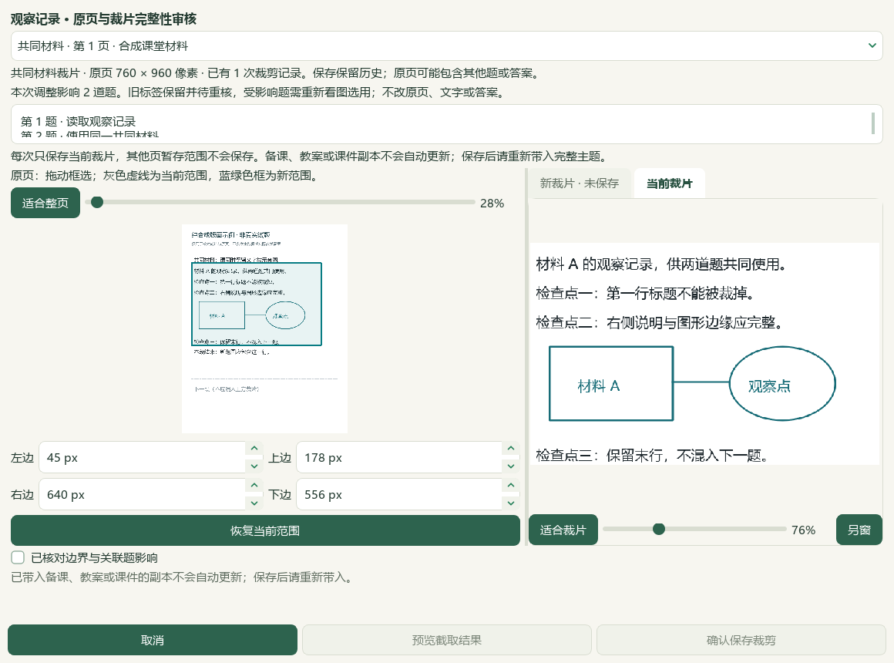
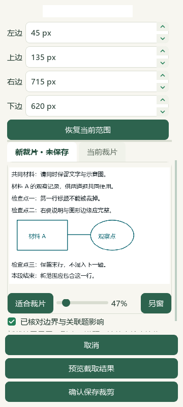
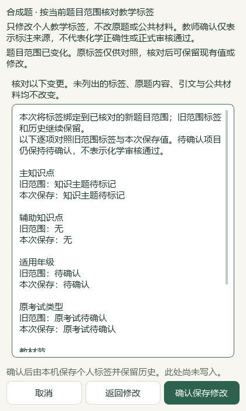

# 原页裁片审核、Word 范围重核与本地资料整理

基线为已合并 PR #37 的 main `a8b172d`。维护源码使用现有本机资料，v0.1.101 EXE 保持原发行版。本轮没有新增网上试卷采集。

## 教师操作

Word 题目范围变化后，标签编辑器展示旧范围标签与当前范围的新建议。核对题干、公共材料及答案范围，勾选明确重核后，预览逐项对照并保存；即使各字段无需修改，也能保存新的范围绑定。旧记录继续留在历史中，待确认字段不会因点击重核自动变成已知。取消、过期版本、来源变化或并发标签修改均不允许旧提案写入。

图片裁片编辑器默认显示原页与当前真实裁片，支持同窗缩放、拖动查看，并可切换本题关联的题面、公共材料和答案页。框选使用原页像素；每页暂存框绑定该图、来源页和裁剪版本。新裁片预览后才可勾选确认，保存只提交当前裁片并关闭窗口。共享材料保存会返回真实受影响题目，不能沿用切换前的影响范围。旧标签保留待核，已带入备课的副本需重新带入。

宽窗采用并排对照；窄窗纵向滚动，底部操作保持可见。以下为原生 Qt 合成截图，不含实际原题或学生资料。

## 本地题库与范围更新

用户于2026-09-27明确要求本地题库整理不限制上海来源。项目规则已同步：全国卷和外省题可继续蒸馏、补标及检索，保留真实出处；地域本身不再作为待审原因。化学内容、完整性、目录映射和原答案仍逐题核对，不把来源放宽等同答案认证。

第三批完整阅读24道文字题后，先采用13道候选，只补11个空主知识点和13个空教材映射（15个节关联）。3671条其他属性和9154条旧历史逐字不变，新增13条历史；262个输入仅目标属性数据库改变。刷新属性版本后重复预览为0项变化。没有写入教师确认，也没有改动原题、答案或出处。

放宽地域范围后，另完整复核10条此前暂缓的来源记录，采用9条：补6个空主知识点、9个空教材映射（13个节关联），其中一条主知识点仍待定。两条记录属于同一道题的重复收录，不能称为9道去重新题。锌失电子被原解析称为还原反应的一条继续因化学问题暂缓。此批其余3675条属性和9167条旧历史逐字段不变，仅新增9条历史；356个基线输入仅目标数据库变化，重复预览为0变更。两批合计补标22条来源记录，仍均为模型研读结果。

更新后的只读导入队列包含3579道当前Word题：2785道有主知识点、2610道有教材映射；1217条仍需处理，其中373条纯文字、785条需图片、56条范围或材料不完整、3条教师或固定标签保护。按当前题目键统计，111条旧范围属性不算新增题目；原考试出处仍有2742道未知，未由文件名猜测。队列生成不写标签、不调用外部模型服务。

## 教材与讲义蒸馏

分离与提纯专题对照必修一1.3节PDF27—38／印刷22—33，以及选择性必修三5.2节PDF115—122／印刷111—118；新增引用落在其中8页。阅读PKG-038原生Word31—328区块及28幅相关原图，主代理另直接复核8页教材和9幅关键原图。

新增14条教学参考：2知识、6方法、4易错或待核提醒、2个40分钟流程；另有7条教材研读记录。内容围绕目标物保留相、结晶条件、过滤与蒸馏装置、萃取分液、粗品提纯及过量试剂去向。原讲义的硫酸钡检验现象和流程试剂顺序矛盾单列待核，回流与减压装置也不按标题误作普通蒸馏。重结晶实例操作归于讲义，不冒称教材给出完整步骤。

已通过维护代码模块＋原资料目录的实际参考服务验证：14条新增均回引，总参考22条，并关联3个既有教材概念；14项逐条缺块检查排除相应依赖，源版本失配后条目和教材引用均归零，重复扩展预览为零新增。只改变PKG-038，其他45讲保持；总计274知识、113方法、95提醒、26流程，13讲有流程、33讲仍缺。catalog追加唯一派生记录111→112；809个保护文件保持一致，含196份原Word及488个个人状态文件。

代码目录的教材联接不能使其成为第二份独立资料库；一次额外验证被原有路径检查阻断后，保留失败记录，改按真实启动布局完成核验。未放宽路径门槛，没有把失败项写为通过。

所有内容保持 `human_reviewed=false`，383个既有教材概念不因研读记录增加。原教材、Word、原图、个人题库及备份仅存本机；公开仓库保存代码、简明改述索引、合成测试与本报告。

## 验证

20文件联合回归530项通过，覆盖题库进度、Word范围及属性事务、离线补标、讲义扩展和参考读取；3文件裁片专项99项通过，覆盖页面切换失败/迟到回调、版本绑定、暂存框、真实临时数据库保存和共享影响范围。文档策略与14项完整README测试通过。

裁片截图包含1160宽屏、420及360窄窗；修正首次隐藏页签尺寸导致的新裁片适配不完整，以及窄窗数字、像素单位与边界标签互相挤压。真实工作台样式测试检查完整四位坐标可见、标签不重叠、首次适配没有横纵溢出，手动缩放仍保持用户设置。Word范围重核另有900、420、360窗口的编辑与对照截图。所有界面材料为合成数据，模型视图复核不代替真人及全量私有题图验收。
