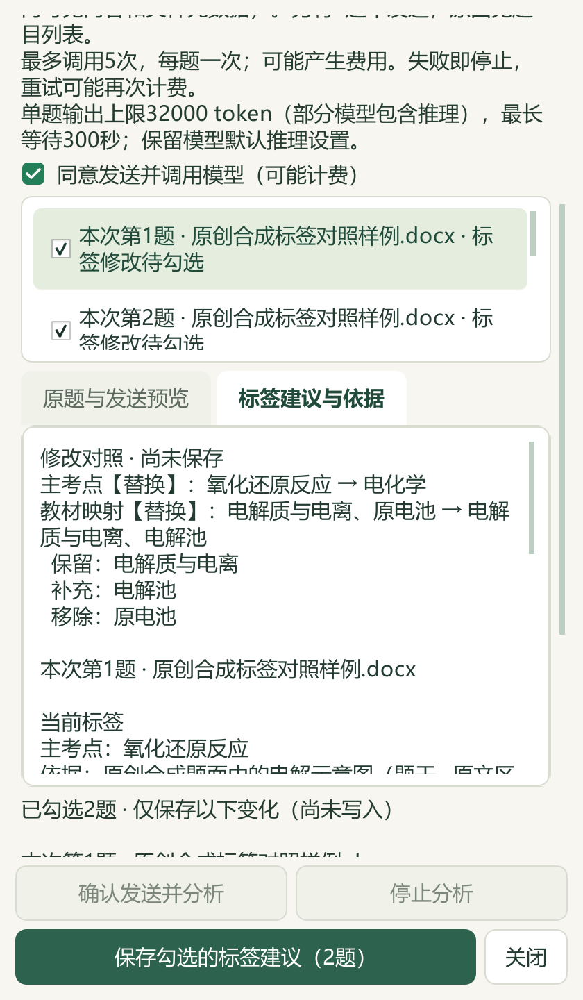

# 标签变化对照、4题重核与电解腐蚀研读

本轮基于 PR #44 合入 main 的 `bcb0e46`。公开内容是维护源码、合成截图、改述候选知识和汇总；原件、题答、XML、个人数据库及备份仍在本机。v0.1.101 EXE未重建。

## 标签变化与保存

AI标签整理在默认补缺与显式重核模式均对照当前标签和服务合并后的建议，区分保留、补充、替换和移除。摘要只列勾选且确有变化的题目，保存数量与之对应。教师修改、教师确认、固定修订、失败和无变化项不可采用；重核模式默认不勾选。四处题目身份均使用“本次第N题”，不冒充原卷印刷题号。

内容区可滚动，360×520、420与900宽度下底部按钮可操作。正在分析、停止中、已停止、部分失败及保存失败分别提示；取消后已完成建议可恢复核对，迟到回调不重新打开关闭的窗口。空、重复、错题或部分保存回执不显示整批成功，须重新打开原题确认实际状态。

9张原生Qt截图均使用合成数据与假服务，主代理已逐张查看；没有真实供应商请求、私有题目截图或实际Office截图。相关界面测试37项通过。

## 离线重核与4题实际修订

维护命令`runtime/deeptutor_shchem/apply_offline_word_labels.py`新增`--label-mode recheck_automatic`；缺省仍为`missing_only`。重核模式要求题面、公共材料和答案完整可读；缺答、只有占位/标题、未读对象、图像或范围缺口会阻断，答案正文仍不得充当标签引用。候选格式保持v1，计划和回执升为v2，区分填补与替换计数。

先预览取得计划SHA，再以同一模式和`--expected-plan-sha256`明确应用。计划绑定候选、模式、阅读规则、当前目录及来源/范围/属性版本，沿用并发比对、事务、旧历史、教师保护和提交后回读。此维护命令采用当前会话已读候选，不调用供应商；教师UI调用所选模型，须在发送预览后明确确认，两条入口的权限和证据范围分别保留。

本机针对上轮4个旧自动标签疑点，读取13个题面区块、12个答案区块及另外4页教材后，完成2个主知识点替换和2题教材映射替换。分别涉及实验分离提纯、共价键能、自发反应方向及常见无机物性质；不通过错误选项或旧答案反推标签。源解析中条件不足、反应物/热效应说明冲突继续另存，未改写源答案。

其余3680条属性、9296条旧历史逐项不变，新增4条历史；578项保护输入只有属性数据库发生授权变化，两个原先不存在的路径仍不存在。正式回读通过，刷新候选后重复预览0变更。本轮修正准确性，没有新增覆盖：98来源/3579题，主知识点2873、教材映射2708，缺失标签待办仍1097＝文字253＋图像785＋范围/材料56＋受保护3。不按地域排除，全部仍为AI候选、未人审。私有证据位于`outputs/offline-label-recheck-20260927/`。

## 电解池与金属腐蚀

新增2知识、5方法、4提醒及3节各40分钟流程，共14参考，另有8条教材研读。委派阅读覆盖434个原生文字区块；主代理读取229个关联区块，逐页查看选必一4.3—4.4 PDF106—117（印刷100—111）及12个Word媒体引用。109个缓存媒体引用仍未读，其中27个WMF；另5个SVG备用引用和26个OLE未读，96个域代码及2个特殊字体符号仅编目。完整Word视觉审查尚未完成，透明图只作白底显示、原件保留。

主代理独立核算16个原子/电荷守恒模型，复算CuSO₄分阶段复原、固体O²⁻载流、H₂O₂理论6.8kg/h、Mn²⁺单电子对应标况H₂上限11.2L，以及22.4mL对应0.001mol的单位关系。各量值都保留题设和效率条件。原图与答案错配、跨膜H⁺导致pH信息不足、阳极成膜也可增重、腐蚀速度不能绝对排序等均明确记录；未将原解析当成官方勘误或实际工程方案。

正式合入后，实际备课入口读出本讲22条参考，其中14条新增，关联8个既有教材概念。来源版本失配时引用归零；逐条移除必要区块，相应14条新增参考均排除；重复合入0新增。其余45讲、794个保护文件和两个缺省路径保持，包含196个原文件/副本及488个状态文件。catalog117→118，仅追加派生候选记录；本轮检索文章0、新采集试卷0。

46讲合计287知识、144方法、118提醒、39流程，19讲有流程、27讲待补，383教材概念不变。均为`candidate_only=true`、`human_reviewed=false`。原件及私有回执位于`outputs/electrolysis-distillation-20260927/`；派生候选归档于本地`sh-chem-db/05_命题热点素材/教材研读候选/`。

后端356项、界面37项共393项不同测试通过，完整README和文档策略结果见[结构化验收](2026-09-27-tag-changes-electrolysis.json)。新界面与回执检查已加入Windows CI。复杂Word定位、1097项标签待办、27讲课时流程和其他业务仍需继续推进。
