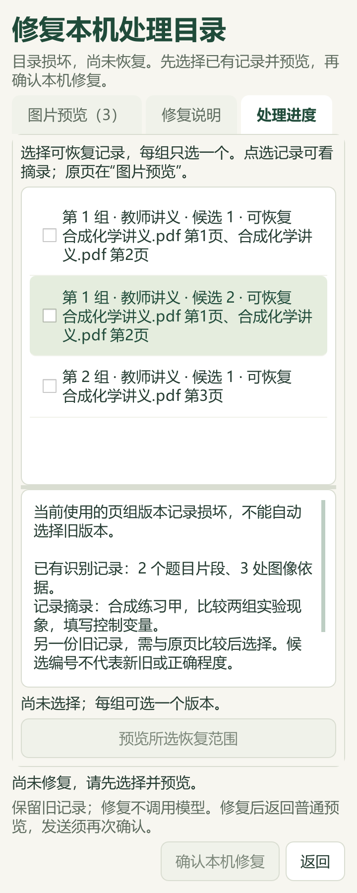
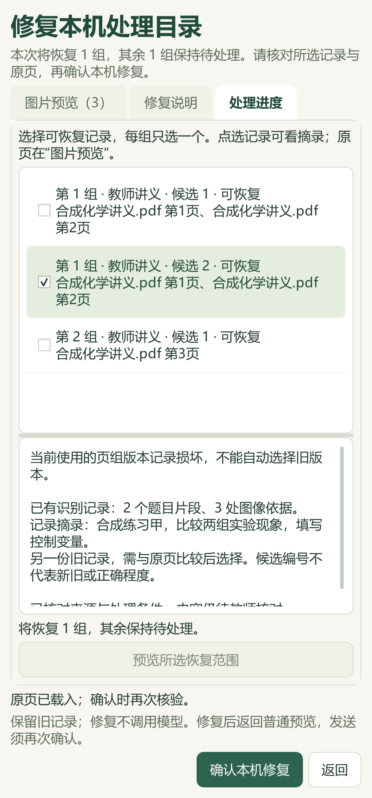
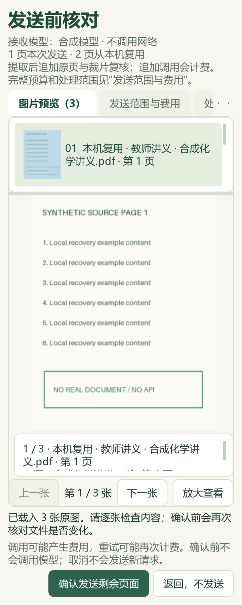
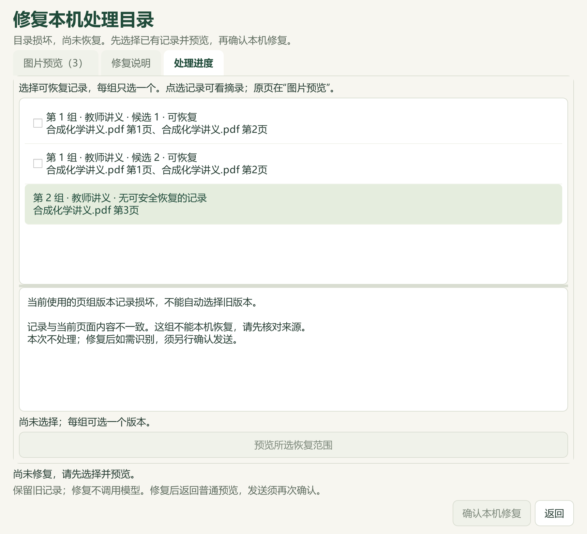
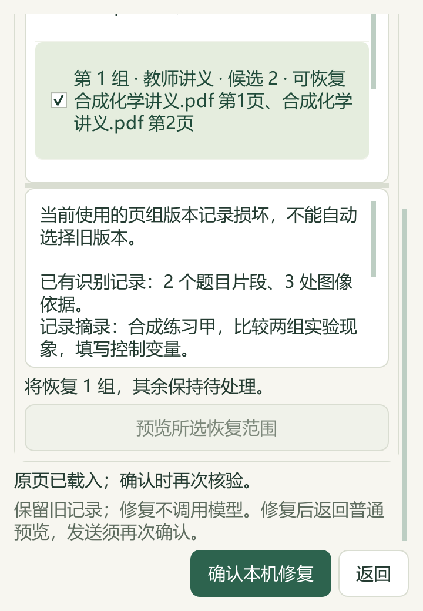

# 视觉导入目录修复、题库补缺与反应速率研读

本轮基于 PR #45 合入 main 的 `a82c3b7`。公开提交包含维护源码、合成截图、改述候选知识和汇总记录。原 Word、教材 PDF、题答、XML、数据库和备份保存在本机；v0.1.101 EXE 未重建。

## 本机恢复已有识别记录

视觉导入的处理范围或当前页组版本记录缺失、JSON 不可解析时，原先无法进入普通续做预览。现在可以检查保留下来的页组记录，逐组选择一个版本，预览所选范围后明确确认本机修复。程序不按日期自动选择；重复但等价的片段合为一个选项，不同内容分别展示。列表保留资料角色、原页范围、摘录和不可恢复原因。

可用记录必须重新通过来源、页面像素、配置、规则、请求和片段绑定核验，并具有已保存的裁片机器复核状态。预览只读；确认后取得批次锁，在写入前再次比较版本。旧目录的精确字节和旧识别记录保留。修复中断时保留阻断标记，普通识别不能绕过半提交；重新预览后可再次恢复。

修复本身不调用模型，完成后返回普通图片预览。未选择或无法恢复的组保持待处理，只有在普通预览另行确认后才会发送识别；恢复结果仍需教师核对。

缺失或不可解析的 `scope.json`、`active-attempts.json` 及未完成修复标记属于本次范围。合法 JSON 中的范围身份冲突、非法版本结构、重复键、链接、超大文件或过多文件继续阻断。单份记录绑定不符时不作为恢复选项，其他独立合格组可明确选择。汇总候选版本历史损坏、化学语义和题目层级的人工修复仍待推进，C02 保持部分完成。

修复内容在矮窗口内可以滚动，确认和返回按钮固定在底部。360×520、420和900宽度均有合成 Qt 检查；状态句已收短，避免与提醒重叠。最终生成16张2×缩放合成截图，主代理实际查看7张，公开其中5张。它们不是私有题目截图或新 EXE 的人工验收。

## 本地题库：22题补缺，另核其中2题

主代理读取24题的完整题面94个区块和答案57个区块，并核对原生 XML 与当前范围。22题补充11个主知识点、17题教材映射（20处章节链接）；另外2题因原答案存在实质疑点保留待核。对同批22题中的2题另行使用显式自动标签重核，将粗盐提纯和金属材料的旧主分类改为对应实验与金属知识类。这里共改变22个题目身份，不能把两次事务相加为24题。

补缺阶段673项保护输入仅数据库发生预期变化，3662条其他属性及9300条旧历史保持。重核阶段525项保护输入仅数据库发生预期变化，3682条其他属性和此前9322条历史保持。共新增24条历史版本；两个阶段正式回读通过，刷新版本后重复预览均为0变更。源件、答案、教师字段和既有非目标标签保留，未把原答案作为标签或难度证据。

全量只读队列为98来源、3579题：主知识点2884，教材映射2725；分别缺695、854，去重待办1075＝纯文字231＋图像785＋范围/材料56＋受保护3。不按地域排除；全部新增标签仍为自动候选、未人审。私有证据位于 `outputs/offline-label-review-20260927-batch9/`，当前队列位于 `outputs/local-import-continuation-20260927-run7/`。

## 化学反应速率教材与讲义

新增2知识、5方法、2提醒和两节各40分钟流程，共11条教学参考，另有5条教材研读。主代理完整读取511个原生文字区块，查看选必一2.3教材 PDF47—51（印刷41—45）和13个 Word 缓存图像引用。其余276个缓存引用、3个额外原生备用引用，以及124个 OLE、3个 OMML 保留未读；完整文字阅读不等于全 Word 视觉审查。

新增内容区分组分速率与按计量系数归一的速率、平均值与瞬时值、混合前后浓度、相对分解率与绝对消耗速率。数值复核涵盖合成氨、过氧化氢分段表、草酸配液、浓度图的计量与压强比、水样对照及带缩放坐标的活化能。反应级数不能直接取任意总反应的系数；催化剂比较须保持模型与条件。原文的平衡标签冲突、pH 与浓度差混用、过度概括及未读公式均保留记录。

正式合入后，实际备课参考入口读出本讲19条参考，其中11条新增，关联4个既有教材概念。来源版本失配时引用归零；逐条去掉必要依据，11条相应参考均被排除；重复合入0新增。其他45讲和383条教材概念不变。教材同步阶段804项保护输入（802文件、2缺省路径）保持，包括196份原Word/副本和488份状态文件；标签数据库此前的授权变化单独验收。资料目录118→119，仅追加派生候选记录。

46讲合计289知识、149方法、120提醒、41流程，20讲有流程、26讲待补。全部新增仍为 `candidate_only=true`、`human_reviewed=false`；未生成最终 PPT 或认定课堂效果。私有阅读与同步回执位于 `outputs/reaction-rates-distillation-20260927/`，派生候选归档于本地 `sh-chem-db/05_命题热点素材/教材研读候选/`。

144项视觉/导入组合与78项知识相关测试通过；2×缩放的修复UI专项13项通过，已包含于144项中，不重复计数。14项文档测试与文档规则检查通过，详细范围见[结构化验收](2026-09-27-visual-repair-reaction-rates.json)。新增修复测试与截图脚本进入 Windows CI。本轮检索文章0、新收集试卷0、真实供应商调用0；全题库标注、全书蒸馏和完整 C02 修复仍未完成。
