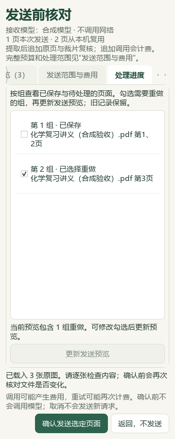
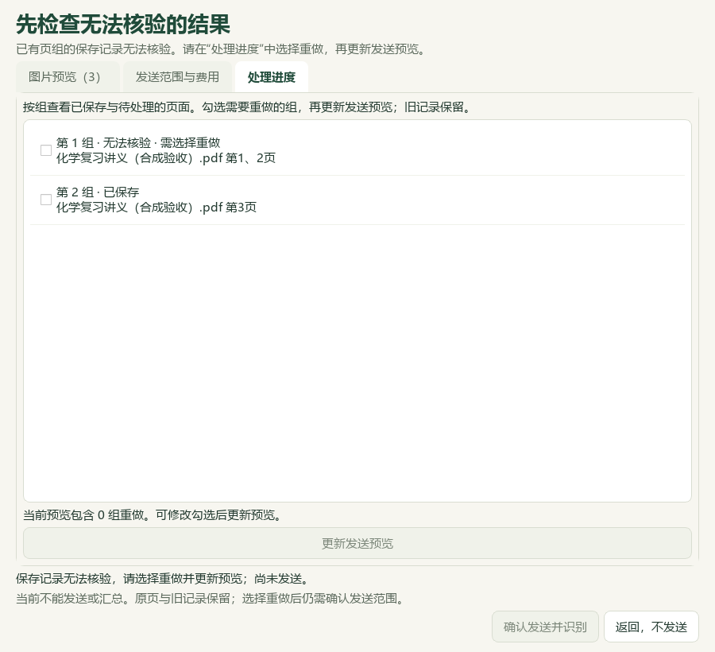

# 选择页组重做、题库补标与水的电离研读

本轮基于 PR #40 合入 main 的 `4189f9e`，属于维护源码。公开仓库只保存代码、合成截图、改述知识与验收摘要；原教材、原题、个人数据库、备份和逐题证据留在本机。没有真实供应商调用或新版EXE验收，v0.1.101包不含本轮改动。

## 处理进度和指定页组重做

图片导入在发送前核对中增加“处理进度”，列出每组原文件、页码、已保存/待识别/无法核验状态。已保存或无法核验的组可勾选重做；修改选择会停用旧确认，点击“更新发送预览”只在本机生成新范围，核对后才可发送。未选成功组继续复用，追加提取与实际裁片复核仍可能计费。窄窗页组说明换行，360、420、900像素窗口均检查确认按钮可达。

普通、大小受限的单个分片记录损坏时，诊断预览保留原记录并显示不能发送；只有全部无法核验组都选入重做后才能确认。范围文件、活动记录索引、路径或过大文件异常仍阻断预览，不猜测修复。跨页组证据标识冲突和答案标识重复提供固定提示，不展示供应商私密错误详情。

确认执行在既有批次进程锁内再次核对来源、模型、请求规则、冻结像素与记录版本，再用一个原子替换切换选中组的活动记录。每次尝试保留旧记录、前一状态和选中组。取消或仅修改预览不写处理状态；切换失败继续使用旧映射，切换后中断则选中组下次仍为待处理。成功批次不能重复执行。不会覆盖已有教师修改的汇总候选。

合成实流水线验证了两个分片分别通过机器复核、合并时证据ID冲突的情形：原样本机汇总仍失败且不借用密钥；明确重做第二组后仅调用该组的提取与裁片复核，合并成功，两个原始记录字节均保留。这只证明恢复路径，不保证真实模型一次重做就能消除语义、层级或化学错误。C02继续标为部分接通。

## 本地题库增量

本轮检索文章0篇、新采集试卷0套，没有新增原件归档。主代理逐题读取24题的题干、选项、答案，并依据题面补缺失标签：18个主知识点、21处教材映射，24题事务写入并回读；重复预览0变更。6个旧主知识点、3个旧教材映射及其余3660条属性保持，9200条旧历史不改，新增24条历史。269个既有受保护输入中仅指定属性数据库改变，3个原先不存在的状态文件仍不存在。

两份不同资料重复收录同一道滴加顺序题，保留各自来源身份，不把内容相同直接合并。原解析出现铝、锰相关方程式配平问题；另有一条旧主知识点偏离题面，缺失字段补全没有覆盖它。这些疑点留在私有审核记录，不能把补标解释为答案背书、去重完成或教师审核通过。所有地域资料采用同一流程。

真实Word题库仍为98来源、3579题；主知识点2821、教材映射2653，缺失至少一项的待办1169：纯文字325、需图像785、范围/材料不完整56、受保护3。原考试类型已知837、未知2742；111条旧属性键不计新题。元数据续处理清单更新时209个输入哈希均未变化。

私有证据与备份在 `outputs/offline-label-review-20260927-batch5/`，最新队列在 `outputs/local-import-continuation-20260927/run-3/`。本轮没有新建中央正式题库条目。

## 水的电离教材研读

实际核对选必一3.1节PDF65—69页（印刷59—63）五张原页、PKG-044声明的完整关联文字选段和10个原图引用。讲义含325个原生区块、132个图像引用，84个WMF引用仍未读图；这不是全文渲染复核。第292块所查看PNG只显示体积标注，不证明缺失的电离常数公式，未据答案补写原式。

新增14条教学参考：2条知识、6条方法、4条易错/待核提醒、2个40分钟讲练流程；另有7条教材研读笔记。内容覆盖水的质子转移、温度与Kw、极稀溶液水贡献、中和当量/总体积、pH测量证据。主代理独立复算：45℃按教材表数据得中性pH约6.704468；2×10⁻⁷mol/L盐酸纳入水电离得pH约6.617224。讲义不同图表中的高温Kw数据及教材/讲义指示剂区间差异分别保留，不编成统一常数表。

实际选段入口可读取本讲22条参考，其中14条新增，并关联3条既有教材概念；换掉来源预览版本时引用全部排除，逐条移除必要依据区块时相应新增参考排除。重复合入0新增，其他45讲保持。同步过程764个受保护文件不变，包括196份原Word与私人状态；本地catalog从113到114行，只新增声明范围的派生候选包。

46讲合计278条知识、124条方法、103条提醒、30条流程建议；15讲有课时流程、31讲仍缺，教材概念仍383条。全体新增内容保持 `candidate_only=true`、`human_reviewed=false`。本轮没有全局技能安装、自动路由或课堂效果评估。

## 验证与剩余工作

523项相关回归通过，覆盖分片恢复/重做、真实桌面适配器与合成传输、取消和重启、原子切换失败、来源/版本变化、路径边界、批次互斥、UI控制器、标签导入和教学索引。四种预览状态各捕获900×820、420×900、360×900，共12张合成截图，主代理逐张查看；README和文档维护检查另记在[结构化回执](2026-09-27-visual-reprocess.json)。

后续仍需处理785项需图像待办、325项纯文字待办、缺失材料和受保护条目；继续补31讲课时流程。目录/汇总候选损坏、复杂跨页语义与层级修订、新EXE和真实模型质量均不因本轮局部验收标记完成。
