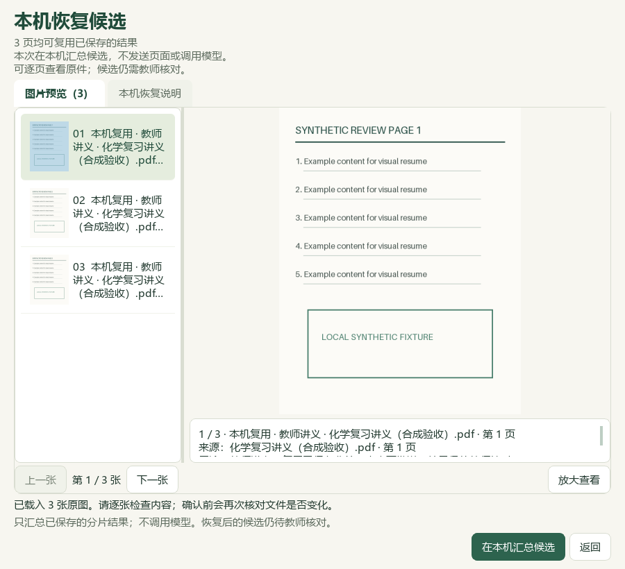

# 图片分片恢复、窄窗和本地候选增量

本轮基于PR #39合入后的main（`4423893`）开发，属于维护源码，未重建v0.1.101 EXE。公开仓库只保留代码、合成截图和结果摘要；原教材、题目、数据库、备份和逐题证据保存在用户本机。

## 图片处理与界面

视觉分片在提取、结构校验和实际裁片机器复核都通过后，才原子保存到个人状态中的`visual-import-v2/shard-checkpoints/`。记录包含候选观察及来源绑定，保持未人审状态。部分失败、取消或应用重启后，重新预览可复用已保存的成功分片；若只差候选汇总保存，则全部在本机重建，不借用密钥或调用模型。

复用范围同时绑定整批来源、页像素和渲染方法、分片顺序、模型配置版本、预算、提取/复核规则及结构契约。预览后记录增加、修改或删除会使旧确认失效。模型、页面或规则变化时隔离旧记录，重新披露发送范围；不会悄悄把不匹配记录当成有效结果。执行与Word重试共用批次进程锁，持续保护确认、处理和保存。

发送前窗口标明本机复用页数、剩余发送页数和每页用途。窄窗改为上下排列缩略图与预览，完整预算仍可在说明页查看；全部可复用时使用本机恢复文案。900×820、420×900和360×900各核对部分续做与全部本机恢复，共6张合成截图，主代理直接查看。截图与模拟服务验证不能代替真实模型或新版EXE验收。

检查点不是完整备份，仍依赖原始文件和个人状态目录，也不自动包含在备课ZIP中。损坏检查点阻断复用，跨分片语义/层级冲突仍需处理；当前没有丢弃或指定成功分片重做的界面。机器复核通过不等于教师核验或化学正确，C02仍为部分接通。

## 真实Word批次与本地标签

发现上轮完整批次读取误用了8MiB失败摘要限制，实际98来源Word批次约66MiB因此无法进入补标。完整批次改用独立128MiB有界读取，失败摘要仍保留8MiB限制，原有来源、结构和路径核验不变。本机正式读取入口恢复，24条来源/题目/属性版本全部匹配；一次完整读取约1.94秒，不绕过归档检查。

本轮无外部采集：检索文章0篇、新试卷0套、无重复试卷归档。主代理读取24题完整选段与选项，按当前知识目录提出缺失标签。24题已事务保存并回读，补主知识点18、教材映射22；重复预览0变更。其余3660条属性、9176条旧历史保持，新增24条历史。270个既有受保护输入中仅指定属性数据库改变，另3个原先不存在的状态文件仍不存在。

题库仍3579题/98来源，主知识点2803、教材映射2632。缺失标签待办1193：纯文字349、需要图像785、范围或材料不完整56、教师或固定保护3。原考试类型已知837、未知2742；111条旧属性键不另算新题。地域不作为排除条件，讲义所载浙江改编题也按相同证据流程补标，不改写其考试身份。

原解析中NaH水中行为、HBr/HCl、KH/KCl及熔点比较的矛盾保留为待核；没有更改或背书答案。6个旧主知识点、2个旧教材映射保留，其中两处旧映射仍需单独重核。本轮候选计划、SQLite备份、回读与输入哈希记录均只存本机`outputs/offline-label-review-20260927-batch4/`；后续队列在`outputs/local-import-continuation-20260927/run-2/`。

## 教材章节技能验证

在前轮13条弱电解质教学参考和7条研读记录基础上，独立子代理只读取章节技能、两份引用文件与5个输入案例，没有读取保留标准、既有结果或原件。主代理再按保留标准逐项核对并独立复算：5案例、16项标准通过。稀释结果pH约6.896484，外加酸体系阴离子浓度约4.0×10⁻⁸mol/L，近似相对误差2.0×10⁻⁶；两处教材常数差异及旧公式不完整的限制保留。

详见[行为评测记录](../../knowledge/skills/weak-electrolyte-equilibrium-chapter/evals/behavioral-evaluation-2026-09-27.json)。这是一次合成试运行，没有无技能对照或真实课堂验证，不代表全书完成。46讲仍14讲有流程、32讲待补，383条教材概念不变；未调用外部模型、安装全局技能或自动接入应用。

## 验证范围

合成回归覆盖重启续做、提取/裁片失败、取消、保存失败、确认后变化、模型/预算/渲染变化、进程互斥、原生来源序号空缺、大批次读取与错误提示，界面涵盖本机恢复、剩余发送和小窗口操作。旧失败回执测试改用完整结果对象，并保留来源失配和超限时阻断恢复的检查。

最终测试数量、截图哈希和本地增量见[结构化回执](2026-09-27-visual-resume.json)。CI增加分片恢复专项与6张合成窗口捕获，仍执行README完整性和文档维护规则。本轮没有真实供应商调用或新EXE验收。
