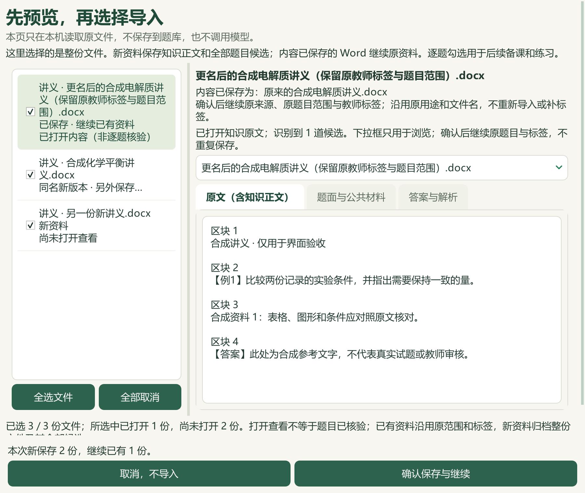

# Word重复续接、版本导入与化学平衡移动研读

日期：2026-09-27。基于 PR #46 合入 main 的 `0d5c3a2`。这是维护源码及本机候选资料增量，已发布的 v0.1.101 EXE 未重建。公开内容限代码、合成验证、改述的来源绑定候选和汇总数据；原Word、教材、题答全文、个人数据库及状态文件保留本机。

## 导入后继续使用原资料

- 同一Word改名后再次选择，预览显示已保存状态；确认后沿用原来源、文件名、用途和批次。原题范围、教师标签、历史和题篮不重建。
- 同名而内容不同的Word明确显示为新版本，确认后单独保存；保留旧资料，不把旧教师标签迁移到新题。
- 混合选择新旧讲义时只保存新项，旧项保留继续入口。旧文件与新的题目、答案或非Word材料混合时，阻断静默拆分；同一内容被选为不同用途也需重新核对。
- 预览与最终确认绑定文件内容及相关保存记录；保存使用线程与进程锁，再核对来源、归档及记录变化。取消、记录变化或并发导入不会沿用过期决定。
- 保存后的三个入口分别打开原来源题目、原Word和原批次进度。原来源没有可用题目时显示空结果，不跳至全库；其他已选题保留。

窗口将文件用途、名称、处理说明分行显示，底部保留勾选摘要与操作按钮。360×520矮窗可滚动；历史同名文件以“保存记录N”区分本地记录，不推断正式版本号。

窄窗可分别查看[重复文件](screenshots/2026-09-27-word-import/identity-existing-360x520-top.png)、[同名新版本确认](screenshots/2026-09-27-word-import/identity-version-360x520-bottom.png)、[题答关联阻断](screenshots/2026-09-27-word-import/identity-context-360x520-bottom.png)、[继续已有资料](screenshots/2026-09-27-word-import/identity-continued-360x520.png)和[新版本保存结果](screenshots/2026-09-27-word-import/identity-version_saved-360x520.png)。这些均为合成材料。

C06仍为部分完成：仅对字节相同的Word去重；内容近似重复、非Word重复和跨版本题目/标签迁移未完成。导入成功也不代表化学内容、答案或题目层级已审核。

## 本机题库补缺与独立重核

完整核对24道纯文字题的86个题面块和52个答案块，采用其中21题；样本7、17、24因范围或答案论证疑点保留待核，不根据原答案反推正确标签。

| 项目 | 本轮结果 |
| --- | --- |
| 缺失主知识点 | 新增12题 |
| 缺失教材映射 | 新增14题、17个章节链接 |
| 旧自动映射重核 | 同批其中1题，主知识点保留 |
| 历史版本 | 新增22条，原9324条完整保留，现9346条 |
| 重复应用预览 | 两阶段均0变更 |
| 数据保护 | 每阶段685项输入核对，仅个人标签数据库预期变化；暂缓题保持 |

一次边界选项的答案疑点另对照了[原始化学论文](https://www.nature.com/articles/s41467-023-42403-2)的摘要、引言与部分结果，记录含硼催化材料构成的反例线索，不据此宣布另一选项为唯一正确答案。相关访问受限页面没有绕过验证，也未记作已读全文。

只读整理回读98份解析版来源、3579道当前候选题（3576道可选）。当前主知识点2896题，教材映射2739题；仍缺683个主知识点、840题教材映射。去重待办1054题，分为纯文字210、需图像785、范围/材料不完整56、受保护3。21项移出待办，未新增待办；111条旧属性键不计成新增题目，原考试类型未知2742条继续保留。资料不按地域排除。

## 化学平衡移动专题

PKG-090新增13条教学参考：2条知识、6条方法、2条提醒、3个40分钟流程；另有7条教材研读。主代理完整读531个原生文字块、选必一PDF38—46页（印刷32—40），并查看15个缓存Word图引用。

内容涵盖K/Q的时刻与约定、三段式、浓度常数与分压常数、气相统一缩放、等效平衡的守恒和约束，以及恒定量与颜色曲线的判据。数值独立复算，例如水煤气变换平衡量为16/9、25/9、20/9、20/9 mol；两温度题给条件下浓度常数分别16、8。计算条件和原文矛盾保留，不用未读公式对象补全证明。

256个缓存图引用中241个未读；198个OLE、4个额外SVG引用和外链备用图也未读。正文全读不等于完整Word视觉审核。备选必修二教材正文未读，不作为本轮证据。

实际备课入口读取21条参考，包含旧8条和新增13条，并关联4条既有教材概念。逐条缺少1个必要依据块的13项检查均排除对应新参考，版本失配时参考与概念均归零；CODE及DATA重复合入均0新增。其他45讲和383条教材概念保持。

知识库现有46讲、291条知识、155条方法、122条提醒、44条流程；21讲有流程、25讲待补。同步期间810项保护输入保持（808个文件、2个缺失路径），包含196份原Word及副本和488份个人状态文件。资料目录只追加一条派生候选，119→120，原目录记录保持。

全部新增知识与标签仍为 `candidate_only=true`、`human_reviewed=false`。主代理模型复核不代表教师人审或课堂效果验证。

## 验证与后续范围

本机315项不同功能测试通过（导入237、知识扩展/索引/实际教学参考78）；文档测试14项及规则检查通过。Qt 2×专项28项也通过，属于237项的重复缩放验证。最终25张合成截图中主代理实际查看9张、公开6张；导入窗口覆盖360×520、420×680和900×760，逐题阅读器仍保留原400×600下限，仅新增限定来源空态在900×760核对。详见[机器可读回执](2026-09-27-word-import-equilibrium.json)。合成界面验证不等于真实教师原件的全面审核，也不等于新EXE验收。

本轮公众号检索0、新试卷采集0、真实模型供应商调用0；另有上述原始化学论文的有限网页核对。重复项为导入功能的合成测试场景，不计作真实新收录。归档在本机`outputs/offline-label-review-20260927-batch10/`、`outputs/local-import-continuation-20260927-run8/`、`outputs/equilibrium-shift-distillation-20260927/`及`outputs/import-equilibrium-live-20260927/`。

继续推进1054道标签待办、25讲流程、暂缓题答案疑点、复杂Word对象与图像题证据核对，以及UI和业务闭环。缺失来源和未读对象不猜测补齐。
