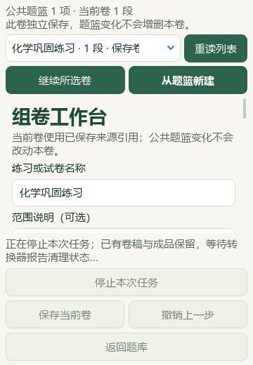
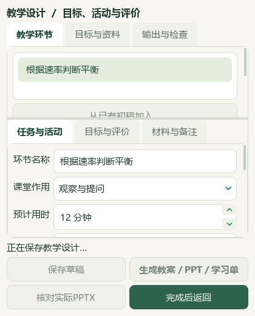

# 本次任务停止、原子结构研读与本地题库补全

本轮基于 PR #52 合入 main 的 `c3f182c`。维护源码与 v0.1.101 试用包分别验收；本轮不重建 EXE、不移动发行标签。下列本机材料仍为 AI 整理候选，未获得教师人工审核。

## 功能验收边界

组卷分页、旧四文件导出、复练预览/输出与教学环节成品任务接入停止操作。处理中显示停止状态并等待实际清理回执，短保存事务显示“完成后返回”，不把已完成保存误报为取消。模型请求与本地任务分别提示；停止等待不能撤回已经发给服务商的调用。

取消或超时不会把新分页替换成当前确认版本。分页完成时重新核对草稿、来源和此前记录，并与停止操作串行决定是否发布。已有确认记录在后台保留；编辑器仍需重新预览与确认，没有自动恢复旧预览窗口。旧四文件任务等待子任务的清理终态，超过等待界限明确报告清理尚未确认。

独立转换器在Windows私有进程作业中运行，启动前建立归属；LibreOffice使用单独临时配置。Word采用独立会话、只读私有副本与分阶段归属核对，明确记录打开文档前尚未验证PID。打开后核对窗口PID、创建时间、原有实例清单、只读文档与私有状态，再保存结果。只有新鲜核对仍满足条件才关闭本次文档并请求退出，不按进程名称结束Word。宏和外部关系在打开前阻断，不更改Word的持久选项。

父端只读退出观察使用限定权限的实际进程句柄和创建时间；这与发出Quit请求是两份证据。参考微软[OpenProcess文档](https://learn.microsoft.com/en-us/windows/win32/api/processthreadsapi/nf-processthreadsapi-openprocess)及[Word Quit引用参数定义](https://learn.microsoft.com/en-us/dotnet/api/microsoft.office.interop.word._application.quit?view=word-pia)。无法证明退出或用户接管的会话保留，不发布本次结果。Office阻塞调用不保证立即退出，D06仍标部分完成。

初轮常规 UI 测试中的演示数据准备意外启动了真实 Word；当时使用了 Word Application 不支持的 `Hwnd` 属性，导致转换失败及隐藏实例未完成清理。该轮测试不计为通过。此后普通回归及独立截图脚本显式禁止启动Office；真实Word仅用另行审核的合成文档单次验收。无法可靠证明归属的原有实例不强制关闭，不能将没有新输出解释为清理成功。

单次真实Word验收保留完整演进记录：第一次生成了PDF，但关闭未确认，结果没有发布；修正引用参数后，第二、三次Close/Quit均正常返回，实例却在原等待界限之后才自然退出，两次原失败回执继续保留。第四次在独立30秒退出预算中，用绑定创建时间的句柄实际等待16.266秒确认退出，才发布一页合成PDF；主代理实际打开渲染页面核对。原有17项PID与创建时间配对保持，不宣称早期遗留实例已经清理。其中16项来自失败前后盘点、归属未充分建立，另1项为第一次受控测试留下且未能重新取得有效COM状态的实例。

随后用两份独立合成DOCX分别验收转换阶段取消及10秒超时。前者9.313秒、后者12.188秒返回，均明确记录清理尚未确认，目标PDF始终未发布。生产调用回执保持原哈希；独立只读观察随后确认各自的helper与Word退出，原有17项身份及输入SHA保持。这两项通过的是停止、隔离和真实回执链，不代表阻塞COM在所有机器上都能立即结束。

## 界面与回归范围

组卷按360×520、420×520及1000×760检查运行、停止、取消和重试；教学设计按360/420×520检查状态、保存与返回，并逐个滚动到所有环节按钮核对完整可达。考试复练使用800×700窄窗，既有最小尺寸720×570保持，不宣称全应用支持360宽。普通与Qt两倍缩放均采用实际Qt界面和真实自有Python进程作为转换替身，Office和真实模型调用为0。

初版停止文字裁切及教学按钮重叠截图保留为失败证据，修正后重新截图。主代理实际读图，不能用测试只检查状态矩形代替视觉复核。冷启动测试原先引用未入库的脚本，现补齐隔离工作区/状态目录、禁止Office启动的真实Qt退出检查。

本机最终回归去重745项通过：功能/消费者/界面580项、知识与离线标签151项、完整指南14项。Qt两倍缩放复跑的10项不重复增加节点数，先前失败轮不计通过。33项实现文件与冻结SHA逐项一致，32份Python通过语法解析；48张最终界面截图已由主代理直接查看或核对与此前实际查看图像逐字节相同，公开其中3张合成图。真实Word三条路径单独计证据，不计入普通测试数。

本机未实测新版LibreOffice真实转换、真实用户接管、多Office并行或另外打开的无关合成Word文档；17项既有身份保留不能代替这些场景。历史generation_v2及交互式原文选区链不在本次改动验收内。测试结果不解锁教材/原题的人审状态，也不等于新EXE、学校电脑或课堂完整验收。

## 原子结构研读

本轮核读 PKG020 的248个原生区块，以及选修2教材 PDF 第7—20页（印刷页3—16）的14页实际页面。主代理实际查看52个 Word 缓存图引用中的16个；其余36个引用、5个 OLE 二进制及完整 Word 分页尚未完成视觉核验。子代理读取范围另记，不能代替主代理确认。

新增10条参考（1条知识、4条方法、3条易错提醒、2条教学流程）和7条教材研读。另显式限定旧M1：同一主量子数下的亚层能量次序用于相应多电子原子模型；不能推广为氢及类氢体系的一般规则。其余7条旧参考、另外45讲及383条教材概念保留。

电子排布、电子/轨道计数、硫粒子电荷、光子能量及氢能级跃迁均另作核算；讲义答案与解析中的疑点保留在候选材料中。外部核对采用 NIST 原子数据和光谱资料、OpenStax 原子结构章节及 RSC 元素史料，逐条限定证据范围，来源链接随知识候选保存。没有将搜索摘要、未读页面或原答案命中当作化学正确性证据。

实际备课入口按29段精确范围读取59个支撑区块，返回18条新旧参考、18,205字，没有扩大到全讲义或靠截断掩盖超限。主代理执行11项首支撑删除和3种身份失配检查；子代理另执行双消费端118项所需区块逐项删除检查。缺依据与失配项排除，CODE与DATA重复合入均0新增。独立校验器再核对46讲的原文件SHA、来源版本及全部区块引用，结果通过。

| 当前累计 | 数量 |
| --- | ---: |
| 讲义索引 | 46讲 |
| 知识／方法／易错提醒／教学流程 | 309／184／136／59 |
| 有流程／待补流程 | 27／19讲 |
| 教材概念 | 383条 |
| 本地资料目录 | 126条（本轮新增1份派生研读候选） |

公开仓库只保存派生索引和研读，不复制私有原教材、Word题面或答案图片。原教材与源讲义保持原文件，候选研读另存并登记在本地目录。

## 本地题库补全

本轮从12个来源完整核读12道题的题面、答案与邻接范围。主代理查看23条图像证据路径（21个不同SHA），并读取20页教材原生提取文字；这20页不计为页面视觉审核。来源年份、地域和原考试类型缺乏依据时继续保持未知，不按是否来自上海排除。

6题按原生范围、缓存版本、媒体哈希、实际读图记录和保存前版本严格绑定，仅补缺：新增5个主知识点及4题教材映射，没有替换既有标签。另6题保留原状态，原因涉及电量推理、离子电荷或解析冲突、题干缺失、图轴读数、原子光谱计数及有机题选项疑点。补标不等于确认原参考答案。

第一次严格预览因纯文字证据的空值类型不符合既有格式而中止，未写数据库；保留初始记录后，只将相应字段规范为空字符串，重新执行两次一致的只读预览，再绑定计划哈希保存。写入后原9,451条历史完整保留，新增6条；其余3,678条属性及6道暂缓题不变。重新核对保存版本后，重复预览0变更。

| 本地回读结果 | 数量 |
| --- | ---: |
| 来源／题目／可选题目 | 98／3,579／3,576 |
| 有主知识点／有教材映射 | 2,936／2,815 |
| 尚缺主知识点／教材映射 | 643／764 |
| 去重待办 | 962 |
| 其中纯文字／图像／范围或材料／受保护 | 127／776／56／3 |
| 原考试类型有据／仍未知 | 837／2,742 |

上述统计来自保存后新建的只读续处理报告，不包含手工猜测的标签。没有新增试卷下载、公众号采集或真实模型供应商调用；题库工作为现有本地材料续处理。本地原题及教材不随公开PR上传。

## 本机证据与保护

本机工作记录位于 `outputs/office-cancel-distillation-live-20260928`，教材阅读与题库原生证据分别保存在 `outputs/atomic-structure-distillation-20260928` 和 `outputs/local-import-evidence-review-20260928-batch16`。这些目录不发布到GitHub。

知识同步阶段988项保护输入、196份原Word及副本、488份状态文件保持不变；其后标签事务仅按预览计划更新6道题。知识库README另行备份旧字节后同步新版。提交前与合并后保护核验对照本轮768项初始文件，只允许已记录的数据库、讲义索引、覆盖表、目录与知识说明变动；结果分别写入本机`precommit-protection.json`和`postmerge-protection.json`，GitHub检查与合并树另记。

证据包括独立化学核算、主代理阅读记录、不可变材料清单、同步分阶段回执、实际消费端返回、标签计划/应用/回读、保存后续处理报告。截图、普通回归、真实Office、GitHub检查及合并树一致性分别记账，不互相替代。
