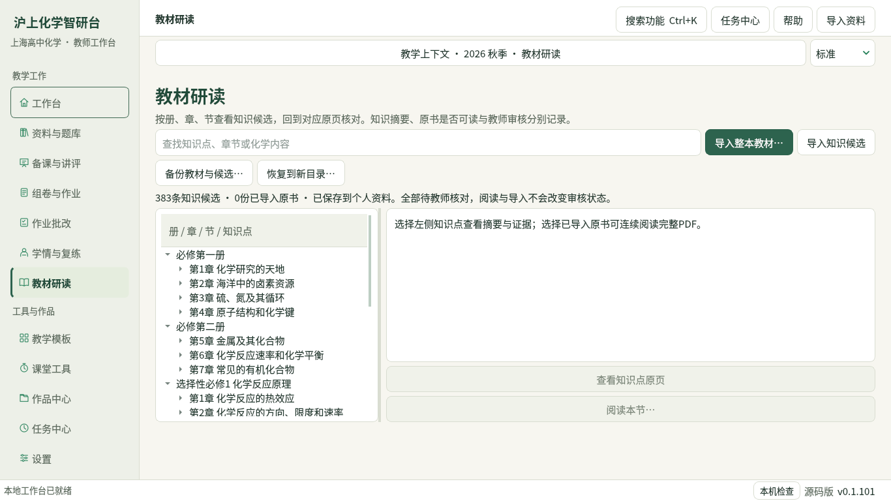
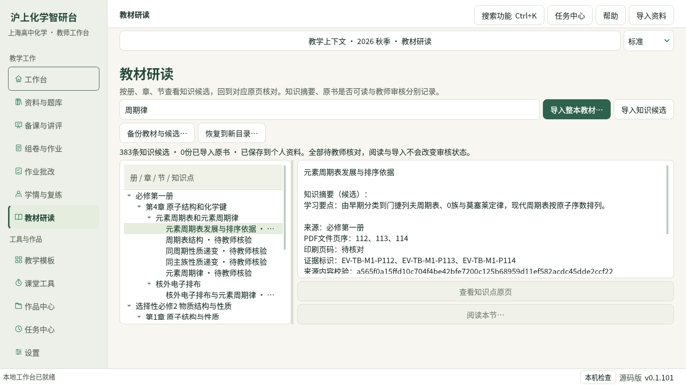

# 教师工作台重构与本地资料导入验收

本轮基于 main `e08c3e778d94ac9bdb526266dc668cc9b18a5091`，按重构与知识蒸馏方案实现首轮桌面入口、任务记录及本地资料导入。验收环境为云端 Linux、Python 3.12、PySide6 原生 Qt；不等同于 Windows 实机、发行 EXE 或完整教学业务验收。已发布 v0.1.101 未重建。

## 方案落实范围

| 方案方向 | 当前实现与边界 |
| --- | --- |
| R00 基线与资料清单 | 核对 GitHub 主线和方案聊天；云端没有 Windows 私人资料，不能复验旧题库计数或目录的 20 项派生差异 |
| R01 导航与教学上下文 | 七个主入口，保留旧页面及深层入口；学期、班级和任务备注保存在个人目录，不充当名册、学生身份或自动过滤条件 |
| R02 任务中心 | 保存任务来源页、开始时的上下文和状态；可停止当前任务，重启后未完成任务标为中断，返回原页面核对，不自动重跑 |
| R03 本地导入 | 整本教材 PDF 单独归档；批量 CLI 复用原 Word/视觉题库导入服务，默认预览，显式 `--apply` 才保存 |
| R11 教材研读的首轮入口 | 册／章／节／知识候选树、搜索、摘要和来源页证据；整本原书连续阅读；已有正式节阅读合同继续使用，候选快照不激活正式目录 |
| K00 候选载入 | 将仓库既有 383 条知识候选保存为内容校验绑定的个人快照；未重新阅读全文、未新增化学蒸馏或提升审核权限 |
| 资料备份 | 教材原书与当前候选快照独立 ZIP，校验后恢复到新目录；不是题库、学生评分和全部业务的统一备份 |

新增作业批次概览可将选中的稳定批次 ID 带回原批次窗口；“已关联提交数”不冒充班级应交人数。原备课编辑器的未保存输入跨导航和上下文备注修改保留。目录、备份和导入中的读取使用原后台任务桥，不在 UI 线程读取整书。

## 实际资料与导入回执

实际导入来源为仓库 `knowledge/textbook/knowledge.jsonl`，383 条，SHA-256：

```text
77c1017a162ac2182deef32f756edb6986c501844565f280135683bfcdfd93a0
```

云端个人目录 `/workspace/.shchem-cloud/localappdata/ShanghaiChem/DesktopWorkbench` 已保存该候选快照；原书 0，私人题库原件 0。该目录和导入回执不提交公开仓库。实际导入命令：

```bash
python runtime/deeptutor_shchem/import_local_materials.py --kind knowledge-candidates --apply --report /workspace/scratch/knowledge-import-receipt.json
```

回执 `ok=true`、`review_status=candidate-only`、`model_calls=0`、`original_files_modified=0`。知识 JSONL 原件及现有 46 讲记录未改写。没有根据缺失教材或文件名补造年份、出处、答案或评分规则。私人原文件可访问后，按[维护入口](../maintainer/README.md#教师工作台与本地批量导入维护入口)预览并分批导入。

教材按实际 PDF 字节、SHA-256 和页数绑定，原文件不覆盖；同内容复用，同名新内容另存。预览后源文件变化、归档内容被改写、加密或损坏 PDF 都停止当前操作。部分批次停止时已保存文件保留，下次预览识别重复。知识点仅按候选记录的原书哈希和实际页序打开，不猜测印刷页码或扩大为整节。

## 验证结果

相关回归共 163 个不同测试通过，覆盖原桌面 UI 与导航合同、首次启动与教学设计合同、Word 和视觉导入批次/预览、教材原页/整节/提示、作业批次窗口，以及新增任务存储、教材归档/备份、CLI 和 Qt 页面。没有用全仓测试或合成文件测试代替实际私人资料验收。

| 检查 | 结果与限制 |
| --- | --- |
| 原桌面 UI／Studio／合同／作业批次 | 31 + 8 + 9 + 10 通过；旧导航入口、未保存输入及稳定批次选择保留 |
| 首次启动／教学设计合同 | 6 + 2 通过；原启动及教学功能边界保持 |
| 原教材原页 UI／来源／整节／提示 | 5 + 16 + 24 + 22 通过；正式来源权限合同保持 |
| 原题库导入批次／预览 | 3 + 10 通过；复用原流程，未自动关联答案或触发扫描识别 |
| 新任务存储／教材服务／Qt／CLI | 3 + 9 + 4 + 1 通过；备份恢复的新目录能通过既有个人目录启动校验；候选与正式概念版本不匹配时不接通整节入口 |
| Qt 两倍缩放 | 新 UI 的 4 个测试通过；云端 offscreen 检查，不替代 Windows 多屏测试 |
| 原生启动冒烟 | 七个主入口全部可达，未捕获 Qt 回调错误；个人题库为空 |
| 实际界面截图 | 11 个入口与教材筛选/证据、360×560 窄窗、1920×1080 共 18 张；新增教材截图来自实际 383 条候选，原书数如实为 0 |
| 文档策略与完整 README | 策略通过，14 个 README 测试通过；新截图、链接、章节和版本边界可达 |

测试用临时 DOCX 验证“预览→保存→重复复用”，原字节保持；临时两页 PDF 验证 Qt 实际打开、翻页和关闭。教材服务另验证来源变化、同名多版本、权限记录、页序边界、停止后继续及损坏备份。这些合成输入只证明软件链路，不证明私人资料的识别或化学质量。

提交前另运行文档策略、完整 README 检查、相关新增文件 Ruff 与 Git 差异格式检查。回归报告和全部临时数据留在本次工作区，不加入公开源文件。

GitHub 的 Desktop integration 流程加入新任务、教材服务、Qt 和 CLI 的独立进程回归，以及 README 和文档策略检查。Windows CI 的结果以 PR 实际运行记录为准；本地 Linux 结果不冒充 Windows 结果。

## 界面证据





截图中的候选摘要来自既有仓库记录；截图不是重新完成化学核验的证据。原 PDF 尚未导入时，原页和整节按钮保持不可用；正式节范围仍须由旧激活目录提供。

## 继续推进所需条件

Windows 的私人题库、五册教材 PDF 及规范教材概念目录未挂载，实际原件导入与新增蒸馏仍未完成。完整班级名册、评分修订向各域传播、统一业务备份、Windows 打包/实机验收、手机端及方案其余任务继续按[当前闭环记录](../WORKFLOW_STATUS.md)推进。本次不据入口、任务记录或候选快照宣称整份方案完成。
