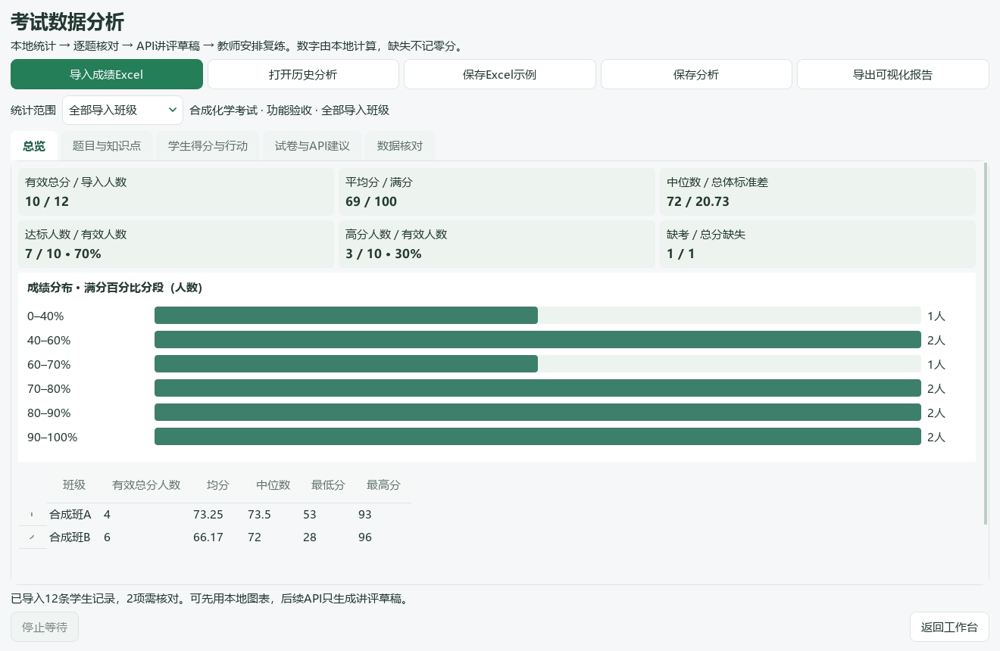

# 从作答与成绩，安排讲评和复练

[返回教师使用说明](../../README.md) · [出练习卷](lesson-and-paper.md#paper) · [保存与排错](save-and-support.md)

## 复核一份作答，或处理同一批作业

### 准备什么

学生原作答、对应原题及公共材料、参考答案、真实满分。页码或题答对应不清楚时先核对，不把资料不足直接判为零分。

### 怎么做

1. 在“学生分析”准备材料、核对题答对应。需要新 AI 分析时，再核对模型与发送范围；查看已有结果不必重新调用模型。
2. 打开已有分析，点击“打开作答与评分（同屏批改）”。中间查看作答、原题与答案，右侧把“教师评分”和“AI建议”分开处理。
3. 明确填写分数与理由，点“记录本题评分”。诊断可采纳、修改、不采纳或暂不判断；分数改变后重新核对旧诊断。
4. 同一作业有多人时，在“作业批次→新建批次”选择已有作答，每人明确选择一份，再逐人复核。

### 得到什么与完成检查

记录的是教师正式评分与观察依据，AI 建议仍可追溯。批次中的“暂存输入”用于继续未完成编辑，不计为正式成绩；点击“记录本题评分”成功后才完成登记。

在批次窗口切换、返回前处理暂存；暂存失败不要直接切走。单份旧窗口的切题输入保留不等于持久暂存。没有每键保存保证，异常退出前未落盘的最新输入可能丢失。

缺页、未作答、尚未学到、时间不足或图像难辨单独记录，不自动改成零分。正式统计不混入 AI 建议、暂存、不同来源试卷或尚未批完的分数。批次窗口不是自动上传全班并连续调用模型的平台。

## 月考后决定先讲什么

### 准备什么

同一场考试的普通 `.xlsx` 文件，一行一名学生。准备可靠学生标识、真实满分、可选班级与缺考状态；有逐题得分时，明确每列对应哪一个非重叠评分单元。

### 怎么做

1. 进入“学生分析 → 考试分析（Excel）”，或 Ctrl+K 搜索“考试分析”。需要格式参考时点“保存Excel示例”；示例是合成数据，不是学生成绩。
2. 导入并选择实际工作表、表头、学生列、总分和可选逐题列。不要同时选择大题总分与其所属小问；不从最高实得分猜题目满分。
3. 先处理“数据核对”：检查重复标识、超满分、缺失、总分冲突和公式缓存。只有总分可以看整体表现，不能据此生成逐题或知识点结论。
4. 确认班级范围与有效人数，再看低得分率题目和学生明细。结合原作答决定先核对什么，不仅按颜色或排名下结论。
5. 需要讲评草稿时添加试卷和教师说明，查看实际发送资料，再确认模型请求。最后保存分析，导出离线 HTML 报告。

### 得到什么与完成检查

本地分析快照、统计图表、待核对问题和可选 AI 讲评草稿。检查报告中的考试范围、有效人数和分母；教师自定达标／高分线不是官方等级分界。

缺考、未批与空白不记零分。公式仅读 Excel 已保存结果，导入前先重算保存；隐藏或筛选掉的行仍会读取。学号前导零应以文本保存。软件不自动按姓名把考试记录并入原作答学生档案。

发送匿名统计不代表图片或自由文字中的姓名被擦除。报告分发前再次检查；模型建议不能证明学生具体错因、永久掌握或已经提分。

## 针对几名学生安排复练

### 准备什么

本次考试中可核对的得分、明确学生、一个可检查目标、实际题库中的完整题目和计划日期。

### 怎么做

1. 在“复练与复测”选择原考试题目和学生，写出任务目标及计划日期。
2. 去真实题库选择练习，核对完整题面及公共材料，再返回该任务明确关联选题。题库中没有合适材料时先补资料，不虚构题目编号。
3. 预览学生／教师两版，逐页核对后导出。已发布 v0.1.101 的任务仍依赖原题篮关联；不要提前清空关联题目。
4. 实际完成后点“记录实际复测”：填写真实日期、已作答／未作答／资料不全，以及实得分、实际满分和观察依据。

### 维护源码中的独立题集

“保存本任务题集”保存有序来源引用，随后可用“整理题集与目标”调序、移除和改目标。取消不保存，保存失败保留输入；原题文件仍必须保管。旧任务只有重新明确选题保存才建立独立题集，不自动迁移。

题目或目标变化后重新预览确认；旧成品和复测历史保留。不要把尚未复测的任务显示成“已提高”，不同试卷的分数不能直接相减证明提分。

## 发现成绩录错了怎么办？（维护源码）

在“学生得分与行动”使用“核对并修改成绩”，明确选择学生、得分或缺失和修改依据。仅修改本机分析副本，不改原 Excel。

完整映射按小题重算总分，部分映射需另核独立总分。重新计算统计不会使旧 AI 建议有效，也不会自动确认复练安排。到“核对改分影响”查看旧、新依据，确认仍适合时保存核对记录，再重新预览输出。

### 得到什么与完成检查

改分原因和新依据可追溯，最初基线、实际复测和旧文件仍在。“改分与旧建议记录”可回看历史。另一窗口已保存时，先重新打开核对，不强行覆盖。

外部 Excel 对比重导仍是未验收本地候选，不属于本手册的可用操作。原“导入成绩Excel”创建新分析，不承诺自动更新旧任务或跨表认人；请保留旧分析和原件。
