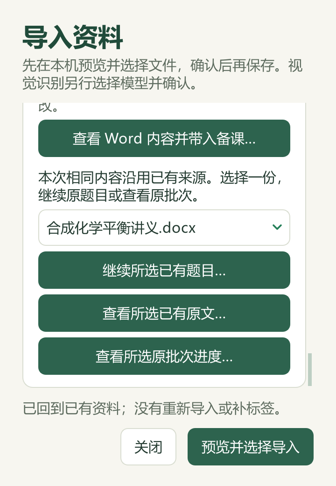
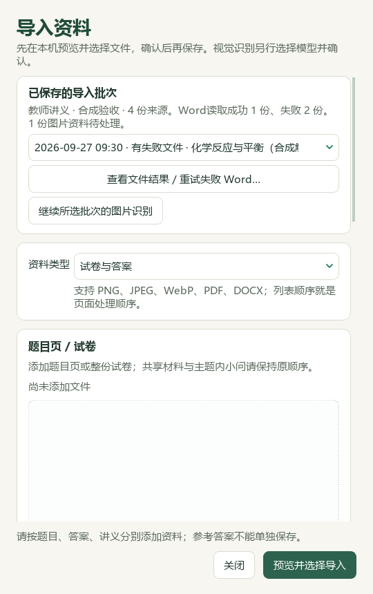
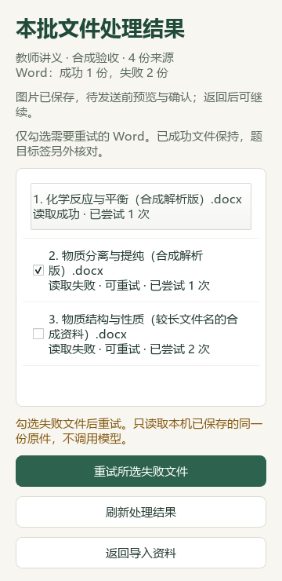
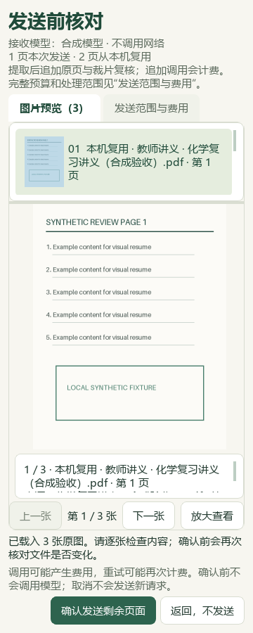

# 第一次使用：从自己的一份资料开始

[返回教师使用说明](../../README.md) · [备课与出卷](lesson-and-paper.md) · [作业、考试与复练](assessment.md) · [保存和排错](save-and-support.md)

## 维护源码：新版工作台与教材导入

新版主导航提供工作台、资料与题库、备课与讲评、组卷与作业、作业批改、学情与复练和教材研读。作品中心、教学模板、课堂工具与任务中心仍可单独打开。旧版入口和 Ctrl+K 搜索继续可用；v0.1.101 试用包没有本次源码改造。

顶部“教学上下文”可记录学期、班级和当前任务备注。它用于辨认任务，不会切换已打开的学生作答、改写学生身份或筛选全部历史资料；班级名册与应交名单仍需另行管理。“标准 / 紧凑”切换显示密度。

**导入题库：** 点击“导入本地资料”，选择自己的 Word、PDF 或题图文件，也可选择文件夹。先预览并勾选，再保存；Word 会进入已有候选题流程。内容相同的 Word 可继续原批次，同名新内容分别保存。题图识别另行选择模型并确认，保存原件不代表已经识别全部题目。来源答案与 AI 建议仍分别核对。

**导入教材：** 进入“教材研读”，点击“导入整本教材…”，添加 PDF 或选择文件夹，先预览页数与重复情况，再保存到本机。每批最多100份、512MB，单份不超过256MB；加密或损坏文件先处理后再导入。整本原书独立保存，可连续阅读；目录和印刷页码不会从文件名推测。

**查看知识候选：** 按册、章、节展开知识点，右侧阅读候选摘要、来源与页序。点击“导入知识候选”保存已有候选快照到个人资料，不会提升审核权限。原书未导入时显示具体缺口；原书内容与候选绑定的来源相符后，“查看知识点原页”可打开。已有完整目录映射时继续支持“阅读本节…”，没有映射时先阅读整本并核对目录。

**任务中断后：** 在任务中心筛选“需要处理”，回原页面核对已经保存的批次、草稿或成品后继续。重开不会自动重发模型请求。停止操作等待当前步骤安全结束，已保存原件保留；重新导入相同教材可继续已有内容。

**备份教材：** “备份教材与候选…”保存已导入原书和当前候选快照；“恢复到新目录…”核对文件后建立独立副本，保留当前资料。这个备份不包含题库、学生、评分或备课；原有备课备份也不包含这批教材。迁移时分别保管所需业务资料和原件。

窄窗口中，教材导入、知识候选导入和备份恢复收在“教材操作…”菜单；页面可向下滚动查看目录和摘要。

此图来自实际 Qt 界面，383条是已有知识候选，原教材 PDF 未随源码提供。它不表示本轮重读了五册教材或完成教师审核。

## 安装与版本确认

在本仓库 v0.1.101 Release 下载 Windows x64 试用包，核对来源与 `SHA256SUMS.txt`。先关闭旧程序，完整解压，再双击 `沪上化学智研台.exe`。不要在压缩包内启动、只复制 EXE 或删除 `_internal`。不需要另外安装 Python。

这是未数字签名的试用程序。保留 Windows 防护，遇到学校电脑限制时由学校管理员核查，不通过关闭防护解决。

已发布试用包与维护源码不是同一版本。若找不到“整理题集与目标”或“核对并修改成绩”，先核对运行版本；这两个入口属于后续维护源码。可筛选并直接打开原题的“题库进度”待处理清单也属于维护源码，旧 v0.1.101 EXE 不包含该新界面。不要为找按钮反复导入原资料。

## 准备材料：选择一条最短的试用路径

| 你手上有什么 | 先完成哪件事 | 需要核对什么 |
| --- | --- | --- |
| 一份完整 Word 讲义 | 导入资料，再到题库读一题、加入题篮 | 原题、答案、公共材料是否对应 |
| 一张同场考试成绩表 | 学生分析 → 考试分析（Excel） | 学生列、实际满分、题号及空白含义 |
| 一个课题和教材节选 | 备课 → 教学环节，手动安排活动并保存草稿 | 学生任务、目标与评价依据 |

程序不自带用户题库、教材全文、学生作答、模型密钥、Office 或字体文件。初装空题库不是安装损坏；只导入有权使用的资料。

资料导入前保留原件。扫描件不是 Word 正文，题目来源和页码不明确时先补齐，不用模糊匹配猜题号。可先处理一份小样本，确认题答对应后再继续整理。

在维护源码中，已有 Word 资料可从 **首页 → 展开“题库与教材状态” → 检查本地题库进度** 整理缺项；也可按 Ctrl+K 搜索“题库进度”。清单能回到原题核对并保存标签，操作见[整理 Word 教学标签](lesson-and-paper.md#library-review)。

## 在小窗口中阅读和选题（维护源码）

逐题窗口可缩到360×520。状态提示和关闭按钮留在底部；题面、答案内的长文字与图片分别滚动，窗口正文也可向下滚到选题和备课操作。需要修改标签时展开“题目设置与标签”，需要带入备课时展开“用所选题备课”。

核对题面与答案后先查看完整预览，再点击“加入选题篮”或“确认带入备课”。展开区块、切换题目和预览都不替代最终确认。保存尚未结束时按提示等待；已选的其他来源题目继续保留。

从已有导入资料继续时，若显示“原来源暂无可用题目”，可回原文或原批次进度检查。此时其他已选题仍可在完整预览中查看。这些阅读窗口改进尚未进入v0.1.101试用包。

## 继续一批没有全部读完的资料（维护源码）

再次选择 Word 时，先看导入预览中的处理说明。改名后的同一份文件会标为已保存，确认后沿用原文件名与原用途，并提供 **继续所选已有题目／查看所选已有原文／查看所选原批次进度**。已有题目、手工范围、教师标签和题篮继续保留；原资料尚无题目时会显示空结果，可转到原文或批次检查。

同名但内容不同的 Word 会标为新版本。核对后另行保存，旧资料与旧标签保留；新版本的题目和标签需要重新核对。批次中的“保存记录”编号只用于区分本机保存记录，不代表教材或试卷的正式版本。

同时选择旧讲义和新讲义时，程序只新增未保存的文件，并保留继续旧资料的入口。若复用文件与新的题目、答案文件混在同次选择中，按提示先继续原资料，或单独导入新的整组题答，避免拆开原有对应关系。预览后文件或本机记录发生变化时，重新预览再确认。

打开 **导入资料 → 已保存的导入批次**，按时间与文件名选择本批，再点 **查看文件结果／重试失败 Word**。列表分别显示成功、失败和尝试次数；旧记录没有次数时会明确标为未记录。

勾选需要重试的失败文件，核对名称后继续。本次只读取已经保存到本机的同一份 Word，不调用模型；已成功的文件保留。完成后刷新核对结果，再到原题检查题目与教学标签。读取成功不等于答案、标签和化学内容已核验。

若提示原件或批次状态变化，先刷新并核对，不反复点击旧选择。重试保存期间请等待任务完成；下次打开仍能看到保存的结果。

图片识别中断后，重新进入发送前预览。页面会标为“本机复用”或“本次发送”，确认按钮显示“确认发送剩余页面”。只有已完成提取、裁片机器复核并成功保存，且与当前页面和模型配置相符的分片才可复用。剩余页面仍按确认范围调用模型，提取后的裁片复核也可能计费；生成的候选仍待教师核对。

如果所有分片都已保存，窗口显示“本机恢复候选”，点击“在本机汇总候选”即可恢复汇总，不调用模型。若更换页面或模型配置，需重新预览并核对发送数量；旧记录保留。

需要重新识别某组页面时，打开 **处理进度**，勾选已保存或无法核验的页组，点击 **更新发送预览**。在重新打开的预览中核对“本次发送”的原页，再确认执行。修改勾选后，旧确认按钮暂不可用；更新预览本身不调用模型，确认重做后才启用新记录并再次识别、复核，可能再次计费。原页和旧分片记录保留。

无法核验的页组必须全部选入重做范围，才能继续；其他已保存页组仍可复用。取消预览不改写处理记录。跨页组证据或答案标识冲突会给出具体提示，但重新识别不保证化学内容或层级关系已正确，结果仍需教师核对。

若遇到可恢复的本机处理目录记录缺失或损坏，从 **导入资料** 恢复已有批次，选择原来的视觉模型并打开图片预览，程序会进入 **修复本机处理目录 → 处理进度**。对照原页和已有记录摘录，每组只选一份记录，再点 **预览所选恢复范围**。同组有多个版本时，程序不会替你按日期选择；候选编号也不代表质量高低。

核对预览中的恢复范围后，点击 **确认本机修复**。修复只在本机进行，不调用模型，旧记录和原目录内容保留。完成后返回普通图片预览；未恢复的页面仍需另行确认发送，才会继续识别。恢复的题目仍是候选，需核对题答、化学内容与题目层级。

如果修复中断，重新打开图片预览后可继续核对并修复，完成前不能继续普通处理。来源或页面不相符、保存记录无法核验时，不可强行恢复；汇总候选本身损坏也不在此修复范围内。保留本地文件并按提示排查，不反复整批调用模型。旧 v0.1.101 EXE 不包含本节功能。

## 什么时候才需要配置模型？

查找已有题、组卷、本地考试统计、查看已有结果、手动教学环节和离线课堂工具不需要 API。生成新的 AI 初稿、分析建议或处理指定图像时，才按对应功能配置模型并确认发送。

在“设置”核对服务商、接口地址、接口格式、模型和密钥；预算不明确时先保留功能默认值。文本连接测试只证明该次文字请求可用，不代表模型看懂化学图或评分准确。

使用图像前确认模型支持视觉、当前设置允许图片，发送前查看页数与所选原页。模型失败后先检查报错与原结果，不反复整批生成。

## 分页与课件预览需要什么？

试卷实际分页需要本机 LibreOffice 或 Microsoft Word 转换工具。教学环节的“核对实际PPTX”使用 LibreOffice Impress；它不等于 PowerPoint 在每台电脑上的呈现。

缺少转换工具时，可以继续核对资料、编辑和保存草稿；不要把快速预览当作实际 Office 文件已经检查。打印前打开最终 PDF，授课前在实际投影电脑打开 PPTX。

## 发送与分发前，教师要检查什么？

模型请求可能收费。发送前核对接收模型、文字、图片、页数与范围；自由文字、图片里的姓名和学号不会因为“匿名统计”选项而自动擦除。

本地选题和统计不需要发送给模型，但明确调用外部模型会发送所确认的数据。停止等待不代表服务商已经撤回请求或不再计费。

发给学生前检查题面、原图和讲者备注。学习单、学生版试卷与教师稿分开发放；含答案备注的 PPTX 不能当作自动匿名学生稿。

## 完成第一次试用

保存一份草稿或分析，关闭后重开，确认仍能找到材料与结果。出现错误时保留原文件、记录提示和操作步骤，按[排错指南](save-and-support.md#problems)处理。
