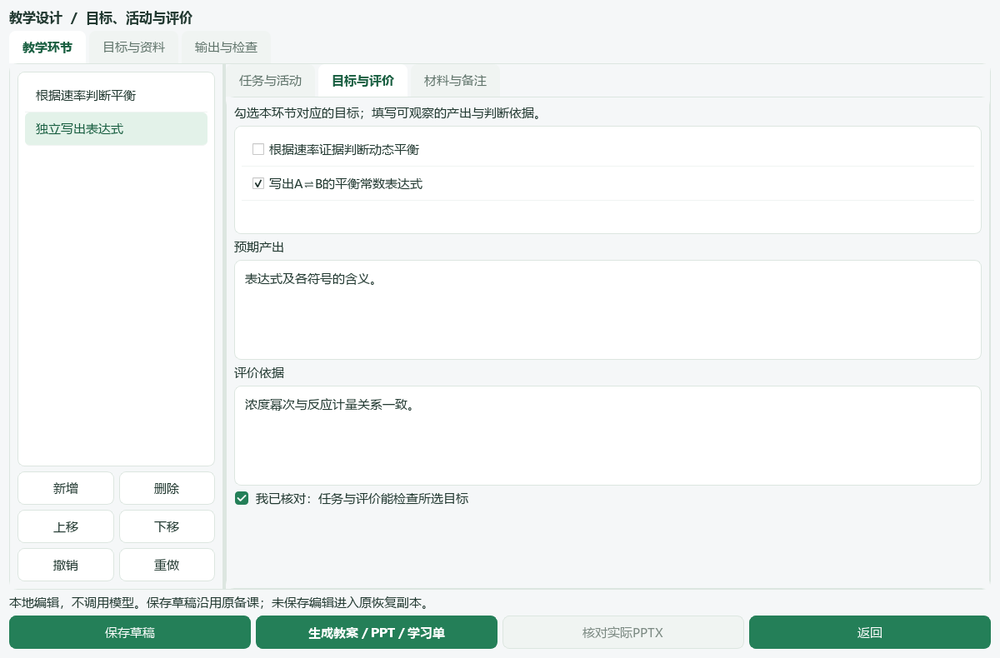

# 备一节课，出一份卷

[返回教师使用说明](../../README.md) · [首次使用](getting-started.md) · [考试与复练](assessment.md) · [保存成果](save-and-support.md)

## 明天要讲一节新课

### 准备什么

课题、授课对象、预计课时、学生已学内容、可以检查的学习目标，以及本次真正要用的教材节选、完整例题或实验资料。目标不要只写“掌握知识”，而要写出学生需要完成的任务。

### 怎么做

1. 在“备课”填写要求与实际材料，先保存草稿。需要结构参考时从“教学模板”预览后带入；已有材料不应因选模板而被替换。
2. 打开“教学环节”，按课堂进程安排提问、解释、例题、独立练习和反馈。每个环节填写学生任务、预计用时、预期产出与评价依据。
3. 已有完成初稿时，点“从已有初稿加入…”→选择作品→“读取所选初稿并预览”→勾选→“加入勾选环节”。转换只追加所选内容，不重新调用 API，也不覆盖已有手写环节。
4. 逐条核对目标是否有相应任务与检查证据。看到“待核对”时先检查，不把标签命中当成目标已经覆盖。
5. 保存草稿，生成教案、PPT 和学习单；核对实际文件，再导出独立副本交付。

### 得到什么

同一设计生成 `lesson_plan.docx`、`lesson_presentation.pptx` 和 `student_worksheet.docx`。草稿保存环节、目标和输出版本；下一次可以继续修改。

### 怎么确认完成

学生任务能在计划课时内实施，公式、条件、单位与图像可读；教案中的教师答案没有出现在学习单或投影正文。PPT 讲者备注可能含答案，不直接作为学生文件分发。

引用材料默认供教师查看并锁定。要放到学生页，先核对题答分离和条件完整，再明确调整可见范围。初稿转换不保证复杂 Word 公式、图表或原 PPT 版面无损重建。

环节或目标有实质修改后，应生成新成品并重新检查。“核对实际PPTX”查看由实际 PPTX 转换的预览；快速结构预览不等于实际 Office 渲染。外部修改导出副本不会反向更新工作台设计。

## 给班级出一份练习卷

### 准备什么

本次练习目标、预计用时、分值安排，以及已经导入并核对来源的完整题目。题库筛选结果只是候选，难度与教学适配仍需教师判断。

### 怎么做

1. 在“题库”按来源、教材章节和知识点筛选，打开题面与答案核对后加入选题篮。保留主题公共材料及依赖前文条件。
2. 在题篮检查是否混入其他备课的题目，到“组卷”安排题序和配分。需要修改题号时核对题面、答案与引用的对应。
3. 生成并逐页查看学生版、教师版实际分页，检查长题、表格、图片、答案和作答空间；全部核对后再导出。
4. 打开导出的 DOCX 与 PDF，按学生稿和教师稿分别命名、发放或打印。

### 得到什么

学生版与教师版 DOCX、PDF，以及本次组卷的预览和确认记录。原题文件不因重新组卷而被改写。

### 怎么确认完成

检查卷名、范围、总分与用时；两版编号一致，学生版没有答案；共同材料没有被截断，图表和公式没有挤出页边。扫描图内部旧号、图中“见第N题”等引用不能只靠页外新号判断正确。

图像换号只适用于已有工具支持的场景；复杂彩底、旋转或多义对应先保留原件并人工核对。材料或组卷内容变化后重新预览，旧确认不当作新版本确认。

## 课堂上使用工具，课后补记反馈

### 准备什么

课堂活动目标、所需时间、已核对的分组或点名资料。投影前确认当前画面没有私人资料或教师答案。

### 怎么做

进入“课堂工具”，选择倒计时、点名、随机分组或随堂反馈。根据学生当堂表现记录观察依据，必要时追加回备课材料，然后保存草稿。

### 得到什么与完成检查

工具辅助组织课堂，反馈供下次备课参考；它不是自动测量学生能力。动态平衡演示是简化示意模型，不是实测化学数据。课后重开草稿确认追加内容已保存。
