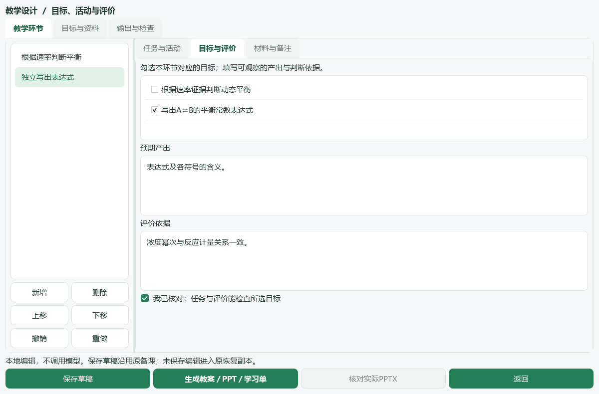
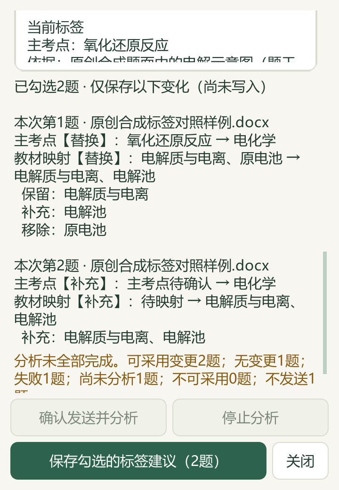
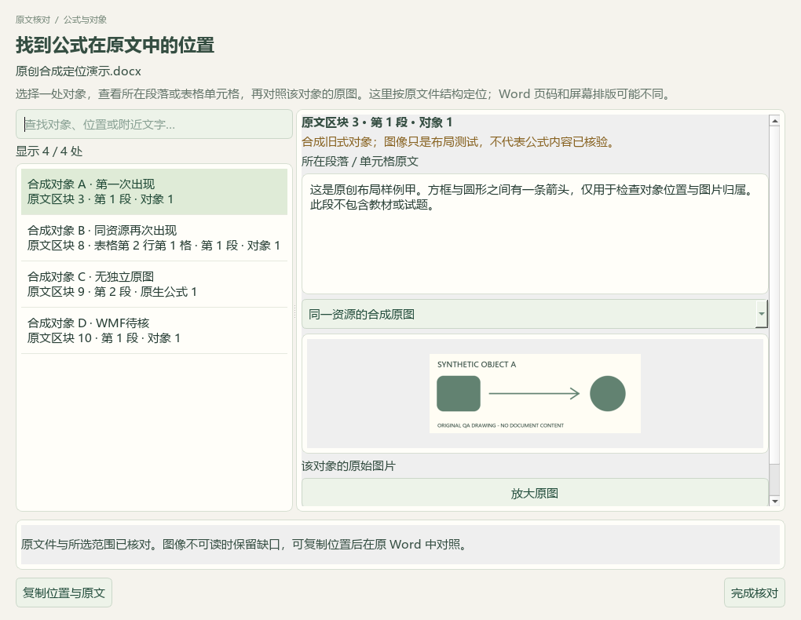
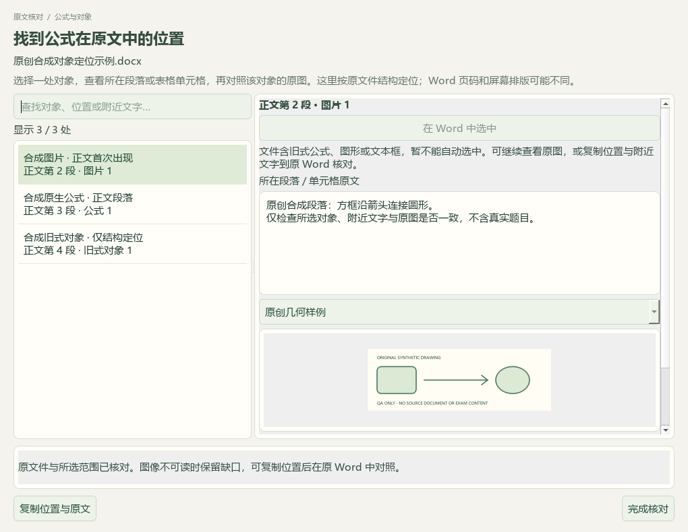
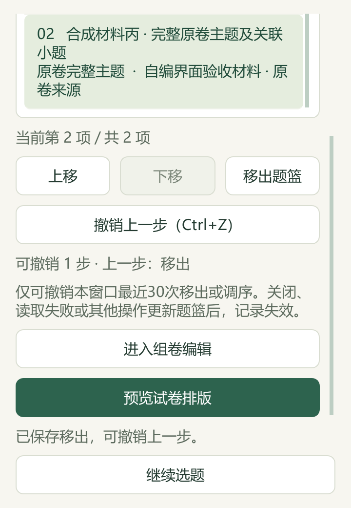

# 备一节课，出一份卷

[返回教师使用说明](../../README.md) · [首次使用](getting-started.md) · [考试与复练](assessment.md) · [保存成果](save-and-support.md)

## 明天要讲一节新课

### 准备什么

课题、授课对象、预计课时、学生已学内容、可以检查的学习目标，以及本次真正要用的教材节选、完整例题或实验资料。目标不要只写“掌握知识”，而要写出学生需要完成的任务。

### 怎么做

1. 在“备课”填写要求与实际材料，先保存草稿。需要结构参考时从“教学模板”预览后带入；已有材料不应因选模板而被替换。
2. 打开“教学环节”，按课堂进程安排提问、解释、例题、独立练习和反馈。每个环节填写学生任务、预计用时、预期产出与评价依据。
3. 已有完成初稿时，点“从已有初稿加入…”→选择作品→“读取所选初稿并预览”→勾选→“加入勾选环节”。转换只追加所选内容，不重新调用 API，也不覆盖已有手写环节。
4. 逐条核对目标是否有相应任务与检查证据。看到“待核对”时先检查，不把标签命中当成目标已经覆盖。
5. 保存草稿，生成教案、PPT 和学习单；核对实际文件，再导出独立副本交付。

### 得到什么

同一设计生成 `lesson_plan.docx`、`lesson_presentation.pptx` 和 `student_worksheet.docx`。草稿保存环节、目标和输出版本；下一次可以继续修改。

### 怎么确认完成

学生任务能在计划课时内实施，公式、条件、单位与图像可读；教案中的教师答案没有出现在学习单或投影正文。PPT 讲者备注可能含答案，不直接作为学生文件分发。

引用材料默认供教师查看并锁定。要放到学生页，先核对题答分离和条件完整，再明确调整可见范围。初稿转换不保证复杂 Word 公式、图表或原 PPT 版面无损重建。

环节或目标有实质修改后，应生成新成品并重新检查。“核对实际PPTX”查看由实际 PPTX 转换的预览；快速结构预览不等于实际 Office 渲染。外部修改导出副本不会反向更新工作台设计。

## 给班级出一份练习卷

### 准备什么

本次练习目标、预计用时、分值安排，以及已经导入并核对来源的完整题目。题库筛选结果只是候选，难度与教学适配仍需教师判断。

### 先整理题目、教学标签与裁片（维护源码）

以下待处理清单属于维护源码，旧 v0.1.101 EXE 不包含这个可点入原题的新界面。已经核对完整的题目可直接进入下方选题流程。

1. 在 **首页** 展开 **题库与教材状态**，点击 **检查本地题库进度**；也可按 Ctrl+K 搜索“题库进度”。
2. 选择 Word 或图片题，再按来源、待办类型、人工保护状态和关键词缩小清单；图片题还可按来源中明确的主题筛选。选中一条待办，点击打开原题；双击该行或按 Enter 也可打开。
3. 对照原题，在“题目设置与标签”中点 **修改教学标签**。补全有依据的知识点、教材节、适用年级或原考试类型，再点 **预览变更 → 确认保存修改**。原图或公共材料缺口应回到来源核对补齐。
4. 关闭原题窗口回到清单，等待自动更新。原筛选保留；这道题仍有待办时继续选中它，已不符合筛选时选中附近的下一条待办。取消修改或保存失败，也按重新读取的实际状态继续处理。

原考试类型没有来源依据时保留“待确认”，不从讲义名称猜填。字段齐备不代表化学审核完成，Word 候选与个人图片题分开统计。窗口较窄时可垂直滚动到原题入口、刷新和导出按钮。

**Word 旧标签重核：** 出现“题目范围已变化”时，旧标签只供对照，下方表单是当前范围的建议。先核对题干、共同材料与答案范围，再修改或保留标签，勾选 **已核对新范围与下列标签**，点 **预览变更** 查看旧范围与本次保存值，最后确认保存。即使标签值不需要修改，也可以明确完成范围重核；待确认字段仍保持待确认。关闭或取消不会保存，旧标签历史继续保留。

**AI 标签变化对照（维护源码）：** 在 Word 选题的 **AI标签整理** 窗口中，默认只补缺失标签；需要重新检查已有自动分类时，选择 **重新核对自动标签**。先预览本次题目、公共材料、图片和接收模型，再明确确认发送并分析。查看 **标签建议与依据**，按“保留、补充、替换、移除”对照当前标签与建议；“本次第N题”表示本次选择顺序，不是原卷印刷题号。

勾选要采用的题目，核对下方仅包含所勾选变化的摘要，再点 **保存勾选的标签建议**。重核模式默认不勾选；教师修改、教师确认、固定修订、无变化及失败项不计入保存。点击 **停止分析** 后，等待当前请求结束，再核对已经完成的建议。保存失败或回执不完整时，先重新打开原题查看实际状态；AI 建议不会变为教师审核结论。

**图片裁片审核：** 在原题图片旁打开截取范围编辑器，默认对照原页与当前裁片。顶部可切换本题的题面、共同材料和参考答案页；两侧均可放大，裁片放大后可拖动查看。框选或调整像素边界后，点 **预览截取结果**，核对新裁片、受影响题目及边界，再勾选确认并点 **确认保存裁剪**。切换页面会暂存各页框选；保存只提交当前裁片并关闭窗口，其他暂存框不保存。共同材料可能影响多题，旧标签会保留待重核，已带入备课的副本需要重新带入。窄窗口可滚动查看原页与裁片，底部操作按钮保持可见。

### 核对公式、旧对象在原文中的位置（维护源码）

在 Word 题目的题面或答案页，点击 **核对本页公式与对象的原文位置**。在完整教案阅读器中，可点段落旁的 **核对公式与对象位置**，也可在选段区域点 **核对所选段落的公式与对象位置**；查看位置不会改变已有备课选段。

选择左侧的一处对象，右侧显示它所在段落或表格单元格的原文、具体位置和可读取的原图。输入附近文字可筛选对象，同一图片在不同位置出现时分别列出。图片可放大；窄窗口上下排列，详情和长提示均可滚动。

窗口先检查文件和对象是否支持 **在 Word 中选中**。按钮可用时，先关闭已有的 Word 窗口，再点击；本机打开只读原件并核对实际选区，通过后显示 Word。处理中可取消；若窗口已经打开，请手动关闭。Word 退出可能需要片刻，未退出前请稍候再试。按钮下的提示会说明当前限制；结构检查通过也不代表实际选区已经确认。

**展开文件内定位详情**可查看完整定位记录；复制内容也保留这些信息，便于追溯。默认页面使用中文原因提示，不展示冗长的文件内部路径。

旧式嵌入公式、浮动对象、表格内原生公式，以及含未支持字段或显示结构的文件，暂不能自动选中。可点 **复制位置与原文**，再打开原 Word 对照附近文字。这里的段落、表格行列来自原文件结构，可能与 Word 排版页码不同。隐藏内容、修订或兼容显示分支会保留提醒，不能当成已经确认可见。题面与答案共用一段且无法可靠分开时，请回完整教案核对。原图读取失败会保留缺口，不自动补写公式。

### 怎么做

1. 在“题库”按来源、教材章节和知识点筛选，打开题面与答案核对后加入选题篮。保留主题公共材料及依赖前文条件。
2. 在题篮检查是否混入其他备课的题目，到“组卷”安排题序和配分。需要修改题号时核对题面、答案与引用的对应。
3. 生成并逐页查看学生版、教师版实际分页，检查长题、表格、图片、答案和作答空间；全部核对后再导出。
4. 打开导出的 DOCX 与 PDF，按学生稿和教师稿分别命名、发放或打印。

### 得到什么

学生版与教师版 DOCX、PDF，以及本次组卷的预览和确认记录。原题文件不因重新组卷而被改写。

### 选题篮中移出、调序与撤销（维护源码）

在选题篮中选中一项，使用 **上移、下移、移出题篮**。保存成功后可点 **撤销上一步（Ctrl+Z）**，恢复完整题目引用、原顺序与原有设置；Word原题、图片完整主题和原卷完整主题共用这套操作。移出最后一项后仍可撤销。

撤销记录限当前窗口最近30步，关闭后清除。其他窗口或入口改变题篮、读取失败或保存未能确认时，旧记录失效；先点 **重新读取题篮** 核对实际内容，再继续操作。窗口会保留上次显示供对照，不能把它当作最新记录。

小窗口可上下滚动到撤销、重读和组卷按钮，保存状态与 **继续选题** 保持可见。题篮顺序与已有组卷草稿分别保存；这里的撤销不会回退草稿中的配分、版式或已导出文件。v0.1.101 EXE 尚不包含此功能。

### 怎么确认完成

检查卷名、范围、总分与用时；两版编号一致，学生版没有答案；共同材料没有被截断，图表和公式没有挤出页边。扫描图内部旧号、图中“见第N题”等引用不能只靠页外新号判断正确。

图像换号只适用于已有工具支持的场景；复杂彩底、旋转或多义对应先保留原件并人工核对。材料或组卷内容变化后重新预览，旧确认不当作新版本确认。

## 课堂上使用工具，课后补记反馈

### 准备什么

课堂活动目标、所需时间、已核对的分组或点名资料。投影前确认当前画面没有私人资料或教师答案。

### 怎么做

进入“课堂工具”，选择倒计时、点名、随机分组或随堂反馈。根据学生当堂表现记录观察依据，必要时追加回备课材料，然后保存草稿。

### 得到什么与完成检查

工具辅助组织课堂，反馈供下次备课参考；它不是自动测量学生能力。动态平衡演示是简化示意模型，不是实测化学数据。课后重开草稿确认追加内容已保存。
